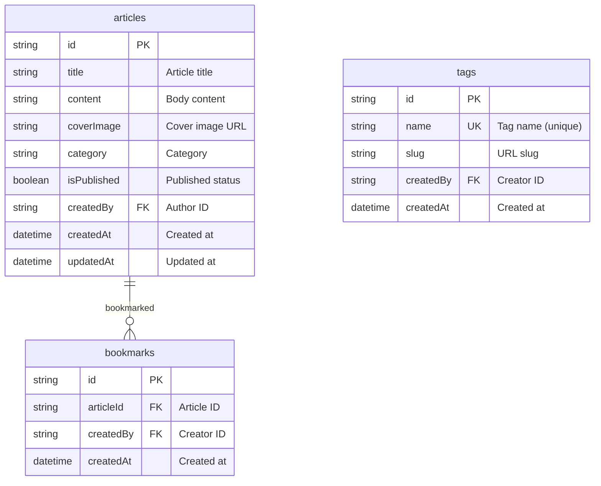
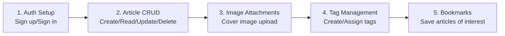

# Project Overview


💡 Understand the overall structure of the blog project. See at a glance what features to build and which tables and APIs to use.


## What You Will Build

After completing this guide, you will have a personal blog with the following features.

| Feature | Description |
|---------|-------------|
| Public Timeline | Non-logged-in users can browse published articles in a timeline feed |
| Email Authentication | Sign up, sign in, token management |
| Article CRUD | Create, read, update, delete, toggle public/private |
| Personalized Dashboard | After login: my article stats, draft management, recent posts |
| Cover Image | Upload images to storage and attach to articles |
| Tag Classification | Create tags, assign tags per article |
| Bookmarks | Save articles of interest and view bookmark list |

### Views by Authentication Status

| Status | Home Screen | Write Article | Article Detail |
|--------|-------------|---------------|----------------|
| **Not logged in** | Timeline feed (published articles, chronological) | Not available | Published articles, read-only |
| **Logged in** | Personalized dashboard (my article stats) | Available | Author can edit/delete |

***

## Prerequisites

Complete the following items before starting this guide.




| Order | Item | Reference |
|:-----:|------|-----------|
| 1 | Sign up for bkend console | [Console Sign Up](../../../console/02-signup-login.md) |
| 2 | Create a project | [Project Management](../../../console/04-project-management.md) |
| 3 | Install AI tools | [MCP Overview](../../../mcp/01-overview.md) |
| 4 | MCP OAuth connection | [OAuth 2.1 Authentication](../../../mcp/05-oauth.md) |


✅ **Try saying this to the AI**
"Show me the list of projects connected to bkend"

If the project list appears, you are ready.





| Order | Item | Reference |
|:-----:|------|-----------|
| 1 | Sign up for bkend console | [Console Sign Up](../../../console/02-signup-login.md) |
| 2 | Create a project | [Project Management](../../../console/04-project-management.md) |
| 3 | Issue API Key | [API Key Management](../../../console/11-api-keys.md) |





⚠️ The "sign up" mentioned here is for creating a **bkend console account**. App user sign-up is implemented in [Authentication Setup](01-auth.md).


***

## Feature Summary

| bkend Feature | Purpose | Related Chapter |
|---------------|---------|-----------------|
| Authentication | Email sign-up/sign-in | [01-auth](01-auth.md) |
| Dynamic Tables | articles, tags, bookmarks CRUD | [02-articles](02-articles.md), [04-tags](04-tags.md), [05-bookmarks](05-bookmarks.md) |
| Storage | Cover image upload | [03-files](03-files.md) |
| MCP Tools | Manage tables/data with AI | [06-ai-prompts](06-ai-prompts.md) |

***

## Table Design

The blog uses 3 dynamic tables. `id`, `createdBy`, `createdAt`, and `updatedAt` are system-generated fields.

### Field Descriptions

#### articles

| Field | Type | Required | Description |
|-------|------|:--------:|-------------|
| `title` | String | ✅ | Article title |
| `content` | String | ✅ | Body content (Markdown supported) |
| `coverImage` | String | - | Cover image URL (set after storage upload) |
| `category` | String | - | Category (e.g., `tech`, `life`, `travel`) |
| `isPublished` | Boolean | - | Published status (default: `false`) |

#### tags

| Field | Type | Required | Description |
|-------|------|:--------:|-------------|
| `name` | String | ✅ | Tag name (unique) |
| `slug` | String | - | URL slug (e.g., `javascript`) |

#### bookmarks

| Field | Type | Required | Description |
|-------|------|:--------:|-------------|
| `articleId` | String | ✅ | ID of the article to bookmark |

***

## Implementation Flow

***

## API Endpoint Summary

Key REST API endpoints used in the blog.

### Authentication API

| Method | Endpoint | Description |
|:------:|----------|-------------|
| POST | `/v1/auth/email/signup` | Email sign-up |
| POST | `/v1/auth/email/signin` | Email sign-in |
| POST | `/v1/auth/refresh` | Token refresh |
| GET | `/v1/auth/me` | Get my info |

### Data API (Dynamic Tables)

| Method | Endpoint | Description |
|:------:|----------|-------------|
| POST | `/v1/data/{tableName}` | Create data |
| GET | `/v1/data/{tableName}/{id}` | Get single record |
| GET | `/v1/data/{tableName}` | List records |
| PATCH | `/v1/data/{tableName}/{id}` | Update data |
| DELETE | `/v1/data/{tableName}/{id}` | Delete data |

### Storage API

| Method | Endpoint | Description |
|:------:|----------|-------------|
| POST | `/v1/files/upload` | Upload file |
| GET | `/v1/files/{fileId}` | Get file metadata |


💡 All API requests require the `X-API-Key` header. For APIs that require authentication, also include the `Authorization: Bearer {accessToken}` header.


***

## Learning Path

| Order | Chapter | Key Content | API Used |
|:-----:|---------|-------------|----------|
| 1 | [Authentication Setup](01-auth.md) | Sign up, sign in, token management | Authentication API |
| 2 | [Article CRUD](02-articles.md) | Create, read, update, delete articles | `/v1/data/articles` |
| 3 | [Image Attachments](03-files.md) | Upload cover images, attach to articles | `/v1/files/upload` |
| 4 | [Tag Management](04-tags.md) | Create tags, assign tags to articles | `/v1/data/tags` |
| 5 | [Bookmarks](05-bookmarks.md) | Save articles of interest, bookmark list | `/v1/data/bookmarks` |
| 6 | [AI Prompt Collection](06-ai-prompts.md) | MCP AI usage scenarios | MCP Tools |
| 99 | [Troubleshooting](99-troubleshooting.md) | Common error responses | - |

***

## Reference Docs

- [Database Overview](../../../database/01-overview.md) — Dynamic table concepts
- [Storage Overview](../../../storage/01-overview.md) — File upload concepts
- [blog-web Example Project](../../../../examples/blog-web/) — Full code implementing this cookbook in Next.js

## Next Steps

Implement email sign-up and sign-in in [Authentication Setup](01-auth.md).
