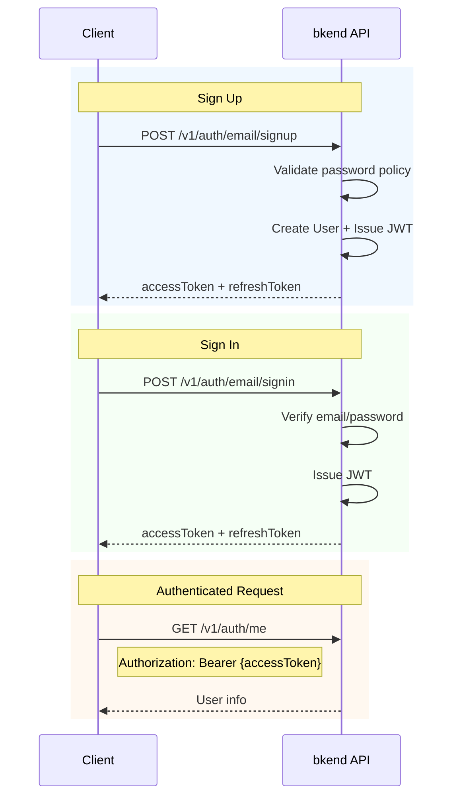

# Authentication Setup


💡 Implement email sign-up and sign-in for the blog app. Once authentication is complete, you can obtain an Access Token to call APIs that require authentication, such as article CRUD.


## Overview

The blog app uses email-based authentication.

| Feature | Description | Endpoint |
|---------|-------------|----------|
| Sign Up | Create an account with email + password | `POST /v1/auth/email/signup` |
| Sign In | Issue tokens with email + password | `POST /v1/auth/email/signin` |
| Token Refresh | Issue new Access Token with Refresh Token | `POST /v1/auth/refresh` |
| Get My Info | Retrieve current user info | `GET /v1/auth/me` |

***

## Authentication Flow



***

## Step 1: Sign Up

Create a new account with email and password.





✅ **Try saying this to the AI**
"Create the email sign-up and sign-in code for the blog app. Use the bkendFetch helper for the implementation."



💡 Sign-up and sign-in are features that users perform directly in the app. Ask the AI to generate the code, then add the generated code to your app. The implementation code can also be found in the **Console + REST API** tab.





### curl

```bash
curl -X POST https://api-client.bkend.ai/v1/auth/email/signup \
  -H "Content-Type: application/json" \
  -H "X-API-Key: {pk_publishable_key}" \
  -d '{
    "method": "password",
    "email": "blogger@example.com",
    "password": "abc123",
    "name": "John Doe"
  }'
```

### bkendFetch

```javascript
import { bkendFetch } from './bkend.js';

const result = await bkendFetch('/v1/auth/email/signup', {
  method: 'POST',
  body: {
    method: 'password',
    email: 'blogger@example.com',
    password: 'abc123',
    name: 'John Doe',
  },
});

// Store tokens
localStorage.setItem('accessToken', result.accessToken);
localStorage.setItem('refreshToken', result.refreshToken);
```

### Request Parameters

| Parameter | Type | Required | Description |
|-----------|------|:--------:|-------------|
| `method` | `string` | ✅ | Fixed as `"password"` |
| `email` | `string` | ✅ | User email address |
| `password` | `string` | ✅ | Password (minimum 6 characters) |
| `name` | `string` | ✅ | User name |

### Success Response

```json
{
  "accessToken": "eyJhbGciOiJIUzI1NiIs...",
  "refreshToken": "eyJhbGciOiJIUzI1NiIs...",
  "tokenType": "Bearer",
  "expiresIn": 3600
}
```




***

## Step 2: Sign In

Sign in with a registered email and password to obtain tokens.





✅ **Try saying this to the AI**
"Create code that stores tokens in localStorage after sign-in and automatically refreshes them on 401 errors."



💡 The AI will generate complete code with token management logic. See the **Console + REST API** tab for detailed implementation.





### curl

```bash
curl -X POST https://api-client.bkend.ai/v1/auth/email/signin \
  -H "Content-Type: application/json" \
  -H "X-API-Key: {pk_publishable_key}" \
  -d '{
    "method": "password",
    "email": "blogger@example.com",
    "password": "abc123"
  }'
```

### bkendFetch

```javascript
const result = await bkendFetch('/v1/auth/email/signin', {
  method: 'POST',
  body: {
    method: 'password',
    email: 'blogger@example.com',
    password: 'abc123',
  },
});

// Store tokens
localStorage.setItem('accessToken', result.accessToken);
localStorage.setItem('refreshToken', result.refreshToken);
```

### Request Parameters

| Parameter | Type | Required | Description |
|-----------|------|:--------:|-------------|
| `method` | `string` | ✅ | Fixed as `"password"` |
| `email` | `string` | ✅ | Registered email address |
| `password` | `string` | ✅ | Password |

### Success Response

```json
{
  "accessToken": "eyJhbGciOiJIUzI1NiIs...",
  "refreshToken": "eyJhbGciOiJIUzI1NiIs...",
  "tokenType": "Bearer",
  "expiresIn": 3600
}
```

| Field | Type | Description |
|-------|------|-------------|
| `accessToken` | `string` | JWT Access Token — used for API authentication |
| `refreshToken` | `string` | JWT Refresh Token — used to refresh the Access Token |
| `tokenType` | `string` | Token type (`"Bearer"`) |
| `expiresIn` | `number` | Access Token expiration time (seconds) |




***

## Step 3: Store Tokens

Manage the issued tokens in your app. The `bkendFetch` helper automatically includes the token in the `Authorization` header.

### Token Validity

| Token | Validity | Purpose |
|-------|:--------:|---------|
| Access Token | 1 hour | API authentication |
| Refresh Token | 30 days | Access Token refresh |

### Token Refresh

When the Access Token expires, use the Refresh Token to obtain a new one.

```bash
curl -X POST https://api-client.bkend.ai/v1/auth/refresh \
  -H "Content-Type: application/json" \
  -H "X-API-Key: {pk_publishable_key}" \
  -d '{
    "refreshToken": "{refresh_token}"
  }'
```

```javascript
// The bkendFetch helper automatically refreshes tokens on 401 responses.
// Simply use bkendFetch without any additional handling.
```


💡 See [Integrate bkend in Your App](../../../getting-started/06-app-integration.md) for the automatic token refresh logic in the `bkendFetch` helper.


***

## Step 4: Verify Authentication Status

Retrieve the currently signed-in user's information.





✅ **Try saying this to the AI**
"Create a profile component that displays the currently signed-in user's information. Use the /v1/auth/me API."





### curl

```bash
curl -X GET https://api-client.bkend.ai/v1/auth/me \
  -H "X-API-Key: {pk_publishable_key}" \
  -H "Authorization: Bearer {accessToken}"
```

### bkendFetch

```javascript
const user = await bkendFetch('/v1/auth/me');

console.log(user);
// { id: "user_abc123", email: "blogger@example.com", name: "John Doe", ... }
```

### Success Response

```json
{
  "id": "user_abc123",
  "email": "blogger@example.com",
  "name": "John Doe",
  "emailVerified": false,
  "createdAt": "2026-02-08T10:00:00Z"
}
```





✅ If `/v1/auth/me` returns user information, authentication setup is complete. You are now ready to implement article CRUD.


***

## Error Handling

### Sign Up Errors

| Error Code | HTTP | Description |
|------------|:----:|-------------|
| `auth/invalid-email` | 400 | Invalid email format |
| `auth/invalid-password-format` | 400 | Password policy violation (minimum 6 characters) |
| `auth/email-already-exists` | 409 | Email already registered |

### Sign In Errors

| Error Code | HTTP | Description |
|------------|:----:|-------------|
| `auth/invalid-email` | 400 | Invalid email format |
| `auth/invalid-credentials` | 401 | Email or password mismatch |
| `auth/account-banned` | 403 | Account suspended |

### Token Errors

| Error Code | HTTP | Description |
|------------|:----:|-------------|
| `auth/token-expired` | 401 | Access Token expired → Token refresh required |
| `auth/invalid-refresh-token` | 401 | Refresh Token expired → Re-sign-in required |

***

## Reference Docs

- [Email Sign Up](../../../authentication/02-email-signup.md) — Sign-up details
- [Email Sign In](../../../authentication/03-email-signin.md) — Sign-in details
- [Token Management](../../../authentication/20-token-management.md) — Token storage and refresh patterns

## Next Steps

Create the articles table and write articles in [Article CRUD](02-articles.md).
