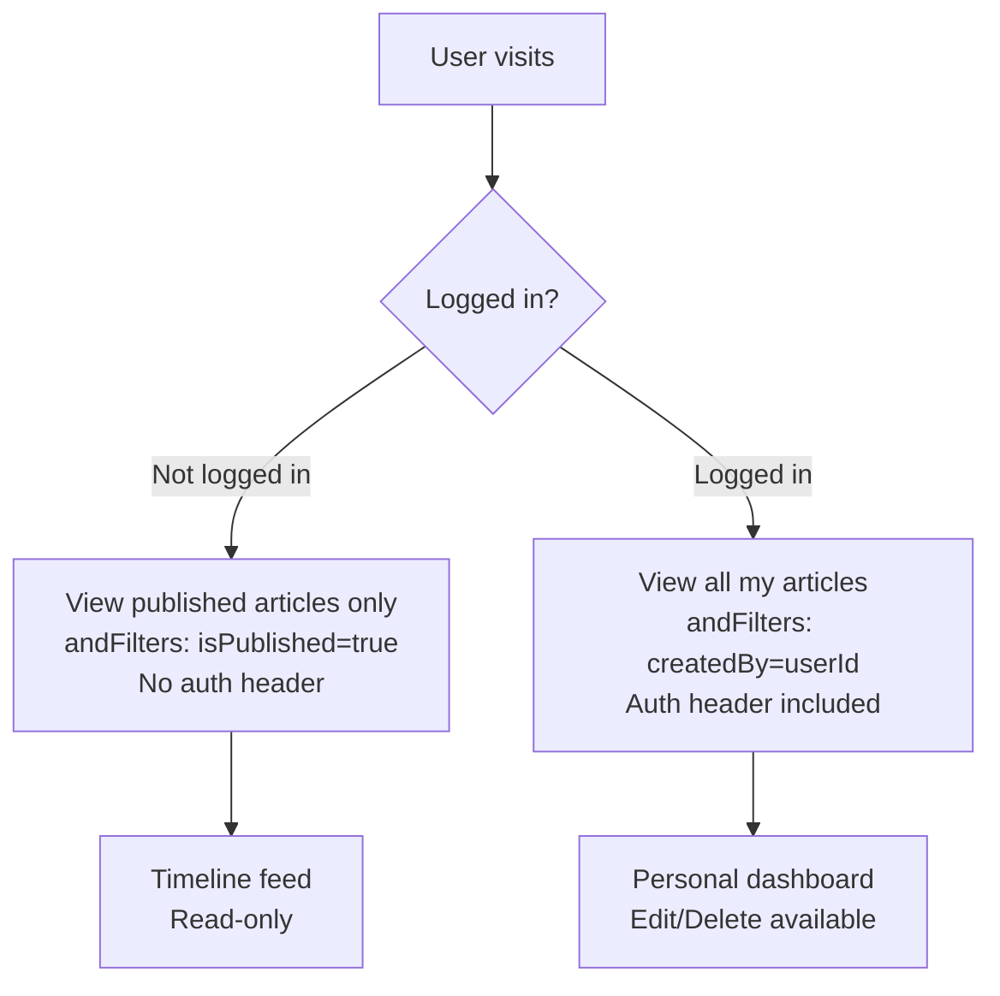
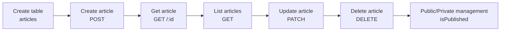

# Implementing Article CRUD


💡 Create the core article table for the blog and implement article creation, reading, updating, and deletion.


## Overview

Implement the full CRUD (Create, Read, Update, Delete) for blog articles.

| Feature | Description | API Endpoint |
|---------|-------------|--------------|
| Create Table | Create articles table | Console UI / MCP |
| Create Article | Enter title, body, category | `POST /v1/data/articles` |
| Get Article | Get single article by ID | `GET /v1/data/articles/{id}` |
| List Articles | Filter/sort/paginate | `GET /v1/data/articles` |
| Update Article | Partial field update | `PATCH /v1/data/articles/{id}` |
| Delete Article | Delete article | `DELETE /v1/data/articles/{id}` |

### Prerequisites

| Required Item | Description | Reference |
|---------------|-------------|-----------|
| Authentication setup complete | Access Token issued | [01-auth.md](01-auth.md) |

***

## Step 1: Create the articles Table

Create the `articles` table to store article data.

### Table Schema

| Field | Type | Required | Description |
|-------|------|:--------:|-------------|
| `title` | String | ✅ | Article title |
| `content` | String | ✅ | Body content (Markdown supported) |
| `coverImage` | String | - | Cover image URL |
| `category` | String | - | Category (e.g., `tech`, `life`, `travel`) |
| `isPublished` | Boolean | - | Published status (default: `false`) |


💡 `id`, `createdBy`, `createdAt`, and `updatedAt` are system-generated fields. You do not need to define them manually.






✅ **Try saying this to the AI**
"I want to store blog posts. Let me manage titles, body content, cover images, categories, and published status. Show me the structure before creating it."



💡 Verify that the AI suggests a structure similar to the one below.

| Field | Description | Example Value |
|-------|-------------|---------------|
| title | Article title | "My First Blog Post" |
| content | Body content | "Hello..." |
| coverImage | Cover image URL | (set after upload) |
| category | Category | "travel" |
| isPublished | Published status | `true` / `false` |





Create the table in the bkend console.

1. Go to **Console** > **Table Management** menu.
2. Click the **Add Table** button.
3. Enter `articles` as the table name.
4. Add the fields from the schema table above one by one.
5. Click the **Save** button.

<!-- 📸 IMG: Articles table creation screen in the console -->


💡 For more details on table management, see [Table Management](../../../console/07-table-management.md).





***

## Step 2: Create an Article





✅ **Try saying this to the AI**
"Write a new blog post. Title is '3-Night Jeju Island Trip', category is 'travel'. Don't publish it yet — save it as a draft."





### curl

```bash
curl -X POST https://api-client.bkend.ai/v1/data/articles \
  -H "Content-Type: application/json" \
  -H "X-API-Key: {pk_publishable_key}" \
  -H "Authorization: Bearer {accessToken}" \
  -d '{
    "title": "3-Night Jeju Island Trip",
    "content": "# Jeju Island Trip\n\nOn the first day, as soon as we arrived at the airport...",
    "category": "travel",
    "isPublished": false
  }'
```

### bkendFetch

```javascript
import { bkendFetch } from './bkend.js';

const article = await bkendFetch('/v1/data/articles', {
  method: 'POST',
  body: {
    title: '3-Night Jeju Island Trip',
    content: '# Jeju Island Trip\n\nOn the first day, as soon as we arrived at the airport...',
    category: 'travel',
    isPublished: false,
  },
});

console.log(article.id); // Created article ID
```

### Request Parameters

| Parameter | Type | Required | Description |
|-----------|------|:--------:|-------------|
| `title` | `string` | ✅ | Article title |
| `content` | `string` | ✅ | Body content |
| `coverImage` | `string` | - | Cover image URL |
| `category` | `string` | - | Category |
| `isPublished` | `boolean` | - | Published status (default: `false`) |

### Success Response (201 Created)

```json
{
  "id": "507f1f77bcf86cd799439011",
  "title": "3-Night Jeju Island Trip",
  "content": "# Jeju Island Trip\n\nOn the first day, as soon as we arrived at the airport...",
  "category": "travel",
  "isPublished": false,
  "createdBy": "user-uuid-1234",
  "createdAt": "2026-02-08T10:00:00.000Z"
}
```




***

## Step 3: Get an Article

### Single Record Retrieval

Retrieve a specific article by ID.





✅ **Try saying this to the AI**
"Show me the content of the article I just wrote"





### curl

```bash
curl -X GET https://api-client.bkend.ai/v1/data/articles/{id} \
  -H "X-API-Key: {pk_publishable_key}" \
  -H "Authorization: Bearer {accessToken}"
```

### bkendFetch

```javascript
const article = await bkendFetch(`/v1/data/articles/${articleId}`);

console.log(article.title);    // "3-Night Jeju Island Trip"
console.log(article.category); // "travel"
```

### Success Response (200 OK)

```json
{
  "id": "507f1f77bcf86cd799439011",
  "title": "3-Night Jeju Island Trip",
  "content": "# Jeju Island Trip\n\nOn the first day, as soon as we arrived at the airport...",
  "category": "travel",
  "isPublished": false,
  "createdBy": "user-uuid-1234",
  "createdAt": "2026-02-08T10:00:00.000Z",
  "updatedAt": "2026-02-08T10:00:00.000Z"
}
```




***

## Step 4: List Articles

Retrieve articles as a list. Supports filtering, sorting, and pagination.





✅ **Try saying this to the AI**
"Show me the 5 most recent articles in the travel category"



✅ **To view only published articles**
"Show me only published articles, sorted by newest first"





### curl — Basic List Retrieval

```bash
curl -X GET "https://api-client.bkend.ai/v1/data/articles?page=1&limit=10&sortBy=createdAt&sortDirection=desc" \
  -H "X-API-Key: {pk_publishable_key}" \
  -H "Authorization: Bearer {accessToken}"
```

### curl — Filter by Category

```bash
curl -X GET "https://api-client.bkend.ai/v1/data/articles?page=1&limit=10&sortBy=createdAt&sortDirection=desc&andFilters=%7B%22category%22%3A%22travel%22%7D" \
  -H "X-API-Key: {pk_publishable_key}" \
  -H "Authorization: Bearer {accessToken}"
```

### bkendFetch

```javascript
// Basic list retrieval
const result = await bkendFetch('/v1/data/articles?page=1&limit=10&sortBy=createdAt&sortDirection=desc');

console.log(result.items);      // Article array
console.log(result.pagination); // Pagination info

// Filter by category
const filters = JSON.stringify({ category: 'travel' });
const travelPosts = await bkendFetch(
  `/v1/data/articles?page=1&limit=10&sortBy=createdAt&sortDirection=desc&andFilters=${encodeURIComponent(filters)}`
);

// Published articles only
const publishedFilters = JSON.stringify({ isPublished: true });
const publishedPosts = await bkendFetch(
  `/v1/data/articles?page=1&limit=10&andFilters=${encodeURIComponent(publishedFilters)}`
);
```

### Query Parameters

| Parameter | Type | Default | Description |
|-----------|------|:-------:|-------------|
| `page` | `number` | `1` | Page number |
| `limit` | `number` | `20` | Items per page (1–100) |
| `sortBy` | `string` | - | Sort field (`createdAt`, `title`, etc.) |
| `sortDirection` | `string` | `desc` | `asc` or `desc` |
| `andFilters` | `JSON` | - | AND condition filter |
| `search` | `string` | - | Search term (partial match) |

### Success Response (200 OK)

```json
{
  "items": [
    {
      "id": "507f1f77bcf86cd799439011",
      "title": "3-Night Jeju Island Trip",
      "category": "travel",
      "isPublished": false,
      "createdBy": "user-uuid-1234",
      "createdAt": "2026-02-08T10:00:00.000Z"
    },
    {
      "id": "507f1f77bcf86cd799439012",
      "title": "Busan Food Tour",
      "category": "food",
      "isPublished": true,
      "createdBy": "user-uuid-1234",
      "createdAt": "2026-02-07T09:00:00.000Z"
    }
  ],
  "pagination": {
    "total": 25,
    "page": 1,
    "limit": 10,
    "totalPages": 3,
    "hasNext": true,
    "hasPrev": false
  }
}
```




***

## Step 5: Update an Article

Include only the fields you want to change in the request (Partial Update).





✅ **Try saying this to the AI**
"Change the title of the travel article I just wrote to '3-Night Jeju Island Trip (Updated)'"



✅ **To publish the article**
"Publish this article"





### curl — Update Title

```bash
curl -X PATCH https://api-client.bkend.ai/v1/data/articles/{id} \
  -H "Content-Type: application/json" \
  -H "X-API-Key: {pk_publishable_key}" \
  -H "Authorization: Bearer {accessToken}" \
  -d '{
    "title": "3-Night Jeju Island Trip (Updated)"
  }'
```

### curl — Change to Published

```bash
curl -X PATCH https://api-client.bkend.ai/v1/data/articles/{id} \
  -H "Content-Type: application/json" \
  -H "X-API-Key: {pk_publishable_key}" \
  -H "Authorization: Bearer {accessToken}" \
  -d '{
    "isPublished": true
  }'
```

### bkendFetch

```javascript
// Update title
const updated = await bkendFetch(`/v1/data/articles/${articleId}`, {
  method: 'PATCH',
  body: {
    title: '3-Night Jeju Island Trip (Updated)',
  },
});

// Change to published
await bkendFetch(`/v1/data/articles/${articleId}`, {
  method: 'PATCH',
  body: {
    isPublished: true,
  },
});
```

### Success Response (200 OK)

```json
{
  "id": "507f1f77bcf86cd799439011",
  "title": "3-Night Jeju Island Trip (Updated)",
  "content": "# Jeju Island Trip\n\nOn the first day, as soon as we arrived at the airport...",
  "category": "travel",
  "isPublished": true,
  "createdBy": "user-uuid-1234",
  "createdAt": "2026-02-08T10:00:00.000Z",
  "updatedAt": "2026-02-08T14:30:00.000Z"
}
```


⚠️ `id`, `createdBy`, and `createdAt` cannot be modified. `updatedAt` is automatically updated.





***

## Step 6: Delete an Article





✅ **Try saying this to the AI**
"Delete the '3-Night Jeju Island Trip' article"





### curl

```bash
curl -X DELETE https://api-client.bkend.ai/v1/data/articles/{id} \
  -H "X-API-Key: {pk_publishable_key}" \
  -H "Authorization: Bearer {accessToken}"
```

### bkendFetch

```javascript
await bkendFetch(`/v1/data/articles/${articleId}`, {
  method: 'DELETE',
});
```

### Success Response (200 OK)

```json
{
  "success": true
}
```


🚨 **Warning** — Deleted articles cannot be recovered. Ask the user for confirmation before deleting.





***

## Error Handling

### Article Create/Update Errors

| HTTP Status | Error Code | Cause | Solution |
|:-----------:|------------|-------|----------|
| 400 | `data/validation-error` | Required field missing or type mismatch | Verify `title` and `content` are included in request body |
| 401 | `common/authentication-required` | Auth token expired | Refresh token and retry |
| 403 | `data/permission-denied` | No permission | Verify create/update permissions for the table |
| 404 | `data/table-not-found` | Table does not exist | Verify table was created in Step 1 |
| 404 | `data/not-found` | Article does not exist | Verify ID |

***

## Public/Private Flow

Use the `isPublished` field to show only published articles to non-logged-in users and display drafts to the logged-in author.



### Public Article List (No Authentication Required)





✅ **Try saying this to the AI**
"Show me published blog posts sorted by newest first"





```bash
curl -X GET "https://api-client.bkend.ai/v1/data/articles?page=1&limit=10&sortBy=createdAt&sortDirection=desc&andFilters=%7B%22isPublished%22%3Atrue%7D" \
  -H "X-API-Key: {pk_publishable_key}"
```


💡 Public article retrieval does not require the `Authorization` header. Only send `X-API-Key`.





### My Article List (Authentication Required)





✅ **Try saying this to the AI**
"Show me the list of articles I've written. Include drafts too."





```bash
curl -X GET "https://api-client.bkend.ai/v1/data/articles?page=1&limit=10&sortBy=createdAt&sortDirection=desc&andFilters=%7B%22createdBy%22%3A%22{userId}%22%7D" \
  -H "X-API-Key: {pk_publishable_key}" \
  -H "Authorization: Bearer {accessToken}"
```




***

## Full Flow Summary



***

## Reference Docs

- [Insert Data](../../../database/03-insert.md) — POST API details
- [Select Single Data](../../../database/04-select.md) — GET API details
- [List Data](../../../database/05-list.md) — Filter/sort/pagination details
- [Update Data](../../../database/06-update.md) — PATCH API details
- [Table Management](../../../console/07-table-management.md) — Manage tables in the console

## Next Steps

Upload cover images and attach them to articles in [Image Upload](03-files.md).
