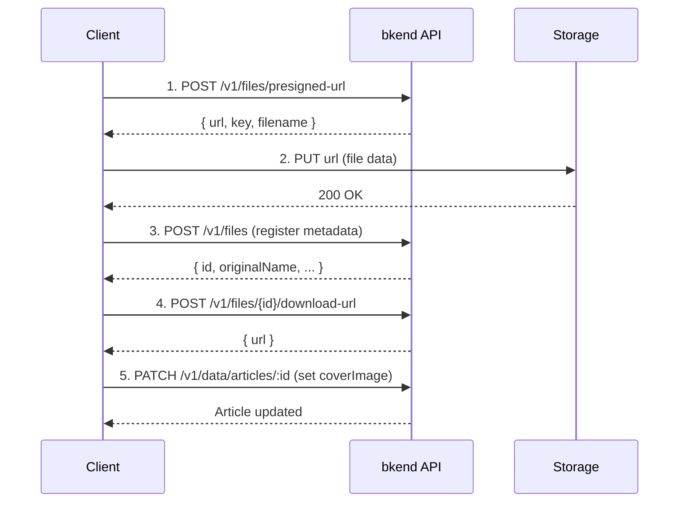

# Implementing Image Upload


💡 Upload cover images for blog articles and attach them. Upload files securely using the Presigned URL method.


## Overview

Image upload proceeds in 4 steps:

1. **Get Presigned URL** — Receive an upload URL from the bkend API.
2. **Upload File** — Upload the file directly to the issued URL.
3. **Register Metadata + Get Download URL** — Register file info and receive a download URL.
4. **Attach to Article** — Set the download URL as the article's `coverImage`.

| Feature | Description | API Endpoint |
|---------|-------------|--------------|
| Get Presigned URL | Generate upload URL | `POST /v1/files/presigned-url` |
| Register Metadata | Save file info | `POST /v1/files` |
| Get Download URL | Generate file access URL | `POST /v1/files/{fileId}/download-url` |
| Get File | Check file info | `GET /v1/files/{fileId}` |
| Delete File | Delete file | `DELETE /v1/files/{fileId}` |

### Prerequisites

| Required Item | Description | Reference |
|---------------|-------------|-----------|
| Authentication setup complete | Access Token issued | [01-auth.md](01-auth.md) |
| articles table | Articles to attach images to | [02-articles.md](02-articles.md) |

***

## Upload Flow



***

## Step 1: Get Presigned URL





⚠️ File upload is performed directly on the client side. Implement the Presigned URL issuance and file upload with the REST API.


MCP tools are used for table/data management. After uploading a file, you can use MCP to attach the image to an article.


✅ **To attach an image to an article after upload**
"I want to set a cover image for my article. Use this image URL: (URL)"





### curl

```bash
curl -X POST https://api-client.bkend.ai/v1/files/presigned-url \
  -H "Content-Type: application/json" \
  -H "X-API-Key: {pk_publishable_key}" \
  -H "Authorization: Bearer {accessToken}" \
  -d '{
    "filename": "cover-jeju.jpg",
    "contentType": "image/jpeg",
    "fileSize": 2048000,
    "visibility": "public",
    "category": "images"
  }'
```

### bkendFetch

```javascript
import { bkendFetch } from './bkend.js';

const presigned = await bkendFetch('/v1/files/presigned-url', {
  method: 'POST',
  body: {
    filename: 'cover-jeju.jpg',
    contentType: 'image/jpeg',
    fileSize: 2048000,
    visibility: 'public',
    category: 'images',
  },
});

console.log(presigned.url); // Upload URL
console.log(presigned.key); // File identification key
```

### Request Parameters

| Parameter | Type | Required | Description |
|-----------|------|:--------:|-------------|
| `filename` | `string` | ✅ | Original filename |
| `contentType` | `string` | ✅ | MIME type (e.g., `image/jpeg`) |
| `fileSize` | `number` | - | File size (bytes) |
| `visibility` | `string` | - | `public`, `private` (default), `protected`, `shared` |
| `category` | `string` | - | `images`, `documents`, `media`, `attachments`, etc. |

### Success Response (200 OK)

```json
{
  "url": "https://s3.amazonaws.com/bucket/...",
  "key": "{server_generated_key}",
  "filename": "cover-jeju.jpg",
  "contentType": "image/jpeg"
}
```


⚠️ The Presigned URL is valid for **15 minutes** only. Complete the upload before it expires.





***

## Step 2: Upload File to Storage

Upload the file directly to the issued Presigned URL.

```javascript
// Upload file to Presigned URL
await fetch(presigned.url, {
  method: 'PUT',
  headers: {
    'Content-Type': file.type,
  },
  body: file, // File or Blob object
});
```


⚠️ Do not include the `Authorization` header when uploading files. The Presigned URL itself contains authentication information.


***

## Step 3: Register Metadata + Get Download URL

After the file upload is complete, register file metadata with the bkend API and get a download URL.





⚠️ Metadata registration and download URL issuance are performed on the client via REST API.





### 3-1. Register Metadata

#### curl

```bash
curl -X POST https://api-client.bkend.ai/v1/files \
  -H "Content-Type: application/json" \
  -H "X-API-Key: {pk_publishable_key}" \
  -H "Authorization: Bearer {accessToken}" \
  -d '{
    "s3Key": "{key from presigned response}",
    "originalName": "cover-jeju.jpg",
    "mimeType": "image/jpeg",
    "size": 2048000,
    "visibility": "public"
  }'
```

### bkendFetch

```javascript
const fileMetadata = await bkendFetch('/v1/files', {
  method: 'POST',
  body: {
    s3Key: presigned.key,
    originalName: 'cover-jeju.jpg',
    mimeType: 'image/jpeg',
    size: 2048000,
    visibility: 'public',
  },
});

console.log(fileMetadata.id); // File ID
```

### Request Parameters

| Parameter | Type | Required | Description |
|-----------|------|:--------:|-------------|
| `s3Key` | `string` | ✅ | `key` from the Presigned URL response |
| `originalName` | `string` | ✅ | Original filename |
| `mimeType` | `string` | ✅ | MIME type |
| `size` | `number` | ✅ | File size (bytes) |
| `visibility` | `string` | - | `public`, `private` (default), `protected`, `shared` |

### Success Response (201 Created)

```json
{
  "id": "file-uuid-1234",
  "originalName": "cover-jeju.jpg",
  "mimeType": "image/jpeg",
  "size": 2048000,
  "visibility": "public",
  "ownerId": "user-uuid-1234",
  "createdAt": "2026-02-08T10:30:00.000Z"
}
```

### 3-2. Get Download URL

After registering metadata, get the file's download URL. Use this URL for the article's `coverImage`.

```bash
curl -X POST https://api-client.bkend.ai/v1/files/{fileId}/download-url \
  -H "X-API-Key: {pk_publishable_key}" \
  -H "Authorization: Bearer {accessToken}"
```

```javascript
const download = await bkendFetch(`/v1/files/${fileMetadata.id}/download-url`, {
  method: 'POST',
});

console.log(download.url); // Download URL
```

#### Success Response (200 OK)

```json
{
  "url": "https://cdn.example.com/cover-jeju.jpg"
}
```




***

## Step 4: Attach Image to Article

Set the uploaded image to the article's `coverImage` field.





✅ **Try saying this to the AI**
"Set the cover image for the Jeju trip article to this URL: https://cdn.example.com/cover-jeju.jpg"





### curl

```bash
curl -X PATCH https://api-client.bkend.ai/v1/data/articles/{articleId} \
  -H "Content-Type: application/json" \
  -H "X-API-Key: {pk_publishable_key}" \
  -H "Authorization: Bearer {accessToken}" \
  -d '{
    "coverImage": "https://cdn.example.com/cover-jeju.jpg"
  }'
```

### bkendFetch — Full Upload Flow

```javascript
import { bkendFetch } from './bkend.js';

async function uploadCoverImage(file, articleId) {
  // 1. Get Presigned URL
  const presigned = await bkendFetch('/v1/files/presigned-url', {
    method: 'POST',
    body: {
      filename: file.name,
      contentType: file.type,
      fileSize: file.size,
      visibility: 'public',
      category: 'images',
    },
  });

  // 2. Upload file to storage (do not use bkendFetch — Authorization header not needed)
  await fetch(presigned.url, {
    method: 'PUT',
    headers: { 'Content-Type': file.type },
    body: file,
  });

  // 3. Register metadata
  const metadata = await bkendFetch('/v1/files', {
    method: 'POST',
    body: {
      s3Key: presigned.key,
      originalName: file.name,
      mimeType: file.type,
      size: file.size,
      visibility: 'public',
    },
  });

  // 4. Get download URL
  const download = await bkendFetch(`/v1/files/${metadata.id}/download-url`, {
    method: 'POST',
  });

  // 5. Attach image to article
  await bkendFetch(`/v1/data/articles/${articleId}`, {
    method: 'PATCH',
    body: {
      coverImage: download.url,
    },
  });

  return { ...metadata, url: download.url };
}

// Use with HTML file input
const fileInput = document.querySelector('input[type="file"]');
fileInput.addEventListener('change', async (e) => {
  const file = e.target.files[0];
  const result = await uploadCoverImage(file, articleId);
  console.log('Cover image set:', result.id);
});
```




***

## Step 5: Get File Metadata





✅ **Try saying this to the AI**
"Check the uploaded image information"





### curl

```bash
curl -X GET https://api-client.bkend.ai/v1/files/{fileId} \
  -H "X-API-Key: {pk_publishable_key}" \
  -H "Authorization: Bearer {accessToken}"
```

### bkendFetch

```javascript
const file = await bkendFetch(`/v1/files/${fileId}`);

console.log(file.originalName); // "cover-jeju.jpg"
console.log(file.mimeType);     // "image/jpeg"
console.log(file.size);         // 2048000
```

### Success Response (200 OK)

```json
{
  "id": "file-uuid-1234",
  "originalName": "cover-jeju.jpg",
  "mimeType": "image/jpeg",
  "size": 2048000,
  "visibility": "public",
  "ownerId": "user-uuid-1234",
  "createdAt": "2026-02-08T10:30:00.000Z"
}
```




***

## Step 6: Delete Image





✅ **Try saying this to the AI**
"Delete the image file I just checked"





### curl

```bash
curl -X DELETE https://api-client.bkend.ai/v1/files/{fileId} \
  -H "X-API-Key: {pk_publishable_key}" \
  -H "Authorization: Bearer {accessToken}"
```

### bkendFetch

```javascript
await bkendFetch(`/v1/files/${fileId}`, {
  method: 'DELETE',
});
```

### Success Response (200 OK)

```json
{
  "success": true
}
```


🚨 **Warning** — Deleted files cannot be recovered. Ask the user for confirmation before deleting.



⚠️ When a file is deleted, the URL set in the article's `coverImage` is no longer valid. Clear the article's `coverImage` after deleting the file.





***

## Error Handling

| HTTP Status | Error Code | Cause | Solution |
|:-----------:|------------|-------|----------|
| 400 | `file/invalid-name` | Invalid filename | Check for special characters in filename |
| 400 | `file/file-too-large` | File size exceeded | Reduce file size and retry |
| 400 | `file/invalid-format` | Unsupported format | Check supported formats (JPEG, PNG, GIF, WebP) |
| 401 | `common/authentication-required` | Auth token expired | Refresh token and retry |
| 403 | `file/access-denied` | No file access permission | Verify owner/admin status |
| 404 | `file/not-found` | File does not exist | Verify file ID |

***

## Reference Docs

- [Single File Upload](../../../storage/02-upload-single.md) — Presigned URL upload details
- [File Metadata](../../../storage/04-file-metadata.md) — Metadata registration/management details
- [File Download](../../../storage/06-download.md) — Download URL issuance details
- [File Delete](../../../storage/07-file-delete.md) — File deletion details
- [Integrate bkend in Your App](../../../getting-started/06-app-integration.md) — bkendFetch helper setup

## Next Steps

Create tags and assign them to articles in [Tag Management](04-tags.md).
