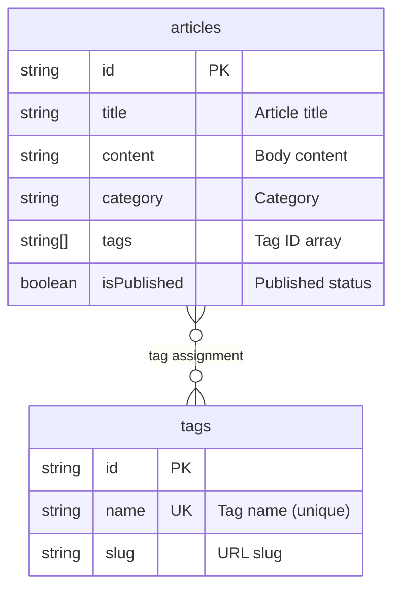

# Implementing Tag Management


💡 Create tags and assign them to articles to categorize content. Also implement filtering articles by tag.


## Overview

Implement the blog's tag system. Manage tags in the `tags` table and link them to articles using the `tags` field in the `articles` table.

| Feature | Description | API Endpoint |
|---------|-------------|--------------|
| Create Table | Create tags table | Console UI / MCP |
| Create Tag | Add a new tag | `POST /v1/data/tags` |
| List Tags | Retrieve all tags | `GET /v1/data/tags` |
| Update Tag | Modify tag info | `PATCH /v1/data/tags/{id}` |
| Delete Tag | Delete a tag | `DELETE /v1/data/tags/{id}` |
| Assign Tags to Article | Update articles.tags field | `PATCH /v1/data/articles/{id}` |

### Prerequisites

| Required Item | Description | Reference |
|---------------|-------------|-----------|
| Authentication setup complete | Access Token issued | [01-auth.md](01-auth.md) |
| articles table | Articles to assign tags to | [02-articles.md](02-articles.md) |

***

## Tag Relationship Structure



***

## Step 1: Create the tags Table

Create the `tags` table to store tag data.

### Table Schema

| Field | Type | Required | Description |
|-------|------|:--------:|-------------|
| `name` | String | ✅ | Tag name (unique) |
| `slug` | String | - | URL slug (e.g., `javascript`) |

### Add tags Field to articles Table

Add a `tags` field to the `articles` table to store an array of tag IDs.

| Field | Type | Description |
|-------|------|-------------|
| `tags` | Array(String) | Tag ID array |





✅ **Try saying this to the AI**
"I want to add tags to blog posts. Let me manage tag names and URL identifiers. Tags with the same name should not be duplicated. Also, let me assign multiple tags to each article. Show me the structure before creating it."



💡 Verify that the AI suggests a structure similar to the one below.

| Field | Description | Example Value |
|-------|-------------|---------------|
| name | Tag name | "travel" |
| slug | URL identifier | "travel" |





Create the table in the bkend console.

**Create the tags table:**

1. Go to **Console** > **Table Management** menu.
2. Click the **Add Table** button.
3. Enter `tags` as the table name.
4. Add the fields from the schema table above.
5. Click the **Save** button.

**Add the tags field to the articles table:**

1. Select the `articles` table in **Table Management**.
2. Click the **Add Field** button.
3. Set field name to `tags`, type to `Array(String)`.
4. Click the **Save** button.




***

## Step 2: Create Tags





✅ **Try saying this to the AI**
"Create tags for the blog: travel, food, tech, lifestyle"



💡 If you request multiple tags at once, the AI will automatically create them one by one.





### curl

```bash
curl -X POST https://api-client.bkend.ai/v1/data/tags \
  -H "Content-Type: application/json" \
  -H "X-API-Key: {pk_publishable_key}" \
  -H "Authorization: Bearer {accessToken}" \
  -d '{
    "name": "travel",
    "slug": "travel"
  }'
```

### bkendFetch

```javascript
import { bkendFetch } from './bkend.js';

const tag = await bkendFetch('/v1/data/tags', {
  method: 'POST',
  body: {
    name: 'travel',
    slug: 'travel',
  },
});

console.log(tag.id); // Created tag ID
```

### Create Multiple Tags at Once

```javascript
const tagNames = [
  { name: 'travel', slug: 'travel' },
  { name: 'food', slug: 'food' },
  { name: 'tech', slug: 'tech' },
  { name: 'lifestyle', slug: 'lifestyle' },
];

const tags = await Promise.all(
  tagNames.map(tag =>
    bkendFetch('/v1/data/tags', {
      method: 'POST',
      body: tag,
    })
  )
);

console.log(tags.map(t => `${t.name}: ${t.id}`));
```

### Success Response (201 Created)

```json
{
  "id": "tag-uuid-travel",
  "name": "travel",
  "slug": "travel",
  "createdBy": "user-uuid-1234",
  "createdAt": "2026-02-08T11:00:00.000Z"
}
```




***

## Step 3: List Tags





✅ **Try saying this to the AI**
"Show me the current list of tags"





### curl

```bash
curl -X GET "https://api-client.bkend.ai/v1/data/tags?sortBy=name&sortDirection=asc" \
  -H "X-API-Key: {pk_publishable_key}" \
  -H "Authorization: Bearer {accessToken}"
```

### bkendFetch

```javascript
// All tags (sorted by name)
const result = await bkendFetch('/v1/data/tags?sortBy=name&sortDirection=asc');

console.log(result.items);
// [{ id: "...", name: "food", slug: "food" }, { id: "...", name: "tech", slug: "tech" }, ...]
```

### Success Response (200 OK)

```json
{
  "items": [
    {
      "id": "tag-uuid-tech",
      "name": "tech",
      "slug": "tech",
      "createdAt": "2026-02-08T11:00:00.000Z"
    },
    {
      "id": "tag-uuid-food",
      "name": "food",
      "slug": "food",
      "createdAt": "2026-02-08T11:00:00.000Z"
    },
    {
      "id": "tag-uuid-travel",
      "name": "travel",
      "slug": "travel",
      "createdAt": "2026-02-08T11:00:00.000Z"
    }
  ],
  "pagination": {
    "total": 3,
    "page": 1,
    "limit": 20,
    "totalPages": 1,
    "hasNext": false,
    "hasPrev": false
  }
}
```




***

## Step 4: Assign Tags to an Article

Store tag ID arrays in the article's `tags` field to link tags.





✅ **Try saying this to the AI**
"Add 'travel' and 'food' tags to the Jeju trip article"



✅ **To remove tags**
"Remove all tags from this article"





### curl

```bash
curl -X PATCH https://api-client.bkend.ai/v1/data/articles/{articleId} \
  -H "Content-Type: application/json" \
  -H "X-API-Key: {pk_publishable_key}" \
  -H "Authorization: Bearer {accessToken}" \
  -d '{
    "tags": ["tag-uuid-travel", "tag-uuid-food"]
  }'
```

### bkendFetch

```javascript
// Assign tags to article
await bkendFetch(`/v1/data/articles/${articleId}`, {
  method: 'PATCH',
  body: {
    tags: ['tag-uuid-travel', 'tag-uuid-food'],
  },
});

// Replace tags (replaces existing tags with new ones)
await bkendFetch(`/v1/data/articles/${articleId}`, {
  method: 'PATCH',
  body: {
    tags: ['tag-uuid-tech'],
  },
});

// Remove all tags
await bkendFetch(`/v1/data/articles/${articleId}`, {
  method: 'PATCH',
  body: {
    tags: [],
  },
});
```


💡 Setting a new array for the `tags` field completely replaces existing tags. To add tags, first retrieve the existing tag list, merge them, and then update.





***

## Step 5: Filter Articles by Tag

Retrieve articles that have a specific tag assigned.





✅ **Try saying this to the AI**
"Show me articles tagged with 'travel'"



✅ **To filter by multiple tags**
"Show me articles that have both 'travel' and 'food' tags"





### curl — Get Articles with a Specific Tag

```bash
curl -X GET "https://api-client.bkend.ai/v1/data/articles?andFilters=%7B%22tags%22%3A%22tag-uuid-travel%22%7D&sortBy=createdAt&sortDirection=desc" \
  -H "X-API-Key: {pk_publishable_key}" \
  -H "Authorization: Bearer {accessToken}"
```

### bkendFetch

```javascript
// Get articles containing a specific tag
const filters = JSON.stringify({ tags: 'tag-uuid-travel' });
const travelPosts = await bkendFetch(
  `/v1/data/articles?andFilters=${encodeURIComponent(filters)}&sortBy=createdAt&sortDirection=desc`
);

console.log(travelPosts.items); // Articles tagged with "travel"
```

### Display Article List with Tag Names

```javascript
// 1. Get tag list
const tagsResult = await bkendFetch('/v1/data/tags');
const tagMap = {};
tagsResult.items.forEach(tag => {
  tagMap[tag.id] = tag.name;
});

// 2. Get article list
const articlesResult = await bkendFetch('/v1/data/articles?page=1&limit=10');

// 3. Map and display tag names
articlesResult.items.forEach(article => {
  const tagNames = (article.tags || []).map(tagId => tagMap[tagId] || tagId);
  console.log(`${article.title} — Tags: ${tagNames.join(', ')}`);
});
```




***

## Step 6: Update and Delete Tags





✅ **To update a tag**
"Rename the 'travel' tag to 'overseas travel'"



✅ **To delete a tag**
"Delete the 'lifestyle' tag"





### Update Tag

```bash
curl -X PATCH https://api-client.bkend.ai/v1/data/tags/{tagId} \
  -H "Content-Type: application/json" \
  -H "X-API-Key: {pk_publishable_key}" \
  -H "Authorization: Bearer {accessToken}" \
  -d '{
    "name": "overseas travel",
    "slug": "overseas-travel"
  }'
```

```javascript
await bkendFetch(`/v1/data/tags/${tagId}`, {
  method: 'PATCH',
  body: {
    name: 'overseas travel',
    slug: 'overseas-travel',
  },
});
```

### Delete Tag

```bash
curl -X DELETE https://api-client.bkend.ai/v1/data/tags/{tagId} \
  -H "X-API-Key: {pk_publishable_key}" \
  -H "Authorization: Bearer {accessToken}"
```

```javascript
await bkendFetch(`/v1/data/tags/${tagId}`, {
  method: 'DELETE',
});
```


⚠️ Deleting a tag does not automatically remove the tag ID remaining in article `tags` arrays. Update the `tags` field of related articles if needed.





***

## Error Handling

| HTTP Status | Error Code | Cause | Solution |
|:-----------:|------------|-------|----------|
| 400 | `data/validation-error` | Required field missing | Verify `name` field is included |
| 401 | `common/authentication-required` | Auth token expired | Refresh token and retry |
| 403 | `data/permission-denied` | No permission | Verify table permissions |
| 404 | `data/not-found` | Tag does not exist | Verify tag ID |
| 409 | `data/duplicate-value` | Duplicate tag name | Check for existing tag name |

***

## Reference Docs

- [Insert Data](../../../database/03-insert.md) — POST API details
- [List Data](../../../database/05-list.md) — Filter/sort/pagination details
- [Update Data](../../../database/06-update.md) — PATCH API details
- [Error Handling](../../../guides/11-error-handling.md) — Error codes and handling patterns

## Next Steps

Save and manage articles of interest in [Bookmarks](05-bookmarks.md).
