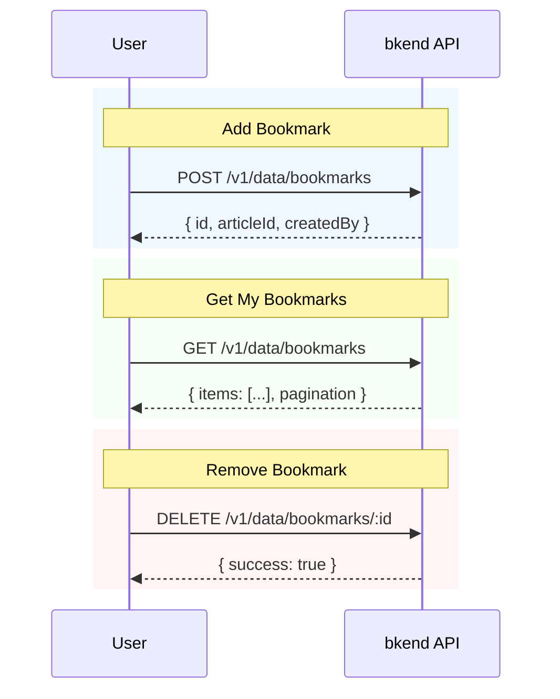

# Implementing Bookmarks


💡 Save articles of interest to bookmarks and manage them. Implement bookmark add/remove toggle and bookmark list retrieval.


## Overview

Implement the blog's bookmark feature. Users can save articles of interest and view their saved article list.

| Feature | Description | API Endpoint |
|---------|-------------|--------------|
| Create Table | Create bookmarks table | Console UI / MCP |
| Add Bookmark | Bookmark an article | `POST /v1/data/bookmarks` |
| My Bookmark List | Retrieve bookmarked articles | `GET /v1/data/bookmarks` |
| Remove Bookmark | Remove a bookmark | `DELETE /v1/data/bookmarks/{id}` |

### Prerequisites

| Required Item | Description | Reference |
|---------------|-------------|-----------|
| Authentication setup complete | Access Token issued | [01-auth.md](01-auth.md) |
| articles table | Articles to bookmark | [02-articles.md](02-articles.md) |

***

## Bookmark Flow



***

## Step 1: Create the bookmarks Table

Create the `bookmarks` table to store bookmark data.

### Table Schema

| Field | Type | Required | Description |
|-------|------|:--------:|-------------|
| `articleId` | String | ✅ | ID of the article to bookmark |


💡 The `createdBy` field is automatically set by the system. The logged-in user's ID is saved automatically, so you do not need to create a separate `userId` field.






✅ **Try saying this to the AI**
"I want users to be able to bookmark articles they're interested in. Let me save which articles were bookmarked. The same article should not be bookmarked twice. Show me the structure before creating it."



💡 Verify that the AI suggests a structure similar to the one below.

| Field | Description | Example Value |
|-------|-------------|---------------|
| articleId | Bookmarked article | (article ID) |





Create the table in the bkend console.

1. Go to **Console** > **Table Management** menu.
2. Click the **Add Table** button.
3. Enter `bookmarks` as the table name.
4. Add the `articleId` field (Type: String, Required: Yes).
5. Click the **Save** button.

<!-- 📸 IMG: Bookmarks table creation screen in the console -->




***

## Step 2: Add a Bookmark





✅ **Try saying this to the AI**
"Save the Jeju trip article to my bookmarks"





### curl

```bash
curl -X POST https://api-client.bkend.ai/v1/data/bookmarks \
  -H "Content-Type: application/json" \
  -H "X-API-Key: {pk_publishable_key}" \
  -H "Authorization: Bearer {accessToken}" \
  -d '{
    "articleId": "507f1f77bcf86cd799439011"
  }'
```

### bkendFetch

```javascript
import { bkendFetch } from './bkend.js';

const bookmark = await bkendFetch('/v1/data/bookmarks', {
  method: 'POST',
  body: {
    articleId: '507f1f77bcf86cd799439011',
  },
});

console.log(bookmark.id); // Created bookmark ID
```

### Success Response (201 Created)

```json
{
  "id": "bookmark-uuid-1234",
  "articleId": "507f1f77bcf86cd799439011",
  "createdBy": "user-uuid-1234",
  "createdAt": "2026-02-08T12:00:00.000Z"
}
```




***

## Step 3: Get My Bookmark List





✅ **Try saying this to the AI**
"Show me the list of articles I've bookmarked"



✅ **To also see article titles**
"Show me my bookmark list with article titles"


The AI will retrieve the bookmark list and then fetch the details for each article.




### curl

```bash
curl -X GET "https://api-client.bkend.ai/v1/data/bookmarks?sortBy=createdAt&sortDirection=desc" \
  -H "X-API-Key: {pk_publishable_key}" \
  -H "Authorization: Bearer {accessToken}"
```

### bkendFetch

```javascript
// My bookmark list (newest first)
const result = await bkendFetch('/v1/data/bookmarks?sortBy=createdAt&sortDirection=desc');

console.log(result.items);      // Bookmark array
console.log(result.pagination); // Pagination info
```

### Success Response (200 OK)

```json
{
  "items": [
    {
      "id": "bookmark-uuid-1234",
      "articleId": "507f1f77bcf86cd799439011",
      "createdBy": "user-uuid-1234",
      "createdAt": "2026-02-08T12:00:00.000Z"
    },
    {
      "id": "bookmark-uuid-5678",
      "articleId": "507f1f77bcf86cd799439012",
      "createdBy": "user-uuid-1234",
      "createdAt": "2026-02-07T15:00:00.000Z"
    }
  ],
  "pagination": {
    "total": 2,
    "page": 1,
    "limit": 20,
    "totalPages": 1,
    "hasNext": false,
    "hasPrev": false
  }
}
```

### Retrieve Bookmarked Article Details

Extract `articleId` from the bookmark list, then retrieve the article details.

```javascript
// 1. Get my bookmark list
const bookmarks = await bkendFetch('/v1/data/bookmarks?sortBy=createdAt&sortDirection=desc');

// 2. Extract articleId list
const articleIds = bookmarks.items.map(b => b.articleId);

// 3. Get each article's details
const articles = await Promise.all(
  articleIds.map(id => bkendFetch(`/v1/data/articles/${id}`))
);

// 4. Combine bookmark + article info
const bookmarkList = bookmarks.items.map((bookmark, index) => ({
  bookmarkId: bookmark.id,
  bookmarkedAt: bookmark.createdAt,
  article: articles[index],
}));

bookmarkList.forEach(item => {
  console.log(`[${item.bookmarkedAt}] ${item.article.title}`);
});
```




***

## Step 4: Remove a Bookmark





✅ **Try saying this to the AI**
"Remove the bookmark for the Jeju trip article"


The AI will find and delete the bookmark for that article.




### curl

```bash
curl -X DELETE https://api-client.bkend.ai/v1/data/bookmarks/{bookmarkId} \
  -H "X-API-Key: {pk_publishable_key}" \
  -H "Authorization: Bearer {accessToken}"
```

### bkendFetch

```javascript
await bkendFetch(`/v1/data/bookmarks/${bookmarkId}`, {
  method: 'DELETE',
});
```

### Success Response (200 OK)

```json
{
  "success": true
}
```




***

## Step 5: Bookmark Toggle

Implement bookmark add/remove as a single function.





✅ **Try saying this to the AI**
"Toggle the bookmark for this article. If it's already bookmarked, remove it; otherwise, add it."


The AI processes this sequentially:

1. Check if a bookmark exists for that article
2. Add or remove based on the result




### bkendFetch — Toggle Implementation

```javascript
async function toggleBookmark(articleId) {
  // 1. Check if a bookmark exists for this article
  const filters = JSON.stringify({ articleId });
  const result = await bkendFetch(
    `/v1/data/bookmarks?andFilters=${encodeURIComponent(filters)}`
  );

  if (result.items.length > 0) {
    // 2a. Bookmark exists — delete it
    await bkendFetch(`/v1/data/bookmarks/${result.items[0].id}`, {
      method: 'DELETE',
    });
    return { bookmarked: false };
  } else {
    // 2b. No bookmark — add it
    const bookmark = await bkendFetch('/v1/data/bookmarks', {
      method: 'POST',
      body: { articleId },
    });
    return { bookmarked: true, bookmarkId: bookmark.id };
  }
}

// Usage example
const result = await toggleBookmark('507f1f77bcf86cd799439011');
console.log(result.bookmarked ? 'Bookmark added' : 'Bookmark removed');
```

### Display Bookmark Status in Article List

```javascript
async function getArticlesWithBookmarkStatus(page = 1) {
  // 1. Get article list
  const articles = await bkendFetch(`/v1/data/articles?page=${page}&limit=10`);

  // 2. Get my bookmark list
  const bookmarks = await bkendFetch('/v1/data/bookmarks?limit=100');
  const bookmarkedIds = new Set(bookmarks.items.map(b => b.articleId));

  // 3. Display bookmark status
  return articles.items.map(article => ({
    ...article,
    isBookmarked: bookmarkedIds.has(article.id),
  }));
}

const articles = await getArticlesWithBookmarkStatus();
articles.forEach(article => {
  const icon = article.isBookmarked ? '[v]' : '[ ]';
  console.log(`${icon} ${article.title}`);
});
```




***

## Step 6: Bookmark Count

Check the number of bookmarks per article.





✅ **Try saying this to the AI**
"Check how many bookmarks the Jeju trip article has"





### bkendFetch

```javascript
// Check bookmark count for a specific article
async function getBookmarkCount(articleId) {
  const filters = JSON.stringify({ articleId });
  const result = await bkendFetch(
    `/v1/data/bookmarks?andFilters=${encodeURIComponent(filters)}&limit=1`
  );

  return result.pagination.total;
}

const count = await getBookmarkCount('507f1f77bcf86cd799439011');
console.log(`Bookmark count: ${count}`);
```


💡 Setting `limit=1` fetches only 1 record, but `pagination.total` still returns the total count.





***

## Error Handling

| HTTP Status | Error Code | Cause | Solution |
|:-----------:|------------|-------|----------|
| 400 | `data/validation-error` | Required field missing | Verify `articleId` is included |
| 401 | `common/authentication-required` | Auth token expired | Refresh token and retry |
| 403 | `data/permission-denied` | No permission | Verify login status |
| 404 | `data/not-found` | Bookmark does not exist | Verify bookmark ID |
| 409 | `data/duplicate-value` | Article already bookmarked | Use the toggle pattern (see Step 5) |

***

## Reference Docs

- [Insert Data](../../../database/03-insert.md) — POST API details
- [List Data](../../../database/05-list.md) — Filter/sort/pagination details
- [Delete Data](../../../database/07-delete.md) — DELETE API details
- [Error Handling](../../../guides/11-error-handling.md) — Error codes and handling patterns

## Next Steps

Check AI prompts organized by scenario in [AI Prompt Collection](06-ai-prompts.md).
