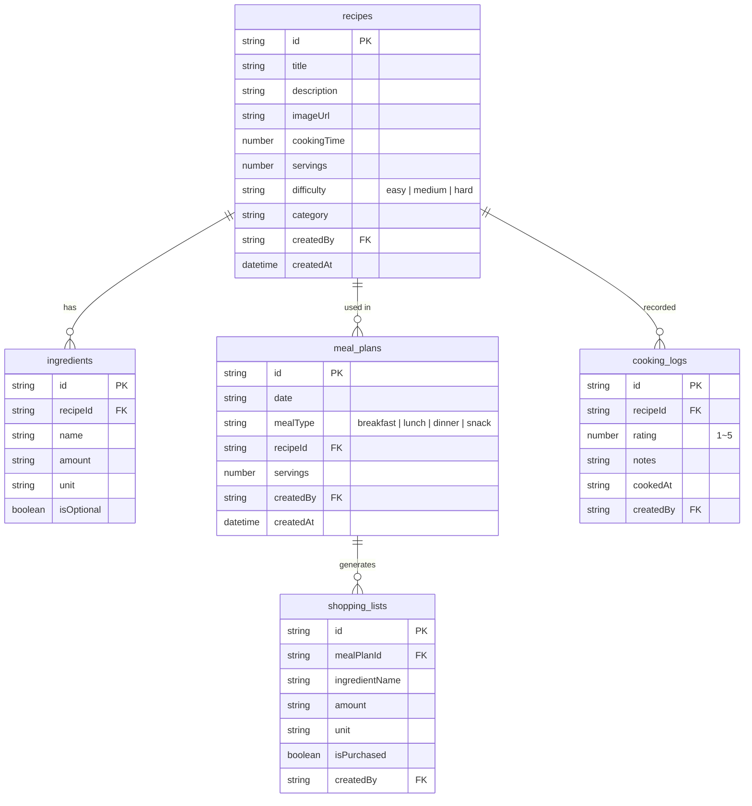

# Recipe App Cookbook


A step-by-step tutorial for building a recipe management app from scratch with bkend.


## What You'll Build

After completing this cookbook, you will have a **recipe management app** with the following features:

- Recipe create/search/update/delete
- Ingredient management and quantity tracking
- Weekly meal planning (breakfast/lunch/dinner/snack)
- Auto-generated shopping lists based on meal plans
- Cooking log with ratings

| Item | Details |
|------|---------|
| Difficulty | ⭐⭐⭐ Intermediate |
| Platform | Web |
| Estimated Time | Quick Start 10 min, Full Guide 4 hours |

***

## bkend Features Used

| bkend Feature | Used For | Reference |
|---------------|----------|-----------|
| Email Auth | Sign up / Sign in | [Email Sign Up](../../authentication/02-email-signup.md) |
| Dynamic Tables | Recipes, ingredients, meal plans, shopping lists, cooking logs CRUD | [Database Overview](../../database/01-overview.md) |
| Storage | Recipe photo upload | [Storage Overview](../../storage/01-overview.md) |
| MCP Tools | Manage tables/data with AI | [MCP](../../mcp/01-overview.md) |

***

## Table Design

***

## Learning Path

| Chapter | Title | Description |
|:-------:|-------|-------------|
| - | [Quick Start](quick-start.md) | Register your first recipe in 10 minutes |
| 00 | [Overview](full-guide/00-overview.md) | Project structure and table design |
| 01 | [Authentication](full-guide/01-auth.md) | Email sign up / sign in |
| 02 | [Recipes](full-guide/02-recipes.md) | Recipe CRUD + images |
| 03 | [Ingredients](full-guide/03-ingredients.md) | Ingredient management |
| 04 | [Meal Plan](full-guide/04-meal-plan.md) | Weekly meal planning |
| 05 | [Shopping List](full-guide/05-shopping-list.md) | Auto-generated shopping lists |
| 06 | [AI Scenarios](full-guide/06-ai-prompts.md) | AI-powered recipe recommendations |
| 99 | [Troubleshooting](full-guide/99-troubleshooting.md) | FAQ and error handling |

***

## Prerequisites

Complete the following items before starting the cookbook.

| Item | Description | Reference |
|------|-------------|-----------|
| bkend Account | Sign up on the console | [Console Sign Up](../../console/02-signup-login.md) |
| Create Project | Create a new project on the console | [Project Management](../../console/04-project-management.md) |
| API Key | Console → **MCP** → **Create New Token** | [API Key Management](../../console/11-api-keys.md) |
| AI Tool (Optional) | Install Claude Code or Cursor | [MCP](../../mcp/01-overview.md) |

***

## Reference

- [recipe-web example project](../../../examples/recipe-web/) — Web implementation code for this cookbook
- [recipe-app example project](../../../examples/recipe-app/) — App implementation code for this cookbook

***

## Next Step

To get started right away, follow the [Quick Start](quick-start.md). For a detailed implementation, go to the [Full Guide](./full-guide/).
