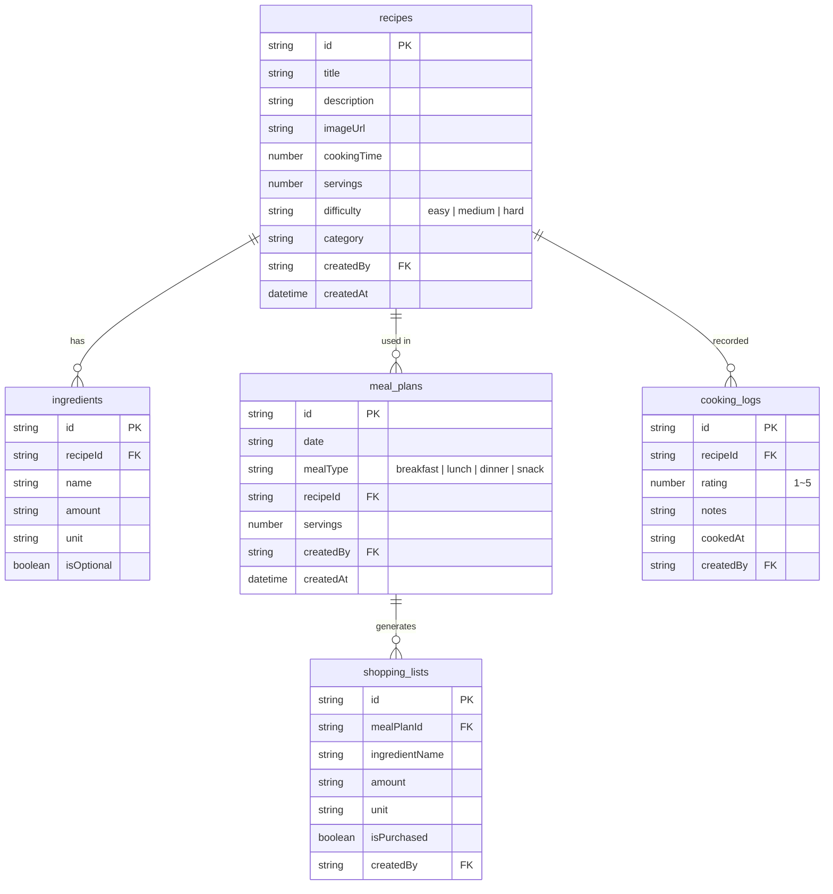
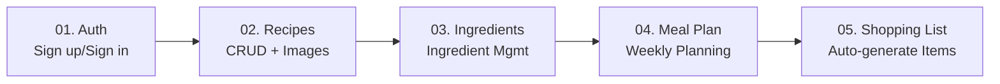

# 00. Project Overview


💡 Understand the overall structure, table design, and implementation flow of the recipe app.


## What You'll Build

After completing this cookbook, you will have a recipe management app with the following features:

- **Recipe Management** — Create, search, update, delete recipes and attach images
- **Ingredient Management** — Register ingredients per recipe, manage quantities and units
- **Meal Planning** — Assign recipes by date and meal type
- **Shopping List** — Auto-generate ingredient lists from meal plans, check off purchases
- **Cooking Log** — Record ratings and notes after cooking

***

## Prerequisites

Complete the following items before starting this guide.




| Step | Item | Reference |
|:----:|------|-----------|
| 1 | Sign up for bkend console | [Console Sign Up](../../../console/02-signup-login.md) |
| 2 | Create a project | [Project Management](../../../console/04-project-management.md) |
| 3 | Install AI tool | [MCP Overview](../../../mcp/01-overview.md) |
| 4 | Connect MCP OAuth | [OAuth 2.1 Authentication](../../../mcp/05-oauth.md) |


✅ **Try saying this to the AI**
"Show me the list of projects connected to bkend"

If the project list appears, you are ready to go.





| Step | Item | Reference |
|:----:|------|-----------|
| 1 | Sign up for bkend console | [Console Sign Up](../../../console/02-signup-login.md) |
| 2 | Create a project | [Project Management](../../../console/04-project-management.md) |
| 3 | Issue API Key | [API Key Management](../../../console/11-api-keys.md) |





⚠️ The "sign up" mentioned here refers to creating a **bkend console account**. User sign up for the app is implemented in [Authentication](01-auth.md).


***

## Feature Summary

| bkend Feature | Used For | Reference |
|---------------|----------|-----------|
| Email Auth | Sign up, sign in, token management | [Email Sign Up](../../../authentication/02-email-signup.md) |
| Dynamic Tables | recipes, ingredients, meal_plans, shopping_lists, cooking_logs | [Database Overview](../../../database/01-overview.md) |
| Data CRUD | `/v1/data/{tableName}` endpoint | [Insert Data](../../../database/03-insert.md) |
| Storage | Recipe photo upload | [Single Upload](../../../storage/02-upload-single.md) |
| MCP Tools | Create tables and manage data with AI | [MCP Overview](../../../mcp/01-overview.md) |

***

## Table Design

This cookbook uses 5 dynamic tables. All data is managed via CRUD operations through the `/v1/data/{tableName}` endpoint.

### Table Descriptions

| Table | Purpose | Key Fields |
|-------|---------|------------|
| `recipes` | Recipe information | title, description, cookingTime, servings, difficulty, category |
| `ingredients` | Ingredients per recipe | recipeId, name, amount, unit, isOptional |
| `meal_plans` | Meal plans by date/meal type | date, mealType, recipeId, servings |
| `shopping_lists` | Shopping lists | mealPlanId, ingredientName, amount, unit, isPurchased |
| `cooking_logs` | Cooking completion records | recipeId, rating, notes, cookedAt |


💡 All dynamic tables automatically include `_id`, `createdBy`, `createdAt`, and `updatedAt` fields.


***

## Implementation Flow

Each chapter builds on the results of the previous one:

1. **Authentication** — Sign up/sign in to obtain an Access Token.
2. **Recipes** — Use the token to CRUD recipe data.
3. **Ingredients** — Manage ingredients linked to recipes.
4. **Meal Plan** — Assign recipes to dates and meal types.
5. **Shopping List** — Aggregate ingredients from meal plans to create a shopping list.

***

## API Endpoint Summary

These are the REST API endpoints used in this cookbook. All requests require `X-API-Key` and `Authorization` headers.

### Auth API

| Method | Endpoint | Description |
|--------|----------|-------------|
| POST | `/v1/auth/email/signup` | Email sign up |
| POST | `/v1/auth/email/signin` | Email sign in |
| POST | `/v1/auth/refresh` | Token refresh |
| GET | `/v1/auth/me` | Get my info |

### Data API

| Method | Endpoint | Description |
|--------|----------|-------------|
| POST | `/v1/data/{tableName}` | Create data |
| GET | `/v1/data/{tableName}` | List data |
| GET | `/v1/data/{tableName}/{id}` | Get data detail |
| PATCH | `/v1/data/{tableName}/{id}` | Update data |
| DELETE | `/v1/data/{tableName}/{id}` | Delete data |

### Storage API

| Method | Endpoint | Description |
|--------|----------|-------------|
| POST | `/v1/files/upload` | Upload file |
| GET | `/v1/files/{fileId}` | Get file metadata |


⚠️ Use `recipes`, `ingredients`, `meal_plans`, `shopping_lists`, or `cooking_logs` for `{tableName}`.


***

## Learning Path

| Order | Chapter | Description | Est. Time |
|:-----:|---------|-------------|:---------:|
| 1 | [Authentication](01-auth.md) | Email sign up / sign in | 30 min |
| 2 | [Recipes](02-recipes.md) | Recipe CRUD + images | 60 min |
| 3 | [Ingredients](03-ingredients.md) | Ingredient management | 30 min |
| 4 | [Meal Plan](04-meal-plan.md) | Weekly meal planning | 40 min |
| 5 | [Shopping List](05-shopping-list.md) | Auto-generated shopping lists | 30 min |
| 6 | [AI Scenarios](06-ai-prompts.md) | AI-powered recipe recommendations | 20 min |

***

## Reference

- [Integrating bkend in Your App](../../../getting-started/06-app-integration.md) — bkendFetch helper function
- [Error Handling Guide](../../../guides/11-error-handling.md) — Common error codes and responses
- [recipe-web example project](../../../../examples/recipe-web/) — Web implementation code for this cookbook
- [recipe-app example project](../../../../examples/recipe-app/) — App implementation code for this cookbook

***

## Next Step

Set up email sign up and sign in in [01. Authentication](01-auth.md).
