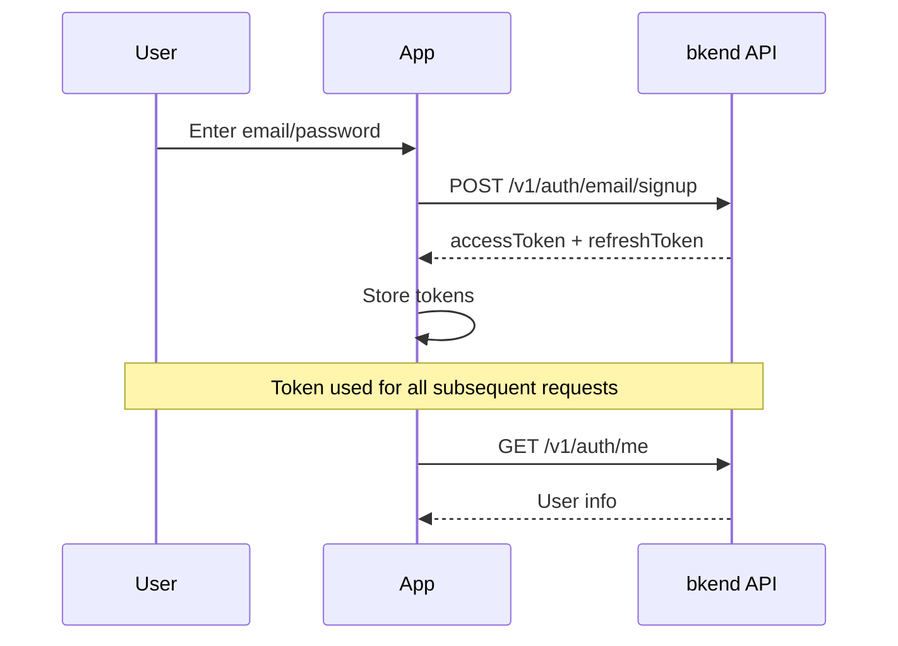

# 01. Authentication


💡 Set up authentication for the recipe app with email sign up and sign in.


## What You'll Learn

- Email/password sign up
- Email/password sign in
- bkendFetch helper setup
- Profile verification

***

## Authentication Flow

The recipe app authenticates using email/password. After signing up and signing in, you receive an Access Token, which is used for all subsequent API requests.



***

## Step 1: Sign Up

Create a new account with email and password.





✅ **Try saying this to the AI**
"Create the email sign up and sign in code for the recipe app. Use the bkendFetch helper for the implementation."



💡 Sign up and sign in are features that users perform directly in the app. Ask the AI to generate the code, then add the generated code to your app. You can also check the implementation code in the **Console + REST API** tab.





```bash
curl -X POST https://api-client.bkend.ai/v1/auth/email/signup \
  -H "Content-Type: application/json" \
  -H "X-API-Key: {pk_publishable_key}" \
  -d '{
    "method": "password",
    "email": "chef@example.com",
    "password": "abc123",
    "name": "Chef Kim"
  }'
```

**Response:**

```json
{
  "accessToken": "eyJhbGciOiJIUzI1NiIs...",
  "refreshToken": "eyJhbGciOiJIUzI1NiIs...",
  "tokenType": "Bearer",
  "expiresIn": 3600
}
```




### Request Parameters

| Parameter | Type | Required | Description |
|-----------|------|:--------:|-------------|
| `method` | `string` | ✅ | Fixed value: `"password"` |
| `email` | `string` | ✅ | User email address |
| `password` | `string` | ✅ | Password (see policy below) |
| `name` | `string` | ✅ | User name |

### Password Policy

| Requirement | Details |
|-------------|---------|
| Minimum length | 6 characters or more |


⚠️ A `400 Bad Request` error occurs if the password policy is not met.


***

## Step 2: Sign In

Sign in with your registered email and password.





✅ **Try saying this to the AI**
"Create code that stores the token in localStorage after sign in, and auto-refreshes on 401 errors."



💡 The AI generates complete code including token management logic. Refer to the **Console + REST API** tab for detailed implementation.





```bash
curl -X POST https://api-client.bkend.ai/v1/auth/email/signin \
  -H "Content-Type: application/json" \
  -H "X-API-Key: {pk_publishable_key}" \
  -d '{
    "method": "password",
    "email": "chef@example.com",
    "password": "abc123"
  }'
```

**Response:**

```json
{
  "accessToken": "eyJhbGciOiJIUzI1NiIs...",
  "refreshToken": "eyJhbGciOiJIUzI1NiIs...",
  "tokenType": "Bearer",
  "expiresIn": 3600
}
```




### Request Parameters

| Parameter | Type | Required | Description |
|-----------|------|:--------:|-------------|
| `method` | `string` | ✅ | Fixed value: `"password"` |
| `email` | `string` | ✅ | Registered email address |
| `password` | `string` | ✅ | Password |
| `mfaCode` | `string` | Conditional | 6-digit TOTP code when MFA is enabled |

### Response Parameters

| Field | Type | Description |
|-------|------|-------------|
| `accessToken` | `string` | JWT token used for API authentication |
| `refreshToken` | `string` | Token for refreshing the Access Token |
| `tokenType` | `string` | Token type (`"Bearer"`) |
| `expiresIn` | `number` | Access Token validity period (seconds) |

***

## Step 3: Set Up the bkendFetch Helper

Store the issued token and set up a helper function so it is automatically included in all subsequent API requests.

```javascript
// bkend.js — Add this file to your project

const BASE_URL = 'https://api-client.bkend.ai';
const PUBLISHABLE_KEY = '{pk_publishable_key}';

async function bkendFetch(endpoint, options = {}) {
  const accessToken = localStorage.getItem('accessToken');

  const response = await fetch(`${BASE_URL}${endpoint}`, {
    ...options,
    headers: {
      'Content-Type': 'application/json',
      'X-API-Key': PUBLISHABLE_KEY,
      ...(accessToken && { 'Authorization': `Bearer ${accessToken}` }),
      ...options.headers,
    },
  });

  if (response.status === 401) {
    // Attempt to refresh when Access Token expires
    const refreshed = await refreshAccessToken();
    if (refreshed) {
      return bkendFetch(endpoint, options);
    }
    // Redirect to login page on refresh failure
    window.location.href = '/login';
    return;
  }

  return response.json();
}
```

### Token Storage Example

Store the tokens after a successful sign in.

```javascript
async function login(email, password) {
  const result = await bkendFetch('/v1/auth/email/signin', {
    method: 'POST',
    body: {
      method: 'password',
      email,
      password,
    },
  });

  // Store tokens
  localStorage.setItem('accessToken', result.accessToken);
  localStorage.setItem('refreshToken', result.refreshToken);
  return result;
}
```

### Token Refresh

Refresh the Access Token using the Refresh Token when it expires.

```javascript
async function refreshAccessToken() {
  const refreshToken = localStorage.getItem('refreshToken');
  if (!refreshToken) return false;

  try {
    const response = await fetch(`${BASE_URL}/v1/auth/refresh`, {
      method: 'POST',
      headers: {
        'Content-Type': 'application/json',
        'X-API-Key': PUBLISHABLE_KEY,
      },
      body: JSON.stringify({ refreshToken }),
    });

    const result = await response.json();

    if (result.accessToken) {
      localStorage.setItem('accessToken', result.accessToken);
      localStorage.setItem('refreshToken', result.refreshToken);
      return true;
    }
  } catch (error) {
    console.error('Token refresh failed:', error);
  }

  localStorage.removeItem('accessToken');
  localStorage.removeItem('refreshToken');
  return false;
}
```

### Token Validity

| Token | Validity | Purpose |
|-------|:--------:|---------|
| Access Token | 1 hour | API authentication |
| Refresh Token | 30 days | Access Token refresh |


💡 For more details on the bkendFetch helper, refer to the [Integrating bkend in Your App](../../../getting-started/06-app-integration.md) documentation.


***

## Step 4: Verify Profile

Check the current user information after signing in.





✅ **Try saying this to the AI**
"Create a profile component that displays the currently signed-in user's information. Use the /v1/auth/me API."





```bash
curl -X GET https://api-client.bkend.ai/v1/auth/me \
  -H "X-API-Key: {pk_publishable_key}" \
  -H "Authorization: Bearer {accessToken}"
```

**Response:**

```json
{
  "id": "user_abc123",
  "email": "chef@example.com",
  "name": "Chef Kim",
  "emailVerified": false,
  "createdAt": "2025-01-15T10:00:00Z"
}
```

Use the bkendFetch helper in JavaScript.

```javascript
const me = await bkendFetch('/v1/auth/me');
console.log(me.name); // "Chef Kim"
```




***

## Error Handling

### Authentication Error Codes

| HTTP Status | Error Code | Description | Solution |
|:-----------:|------------|-------------|----------|
| 400 | `auth/validation-error` | Missing or malformed required parameter | Check request parameters |
| 401 | `auth/invalid-credentials` | Incorrect email or password | Verify input values |
| 401 | `auth/token-expired` | Access Token expired | Refresh token or sign in again |
| 409 | `auth/email-already-exists` | Email already registered | Try signing in |
| 429 | `auth/rate-limit` | Request limit exceeded | Retry after a moment |

### Rate Limiting

| Action | Limit |
|--------|-------|
| Sign in attempts | 5 per 15 minutes |
| Sign up | 3 per hour |
| Token refresh | 10 per minute |

### Error Handling Example

```javascript
async function handleAuth(email, password) {
  try {
    const result = await login(email, password);
    // Sign in successful → redirect to home
    window.location.href = '/';
  } catch (error) {
    if (error.message.includes('auth/invalid-credentials')) {
      alert('Incorrect email or password.');
    } else if (error.message.includes('auth/rate-limit')) {
      alert('Request limit exceeded. Please try again later.');
    } else {
      alert('Sign in failed. Please try again.');
    }
  }
}
```

***

## Reference

- [Email Sign Up](../../../authentication/02-email-signup.md) — Sign up API details
- [Email Sign In](../../../authentication/03-email-signin.md) — Sign in API details
- [Token Management](../../../authentication/20-token-management.md) — Access Token / Refresh Token management

***

## Next Step

Learn about recipe CRUD and image attachment in [02. Recipes](02-recipes.md).
