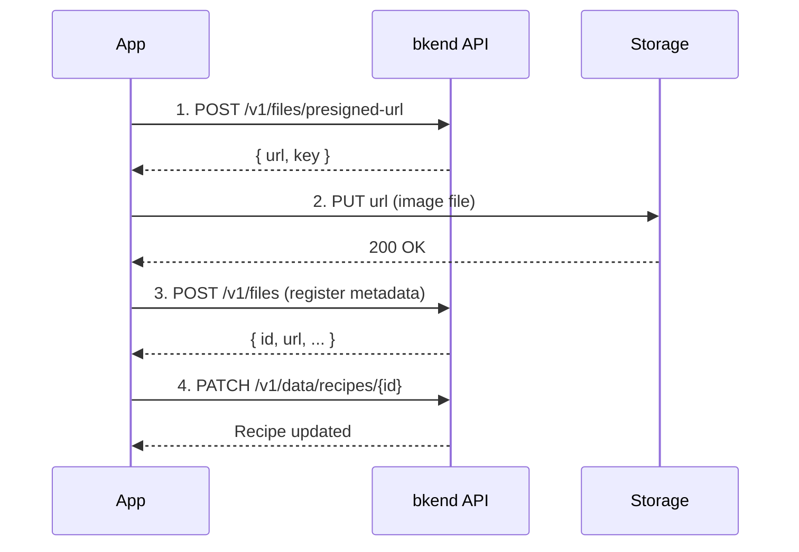

# 02. Implementing Recipes


💡 Create the recipes table and implement CRUD operations and image upload.


## Overview

In this chapter, you will manage the core recipe data of the recipe app:

- Create the `recipes` table
- Register recipes (title, description, cooking time, difficulty, servings)
- Upload recipe images (Presigned URL)
- List recipes (filter by difficulty, cooking time)
- Update/delete recipes
- View my recipes

### Prerequisites

| Required Item | Description | Reference |
|---------------|-------------|-----------|
| Auth complete | Access Token issued | [01. Authentication](01-auth.md) |
| Project | bkend project created | [Quick Start](../../../getting-started/02-quickstart.md) |

***

## Step 1: Create the recipes Table

Create a table to store recipe data.

### Table Structure

| Field | Type | Required | Description |
|-------|------|:--------:|-------------|
| `title` | `string` | ✅ | Recipe title |
| `description` | `string` | ✅ | Recipe description |
| `cookingTime` | `number` | ✅ | Cooking time (minutes) |
| `difficulty` | `string` | ✅ | Difficulty (`easy`, `medium`, `hard`) |
| `servings` | `number` | ✅ | Number of servings |
| `category` | `string` | - | Category (Korean, Western, Japanese, etc.) |
| `imageUrl` | `string` | - | Main image URL |


💡 The `id`, `createdBy`, `createdAt`, and `updatedAt` fields are automatically added.






✅ **Try saying this to the AI**

"I want to store recipes. Let me manage recipe name, description, cooking time, difficulty, servings, category, and photo. Before creating it, show me the structure first."



💡 Verify that the AI suggests a structure similar to the one below.


| Field | Description | Example Value |
|-------|-------------|---------------|
| title | Recipe name | "Kimchi Stew" |
| description | Brief description | "Spicy kimchi stew" |
| cookingTime | Cooking time (min) | 30 |
| difficulty | Difficulty level | "easy" / "medium" / "hard" |
| servings | Servings | 2 |
| category | Category | "Korean" |
| imageUrl | Recipe photo URL | (linked after upload) |




1. Navigate to the **Table Management** menu.
2. Click the **Add Table** button.
3. Enter `recipes` as the table name.
4. Add fields according to the table structure above.
5. Set the `difficulty` field as **Enum** type with `easy`, `medium`, `hard` values.
6. Click the **Save** button.

<!-- 📸 IMG: recipes table creation screen -->




### Difficulty Levels

| Difficulty | Value | Description |
|------------|-------|-------------|
| Easy | `easy` | Beginner-friendly, 5 ingredients or fewer |
| Medium | `medium` | Basic cooking experience required |
| Hard | `hard` | Advanced cooking experience required |

***

## Step 2: Register a Recipe

Once the table is created, register a recipe.





✅ **Try saying this to the AI**

"Register a new recipe. Kimchi stew, 30 minutes cooking time, easy difficulty, 2 servings, Korean cuisine. Set the description to 'A spicy stew made with pork and well-fermented kimchi'."





```bash
curl -X POST https://api-client.bkend.ai/v1/data/recipes \
  -H "Content-Type: application/json" \
  -H "X-API-Key: {pk_publishable_key}" \
  -H "Authorization: Bearer {accessToken}" \
  -d '{
    "title": "Kimchi Stew",
    "description": "A spicy stew made with pork and well-fermented kimchi.",
    "cookingTime": 30,
    "difficulty": "easy",
    "servings": 2,
    "category": "Korean"
  }'
```

**Response (201 Created):**

```json
{
  "id": "6612a3f4b1c2d3e4f5a6b7c8",
  "title": "Kimchi Stew",
  "description": "A spicy stew made with pork and well-fermented kimchi.",
  "cookingTime": 30,
  "difficulty": "easy",
  "servings": 2,
  "category": "Korean",
  "createdBy": "user_abc123",
  "createdAt": "2025-01-15T10:00:00.000Z",
  "updatedAt": "2025-01-15T10:00:00.000Z"
}
```

**Using the bkendFetch helper:**

```javascript
const recipe = await bkendFetch('/v1/data/recipes', {
  method: 'POST',
  body: {
    title: 'Kimchi Stew',
    description: 'A spicy stew made with pork and well-fermented kimchi.',
    cookingTime: 30,
    difficulty: 'easy',
    servings: 2,
    category: 'Korean',
  },
});

console.log('Recipe ID:', recipe.id);
```




### Request Parameters

| Parameter | Type | Required | Description |
|-----------|------|:--------:|-------------|
| `title` | `string` | ✅ | Recipe title (max 200 characters) |
| `description` | `string` | ✅ | Recipe description |
| `cookingTime` | `number` | ✅ | Cooking time (in minutes) |
| `difficulty` | `string` | ✅ | `easy`, `medium`, `hard` |
| `servings` | `number` | ✅ | Number of servings |
| `category` | `string` | - | Category |
| `imageUrl` | `string` | - | Main image URL |


⚠️ `id`, `createdBy`, `createdAt`, and `updatedAt` are set automatically by the system. Do not include them in your request.


***

## Step 3: Upload Recipe Image

Use the Presigned URL method to attach a main image to a recipe.







✅ **Try saying this to the AI**

"I want to add a photo to the Kimchi Stew recipe. Upload the image file and link it to the recipe."


The AI handles image upload and recipe linking sequentially.




**Step 1: Get Presigned URL**

```bash
curl -X POST https://api-client.bkend.ai/v1/files/presigned-url \
  -H "Content-Type: application/json" \
  -H "X-API-Key: {pk_publishable_key}" \
  -H "Authorization: Bearer {accessToken}" \
  -d '{
    "filename": "kimchi-jjigae.jpg",
    "contentType": "image/jpeg",
    "fileSize": 2048000,
    "visibility": "public",
    "category": "images"
  }'
```

**Step 2: Upload file to storage**

```bash
curl -X PUT "{presigned_url}" \
  -H "Content-Type: image/jpeg" \
  --data-binary @kimchi-jjigae.jpg
```

**Step 3: Register metadata**

```bash
curl -X POST https://api-client.bkend.ai/v1/files \
  -H "Content-Type: application/json" \
  -H "X-API-Key: {pk_publishable_key}" \
  -H "Authorization: Bearer {accessToken}" \
  -d '{
    "s3Key": "{issued_key}",
    "originalName": "kimchi-jjigae.jpg",
    "mimeType": "image/jpeg",
    "size": 2048000,
    "visibility": "public"
  }'
```

**Step 4: Link image to recipe**

```bash
curl -X PATCH https://api-client.bkend.ai/v1/data/recipes/{recipeId} \
  -H "Content-Type: application/json" \
  -H "X-API-Key: {pk_publishable_key}" \
  -H "Authorization: Bearer {accessToken}" \
  -d '{
    "imageUrl": "{file_download_url}"
  }'
```

**Integrated with bkendFetch helper:**

```javascript
async function uploadRecipeImage(recipeId, file) {
  // 1. Get Presigned URL
  const presigned = await bkendFetch('/v1/files/presigned-url', {
    method: 'POST',
    body: {
      filename: file.name,
      contentType: file.type,
      fileSize: file.size,
      visibility: 'public',
      category: 'images',
    },
  });

  // 2. Upload file to storage (do NOT use bkendFetch for Presigned URL)
  await fetch(presigned.url, {
    method: 'PUT',
    headers: { 'Content-Type': file.type },
    body: file,
  });

  // 3. Register metadata
  const metadata = await bkendFetch('/v1/files', {
    method: 'POST',
    body: {
      s3Key: presigned.key,
      originalName: file.name,
      mimeType: file.type,
      size: file.size,
      visibility: 'public',
    },
  });

  // 4. Link image to recipe
  await bkendFetch(`/v1/data/recipes/${recipeId}`, {
    method: 'PATCH',
    body: { imageUrl: metadata.url },
  });

  return metadata;
}
```





⚠️ Presigned URLs are only valid for **15 minutes**. Complete the upload immediately after issuance.


***

## Step 4: List Recipes

Retrieve registered recipes with various conditions.





✅ **Try saying this to the AI**

"Show me only easy difficulty recipes sorted by shortest cooking time."



✅ **Retrieve recipes under 30 minutes**

"Show me recipes that can be made in 30 minutes or less."





**Full list:**

```bash
curl -X GET "https://api-client.bkend.ai/v1/data/recipes?page=1&limit=20&sortBy=createdAt&sortDirection=desc" \
  -H "X-API-Key: {pk_publishable_key}" \
  -H "Authorization: Bearer {accessToken}"
```

**Response example:**

```json
{
  "items": [
    {
      "id": "6612a3f4b1c2d3e4f5a6b7c8",
      "title": "Kimchi Stew",
      "description": "A spicy stew made with pork and well-fermented kimchi.",
      "cookingTime": 30,
      "difficulty": "easy",
      "servings": 2,
      "category": "Korean",
      "createdAt": "2025-01-15T10:00:00.000Z"
    }
  ],
  "pagination": {
    "total": 1,
    "page": 1,
    "limit": 20,
    "totalPages": 1,
    "hasNext": false,
    "hasPrev": false
  }
}
```

**Filter by difficulty:**

```bash
curl -X GET "https://api-client.bkend.ai/v1/data/recipes?andFilters=%7B%22difficulty%22%3A%22easy%22%7D&sortBy=cookingTime&sortDirection=asc" \
  -H "X-API-Key: {pk_publishable_key}" \
  -H "Authorization: Bearer {accessToken}"
```

**Filter by cooking time range (bkendFetch):**

```javascript
// Retrieve only easy recipes
const easyRecipes = await bkendFetch(
  '/v1/data/recipes?andFilters=' +
  encodeURIComponent(JSON.stringify({ difficulty: 'easy' })) +
  '&sortBy=cookingTime&sortDirection=asc'
);

// Retrieve recipes under 30 minutes
const quickRecipes = await bkendFetch(
  '/v1/data/recipes?andFilters=' +
  encodeURIComponent(JSON.stringify({
    cookingTime: { $lte: 30 }
  })) +
  '&sortBy=createdAt&sortDirection=desc'
);

// Retrieve by category
const koreanRecipes = await bkendFetch(
  '/v1/data/recipes?andFilters=' +
  encodeURIComponent(JSON.stringify({ category: 'Korean' }))
);
```




### Filter Options Summary

| Filter Condition | Parameter Example | Description |
|------------------|-------------------|-------------|
| By difficulty | `{ "difficulty": "easy" }` | easy, medium, hard |
| Cooking time max | `{ "cookingTime": { "$lte": 30 } }` | Under 30 minutes |
| By category | `{ "category": "Korean" }` | Specific category |
| By servings | `{ "servings": 2 }` | Specific servings |

***

## Step 5: Get Recipe Details

Retrieve detailed information for a specific recipe.





✅ **Try saying this to the AI**

"Show me the detailed information for the Kimchi Stew recipe."





```bash
curl -X GET https://api-client.bkend.ai/v1/data/recipes/{recipeId} \
  -H "X-API-Key: {pk_publishable_key}" \
  -H "Authorization: Bearer {accessToken}"
```

```javascript
const recipe = await bkendFetch(`/v1/data/recipes/${recipeId}`);
console.log(recipe.title);        // "Kimchi Stew"
console.log(recipe.cookingTime);   // 30
console.log(recipe.difficulty);    // "easy"
```




***

## Step 6: Update a Recipe

Update recipe information.





✅ **Try saying this to the AI**

"Update the Kimchi Stew recipe. Change it to 4 servings and 40 minutes cooking time. Also change the description to 'A generous pot of kimchi stew for 4 people'."





```bash
curl -X PATCH https://api-client.bkend.ai/v1/data/recipes/{recipeId} \
  -H "Content-Type: application/json" \
  -H "X-API-Key: {pk_publishable_key}" \
  -H "Authorization: Bearer {accessToken}" \
  -d '{
    "servings": 4,
    "cookingTime": 40,
    "description": "A generous pot of kimchi stew for 4 people."
  }'
```

```javascript
const updated = await bkendFetch(`/v1/data/recipes/${recipeId}`, {
  method: 'PATCH',
  body: {
    servings: 4,
    cookingTime: 40,
    description: 'A generous pot of kimchi stew for 4 people.',
  },
});
```




***

## Step 7: Delete a Recipe

Delete a recipe that is no longer needed.





✅ **Try saying this to the AI**

"Delete the Kimchi Stew recipe."





```bash
curl -X DELETE https://api-client.bkend.ai/v1/data/recipes/{recipeId} \
  -H "X-API-Key: {pk_publishable_key}" \
  -H "Authorization: Bearer {accessToken}"
```

```javascript
await bkendFetch(`/v1/data/recipes/${recipeId}`, {
  method: 'DELETE',
});
```





🚨 **Warning** — Deleted data cannot be recovered. Always confirm before deleting.


***

## Step 8: View My Recipes

Retrieve only the recipes registered by the signed-in user.





✅ **Try saying this to the AI**

"Show me the list of recipes I registered."





```bash
curl -X GET "https://api-client.bkend.ai/v1/data/recipes?andFilters=%7B%22createdBy%22%3A%22{userId}%22%7D&sortBy=createdAt&sortDirection=desc" \
  -H "X-API-Key: {pk_publishable_key}" \
  -H "Authorization: Bearer {accessToken}"
```

```javascript
// View my recipes
const myRecipes = await bkendFetch(
  '/v1/data/recipes?andFilters=' +
  encodeURIComponent(JSON.stringify({ createdBy: userId })) +
  '&sortBy=createdAt&sortDirection=desc'
);

console.log(`My recipes: ${myRecipes.pagination.total}`);
myRecipes.items.forEach(r => {
  console.log(`- ${r.title} (${r.difficulty}, ${r.cookingTime} min)`);
});
```




***

## Error Handling

### Key Error Codes

| HTTP Status | Error Code | Description | Solution |
|:-----------:|------------|-------------|----------|
| 400 | `data/validation-error` | Missing required field or format error | Check title, description, cookingTime, difficulty, servings |
| 401 | `common/authentication-required` | Auth token missing or expired | Refresh token and retry |
| 404 | `data/not-found` | Recipe does not exist | Verify recipe ID |
| 403 | `common/forbidden` | Attempted to modify/delete another user's recipe | Only your own recipes can be modified |

```javascript
try {
  const recipe = await bkendFetch('/v1/data/recipes', {
    method: 'POST',
    body: { title: 'Kimchi Stew' }, // Missing required fields
  });
} catch (error) {
  if (error.message.includes('data/validation-error')) {
    console.error('Please fill in all required fields.');
  }
}
```

***

## Reference

- [Table Management](../../../console/07-table-management.md) — Create/manage tables in the console
- [Create Data](../../../database/03-insert.md) — REST API data creation details
- [List Data](../../../database/05-list.md) — Filtering, sorting, pagination
- [Single File Upload](../../../storage/02-upload-single.md) — Presigned URL upload details

***

## Next Step

Implement ingredient management for each recipe in [03. Ingredients](03-ingredients.md).
