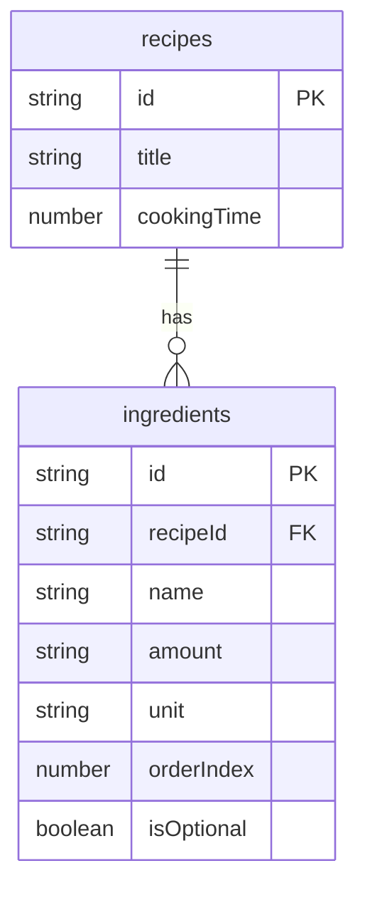

# 03. Implementing Ingredient Management


💡 Register and manage ingredients linked to recipes.


## Overview

In this chapter, you will manage ingredients per recipe:

- Create the `ingredients` table
- Add ingredients to a recipe (1:N relationship)
- List ingredients (filter by recipeId)
- Update/delete ingredients
- Unit conversion tips



### Prerequisites

| Required Item | Description | Reference |
|---------------|-------------|-----------|
| Auth complete | Access Token issued | [01. Authentication](01-auth.md) |
| recipes table | Recipes to link ingredients to | [02. Recipes](02-recipes.md) |

***

## Step 1: Create the ingredients Table

Create a table to store ingredients per recipe.

### Table Structure

| Field | Type | Required | Description |
|-------|------|:--------:|-------------|
| `recipeId` | `string` | ✅ | Linked recipe ID |
| `name` | `string` | ✅ | Ingredient name |
| `amount` | `string` | ✅ | Quantity (e.g., "300", "1/2") |
| `unit` | `string` | ✅ | Unit (e.g., "g", "pc", "tbsp") |
| `orderIndex` | `number` | - | Display order |
| `isOptional` | `boolean` | - | Whether optional (default: false) |





✅ **Try saying this to the AI**

"I want to manage ingredients separately for each recipe. Let me store which recipe the ingredient belongs to, ingredient name, amount, unit, order, and whether it's optional. Before creating it, show me the structure first."



💡 Verify that the AI suggests a structure similar to the one below.


| Field | Description | Example Value |
|-------|-------------|---------------|
| recipeId | Which recipe this ingredient belongs to | (recipe ID) |
| name | Ingredient name | "Kimchi" |
| amount | Amount | "200" |
| unit | Unit | "g" |
| orderIndex | Order | 1 |
| isOptional | Whether optional | false |




1. Navigate to the **Table Management** menu.
2. Click the **Add Table** button.
3. Enter `ingredients` as the table name.
4. Add fields according to the table structure above.
5. Click the **Save** button.

<!-- 📸 IMG: ingredients table creation screen -->




### Common Units Reference

| Category | Units | Example |
|----------|-------|---------|
| Weight | g, kg | Pork 200g |
| Volume | ml, L, cup | Water 2 cups |
| Measure | tbsp, tsp | Soy sauce 2 tbsp |
| Count | pc, block, stalk, clove | Tofu 1/2 block, Green onion 1 stalk |
| Other | pinch, to taste | Salt to taste |

***

## Step 2: Add Ingredients

Add ingredients to a recipe. They are linked to the recipe by `recipeId`.





✅ **Try saying this to the AI**

"Add ingredients to the Kimchi Stew recipe. Kimchi 300g, pork 200g, tofu half a block, green onion 1 stalk, and chili powder 1 tbsp is optional."


The AI registers each ingredient sequentially.




**Add 1 ingredient:**

```bash
curl -X POST https://api-client.bkend.ai/v1/data/ingredients \
  -H "Content-Type: application/json" \
  -H "X-API-Key: {pk_publishable_key}" \
  -H "Authorization: Bearer {accessToken}" \
  -d '{
    "recipeId": "{recipeId}",
    "name": "Kimchi",
    "amount": "300",
    "unit": "g",
    "orderIndex": 1,
    "isOptional": false
  }'
```

**Response (201 Created):**

```json
{
  "id": "6612b1a2c3d4e5f6a7b8c9d0",
  "recipeId": "6612a3f4b1c2d3e4f5a6b7c8",
  "name": "Kimchi",
  "amount": "300",
  "unit": "g",
  "orderIndex": 1,
  "isOptional": false,
  "createdBy": "user_abc123",
  "createdAt": "2025-01-15T10:30:00.000Z"
}
```

**Add multiple ingredients with bkendFetch:**

```javascript
const ingredients = [
  { name: 'Kimchi', amount: '300', unit: 'g', orderIndex: 1 },
  { name: 'Pork', amount: '200', unit: 'g', orderIndex: 2 },
  { name: 'Tofu', amount: '1/2', unit: 'block', orderIndex: 3 },
  { name: 'Green Onion', amount: '1', unit: 'stalk', orderIndex: 4 },
  { name: 'Chili Powder', amount: '1', unit: 'tbsp', orderIndex: 5, isOptional: true },
];

for (const ingredient of ingredients) {
  await bkendFetch('/v1/data/ingredients', {
    method: 'POST',
    body: {
      recipeId,
      ...ingredient,
      isOptional: ingredient.isOptional || false,
    },
  });
}

console.log(`${ingredients.length} ingredients added`);
```




***

## Step 3: List Ingredients

Retrieve the ingredient list for a specific recipe.





✅ **Try saying this to the AI**

"Show me the list of ingredients for Kimchi Stew."





```bash
curl -X GET "https://api-client.bkend.ai/v1/data/ingredients?andFilters=%7B%22recipeId%22%3A%22{recipeId}%22%7D&sortBy=orderIndex&sortDirection=asc" \
  -H "X-API-Key: {pk_publishable_key}" \
  -H "Authorization: Bearer {accessToken}"
```

**Response example:**

```json
{
  "items": [
    { "id": "...", "name": "Kimchi", "amount": "300", "unit": "g", "orderIndex": 1, "isOptional": false },
    { "id": "...", "name": "Pork", "amount": "200", "unit": "g", "orderIndex": 2, "isOptional": false },
    { "id": "...", "name": "Tofu", "amount": "1/2", "unit": "block", "orderIndex": 3, "isOptional": false },
    { "id": "...", "name": "Green Onion", "amount": "1", "unit": "stalk", "orderIndex": 4, "isOptional": false },
    { "id": "...", "name": "Chili Powder", "amount": "1", "unit": "tbsp", "orderIndex": 5, "isOptional": true }
  ],
  "pagination": { "total": 5, "page": 1, "limit": 20, "totalPages": 1, "hasNext": false, "hasPrev": false }
}
```

**Using bkendFetch:**

```javascript
async function getIngredients(recipeId) {
  const result = await bkendFetch(
    '/v1/data/ingredients?andFilters=' +
    encodeURIComponent(JSON.stringify({ recipeId })) +
    '&sortBy=orderIndex&sortDirection=asc'
  );

  // Separate required and optional ingredients
  const required = result.items.filter(i => !i.isOptional);
  const optional = result.items.filter(i => i.isOptional);

  console.log('Required ingredients:');
  required.forEach(i => console.log(`  - ${i.name} ${i.amount}${i.unit}`));

  if (optional.length > 0) {
    console.log('Optional ingredients:');
    optional.forEach(i => console.log(`  - ${i.name} ${i.amount}${i.unit}`));
  }

  return result.items;
}
```




***

## Step 4: Update an Ingredient

Update the quantity or unit of an ingredient.





✅ **Try saying this to the AI**

"Change the kimchi amount to 500g in the Kimchi Stew ingredients."





```bash
curl -X PATCH https://api-client.bkend.ai/v1/data/ingredients/{ingredientId} \
  -H "Content-Type: application/json" \
  -H "X-API-Key: {pk_publishable_key}" \
  -H "Authorization: Bearer {accessToken}" \
  -d '{
    "amount": "500",
    "unit": "g"
  }'
```

```javascript
// Change kimchi amount to 500g
await bkendFetch(`/v1/data/ingredients/${ingredientId}`, {
  method: 'PATCH',
  body: {
    amount: '500',
    unit: 'g',
  },
});
```




***

## Step 5: Delete an Ingredient

Remove an unnecessary ingredient.





✅ **Try saying this to the AI**

"Remove chili powder from the Kimchi Stew ingredients."





```bash
curl -X DELETE https://api-client.bkend.ai/v1/data/ingredients/{ingredientId} \
  -H "X-API-Key: {pk_publishable_key}" \
  -H "Authorization: Bearer {accessToken}"
```

```javascript
await bkendFetch(`/v1/data/ingredients/${ingredientId}`, {
  method: 'DELETE',
});
```




***

## Serving Size Conversion Tips

When the number of servings changes, adjust ingredient amounts proportionally.

```javascript
/**
 * Calculate ingredient amount based on serving size change
 * @param {string} originalAmount - Original quantity (e.g., "300", "1/2")
 * @param {number} originalServings - Original servings
 * @param {number} newServings - New servings
 * @returns {string} Converted quantity
 */
function convertAmount(originalAmount, originalServings, newServings) {
  // Handle fractions (e.g., "1/2" → 0.5)
  let numericAmount;
  if (originalAmount.includes('/')) {
    const [numerator, denominator] = originalAmount.split('/').map(Number);
    numericAmount = numerator / denominator;
  } else {
    numericAmount = parseFloat(originalAmount);
  }

  const ratio = newServings / originalServings;
  const converted = numericAmount * ratio;

  // Handle decimals
  return converted % 1 === 0 ? String(converted) : converted.toFixed(1);
}

// Example: 2 servings → 4 servings
console.log(convertAmount('300', 2, 4));  // "600"
console.log(convertAmount('1/2', 2, 4));  // "1"
console.log(convertAmount('1', 2, 4));    // "2"
```

### Common Unit Conversions

| Conversion | Standard |
|------------|----------|
| 1 tbsp | 15ml |
| 1 tsp | 5ml |
| 1 cup | 200ml |
| 1 pinch | approx. 1g |
| to taste | 1/4 tsp |


💡 Subjective units like "to taste" or "a pinch" are typically kept fixed regardless of serving size.


***

## Error Handling

### Key Error Codes

| HTTP Status | Error Code | Description | Solution |
|:-----------:|------------|-------------|----------|
| 400 | `data/validation-error` | Missing required field | Check recipeId, name, amount, unit |
| 404 | `data/not-found` | Ingredient does not exist | Verify ingredient ID |
| 403 | `common/forbidden` | Permission denied | Only ingredients you created can be modified/deleted |

***

## Reference

- [Table Management](../../../console/07-table-management.md) — Create/manage tables in the console
- [Create Data](../../../database/03-insert.md) — REST API data creation details
- [List Data](../../../database/05-list.md) — Filtering and sorting

***

## Next Step

Implement weekly meal planning in [04. Meal Plan](04-meal-plan.md).
