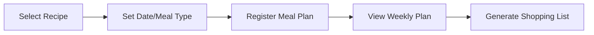

# 04. Implementing Meal Plans


💡 Register daily meal plans by date and meal type, and manage your weekly menu.


## Overview

In this chapter, you will implement the meal planning feature:

- Create the `meal_plans` table
- Register meals by date (breakfast, lunch, dinner, snack)
- View weekly meal plans (date range filter)
- Update/delete meal plans



### Prerequisites

| Required Item | Description | Reference |
|---------------|-------------|-----------|
| Auth complete | Access Token issued | [01. Authentication](01-auth.md) |
| recipes table | Recipes to assign to meal plans | [02. Recipes](02-recipes.md) |

***

## Step 1: Create the meal_plans Table

Create a table to store meal plan data.

### Table Structure

| Field | Type | Required | Description |
|-------|------|:--------:|-------------|
| `date` | `string` | ✅ | Date (YYYY-MM-DD format) |
| `mealType` | `string` | ✅ | Meal type (`breakfast`, `lunch`, `dinner`, `snack`) |
| `recipeId` | `string` | ✅ | Assigned recipe ID |
| `servings` | `number` | - | Number of servings (default: 2) |
| `notes` | `string` | - | Notes |


💡 Since the `createdBy` field is automatically added, meal plans are automatically separated per user.






✅ **Try saying this to the AI**

"I want to plan meals by date. Let me store the date, meal type (breakfast/lunch/dinner/snack), which recipe, servings, and notes. Before creating it, show me the structure first."



💡 Verify that the AI suggests a structure similar to the one below.


| Field | Description | Example Value |
|-------|-------------|---------------|
| date | Date | "2026-02-10" |
| mealType | Meal type | "breakfast" / "lunch" / "dinner" / "snack" |
| recipeId | Which recipe | (recipe ID) |
| servings | Servings | 2 |
| notes | Notes | "Less spicy" |




1. Navigate to the **Table Management** menu.
2. Click the **Add Table** button.
3. Enter `meal_plans` as the table name.
4. Add fields according to the table structure above.
5. Set the `mealType` field as **Enum** type with `breakfast`, `lunch`, `dinner`, `snack` values.
6. Click the **Save** button.

<!-- 📸 IMG: meal_plans table creation screen -->




### Meal Types

| Value | Label | Description |
|-------|-------|-------------|
| `breakfast` | Breakfast | Morning meal |
| `lunch` | Lunch | Midday meal |
| `dinner` | Dinner | Evening meal |
| `snack` | Snack | Snack / late-night food |

***

## Step 2: Register a Meal Plan

Assign a recipe to a specific date and meal type.





✅ **Try saying this to the AI**

"Register Kimchi Stew for 2 servings as dinner on January 20th."



✅ **Register a full day's meals at once**

"Plan the meals for January 20th. Toast for breakfast, Bibimbap for lunch, and Kimchi Stew for dinner."





**Register dinner meal:**

```bash
curl -X POST https://api-client.bkend.ai/v1/data/meal_plans \
  -H "Content-Type: application/json" \
  -H "X-API-Key: {pk_publishable_key}" \
  -H "Authorization: Bearer {accessToken}" \
  -d '{
    "date": "2025-01-20",
    "mealType": "dinner",
    "recipeId": "{recipeId}",
    "servings": 2,
    "notes": "Kimchi stew with rice"
  }'
```

**Response (201 Created):**

```json
{
  "id": "6614c2d3e4f5a6b7c8d9e0f1",
  "date": "2025-01-20",
  "mealType": "dinner",
  "recipeId": "6612a3f4b1c2d3e4f5a6b7c8",
  "servings": 2,
  "notes": "Kimchi stew with rice",
  "createdBy": "user_abc123",
  "createdAt": "2025-01-15T11:00:00.000Z"
}
```

**Register a full day's meals (bkendFetch):**

```javascript
const dailyMeals = [
  { mealType: 'breakfast', recipeId: recipeToastId, notes: 'Toast and coffee' },
  { mealType: 'lunch', recipeId: recipeBibimbapId, notes: 'Bibimbap' },
  { mealType: 'dinner', recipeId: recipeKimchiId, notes: 'Kimchi stew with rice' },
];

for (const meal of dailyMeals) {
  await bkendFetch('/v1/data/meal_plans', {
    method: 'POST',
    body: {
      date: '2025-01-20',
      ...meal,
      servings: 2,
    },
  });
}

console.log('Daily meal plan registered');
```




***

## Step 3: View Meals for a Specific Date

Retrieve the meal plan for a specific date.





✅ **Try saying this to the AI**

"Show me what I planned to eat on January 20th."





```bash
curl -X GET "https://api-client.bkend.ai/v1/data/meal_plans?andFilters=%7B%22date%22%3A%222025-01-20%22%7D&sortBy=mealType&sortDirection=asc" \
  -H "X-API-Key: {pk_publishable_key}" \
  -H "Authorization: Bearer {accessToken}"
```

**Response example:**

```json
{
  "items": [
    {
      "id": "...",
      "date": "2025-01-20",
      "mealType": "breakfast",
      "recipeId": "recipe_toast_001",
      "servings": 1,
      "notes": "Toast and coffee"
    },
    {
      "id": "...",
      "date": "2025-01-20",
      "mealType": "dinner",
      "recipeId": "6612a3f4b1c2d3e4f5a6b7c8",
      "servings": 2,
      "notes": "Kimchi stew with rice"
    }
  ],
  "pagination": { "total": 2, "page": 1, "limit": 20, "totalPages": 1, "hasNext": false, "hasPrev": false }
}
```

```javascript
// View meals for a specific date
const todayMeals = await bkendFetch(
  '/v1/data/meal_plans?andFilters=' +
  encodeURIComponent(JSON.stringify({ date: '2025-01-20' })) +
  '&sortBy=mealType&sortDirection=asc'
);

const mealTypeMap = {
  breakfast: 'Breakfast',
  lunch: 'Lunch',
  dinner: 'Dinner',
  snack: 'Snack',
};

todayMeals.items.forEach(meal => {
  console.log(`${mealTypeMap[meal.mealType]}: ${meal.notes || meal.recipeId}`);
});
```




***

## Step 4: View Weekly Meal Plan

Specify a date range to see the weekly meal plan at a glance.





✅ **Try saying this to the AI**

"Show me this week's meal plan from January 20th to 26th, organized by date."





```bash
curl -X GET "https://api-client.bkend.ai/v1/data/meal_plans?andFilters=%7B%22date%22%3A%7B%22%24gte%22%3A%222025-01-20%22%2C%22%24lte%22%3A%222025-01-26%22%7D%7D&sortBy=date&sortDirection=asc&limit=50" \
  -H "X-API-Key: {pk_publishable_key}" \
  -H "Authorization: Bearer {accessToken}"
```

**Weekly meal plan with bkendFetch:**

```javascript
async function getWeeklyMealPlan(startDate, endDate) {
  const result = await bkendFetch(
    '/v1/data/meal_plans?andFilters=' +
    encodeURIComponent(JSON.stringify({
      date: { $gte: startDate, $lte: endDate }
    })) +
    '&sortBy=date&sortDirection=asc&limit=50'
  );

  // Group by date
  const grouped = {};
  result.items.forEach(meal => {
    if (!grouped[meal.date]) {
      grouped[meal.date] = {};
    }
    grouped[meal.date][meal.mealType] = meal;
  });

  return grouped;
}

// Usage example
const weekPlan = await getWeeklyMealPlan('2025-01-20', '2025-01-26');

Object.entries(weekPlan).forEach(([date, meals]) => {
  console.log(`\n${date}:`);
  if (meals.breakfast) console.log(`  Breakfast: ${meals.breakfast.notes}`);
  if (meals.lunch) console.log(`  Lunch: ${meals.lunch.notes}`);
  if (meals.dinner) console.log(`  Dinner: ${meals.dinner.notes}`);
  if (meals.snack) console.log(`  Snack: ${meals.snack.notes}`);
});
```





💡 A weekly meal plan has a maximum of 28 items (7 days x 4 meals), so setting `limit=50` retrieves all of them.


***

## Step 5: Update a Meal Plan

Change the menu or servings for an existing meal plan.





✅ **Try saying this to the AI**

"Change the dinner menu on January 20th to Doenjang Stew."





**Change menu:**

```bash
curl -X PATCH https://api-client.bkend.ai/v1/data/meal_plans/{mealPlanId} \
  -H "Content-Type: application/json" \
  -H "X-API-Key: {pk_publishable_key}" \
  -H "Authorization: Bearer {accessToken}" \
  -d '{
    "recipeId": "{newRecipeId}",
    "notes": "Changed to Doenjang Stew"
  }'
```

```javascript
// Change dinner to Doenjang Stew
await bkendFetch(`/v1/data/meal_plans/${mealPlanId}`, {
  method: 'PATCH',
  body: {
    recipeId: newRecipeId,
    notes: 'Changed to Doenjang Stew',
  },
});
```

**Change servings:**

```javascript
// Change 2 servings → 4 servings
await bkendFetch(`/v1/data/meal_plans/${mealPlanId}`, {
  method: 'PATCH',
  body: { servings: 4 },
});
```




***

## Step 6: Delete a Meal Plan

Remove a meal plan entry that is no longer needed.





✅ **Try saying this to the AI**

"Delete the dinner plan for January 20th."





```bash
curl -X DELETE https://api-client.bkend.ai/v1/data/meal_plans/{mealPlanId} \
  -H "X-API-Key: {pk_publishable_key}" \
  -H "Authorization: Bearer {accessToken}"
```

```javascript
await bkendFetch(`/v1/data/meal_plans/${mealPlanId}`, {
  method: 'DELETE',
});
```




***

## Practical Example: Weekly Meal Plan UI

An example of displaying the weekly meal plan in a table format.

```javascript
async function renderWeeklyPlan(startDate) {
  const days = [];
  const start = new Date(startDate);

  // Generate dates for 7 days
  for (let i = 0; i < 7; i++) {
    const d = new Date(start);
    d.setDate(d.getDate() + i);
    days.push(d.toISOString().split('T')[0]);
  }

  const endDate = days[6];

  // Retrieve meal plans
  const result = await bkendFetch(
    '/v1/data/meal_plans?andFilters=' +
    encodeURIComponent(JSON.stringify({
      date: { $gte: startDate, $lte: endDate }
    })) +
    '&sortBy=date&sortDirection=asc&limit=50'
  );

  // Collect recipe IDs and fetch details
  const recipeIds = [...new Set(result.items.map(m => m.recipeId))];
  const recipes = {};
  for (const id of recipeIds) {
    const recipe = await bkendFetch(`/v1/data/recipes/${id}`);
    recipes[id] = recipe;
  }

  // Organize by date/meal type
  const dayNames = ['Sun', 'Mon', 'Tue', 'Wed', 'Thu', 'Fri', 'Sat'];
  const mealTypes = ['breakfast', 'lunch', 'dinner', 'snack'];

  days.forEach(date => {
    const dayMeals = result.items.filter(m => m.date === date);
    const dayName = dayNames[new Date(date).getDay()];
    console.log(`${date} (${dayName})`);

    mealTypes.forEach(type => {
      const meal = dayMeals.find(m => m.mealType === type);
      const label = { breakfast: 'Breakfast', lunch: 'Lunch', dinner: 'Dinner', snack: 'Snack' }[type];
      if (meal) {
        const recipeName = recipes[meal.recipeId]?.title || 'Unknown';
        console.log(`  ${label}: ${recipeName} (${meal.servings} servings)`);
      }
    });
  });
}
```

***

## Error Handling

### Key Error Codes

| HTTP Status | Error Code | Description | Solution |
|:-----------:|------------|-------------|----------|
| 400 | `data/validation-error` | Missing required field | Check date, mealType, recipeId |
| 400 | `data/validation-error` | Invalid mealType value | Choose from breakfast, lunch, dinner, snack |
| 404 | `data/not-found` | Meal plan does not exist | Verify meal plan ID |
| 403 | `common/forbidden` | Permission denied | Only your own meal plans can be modified/deleted |

***

## Reference

- [Table Management](../../../console/07-table-management.md) — Create/manage tables in the console
- [Create Data](../../../database/03-insert.md) — REST API data creation details
- [List Data](../../../database/05-list.md) — Filtering, sorting, pagination

***

## Next Step

Implement meal plan-based shopping lists in [05. Shopping List](05-shopping-list.md).
