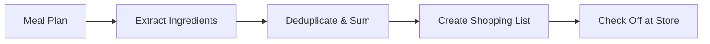

# 05. Implementing Shopping Lists


💡 Aggregate ingredients from meal plans to create shopping lists and manage purchase status.


## Overview

In this chapter, you will implement the shopping list feature:

- Create the `shopping_lists` table
- Create shopping lists (manual + recipe-based)
- Check/uncheck items
- View/update/delete shopping lists
- Auto-generate from recipe ingredients



### Prerequisites

| Required Item | Description | Reference |
|---------------|-------------|-----------|
| Auth complete | Access Token issued | [01. Authentication](01-auth.md) |
| recipes table | Recipes for ingredient extraction | [02. Recipes](02-recipes.md) |
| ingredients table | Ingredient data | [03. Ingredients](03-ingredients.md) |
| meal_plans table | For meal plan-based generation (optional) | [04. Meal Plan](04-meal-plan.md) |

***

## Step 1: Create the shopping_lists Table

Create a table to store shopping list data.

### Table Structure

| Field | Type | Required | Description |
|-------|------|:--------:|-------------|
| `name` | `string` | ✅ | Shopping list name (e.g., "This week's groceries") |
| `date` | `string` | - | Planned shopping date (YYYY-MM-DD) |
| `items` | `array` | ✅ | Shopping item array |
| `totalItems` | `number` | - | Total number of items |
| `checkedItems` | `number` | - | Number of checked items |

### items Array Structure

Each item is an object in the following format:

```json
{
  "name": "Kimchi",
  "amount": "300",
  "unit": "g",
  "checked": false,
  "recipeId": "6612a3f4b1c2d3e4f5a6b7c8"
}
```





✅ **Try saying this to the AI**

"I want to manage grocery lists. Let me store the list name, date, items to buy (ingredient name, amount, unit, purchased status). Before creating it, show me the structure first."



💡 Verify that the AI suggests a structure similar to the one below.


| Field | Description | Example Value |
|-------|-------------|---------------|
| name | List name | "This week's groceries" |
| date | Date | "2026-02-10" |
| items | Shopping items | [{name, amount, unit, checked}] |
| totalItems | Total item count | 4 |
| checkedItems | Purchased count | 0 |




1. Navigate to the **Table Management** menu.
2. Click the **Add Table** button.
3. Enter `shopping_lists` as the table name.
4. Add fields according to the table structure above.
5. Set the `items` field as **Array** type (inner Object).
6. Click the **Save** button.

<!-- 📸 IMG: shopping_lists table creation screen -->




***

## Step 2: Create a Shopping List

### Manual Creation

Create a shopping list by specifying items directly.





✅ **Try saying this to the AI**

"Create a grocery list for this week. I need 1 whole kimchi, pork 500g, 2 blocks of tofu, and 1 bunch of green onions."





```bash
curl -X POST https://api-client.bkend.ai/v1/data/shopping_lists \
  -H "Content-Type: application/json" \
  -H "X-API-Key: {pk_publishable_key}" \
  -H "Authorization: Bearer {accessToken}" \
  -d '{
    "name": "This week groceries",
    "date": "2025-01-25",
    "items": [
      { "name": "Kimchi", "amount": "1", "unit": "whole", "checked": false },
      { "name": "Pork", "amount": "500", "unit": "g", "checked": false },
      { "name": "Tofu", "amount": "2", "unit": "block", "checked": false },
      { "name": "Green Onion", "amount": "1", "unit": "bunch", "checked": false }
    ],
    "totalItems": 4,
    "checkedItems": 0
  }'
```

**Response (201 Created):**

```json
{
  "id": "6616d4e5f6a7b8c9d0e1f2a3",
  "name": "This week groceries",
  "date": "2025-01-25",
  "items": [
    { "name": "Kimchi", "amount": "1", "unit": "whole", "checked": false },
    { "name": "Pork", "amount": "500", "unit": "g", "checked": false },
    { "name": "Tofu", "amount": "2", "unit": "block", "checked": false },
    { "name": "Green Onion", "amount": "1", "unit": "bunch", "checked": false }
  ],
  "totalItems": 4,
  "checkedItems": 0,
  "createdBy": "user_abc123",
  "createdAt": "2025-01-15T12:00:00.000Z"
}
```




### Auto-Generate from Recipe Ingredients

A pattern for automatically creating a shopping list by retrieving ingredients from recipes.





✅ **Try saying this to the AI**

"Combine the ingredients from Kimchi Stew and Bibimbap into a grocery list. Merge quantities for the same ingredients."


The AI retrieves ingredients from each recipe, merges duplicates, and creates the grocery list.




```javascript
/**
 * Auto-generate shopping list from recipe IDs
 * @param {string[]} recipeIds - Array of recipe IDs
 * @param {string} listName - Shopping list name
 */
async function createShoppingListFromRecipes(recipeIds, listName) {
  // 1. Retrieve ingredients for each recipe
  const allIngredients = [];
  for (const recipeId of recipeIds) {
    const result = await bkendFetch(
      '/v1/data/ingredients?andFilters=' +
      encodeURIComponent(JSON.stringify({ recipeId }))
    );
    allIngredients.push(...result.items);
  }

  // 2. Merge same ingredients (by name + unit)
  const merged = {};
  allIngredients.forEach(ing => {
    const key = `${ing.name}_${ing.unit}`;
    if (merged[key]) {
      const prev = parseFloat(merged[key].amount);
      const curr = parseFloat(ing.amount);
      merged[key].amount = String(prev + curr);
    } else {
      merged[key] = {
        name: ing.name,
        amount: ing.amount,
        unit: ing.unit,
        checked: false,
        recipeId: ing.recipeId,
      };
    }
  });

  const items = Object.values(merged);

  // 3. Create shopping list
  const shoppingList = await bkendFetch('/v1/data/shopping_lists', {
    method: 'POST',
    body: {
      name: listName,
      date: new Date().toISOString().split('T')[0],
      items,
      totalItems: items.length,
      checkedItems: 0,
    },
  });

  console.log(`Shopping list created: ${items.length} items`);
  return shoppingList;
}

// Usage example
const list = await createShoppingListFromRecipes(
  [recipeKimchiId, recipeBibimbapId],
  'This week groceries'
);
```





💡 Aggregating all recipe ingredients from the weekly meal plan makes an efficient grocery list. Set up your weekly meal plan first in [04. Meal Plan](04-meal-plan.md).


***

## Step 3: View Shopping Lists

### View All My Shopping Lists





✅ **Try saying this to the AI**

"Show me my grocery lists."





```bash
curl -X GET "https://api-client.bkend.ai/v1/data/shopping_lists?sortBy=createdAt&sortDirection=desc" \
  -H "X-API-Key: {pk_publishable_key}" \
  -H "Authorization: Bearer {accessToken}"
```

```javascript
const myLists = await bkendFetch(
  '/v1/data/shopping_lists?sortBy=createdAt&sortDirection=desc'
);

myLists.items.forEach(list => {
  const progress = list.totalItems > 0
    ? Math.round((list.checkedItems / list.totalItems) * 100)
    : 0;
  console.log(`${list.name} - ${progress}% complete (${list.checkedItems}/${list.totalItems})`);
});
```




### View Specific Shopping List Details





✅ **Try saying this to the AI**

"Show me the details of this week's grocery list."





```bash
curl -X GET https://api-client.bkend.ai/v1/data/shopping_lists/{listId} \
  -H "X-API-Key: {pk_publishable_key}" \
  -H "Authorization: Bearer {accessToken}"
```

```javascript
const list = await bkendFetch(`/v1/data/shopping_lists/${listId}`);

console.log(`${list.name} (${list.date})`);
console.log('---');
list.items.forEach(item => {
  const check = item.checked ? '[x]' : '[ ]';
  console.log(`${check} ${item.name} ${item.amount}${item.unit}`);
});
```




***

## Step 4: Check/Uncheck Items

Check off items you have purchased at the store. This updates the entire `items` array.





✅ **Try saying this to the AI**

"I bought the kimchi and tofu. Check them off on the grocery list."


The AI checks the list and marks the items as purchased.


✅ **Uncheck**

"Uncheck the kimchi."





```javascript
/**
 * Check/uncheck a shopping list item
 * @param {string} listId - Shopping list ID
 * @param {string} itemName - Item name to check
 * @param {boolean} checked - Check status
 */
async function toggleItem(listId, itemName, checked) {
  // 1. Retrieve current list
  const list = await bkendFetch(`/v1/data/shopping_lists/${listId}`);

  // 2. Update checked status for the item
  const updatedItems = list.items.map(item => {
    if (item.name === itemName) {
      return { ...item, checked };
    }
    return item;
  });

  // 3. Calculate checked count
  const checkedCount = updatedItems.filter(i => i.checked).length;

  // 4. Update
  await bkendFetch(`/v1/data/shopping_lists/${listId}`, {
    method: 'PATCH',
    body: {
      items: updatedItems,
      checkedItems: checkedCount,
    },
  });

  console.log(`${itemName} ${checked ? 'checked' : 'unchecked'}`);
}

// Usage example
await toggleItem(listId, 'Kimchi', true);    // Kimchi purchased
await toggleItem(listId, 'Tofu', true);      // Tofu purchased
await toggleItem(listId, 'Kimchi', false);   // Uncheck kimchi
```

**Check multiple items at once:**

```javascript
async function checkMultipleItems(listId, itemNames) {
  const list = await bkendFetch(`/v1/data/shopping_lists/${listId}`);

  const updatedItems = list.items.map(item => ({
    ...item,
    checked: itemNames.includes(item.name) ? true : item.checked,
  }));

  const checkedCount = updatedItems.filter(i => i.checked).length;

  await bkendFetch(`/v1/data/shopping_lists/${listId}`, {
    method: 'PATCH',
    body: {
      items: updatedItems,
      checkedItems: checkedCount,
    },
  });

  console.log(`${itemNames.join(', ')} checked`);
}

// Check Kimchi and Tofu at once
await checkMultipleItems(listId, ['Kimchi', 'Tofu']);
```




***

## Step 5: Add/Remove Items from Shopping List

### Add Item





✅ **Try saying this to the AI**

"Add 1 bag of chili powder to the grocery list."





```javascript
async function addItem(listId, newItem) {
  const list = await bkendFetch(`/v1/data/shopping_lists/${listId}`);

  const updatedItems = [...list.items, { ...newItem, checked: false }];

  await bkendFetch(`/v1/data/shopping_lists/${listId}`, {
    method: 'PATCH',
    body: {
      items: updatedItems,
      totalItems: updatedItems.length,
    },
  });
}

// Add chili powder
await addItem(listId, { name: 'Chili Powder', amount: '1', unit: 'bag' });
```




### Remove Item





✅ **Try saying this to the AI**

"Remove green onion from the grocery list."





```javascript
async function removeItem(listId, itemName) {
  const list = await bkendFetch(`/v1/data/shopping_lists/${listId}`);

  const updatedItems = list.items.filter(item => item.name !== itemName);
  const checkedCount = updatedItems.filter(i => i.checked).length;

  await bkendFetch(`/v1/data/shopping_lists/${listId}`, {
    method: 'PATCH',
    body: {
      items: updatedItems,
      totalItems: updatedItems.length,
      checkedItems: checkedCount,
    },
  });
}

// Remove green onion
await removeItem(listId, 'Green Onion');
```




***

## Step 6: Check Progress

Check the shopping progress.





✅ **Try saying this to the AI**

"How is my grocery shopping going? Show me what I haven't bought yet."





```javascript
async function getProgress(listId) {
  const list = await bkendFetch(`/v1/data/shopping_lists/${listId}`);

  const total = list.items.length;
  const checked = list.items.filter(i => i.checked).length;
  const remaining = list.items.filter(i => !i.checked);
  const progress = total > 0 ? Math.round((checked / total) * 100) : 0;

  console.log(`Shopping progress: ${checked}/${total} (${progress}%)`);
  console.log('');

  // Checked items
  list.items.filter(i => i.checked).forEach(i => {
    console.log(`  [x] ${i.name} ${i.amount}${i.unit}`);
  });

  // Remaining items
  remaining.forEach(i => {
    console.log(`  [ ] ${i.name} ${i.amount}${i.unit}`);
  });

  return { progress, remaining };
}

await getProgress(listId);
// Shopping progress: 2/4 (50%)
//   [x] Kimchi 1 whole
//   [x] Tofu 2 block
//   [ ] Pork 500g
//   [ ] Green Onion 1 bunch
```




***

## Step 7: Delete a Shopping List

Delete a completed shopping list.





✅ **Try saying this to the AI**

"Delete this week's grocery list."





```bash
curl -X DELETE https://api-client.bkend.ai/v1/data/shopping_lists/{listId} \
  -H "X-API-Key: {pk_publishable_key}" \
  -H "Authorization: Bearer {accessToken}"
```

```javascript
await bkendFetch(`/v1/data/shopping_lists/${listId}`, {
  method: 'DELETE',
});
```




***

## Sharing Shopping Lists

To share a shopping list with other users, pass the list ID.


💡 Currently, bkend dynamic tables use `createdBy`-based ownership. To share a list with another user, set the table permission to `public: read`, or implement a share link at the app level.


```javascript
// Example of generating a share link (app level)
function generateShareLink(listId) {
  return `https://myapp.com/shopping-list/${listId}`;
}

// View shared list (when table permission is public read)
const sharedList = await bkendFetch(`/v1/data/shopping_lists/${listId}`);
```

***

## Error Handling

### Key Error Codes

| HTTP Status | Error Code | Description | Solution |
|:-----------:|------------|-------------|----------|
| 400 | `data/validation-error` | Missing required field | Check name, items |
| 400 | `data/validation-error` | Invalid items format | Each item must include name, amount, unit, checked |
| 404 | `data/not-found` | List does not exist | Verify list ID |
| 403 | `common/forbidden` | Permission denied | Only your own lists can be modified/deleted |

***

## Reference

- [Table Management](../../../console/07-table-management.md) — Create/manage tables in the console
- [Create Data](../../../database/03-insert.md) — REST API data creation details
- [Update Data](../../../database/06-update.md) — Data update details
- [Integrating bkend in Your App](../../../getting-started/06-app-integration.md) — bkendFetch helper

***

## Next Step

Learn about AI-powered scenarios like fridge cleanup and auto-generated weekly meal plans in [06. AI Scenarios](06-ai-prompts.md).
