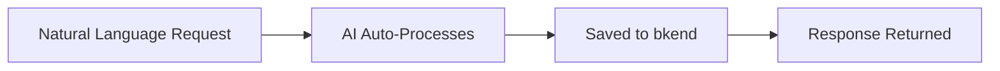
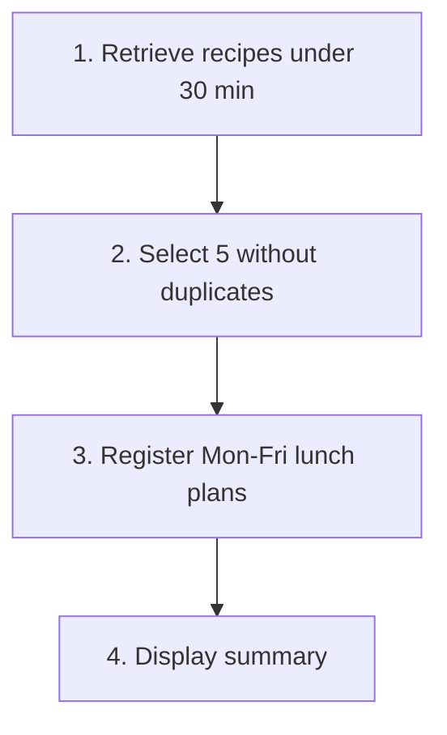
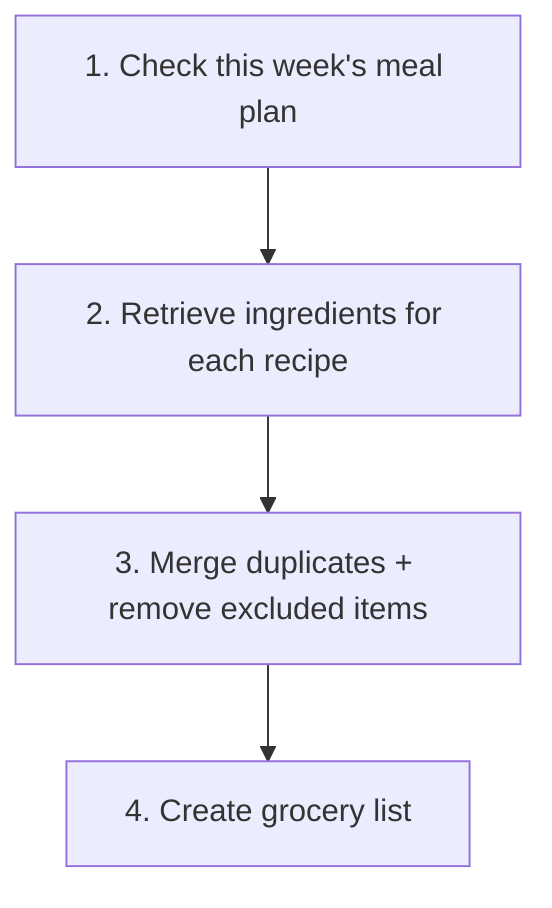

# 06. AI Prompt Collection


💡 A prompt reference for requesting each feature of the recipe app from the AI in natural language. Use these prompts as-is in an AI client connected to MCP tools (Claude Code, Cursor, etc.).


## What This Chapter Covers

- AI prompts for recipes, ingredients, meal plans, shopping lists, and cooking logs
- Prompts from initial table setup to daily use
- Combined scenario prompts that chain multiple features

***

## Initial Table Setup

When starting a new project, ask the AI to create all the required data structures at once.


✅ **Try saying this to the AI**

"I want to build a recipe app. Let me manage recipes, ingredients, meal plans, grocery lists, and cooking logs. Before creating them, show me the structure first."



💡 Verify that the AI suggests structures similar to the ones below.


**recipes**

| Field | Description | Example Value |
|-------|-------------|---------------|
| title | Recipe name | "Kimchi Stew" |
| description | Brief description | "Spicy kimchi stew" |
| cookingTime | Cooking time (min) | 30 |
| difficulty | Difficulty level | "easy" / "medium" / "hard" |
| servings | Servings | 2 |
| category | Category | "Korean" |
| imageUrl | Recipe photo URL | (linked after upload) |

**ingredients**

| Field | Description | Example Value |
|-------|-------------|---------------|
| recipeId | Which recipe this belongs to | (recipe ID) |
| name | Ingredient name | "Kimchi" |
| amount | Amount | "200" |
| unit | Unit | "g" |
| orderIndex | Order | 1 |
| isOptional | Whether optional | false |

**meal_plans**

| Field | Description | Example Value |
|-------|-------------|---------------|
| date | Date | "2026-02-10" |
| mealType | Meal type | "breakfast" / "lunch" / "dinner" / "snack" |
| recipeId | Which recipe | (recipe ID) |
| servings | Servings | 2 |
| notes | Notes | "Less spicy" |

**shopping_lists**

| Field | Description | Example Value |
|-------|-------------|---------------|
| name | List name | "This week's groceries" |
| date | Date | "2026-02-10" |
| items | Shopping items | [{name, amount, unit, checked}] |

**cooking_logs**

| Field | Description | Example Value |
|-------|-------------|---------------|
| recipeId | Which recipe was cooked | (recipe ID) |
| date | Cooking date | "2026-02-10" |
| rating | Rating (1~5) | 4 |
| notes | Notes | "A bit less salt next time" |


✅ **After confirming the structure**

"Looks good, create them with this structure."



✅ **Check current structure**

"Show me what data structures exist in the current project."


***

## Recipe Management

### Register a Recipe


✅ **Try saying this to the AI**

"Register a new recipe. Kimchi stew, 30 minutes cooking time, easy difficulty, 2 servings, Korean cuisine. Set the description to 'A spicy stew made with pork and well-fermented kimchi'."



✅ **Register multiple recipes at once**

"Register 3 pasta recipes. Carbonara (20 min, medium difficulty), Aglio e Olio (15 min, easy), and Vongole (25 min, medium)."


### Update a Recipe


✅ **Try saying this to the AI**

"Update the Kimchi Stew recipe. Change it to 4 servings and 40 minutes cooking time."



✅ **Try saying this to the AI**

"Change the Bibimbap recipe difficulty to easy."


### Delete a Recipe


✅ **Try saying this to the AI**

"Delete the Kimchi Stew recipe."


### Image Upload


✅ **Try saying this to the AI**

"I want to add a photo to the Kimchi Stew recipe. Upload the image file and link it to the recipe."



💡 The AI automatically handles image upload and recipe linking. For the detailed flow, refer to [02. Recipes](02-recipes.md).


### Recipe Search/Filter


✅ **Try saying this to the AI**

"Show me only easy difficulty recipes sorted by shortest cooking time."



✅ **Try saying this to the AI**

"Show me Korean recipes that can be made in 30 minutes or less."



✅ **Try saying this to the AI**

"Show me the list of recipes I registered."


***

## Ingredient Management

### Add Ingredients


✅ **Try saying this to the AI**

"Add ingredients to the Kimchi Stew recipe. Kimchi 300g, pork 200g, tofu half a block, green onion 1 stalk, and chili powder 1 tbsp is optional."



✅ **Try saying this to the AI**

"Register ingredients for Carbonara. Spaghetti 200g, bacon 100g, eggs 2, parmesan cheese 50g, heavy cream 100ml."


### Update Ingredients


✅ **Try saying this to the AI**

"Change the kimchi amount to 500g in the Kimchi Stew ingredients."



✅ **Try saying this to the AI**

"Change the chili powder to a required ingredient in the Kimchi Stew."


### Delete Ingredients


✅ **Try saying this to the AI**

"Remove chili powder from the Kimchi Stew ingredients."


### View Ingredients / Serving Conversion


✅ **Try saying this to the AI**

"Show me the ingredient list for Kimchi Stew. Separate required and optional ingredients."



✅ **Try saying this to the AI**

"How much of each ingredient do I need to make Kimchi Stew for 4 servings? Calculate from the 2-serving base."


***

## Meal Planning

### Register Daily Meals


✅ **Try saying this to the AI**

"Register Kimchi Stew for 2 servings as dinner on January 20th."



✅ **Register a full day's meals at once**

"Plan the meals for January 20th. Toast for breakfast, Bibimbap for lunch, and Kimchi Stew for dinner."



✅ **Conditional meal registration**

"Register something quick for tomorrow's lunch. Under 15 minutes cooking time."


### View Meal Plans


✅ **Try saying this to the AI**

"Show me this week's meal plan organized by date."



✅ **Try saying this to the AI**

"Show me what I planned to eat on January 20th."


### Update Meal Plans


✅ **Try saying this to the AI**

"Change the dinner menu on January 20th to Doenjang Stew."



✅ **Try saying this to the AI**

"Change the January 22nd lunch to 4 servings."


***

## Grocery Lists

### Create Manually


✅ **Try saying this to the AI**

"Create a grocery list for this week. I need 1 whole kimchi, pork 500g, 2 blocks of tofu, and 1 bunch of green onions."


### Auto-Generate from Recipe Ingredients


✅ **Try saying this to the AI**

"Combine the ingredients from Kimchi Stew and Bibimbap into a grocery list. Merge quantities for the same ingredients."



✅ **Try saying this to the AI**

"Gather all ingredients from this week's meal plan and create a grocery list."



💡 The AI finds recipes from the meal plan, retrieves each recipe's ingredients, merges duplicates, and automatically creates the grocery list.


### Purchase Check


✅ **Try saying this to the AI**

"I bought the kimchi and tofu. Check them off on the grocery list."



✅ **Check progress**

"How is my grocery shopping going? Show me what I haven't bought yet."


### Add/Remove Items


✅ **Try saying this to the AI**

"Add 1 bag of chili powder to the grocery list."



✅ **Try saying this to the AI**

"Remove green onion from the grocery list."


***

## Cooking Log

Record your cooking completions with notes and ratings.

### Record Cooking Completion


✅ **Try saying this to the AI**

"I made Kimchi Stew for lunch today. Rating 4 out of 5, and note 'The spice level was just right'."



✅ **Try saying this to the AI**

"I made Carbonara for dinner yesterday. Rating 3, note that the noodles were a bit overcooked."



💡 The AI stores information similar to the following.


| Field | Description | Example Value |
|-------|-------------|---------------|
| recipeId | Which recipe was cooked | (recipe ID) |
| date | Cooking date | "2026-02-10" |
| rating | Rating (1~5) | 4 |
| notes | Notes | "The spice level was just right" |

### View Cooking Log


✅ **Try saying this to the AI**

"Show me what I cooked this month."



✅ **Try saying this to the AI**

"How many times have I made Kimchi Stew, and what's the average rating?"


### Update/Delete Cooking Log


✅ **Try saying this to the AI**

"Change the rating of my last cooking log to 5."



✅ **Try saying this to the AI**

"Delete the cooking log I registered yesterday."


***

## Combined Scenarios

Prompts that request multiple features at once. The AI processes the required tasks sequentially.

### Auto-Generate Weekly Meal Plan


✅ **Try saying this to the AI**

"Plan my lunch meals from Monday to Friday this week. Choose recipes that can be made in 30 minutes or less, with no duplicates."


AI processing flow:

### Fridge Cleanup + Meal Registration


✅ **Try saying this to the AI**

"I have chicken breast, onion, and garlic in the fridge. Find recipes I can make with these ingredients and register one as tonight's dinner."


AI processing flow:

1. Search for recipes containing chicken breast, onion, and garlic
2. Recommend matching recipes
3. Register the selected recipe as tonight's dinner

### Auto-Generate Grocery List from Meal Plan


✅ **Try saying this to the AI**

"Gather all ingredients needed for this week's meal plan into a grocery list. Merge the same ingredients, and exclude rice, soy sauce, and salt since I already have them."


AI processing flow:

### Monthly Cooking Report


✅ **Try saying this to the AI**

"Create a cooking report for this month. Include how many times I cooked, top 5 most-cooked recipes, average rating, and category distribution."


AI processing flow:

1. Retrieve all cooking logs for the month
2. Fetch detailed info for each recipe
3. Analyze stats and generate report

### Register Recipe + Ingredients at Once


✅ **Try saying this to the AI**

"Register a Doenjang Stew recipe and add the ingredients too. Doenjang 2 tbsp, tofu 1 block, potato 1, zucchini half, onion half, green onion 1 stalk, chili pepper 1."


AI processing flow:

1. Create the Doenjang Stew recipe
2. Add each ingredient sequentially

### Change Meal Plan + Update Grocery List


✅ **Try saying this to the AI**

"Change Wednesday's dinner from Kimchi Stew to Doenjang Stew. Also remove kimchi from the grocery list and add doenjang."


AI processing flow:

1. Check Wednesday's dinner plan
2. Change the recipe
3. Update grocery list items

***

## Prompt Writing Tips

Tips for writing effective AI prompts.

| Principle | Good Example | Bad Example |
|-----------|--------------|-------------|
| Be specific | "Kimchi stew, 30 min, 2 servings, easy" | "Register a recipe" |
| State conditions | "Under 30 minutes, Korean only" | "Something quick to make" |
| Specify result format | "Show organized by date" | "Show meal plan" |
| Batch multiple tasks | "Register the recipe and add ingredients too" | (Requesting each separately) |
| Confirm first | "Show me the structure before creating" | (Just asking to create) |


⚠️ To prevent the AI from modifying or deleting the wrong data, specify recipe names or dates precisely. Using specific values instead of vague expressions is safer.


***

## Reference

- [MCP Overview](../../../mcp/01-overview.md) — MCP tool setup and integration guide
- [List Data](../../../database/05-list.md) — Filtering, sorting, pagination details

***

## Next Step

Check common errors and solutions during recipe app development in [99. Troubleshooting](99-troubleshooting.md).
