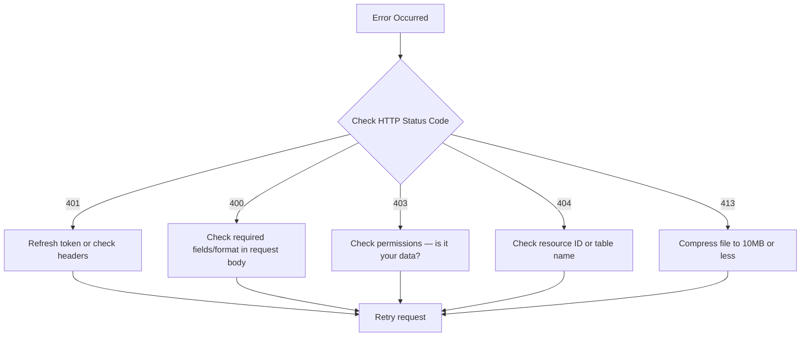

# 99. Troubleshooting


💡 Common errors and solutions encountered during recipe app development.


## What This Chapter Covers

- Error handling for authentication, recipes, ingredients, meal plans, and shopping lists
- MCP tool troubleshooting
- Frequently asked questions

***

## Authentication Issues

### 401 Unauthorized — Token Expired or Missing

```json
{
  "statusCode": 401,
  "message": "Unauthorized: Invalid or expired token"
}
```

**Cause:** The Access Token has expired or was not included in the request.

**Solution:**




Refresh the token and retry the request.

```bash
curl -X POST https://api-client.bkend.ai/v1/auth/refresh \
  -H "Content-Type: application/json" \
  -H "X-API-Key: {pk_publishable_key}" \
  -d '{
    "refreshToken": "{refreshToken}"
  }'
```

Set the refreshed `accessToken` back in the `Authorization: Bearer {accessToken}` header.




Adding auto-refresh logic to the bkendFetch helper is convenient. Refer to [Token Management](../../../authentication/20-token-management.md) for detailed patterns.




### 401 Unauthorized — Missing Headers

```json
{
  "statusCode": 401,
  "message": "X-API-Key header is required"
}
```

**Cause:** Required headers (`X-API-Key`, `Authorization`) are missing.

**Solution:** Include the required headers in all API requests.

| Header | Value | Description |
|--------|-------|-------------|
| `X-API-Key` | `{pk_publishable_key}` | Publishable Key (`pk_` prefix) |
| `Authorization` | `Bearer {accessToken}` | Auth token |

***

## Recipe Issues

### Recipe Registration Failed — Missing Required Fields

```json
{
  "statusCode": 400,
  "message": "Validation failed: title is required"
}
```

**Cause:** One or more of `title`, `description`, `cookingTime`, `difficulty`, `servings` is missing.

**Solution:** Include all required fields in the request.

```bash
curl -X POST https://api-client.bkend.ai/v1/data/recipes \
  -H "Content-Type: application/json" \
  -H "X-API-Key: {pk_publishable_key}" \
  -H "Authorization: Bearer {accessToken}" \
  -d '{
    "title": "Kimchi Stew",
    "description": "A stew made with kimchi and pork",
    "cookingTime": 30,
    "difficulty": "easy",
    "servings": 2
  }'
```

### Image Upload Failed — File Size Exceeded

```json
{
  "statusCode": 413,
  "message": "File size exceeds limit"
}
```

**Cause:** The uploaded file exceeds the allowed size limit.

**Solution:**

- Compress the image to **10MB or less**.
- Reduce the resolution or convert to WebP format to reduce file size.

### Image Upload Failed — Presigned URL Expired

```json
{
  "statusCode": 403,
  "message": "Request has expired"
}
```

**Cause:** More than 15 minutes have passed since the Presigned URL was issued.

**Solution:** Re-issue the Presigned URL and upload immediately.


⚠️ Presigned URLs are only valid for **15 minutes** after issuance.


### Recipe Filter Returns No Results

The `items` array is empty when listing recipes.

**Possible causes:**

| Cause | How to Check |
|-------|-------------|
| Filter conditions too strict | Remove conditions one by one and test |
| Typo in `difficulty` value | Enter `easy`, `medium`, `hard` exactly |
| No data exists | Retrieve the full list without filters first |

**Solution:** Remove filters and check all data first.

```bash
# Retrieve all without filters
curl -X GET "https://api-client.bkend.ai/v1/data/recipes?page=1&limit=10" \
  -H "X-API-Key: {pk_publishable_key}" \
  -H "Authorization: Bearer {accessToken}"
```

***

## Ingredient Issues

### Duplicate Ingredient Registration

Multiple entries of the same ingredient are created for a recipe.

**Cause:** The `ingredients` table has no duplicate prevention constraint, so multiple entries with the same `recipeId` + `name` combination can exist.

**Solution:** Check for existing ingredients before adding a new one.

```javascript
async function addIngredientSafe(recipeId, ingredient) {
  // 1. Check for existing ingredient
  const existing = await bkendFetch(
    '/v1/data/ingredients?andFilters=' +
    encodeURIComponent(JSON.stringify({
      recipeId,
      name: ingredient.name,
    }))
  );

  if (existing.items.length > 0) {
    // If exists, update the amount
    await bkendFetch(`/v1/data/ingredients/${existing.items[0].id}`, {
      method: 'PATCH',
      body: {
        amount: ingredient.amount,
        unit: ingredient.unit,
      },
    });
    console.log(`${ingredient.name} amount updated`);
  } else {
    // If not, create new
    await bkendFetch('/v1/data/ingredients', {
      method: 'POST',
      body: { recipeId, ...ingredient },
    });
    console.log(`${ingredient.name} added`);
  }
}
```

### Unit Inconsistency

Inconsistent units are entered in the `unit` field for ingredients.

**Cause:** The `unit` field allows free text, so the same unit can be entered differently. E.g., `g` vs `grams`, `table spoon` vs `tbsp`

**Solution:** Define an allowed list of units in the app and use a dropdown for selection.

| Category | Recommended Units |
|----------|-------------------|
| Weight | `g`, `kg` |
| Volume | `ml`, `L`, `cup` |
| Measure | `tbsp`, `tsp` |
| Count | `pc`, `block`, `stalk`, `clove`, `bunch` |
| Other | `pinch`, `to taste` |

***

## Meal Plan Issues

### Date Format Error

```json
{
  "statusCode": 400,
  "message": "Validation failed: date format is invalid"
}
```

**Cause:** The date format is not `YYYY-MM-DD`.

**Solution:**

```json
// Incorrect formats
{ "date": "01/20/2025" }
{ "date": "2025.01.20" }
{ "date": "January 20" }

// Correct format (ISO 8601)
{ "date": "2025-01-20" }
```

### Invalid mealType Value

```json
{
  "statusCode": 400,
  "message": "Validation failed: mealType must be one of breakfast, lunch, dinner, snack"
}
```

**Cause:** An unsupported value was entered for the `mealType` field.

**Solution:** Use only one of the 4 values below.

| Value | Meaning |
|-------|---------|
| `breakfast` | Breakfast |
| `lunch` | Lunch |
| `dinner` | Dinner |
| `snack` | Snack |

### Duplicate Registration for Same Date/Meal Type

Multiple meal plans can be registered for the same date and `mealType` (the system does not prevent duplicates).

**Solution:** Check if a meal plan already exists for the date/meal type before registering.

```javascript
async function setMealPlan(date, mealType, recipeId, servings) {
  // 1. Check for existing meal plan
  const existing = await bkendFetch(
    '/v1/data/meal_plans?andFilters=' +
    encodeURIComponent(JSON.stringify({ date, mealType }))
  );

  if (existing.items.length > 0) {
    // If exists, update
    await bkendFetch(`/v1/data/meal_plans/${existing.items[0].id}`, {
      method: 'PATCH',
      body: { recipeId, servings },
    });
    console.log(`${date} ${mealType} meal plan updated`);
  } else {
    // If not, create new
    await bkendFetch('/v1/data/meal_plans', {
      method: 'POST',
      body: { date, mealType, recipeId, servings },
    });
    console.log(`${date} ${mealType} meal plan registered`);
  }
}
```

***

## Shopping List Issues

### Missing Ingredients in Recipe-Based Auto-Generation

**Cause:** Ingredients are not registered for the recipe.

**Solution:**

1. Check if ingredients are registered for the recipe.
2. If not, register them first by referring to [03. Ingredients](03-ingredients.md).

```bash
# Check recipe ingredients
curl -X GET "https://api-client.bkend.ai/v1/data/ingredients?andFilters=%7B%22recipeId%22%3A%22{recipeId}%22%7D" \
  -H "X-API-Key: {pk_publishable_key}" \
  -H "Authorization: Bearer {accessToken}"
```

### Merging Error

Same ingredient not being merged because the units differ.

**Cause:** Ingredient names match but units are different. E.g., "Onion 1 pc" + "Onion 100g"

**Solution:**

- Register ingredients with consistent units.
- When writing merge logic at the app level, only merge when both `name` and `unit` match.

```javascript
// Merge only when same name + same unit
const merged = {};
items.forEach(item => {
  const key = `${item.name}_${item.unit}`;
  if (merged[key]) {
    const prev = parseFloat(merged[key].amount);
    const curr = parseFloat(item.amount);
    merged[key].amount = String(prev + curr);
  } else {
    merged[key] = { ...item };
  }
});
```


💡 Items with different units like "Onion 1 pc" and "Onion 100g" are more practical when displayed as separate rows.


### Shopping List Check Status Reset

**Cause:** When updating the entire `items` array, the existing `checked` status was overwritten without being preserved.

**Solution:** Always retrieve the current list first, then update only the `checked` value for the target item and send the complete array. Refer to the check/uncheck pattern in [05. Shopping List](05-shopping-list.md).

***

## MCP Tool Issues

### AI Cannot Find a Table

The AI responds that the table does not exist when you request data retrieval.

**Possible causes:**

| Cause | How to Check |
|-------|-------------|
| Table not yet created | Check in Console → **Table Management** |
| Typo in table name | `recipe` (X) → `recipes` (O) |
| Connected to different project/environment | Verify project ID and environment in MCP settings |

**Solution:**


✅ **Try saying this to the AI**

"Show me the list of tables in the current project."


If no tables exist, create them first using the console or AI. Refer to Step 1 of each chapter starting from [02. Recipes](02-recipes.md).

### MCP Connection Failed

```text
Error: Failed to connect to MCP server
```

**Checklist:**

1. **Check MCP server settings** — Verify that the correct server URL and API key are entered in your AI client (Claude Code, Cursor, etc.) MCP settings.
2. **Network connection** — Check your internet connection.
3. **API key expiration** — Verify the token is valid in Console → **MCP** menu.
4. **Restart AI client** — Restart the client after changing settings.

**Settings check:**

```json
{
  "mcpServers": {
    "bkend": {
      "url": "https://mcp.bkend.ai/mcp",
      "headers": {
        "Authorization": "Bearer {mcp_api_key}"
      }
    }
  }
}
```


⚠️ Use the MCP API key issued from the console. It is different from the REST API Access Token.


### AI Response Does Not Match Expectations

The AI references the wrong table or field.

**Solution:**

- Specify table names and field names **exactly**.
- Use specific values instead of vague expressions.

| Vague Request | Specific Request |
|---------------|------------------|
| "Delete a recipe" | "Delete the Kimchi Stew recipe" |
| "Change the meal plan" | "Change January 20th dinner to Doenjang Stew" |
| "Update the grocery list" | "Check off kimchi on this week's grocery list" |

***

## Common Error Code Summary

| HTTP Status | Error | Description | Solution |
|:-----------:|-------|-------------|----------|
| 400 | `data/validation-error` | Missing required field or format error | Check required fields and data format in request body |
| 401 | `common/authentication-required` | Auth token missing or expired | Refresh token and retry |
| 403 | `common/forbidden` | Permission denied (accessing another user's data) | Only your own data can be modified/deleted |
| 404 | `data/not-found` | Requested resource does not exist | Verify ID and check if deleted |
| 413 | `file/too-large` | File size exceeded | Compress to 10MB or less |

***

## Frequently Asked Questions

### Q: Can I recover a deleted recipe?

A: Data in dynamic tables is permanently deleted. Recovery is not possible, so always confirm before deleting.

### Q: Can I share meal plans with other users?

A: By default, data is separated by owner using the `createdBy` field. To share, set the table permission to `public: read`, or implement a share link at the app level.

### Q: Can I attach multiple images to a recipe?

A: The `imageUrl` field is for a single main image. If you need multiple images, create a separate table (e.g., `recipe_images`) and link them with `recipeId`.

### Q: What is the rating range for cooking logs?

A: The `rating` field is a `number` type, so the 1~5 range must be validated at the app level. Setting `min: 1`, `max: 5` in the schema enables server-side validation.

### Q: Can I register multiple data entries at once?

A: Currently, the dynamic table API supports single-entry creation only. To register multiple entries, call the API repeatedly. If you tell the AI "add 5 ingredients", the AI processes them sequentially.

***

## Debugging Checklist

Follow this order when an issue occurs.



1. **Check error message** — Read the `message` field in the response.
2. **Check request headers** — Verify both `X-API-Key` and `Authorization` headers are present.
3. **Check request body** — Verify required fields are not missing and data types are correct.
4. **Check table existence** — Verify the table is created in the console.
5. **Check network** — Verify the API server is accessible.

***

## Reference

- [Error Handling Guide](../../../guides/11-error-handling.md) — Common error codes and response patterns
- [Token Management](../../../authentication/20-token-management.md) — Access Token refresh and management

***

## Next Steps

You have completed the recipe app cookbook. Check out the other cookbooks as well.

- [Recipe App Cookbook README](../README.md) — Review the overall structure
- [Blog Cookbook](../../blog/README.md) — Building a blog backend
- [Shopping Mall Cookbook](../../shopping-mall/README.md) — Building a shopping mall backend
- [Social Network Cookbook](../../social-network/README.md) — Building a social network backend
