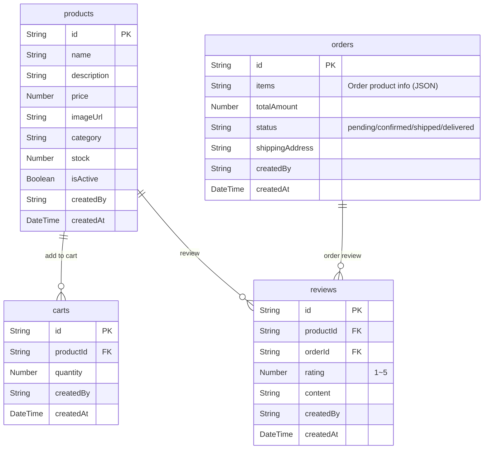

# Shopping Mall Cookbook


💡 Build an online shopping mall using bkend's authentication, database, and storage features. Implement product catalog, shopping cart, order management, and review + rating features step by step.


## What You'll Build

After completing this cookbook, you will have a shopping mall app with the following features:

- **Product Catalog** — Product registration, category classification, inventory management
- **Shopping Cart** — Add products, change quantities, remove items
- **Order Management** — Create orders, track status (pending → confirmed → shipped → delivered)
- **Reviews + Ratings** — Write reviews and rate purchased products

***

## bkend Features Used

| bkend Feature | Usage in Shopping Mall | Related Chapter |
|---------------|----------------------|-----------------|
| Email Auth | Sign up / Sign in | [01-auth](full-guide/01-auth.md) |
| Dynamic Tables | Store products, carts, orders, reviews data | [02](full-guide/02-stores.md)~[05](full-guide/05-reviews.md) |
| REST API | Product/Order/Review CRUD from the app | All |
| MCP (AI Tools) | Register products and analyze orders with AI | [06-ai-prompts](full-guide/06-ai-prompts.md) |
| Storage | Product image upload | [03-products](full-guide/03-products.md) |

***

## Table Design

***

## Learning Path

| Chapter | Title | Content | Est. Time |
|:-------:|-------|---------|:---------:|
| 00 | [Overview](full-guide/00-overview.md) | Project structure, table design, order status flow | 15 min |
| 01 | [Authentication](full-guide/01-auth.md) | Email sign up/sign in, token management | 30 min |
| 02 | [Products](full-guide/03-products.md) | Product CRUD, categories, inventory management | 45 min |
| 03 | [Orders](full-guide/04-orders.md) | Cart → Order creation, status management | 45 min |
| 04 | [Reviews](full-guide/05-reviews.md) | Write reviews, star ratings | 30 min |
| 05 | [AI Scenarios](full-guide/06-ai-prompts.md) | AI-powered automation use cases | 30 min |
| 99 | [Troubleshooting](full-guide/99-troubleshooting.md) | FAQ and error handling | - |


✅ **Want to get started quickly?** Try the [Quick Start](quick-start.md) to register and browse products in just 10 minutes.


***

## Prerequisites

| Item | Where to Check | Description |
|------|---------------|-------------|
| bkend Project | Console → **Project Settings** | A project must be created |
| Email Auth Enabled | Console → **Auth** → **Email** | Email/password sign in enabled |
| Tables Created | Console → **Tables** or MCP | products, carts, orders, reviews tables |
| API Key | Console → **MCP** → **Create New Token** | For REST API access (app integration) |

***

## Difficulty

| Item | Details |
|------|---------|
| Difficulty | ⭐⭐⭐ Intermediate |
| Platform | Web |
| Est. Learning Time | Quick Start 10 min, Full Guide 3 hours |

***

## Reference Docs

- [shopping-mall-web Example Project](../../../examples/shopping-mall-web/) — Full code implementing this cookbook in Next.js

***

## Next Steps

- [Quick Start](quick-start.md) — Register a product in 10 minutes
- [Full Guide](full-guide/00-overview.md) — Detailed implementation from start to finish
