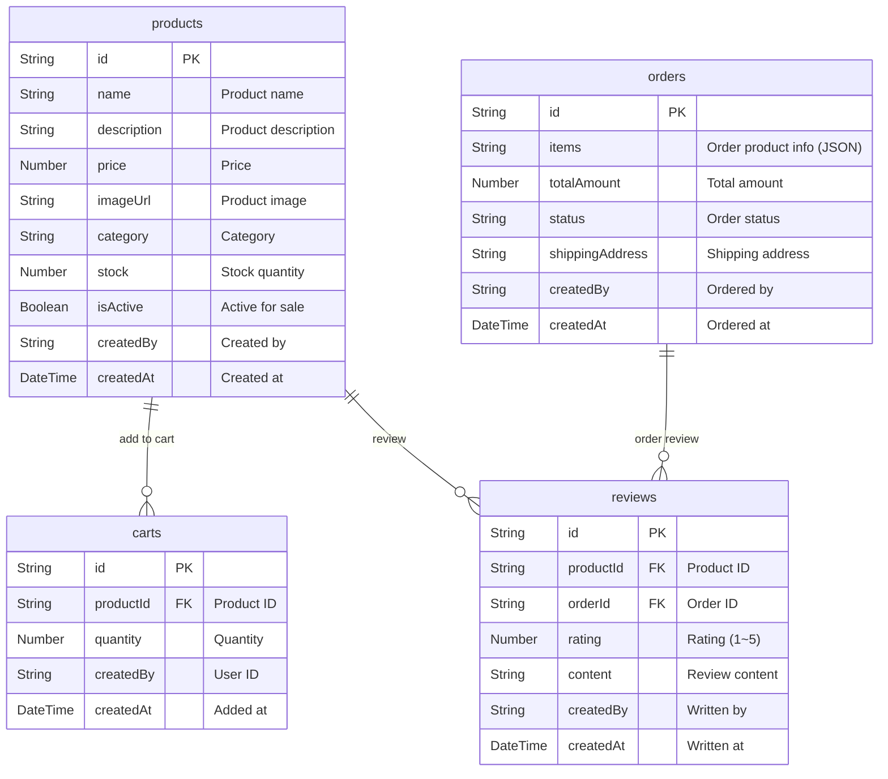
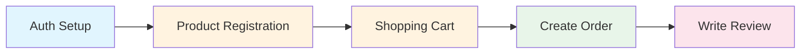
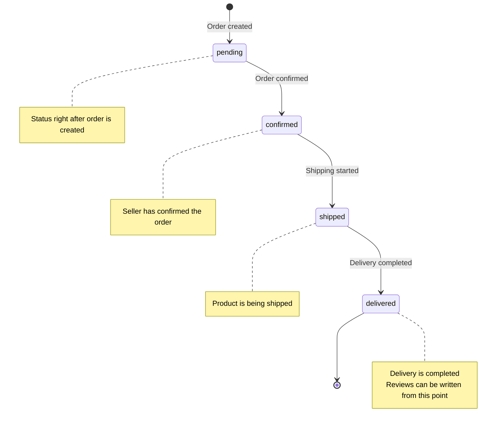

# 00. Shopping Mall Overview


💡 Understand the overall structure, table design, and order status flow of the shopping mall project.


## What You'll Learn in This Chapter

- Feature composition of the completed shopping mall
- Design and relationships of the 4 dynamic tables
- Order status flow (pending → confirmed → shipped → delivered)
- Overall implementation order

***

## What You'll Build

The shopping mall app consists of the following features:

| Feature | Description |
|---------|-------------|
| Product Catalog | Register/edit/delete products, category classification, inventory management |
| Shopping Cart | Add products, change quantities, remove items |
| Order Management | Create orders, enter shipping address, 4-step status tracking |
| Reviews + Ratings | Write reviews for delivered products, rate 1~5 stars |


⚠️ This cookbook does not cover actual payment processing (PG integration). It focuses on order status management.


***

## Prerequisites

Complete the following items before starting this guide.




| Order | Item | Reference |
|:-----:|------|-----------|
| 1 | Sign up for bkend console | [Console Sign Up](../../../console/02-signup-login.md) |
| 2 | Create a project | [Project Management](../../../console/04-project-management.md) |
| 3 | Install AI tools | [MCP Overview](../../../mcp/01-overview.md) |
| 4 | Connect MCP OAuth | [OAuth 2.1 Authentication](../../../mcp/05-oauth.md) |


✅ **Try saying this to AI**
"Show me the list of projects connected to bkend"

If the project list appears, you're ready to go.





| Order | Item | Reference |
|:-----:|------|-----------|
| 1 | Sign up for bkend console | [Console Sign Up](../../../console/02-signup-login.md) |
| 2 | Create a project | [Project Management](../../../console/04-project-management.md) |
| 3 | Issue API Key | [API Key Management](../../../console/11-api-keys.md) |





⚠️ The "sign up" mentioned here refers to creating a **bkend console account**. App user sign up is implemented in [Authentication](01-auth.md).


***

## Feature Summary

| bkend Feature | Purpose | Table / API |
|---------------|---------|-------------|
| Email Auth | Sign up, Sign in | `/v1/auth/email/signup`, `/v1/auth/email/signin` |
| Dynamic Tables | Products, cart, orders, reviews data | `/v1/data/{tableName}` |
| Storage | Product image upload | `/v1/files` |
| MCP (AI Tools) | AI-based product management, order analysis | MCP tool calls |

***

## Table Design

### Table Descriptions

| Table | Purpose | Key Fields |
|-------|---------|------------|
| `products` | Product catalog | name, price, category, stock, isActive |
| `carts` | Shopping cart | productId, quantity |
| `orders` | Order history | items(JSON), totalAmount, status, shippingAddress |
| `reviews` | Product reviews | productId, orderId, rating, content |


💡 `createdBy` and `createdAt` are system fields automatically generated by bkend. You don't need to provide them in your requests.


***

## Overall Implementation Flow

| Step | Chapter | Description |
|:----:|---------|-------------|
| 1 | [01-auth](01-auth.md) | Email sign up/sign in, token storage |
| 2 | [03-products](03-products.md) | Product CRUD, category classification, image upload |
| 3 | [04-orders](04-orders.md) | Add to cart → Create order → Status tracking |
| 4 | [05-reviews](05-reviews.md) | Write reviews + ratings after delivery |
| 5 | [06-ai-prompts](06-ai-prompts.md) | Product registration, inventory analysis, review summary with AI |

***

## Order Status Flow

Orders in the shopping mall go through 4 status stages in sequence.

| Status | Meaning | Transition Condition |
|--------|---------|---------------------|
| `pending` | Order pending | Automatically set when order is created |
| `confirmed` | Order confirmed | Seller confirms the order |
| `shipped` | Shipping | When shipping begins |
| `delivered` | Delivered | Delivery confirmed |


💡 Change the order status by updating the `status` field of the `orders` table. Use `PATCH /v1/data/orders/{id}`.


***

## API Endpoint Summary

All data CRUD uses the `/v1/data/{tableName}` pattern.

| Feature | Method | Endpoint | Description |
|---------|:------:|----------|-------------|
| Register product | POST | `/v1/data/products` | Create new product |
| List products | GET | `/v1/data/products` | List products (filter/sort/paginate) |
| Product details | GET | `/v1/data/products/{id}` | Single item query |
| Update product | PATCH | `/v1/data/products/{id}` | Partial update (price, stock, etc.) |
| Delete product | DELETE | `/v1/data/products/{id}` | Delete product |
| Add to cart | POST | `/v1/data/carts` | Add product to cart |
| View cart | GET | `/v1/data/carts` | My cart list |
| Remove from cart | DELETE | `/v1/data/carts/{id}` | Remove from cart |
| Create order | POST | `/v1/data/orders` | Create new order |
| List orders | GET | `/v1/data/orders` | My order history |
| Update order status | PATCH | `/v1/data/orders/{id}` | Update status field |
| Write review | POST | `/v1/data/reviews` | Create product review |
| List reviews | GET | `/v1/data/reviews` | View reviews by product |

***

## Reference Docs

- [Insert Data](../../database/03-insert.md) — Create data in dynamic tables
- [Query Data (Select / List)](../../database/04-select.md) — Filter, sort, paginate
- [shopping-mall-web Example Project](../../../../examples/shopping-mall-web/) — Full code implementing this cookbook in Next.js

***

## Next Steps

Set up email sign up and sign in in [01. Authentication](01-auth.md).
