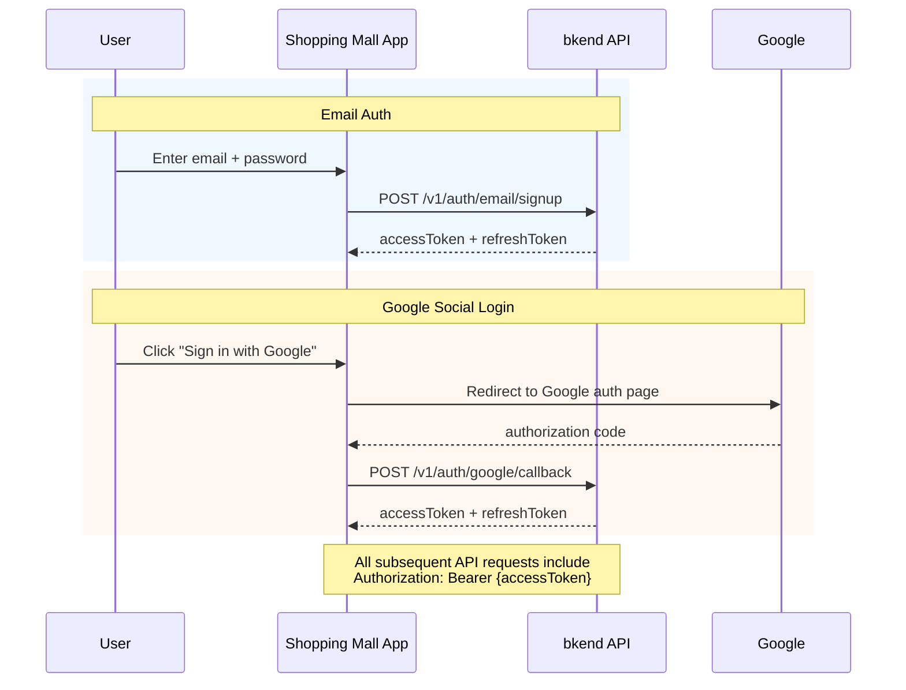

# 01. Authentication


💡 Set up email sign up/sign in and Google social login, then prepare to call shopping mall APIs with the issued tokens.


## What You'll Learn in This Chapter

- Email/password sign up
- Email/password sign in
- Google social login
- Token storage and bkendFetch helper setup
- Checking authentication status

***

## Authentication Flow

The shopping mall app authenticates via two methods: **email/password** or **Google social login**.



***

## Step 1: Sign Up




✅ **Try saying this to AI**
"Create the email sign up and sign in code for a shopping mall app. Implement it using the bkendFetch helper."



💡 Sign up and sign in are features that users perform directly in the app. Ask the AI to generate the code, then add the generated code to your app. You can also check the implementation code in the **Console + REST API** tab.




```bash
curl -X POST https://api-client.bkend.ai/v1/auth/email/signup \
  -H "Content-Type: application/json" \
  -H "X-API-Key: {pk_publishable_key}" \
  -d '{
    "method": "password",
    "email": "user@example.com",
    "password": "abc123",
    "name": "John Doe"
  }'
```

**Response:**

```json
{
  "accessToken": "eyJhbGciOiJIUzI1NiIs...",
  "refreshToken": "dGhpcyBpcyBhIHJlZnJl...",
  "tokenType": "Bearer",
  "expiresIn": 3600
}
```

| Parameter | Type | Required | Description |
|-----------|------|:--------:|-------------|
| `method` | String | ✅ | Fixed value `"password"` |
| `email` | String | ✅ | Email address |
| `password` | String | ✅ | Password (minimum 6 characters) |
| `name` | String | ✅ | User name |




⚠️ The password must be at least 6 characters long.


***

## Step 2: Sign In




✅ **Try saying this to AI**
"Create code that saves tokens to localStorage after sign in and automatically refreshes on 401 errors."



💡 The AI generates complete code with token management logic. See the **Console + REST API** tab for implementation details.




```bash
curl -X POST https://api-client.bkend.ai/v1/auth/email/signin \
  -H "Content-Type: application/json" \
  -H "X-API-Key: {pk_publishable_key}" \
  -d '{
    "method": "password",
    "email": "user@example.com",
    "password": "abc123"
  }'
```

**Response:**

```json
{
  "accessToken": "eyJhbGciOiJIUzI1NiIs...",
  "refreshToken": "dGhpcyBpcyBhIHJlZnJl...",
  "tokenType": "Bearer",
  "expiresIn": 3600
}
```

| Parameter | Type | Required | Description |
|-----------|------|:--------:|-------------|
| `method` | String | ✅ | Fixed value `"password"` |
| `email` | String | ✅ | Registered email |
| `password` | String | ✅ | Password |



***

## Step 3: Google Social Login

Sign in conveniently with a Google account. Just like email auth, an Access Token and Refresh Token are issued.

### Prerequisites

1. Issue an OAuth Client ID at [Google Cloud Console](https://console.cloud.google.com/).
2. Add the callback URL (e.g., `https://myshop.com/auth/callback`) to **Authorized redirect URIs**.
3. Register the issued `Client ID` and `Client Secret` in bkend.


⚠️ Do not expose the `Client Secret` in client-side code (frontend). Register it server-side in the bkend console's [Auth Provider Settings](../../../authentication/17-provider-config.md).





✅ **Try saying this to AI**
"Add Google social login to the shopping mall app. Create code that issues tokens from the bkend API after Google authentication callback."



💡 Google OAuth settings must be registered directly in the console. Ask the AI for the client-side login flow code. You can also check the implementation code in the **Console + REST API** tab.





### 3-1. Redirect to Google Auth URL

```javascript
const GOOGLE_AUTH_URL = 'https://accounts.google.com/o/oauth2/v2/auth';
const params = new URLSearchParams({
  client_id: '{google_client_id}',
  redirect_uri: 'https://myshop.com/auth/callback',
  response_type: 'code',
  scope: 'openid email profile',
  state: crypto.randomUUID(),
});

window.location.href = `${GOOGLE_AUTH_URL}?${params}`;
```


💡 `state` is a random value to prevent CSRF attacks. Make sure to verify it in the callback.


### 3-2. Issue Tokens in Callback

After Google authentication completes, the user is redirected to the callback URL. Pass the authorization code to bkend to receive tokens.

```bash
curl -X POST https://api-client.bkend.ai/v1/auth/google/callback \
  -H "Content-Type: application/json" \
  -H "X-API-Key: {pk_publishable_key}" \
  -d '{
    "code": "{authorization_code}",
    "redirectUri": "https://myshop.com/auth/callback",
    "state": "{state_value}"
  }'
```

```javascript
// Execute on the callback page
const urlParams = new URLSearchParams(window.location.search);
const code = urlParams.get('code');
const state = urlParams.get('state');

// Verify state (CSRF vulnerability if skipped)
if (state !== sessionStorage.getItem('oauth_state')) {
  throw new Error('Invalid state');
}

const result = await bkendFetch('/v1/auth/google/callback', {
  method: 'POST',
  body: {
    code,
    redirectUri: window.location.origin + '/auth/callback',
    state,
  },
});

// Save tokens
localStorage.setItem('accessToken', result.accessToken);
localStorage.setItem('refreshToken', result.refreshToken);

// Branch based on whether user is new
if (result.is_new_user) {
  window.location.href = '/onboarding';
} else {
  window.location.href = '/';
}
```

**Response:**

```json
{
  "accessToken": "eyJhbGciOiJIUzI1NiIs...",
  "refreshToken": "dGhpcyBpcyBhIHJlZnJl...",
  "tokenType": "Bearer",
  "expiresIn": 3600,
  "is_new_user": true
}
```

| Parameter | Type | Required | Description |
|-----------|------|:--------:|-------------|
| `code` | String | ✅ | Authorization code issued by Google |
| `redirectUri` | String | ✅ | Redirect URI registered with Google (must match exactly) |
| `state` | String | ✅ | CSRF prevention state value |




***

## Step 4: Token Storage (bkendFetch Setup)

After a successful login, save the returned tokens and set up a fetch helper so they are automatically included in all subsequent API calls.

```javascript
// bkend.js — Add this file to your project

const API_BASE = 'https://api-client.bkend.ai';
const PUBLISHABLE_KEY = '{pk_publishable_key}';  // Check in the console

/**
 * bkend API call helper
 */
export async function bkendFetch(path, options = {}) {
  const accessToken = localStorage.getItem('accessToken');

  const response = await fetch(`${API_BASE}${path}`, {
    ...options,
    headers: {
      'Content-Type': 'application/json',
      'X-API-Key': PUBLISHABLE_KEY,
      ...(accessToken && { 'Authorization': `Bearer ${accessToken}` }),
      ...options.headers,
    },
  });

  // Attempt token refresh on 401 response
  if (response.status === 401) {
    const newToken = await refreshAccessToken();
    if (newToken) {
      return fetch(`${API_BASE}${path}`, {
        ...options,
        headers: {
          'Content-Type': 'application/json',
          'X-API-Key': PUBLISHABLE_KEY,
          'Authorization': `Bearer ${newToken}`,
          ...options.headers,
        },
      }).then(r => r.json());
    }
  }

  return response.json();
}

/**
 * Refresh token
 */
async function refreshAccessToken() {
  const refreshToken = localStorage.getItem('refreshToken');
  if (!refreshToken) return null;

  const response = await fetch(`${API_BASE}/v1/auth/refresh`, {
    method: 'POST',
    headers: {
      'Content-Type': 'application/json',
      'X-API-Key': PUBLISHABLE_KEY,
    },
    body: JSON.stringify({ refreshToken }),
  });

  const result = await response.json();
  if (result.accessToken) {
    localStorage.setItem('accessToken', result.accessToken);
    localStorage.setItem('refreshToken', result.refreshToken);
    return result.accessToken;
  }

  // If Refresh Token is also expired
  localStorage.clear();
  window.location.href = '/login';
  return null;
}
```

### Token Storage Example

```javascript
// After successful sign up or sign in
const result = await bkendFetch('/v1/auth/email/signin', {
  method: 'POST',
  body: {
    method: 'password',
    email: 'user@example.com',
    password: 'abc123',
  },
});

// Save tokens
localStorage.setItem('accessToken', result.accessToken);
localStorage.setItem('refreshToken', result.refreshToken);
// Navigate to shopping mall main page
window.location.href = '/';
```


💡 For more details on the `bkendFetch` helper, see the [Integrating bkend in Your App](../../../getting-started/06-app-integration.md) documentation.


***

## Step 5: Check Authentication Status




✅ **Try saying this to AI**
"Create a profile component that displays the currently signed-in user's information. Use the /v1/auth/me API."




Check the currently signed-in user's information with the stored token.

```bash
curl -X GET https://api-client.bkend.ai/v1/auth/me \
  -H "X-API-Key: {pk_publishable_key}" \
  -H "Authorization: Bearer {accessToken}"
```

**Response:**

```json
{
  "id": "user_abc123",
  "email": "user@example.com",
  "name": "John Doe",
  "emailVerified": false,
  "createdAt": "2026-02-08T10:00:00Z"
}
```



***

## Error Handling

### Email Auth Errors

| HTTP Status | Error Code | Description | Solution |
|:-----------:|------------|-------------|----------|
| 400 | `auth/invalid-password-format` | Password policy not met | At least 6 characters |
| 400 | `auth/invalid-email` | Invalid email format | Check email format |
| 401 | `auth/invalid-credentials` | Wrong email or password | Re-check input |
| 401 | `auth/token-expired` | Access Token expired | Refresh with Refresh Token |
| 409 | `auth/email-already-exists` | Email already registered | Sign in or reset password |
| 429 | `auth/rate-limit` | Too many requests | Retry after a moment |

### Google OAuth Errors

| HTTP Status | Error Code | Description | Solution |
|:-----------:|------------|-------------|----------|
| 400 | `auth/oauth-not-configured` | Google OAuth not configured | Check Google settings in console |
| 401 | `auth/invalid-oauth-code` | Invalid authorization code | Retry authentication |
| 500 | `auth/oauth-callback-failed` | Error during callback processing | Check settings and retry |

### JavaScript Error Handling Example

```javascript
const result = await bkendFetch('/v1/auth/email/signin', {
  method: 'POST',
  body: { method: 'password', email, password },
});

if (result.code) {
  // Error response
  switch (result.code) {
    case 'auth/invalid-credentials':
      alert('The email or password is incorrect.');
      break;
    case 'auth/token-expired':
      // bkendFetch helper automatically attempts refresh
      break;
    default:
      alert(result.message || 'Sign in failed.');
  }
}
```

***

## Token Expiration

| Token | Expiry | Purpose |
|-------|:------:|---------|
| Access Token | 1 hour | `Authorization` header for API requests |
| Refresh Token | Long-lived (server config) | Refresh expired Access Tokens |

***

## Reference Docs

- [Email Sign Up](../../../authentication/02-email-signup.md) — Detailed sign up guide
- [Email Sign In](../../../authentication/03-email-signin.md) — Detailed sign in guide
- [Google OAuth](../../../authentication/06-social-google.md) — Detailed Google social login guide
- [Auth Provider Settings](../../../authentication/17-provider-config.md) — OAuth configuration management
- [Token Storage and Refresh](../../../authentication/20-token-management.md) — Token management patterns

***

## Next Steps

Learn product registration, category classification, and inventory management in [02. Products](02-products.md).
