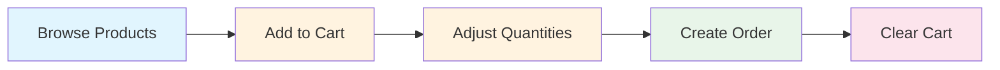

# 03. Implementing the Shopping Cart


💡 Create the carts table, then implement add to cart, change quantity, and delete features.


## Overview

In this chapter, you will implement features that allow users to add products to a cart and manage them.

- Create the `carts` table
- Add products to cart
- View my cart list
- Change quantities
- Remove cart items
- Clear the cart

### Prerequisites

| Item | Description | Reference |
|------|-------------|-----------|
| Auth setup | Access Token required | [01-auth](01-auth.md) |
| products table | Products must be registered | [02-products](02-products.md) |

***

## Step 1: Create the carts Table

Create the `carts` table to store shopping cart data.

### Table Schema

| Field | Type | Required | Description |
|-------|------|:--------:|-------------|
| `productId` | String | ✅ | Product ID (references products table) |
| `quantity` | Number | ✅ | Quantity (1 or more) |


💡 The `createdBy` field is automatically set to the currently signed-in user's ID. You can manage per-user carts without a separate `userId` field.





✅ **Try saying this to AI**

"I want to create a shopping cart feature. I need to store which product and how many were added. Show me the structure before creating it."



💡 Check that the AI suggests a structure similar to the one below.


| Field | Description | Example Value |
|-------|-------------|---------------|
| productId | Which product | (product ID) |
| quantity | Quantity | 2 |



1. Go to the **Tables** menu in the console.
2. Click **Add New Table**.
3. Enter `carts` as the table name.
4. Add the fields as described in the schema above.
5. Click **Save** to create the table.

<!-- 📸 IMG: Carts table creation screen in the console -->



***

## Step 2: Add Product to Cart

Add a product to the shopping cart.




✅ **Try saying this to AI**

"Add 2 Premium Cotton T-Shirts to the cart."


The AI adds the product to the cart.



```bash
curl -X POST https://api-client.bkend.ai/v1/data/carts \
  -H "Content-Type: application/json" \
  -H "X-API-Key: {pk_publishable_key}" \
  -H "Authorization: Bearer {accessToken}" \
  -d '{
    "productId": "product_abc123",
    "quantity": 2
  }'
```

**bkendFetch example:**

```javascript
const cartItem = await bkendFetch('/v1/data/carts', {
  method: 'POST',
  body: {
    productId: 'product_abc123',
    quantity: 2,
  },
});

console.log('Added to cart:', cartItem);
```

**Response example:**

```json
{
  "id": "cart_item_001",
  "productId": "product_abc123",
  "quantity": 2,
  "createdBy": "user_abc123",
  "createdAt": "2025-01-15T11:00:00Z"
}
```



***

## Step 3: View Cart List

Check the products in your cart.




✅ **Try saying this to AI**

"Show me what's in my cart."


The AI shows the products and quantities in your cart.



```bash
curl -X GET "https://api-client.bkend.ai/v1/data/carts" \
  -H "X-API-Key: {pk_publishable_key}" \
  -H "Authorization: Bearer {accessToken}"
```

**bkendFetch example:**

```javascript
const cart = await bkendFetch('/v1/data/carts');

// Print cart items
cart.items.forEach(item => {
  console.log(`Product: ${item.productId}, Quantity: ${item.quantity}`);
});
```

**Response example:**

```json
{
  "items": [
    {
      "id": "cart_item_001",
      "productId": "product_abc123",
      "quantity": 2,
      "createdBy": "user_abc123",
      "createdAt": "2025-01-15T11:00:00Z"
    },
    {
      "id": "cart_item_002",
      "productId": "product_def456",
      "quantity": 1,
      "createdBy": "user_abc123",
      "createdAt": "2025-01-15T11:05:00Z"
    }
  ],
  "pagination": {
    "total": 2,
    "page": 1,
    "limit": 20,
    "totalPages": 1,
    "hasNext": false,
    "hasPrev": false
  }
}
```


💡 Only the authenticated user's cart is returned. It is automatically filtered based on the user information in the Access Token.




***

## Step 4: Change Quantity

Change the quantity of a product in the cart.




✅ **Try saying this to AI**

"Change the quantity of Premium Cotton T-Shirt in my cart to 3."


The AI updates the cart quantity.



```bash
curl -X PATCH https://api-client.bkend.ai/v1/data/carts/{cart_item_id} \
  -H "Content-Type: application/json" \
  -H "X-API-Key: {pk_publishable_key}" \
  -H "Authorization: Bearer {accessToken}" \
  -d '{
    "quantity": 3
  }'
```

**bkendFetch example:**

```javascript
const updated = await bkendFetch(`/v1/data/carts/${cartItemId}`, {
  method: 'PATCH',
  body: {
    quantity: 3,
  },
});

console.log('Quantity updated:', updated);
```



***

## Step 5: Remove Cart Item

Remove a specific product from the cart.




✅ **Try saying this to AI**

"Remove the Premium Cotton T-Shirt from my cart."


The AI removes the product from the cart.



```bash
curl -X DELETE https://api-client.bkend.ai/v1/data/carts/{cart_item_id} \
  -H "X-API-Key: {pk_publishable_key}" \
  -H "Authorization: Bearer {accessToken}"
```

**bkendFetch example:**

```javascript
await bkendFetch(`/v1/data/carts/${cartItemId}`, {
  method: 'DELETE',
});

console.log('Removed from cart');
```



***

## Step 6: Clear the Cart

To delete all items in the cart at once, query the list and then delete each item individually.




✅ **Try saying this to AI**

"Clear my entire cart."


The AI removes all products from the cart.



**bkendFetch example:**

```javascript
// 1. Get all cart items
const cart = await bkendFetch('/v1/data/carts');

// 2. Delete each item
const deletePromises = cart.items.map(item =>
  bkendFetch(`/v1/data/carts/${item.id}`, { method: 'DELETE' })
);

await Promise.all(deletePromises);
console.log('Cart cleared');
```


💡 bkend's data API uses individual deletion. To delete multiple items, make repeated calls.




***

## Cart to Order Conversion Flow

Products in the cart are converted to orders in the next chapter.



***

## Error Handling

| HTTP Status | Error Code | Description | Solution |
|:-----------:|------------|-------------|----------|
| 400 | `data/validation-error` | Required field missing | Check productId, quantity |
| 401 | `common/authentication-required` | Authentication failed | Check Access Token |
| 404 | `data/not-found` | Cart item not found | Check cart item ID |

***

## Reference Docs

- [Insert Data](../../../database/03-insert.md) — Create data in dynamic tables
- [List Data](../../../database/05-list.md) — Filter, sort, paginate
- [Delete Data](../../../database/07-delete.md) — How to delete data

***

## Next Steps

Convert cart products to orders and manage order status in [04. Order Management](04-orders.md).
