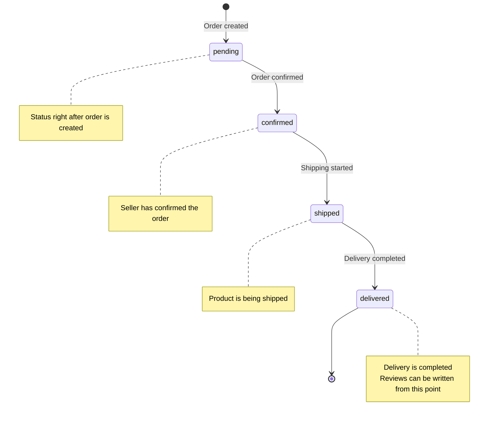
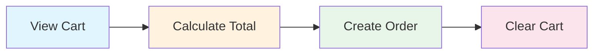

# 04. Implementing Order Management


💡 Create the orders table, convert cart products to orders, and manage order status.


## Overview

In this chapter, you will implement the order management feature of the shopping mall.

- Create the `orders` table
- 4-step order status: pending → confirmed → shipped → delivered
- Create orders (cart → order conversion)
- View order list/details
- Update order status


⚠️ This cookbook does not cover actual payment processing (PG integration). It only manages order status using dynamic tables.


### Prerequisites

| Item | Description | Reference |
|------|-------------|-----------|
| Auth setup | Access Token required | [01-auth](01-auth.md) |
| products table | Products must be registered | [02-products](02-products.md) |
| carts table | Products must be in the cart | [03-cart](03-cart.md) |

***

## Order Status Flow

Orders go through 4 status stages in sequence.



| Status | Meaning | Transition Actor |
|--------|---------|-----------------|
| `pending` | Order pending | Automatic on order creation |
| `confirmed` | Order confirmed | Seller |
| `shipped` | Shipping | Seller |
| `delivered` | Delivered | Seller/System |

***

## Step 1: Create the orders Table

Create the `orders` table to store order data.

### Table Schema

| Field | Type | Required | Description |
|-------|------|:--------:|-------------|
| `items` | String | ✅ | Order product info (JSON string) |
| `totalPrice` | Number | ✅ | Total order amount |
| `status` | String | ✅ | Order status (pending/confirmed/shipped/delivered) |
| `shippingAddress` | String | ✅ | Shipping address |
| `recipientName` | String | - | Recipient name |
| `recipientPhone` | String | - | Recipient phone number |




✅ **Try saying this to AI**

"I want to create an order management feature. I need to store the list of ordered products, total amount, order status, shipping address, recipient name, and recipient phone number. Show me the structure before creating it."



💡 Check that the AI suggests a structure similar to the one below.


| Field | Description | Example Value |
|-------|-------------|---------------|
| items | List of ordered products | [{product name, price, quantity}] |
| totalPrice | Total amount | 59800 |
| status | Order status | "pending" / "confirmed" / "shipped" / "delivered" |
| shippingAddress | Shipping address | "45 Banpo-daero, Seocho-gu, Seoul" |
| recipientName | Recipient name | "Kim Customer" |
| recipientPhone | Recipient phone | "010-1234-5678" |



1. Go to the **Tables** menu in the console.
2. Click **Add New Table**.
3. Enter `orders` as the table name.
4. Add the fields as described in the schema above.
5. Click **Save** to create the table.

<!-- 📸 IMG: Orders table creation screen in the console -->



***

## Step 2: Create an Order

Convert the products in the cart to an order.

### Order Creation Flow






✅ **Try saying this to AI**

"Place an order with the products in my cart. Shipping address is 45 Banpo-daero, Seocho-gu, Seoul, recipient Kim Customer, phone 010-1234-5678. Clear the cart after ordering."


The AI checks the cart, calculates the total amount, creates the order, and clears the cart.




### 2-1. View Cart

```bash
curl -X GET "https://api-client.bkend.ai/v1/data/carts" \
  -H "X-API-Key: {pk_publishable_key}" \
  -H "Authorization: Bearer {accessToken}"
```

### 2-2. Create Order

```bash
curl -X POST https://api-client.bkend.ai/v1/data/orders \
  -H "Content-Type: application/json" \
  -H "X-API-Key: {pk_publishable_key}" \
  -H "Authorization: Bearer {accessToken}" \
  -d '{
    "items": "[{\"productId\":\"product_abc123\",\"name\":\"Premium Cotton T-Shirt\",\"price\":29000,\"quantity\":2},{\"productId\":\"product_def456\",\"name\":\"Slim Fit Jeans\",\"price\":49000,\"quantity\":1}]",
    "totalPrice": 107000,
    "status": "pending",
    "shippingAddress": "45 Banpo-daero, Seocho-gu, Seoul",
    "recipientName": "Kim Customer",
    "recipientPhone": "010-1234-5678"
  }'
```

**bkendFetch example:**

```javascript
// 1. View cart
const cart = await bkendFetch('/v1/data/carts');
const cartItems = cart.items;

// 2. Combine product info and calculate total
let totalPrice = 0;
const orderItems = [];

for (const item of cartItems) {
  const product = await bkendFetch(`/v1/data/products/${item.productId}`);
  const price = product.price;
  totalPrice += price * item.quantity;
  orderItems.push({
    productId: item.productId,
    name: product.name,
    price: price,
    quantity: item.quantity,
  });
}

// 3. Create order
const order = await bkendFetch('/v1/data/orders', {
  method: 'POST',
  body: {
    items: JSON.stringify(orderItems),
    totalPrice: totalPrice,
    status: 'pending',
    shippingAddress: '45 Banpo-daero, Seocho-gu, Seoul',
    recipientName: 'Kim Customer',
    recipientPhone: '010-1234-5678',
  },
});

console.log('Order created:', order);

// 4. Clear cart
for (const item of cartItems) {
  await bkendFetch(`/v1/data/carts/${item.id}`, { method: 'DELETE' });
}
```

**Response example:**

```json
{
  "id": "order_xyz789",
  "items": "[{\"productId\":\"product_abc123\",\"name\":\"Premium Cotton T-Shirt\",\"price\":29000,\"quantity\":2},{\"productId\":\"product_def456\",\"name\":\"Slim Fit Jeans\",\"price\":49000,\"quantity\":1}]",
  "totalPrice": 107000,
  "status": "pending",
  "shippingAddress": "45 Banpo-daero, Seocho-gu, Seoul",
  "recipientName": "Kim Customer",
  "recipientPhone": "010-1234-5678",
  "createdBy": "user_abc123",
  "createdAt": "2025-01-15T12:00:00Z"
}
```



***

## Step 3: View Order List

Check your order history.




✅ **Try saying this to AI**

"Show me my order history in most recent order."


The AI shows your order list sorted by newest first.


✅ **You can also filter by status:**

"Show me only orders that are being shipped."




```bash
curl -X GET "https://api-client.bkend.ai/v1/data/orders?sortBy=createdAt&sortDirection=desc" \
  -H "X-API-Key: {pk_publishable_key}" \
  -H "Authorization: Bearer {accessToken}"
```

### Filter by Status

```bash
curl -X GET "https://api-client.bkend.ai/v1/data/orders?andFilters=%7B%22status%22%3A%22pending%22%7D" \
  -H "X-API-Key: {pk_publishable_key}" \
  -H "Authorization: Bearer {accessToken}"
```

**bkendFetch example:**

```javascript
// My order list (newest first)
const orders = await bkendFetch('/v1/data/orders?sortBy=createdAt&sortDirection=desc');

orders.items.forEach(order => {
  const items = JSON.parse(order.items);
  console.log(`Order ${order.id}: ${order.status}, ${order.totalPrice} won`);
  items.forEach(item => {
    console.log(`  - ${item.name} x ${item.quantity}`);
  });
});
```

**Response example:**

```json
{
  "items": [
    {
      "id": "order_xyz789",
      "items": "[{\"productId\":\"product_abc123\",\"name\":\"Premium Cotton T-Shirt\",\"price\":29000,\"quantity\":2}]",
      "totalPrice": 58000,
      "status": "pending",
      "shippingAddress": "45 Banpo-daero, Seocho-gu, Seoul",
      "createdAt": "2025-01-15T12:00:00Z"
    }
  ],
  "pagination": {
    "total": 1,
    "page": 1,
    "limit": 20,
    "totalPages": 1,
    "hasNext": false,
    "hasPrev": false
  }
}
```



***

## Step 4: View Order Details

Check the detailed information of a specific order.




✅ **Try saying this to AI**

"Show me the details of my most recent order."


The AI shows the products, amount, shipping address, current status, and more.



```bash
curl -X GET https://api-client.bkend.ai/v1/data/orders/{order_id} \
  -H "X-API-Key: {pk_publishable_key}" \
  -H "Authorization: Bearer {accessToken}"
```

**bkendFetch example:**

```javascript
const order = await bkendFetch(`/v1/data/orders/${orderId}`);
const items = JSON.parse(order.items);

console.log('Order status:', order.status);
console.log('Shipping address:', order.shippingAddress);
console.log('Total amount:', order.totalPrice);
items.forEach(item => {
  console.log(`  ${item.name}: ${item.price} won x ${item.quantity}`);
});
```



***

## Step 5: Update Order Status

Change the order status to the next stage.




✅ **Try saying this to AI**

"Change the most recent order status to 'shipped'."


The AI updates the order status.


✅ **Step-by-step change examples:**

- "Change the order status to 'confirmed'."
- "Change the order status to 'shipped'."
- "Change the order status to 'delivered'."



💡 Order status follows the sequence below.

| Expression | Stored Value |
|------------|-------------|
| Order pending | pending |
| Order confirmed | confirmed |
| Shipping | shipped |
| Delivered | delivered |





### Confirm Order (pending → confirmed)

```bash
curl -X PATCH https://api-client.bkend.ai/v1/data/orders/{order_id} \
  -H "Content-Type: application/json" \
  -H "X-API-Key: {pk_publishable_key}" \
  -H "Authorization: Bearer {accessToken}" \
  -d '{
    "status": "confirmed"
  }'
```

### Start Shipping (confirmed → shipped)

```bash
curl -X PATCH https://api-client.bkend.ai/v1/data/orders/{order_id} \
  -H "Content-Type: application/json" \
  -H "X-API-Key: {pk_publishable_key}" \
  -H "Authorization: Bearer {accessToken}" \
  -d '{
    "status": "shipped"
  }'
```

### Complete Delivery (shipped → delivered)

```bash
curl -X PATCH https://api-client.bkend.ai/v1/data/orders/{order_id} \
  -H "Content-Type: application/json" \
  -H "X-API-Key: {pk_publishable_key}" \
  -H "Authorization: Bearer {accessToken}" \
  -d '{
    "status": "delivered"
  }'
```

**bkendFetch example:**

```javascript
// Order status update function
async function updateOrderStatus(orderId, newStatus) {
  const result = await bkendFetch(`/v1/data/orders/${orderId}`, {
    method: 'PATCH',
    body: { status: newStatus },
  });

  console.log(`Order ${orderId}: changed to ${newStatus}`);
  return result;
}

// Usage examples
await updateOrderStatus('order_xyz789', 'confirmed');  // Confirm order
await updateOrderStatus('order_xyz789', 'shipped');     // Start shipping
await updateOrderStatus('order_xyz789', 'delivered');   // Complete delivery
```




⚠️ Order status can only be changed in sequence. Do not change directly from `pending` to `delivered`. Validate the transition in your business logic.


***

## Order Status Display Pattern

A pattern for showing different UI based on order status in your app.

```javascript
function getStatusDisplay(status) {
  const statusMap = {
    pending: { label: 'Order Pending', color: '#FFA500' },
    confirmed: { label: 'Order Confirmed', color: '#2196F3' },
    shipped: { label: 'Shipping', color: '#9C27B0' },
    delivered: { label: 'Delivered', color: '#4CAF50' },
  };

  return statusMap[status] || { label: 'Unknown', color: '#999' };
}

// Usage example
const { label, color } = getStatusDisplay(order.status);
console.log(`Status: ${label}`); // "Status: Shipping"
```

***

## Error Handling

| HTTP Status | Error Code | Description | Solution |
|:-----------:|------------|-------------|----------|
| 400 | `data/validation-error` | Required field missing | Check items, totalPrice, status, shippingAddress |
| 401 | `common/authentication-required` | Authentication failed | Check Access Token |
| 404 | `data/not-found` | Order not found | Check order ID |

***

## Reference Docs

- [Insert Data](../../../database/03-insert.md) — Create data in dynamic tables
- [Update Data](../../../database/06-update.md) — Partial data update (PATCH)
- [Query Data (Select)](../../../database/04-select.md) — Single item query
- [Error Handling](../../../guides/11-error-handling.md) — Error codes and solutions

***

## Next Steps

Implement reviews and ratings for delivered products in [05. Reviews](05-reviews.md).
