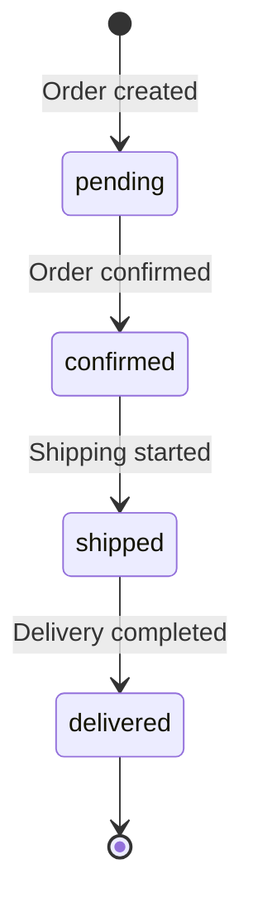

# 99. Troubleshooting


💡 This guide covers frequently occurring errors and solutions during shopping mall app development.


***

## Authentication Related

### 401 Unauthorized

```json
{
  "error": {
    "code": 401,
    "message": "Unauthorized: Invalid or expired token"
  }
}
```

**Cause**: The Access Token is expired or invalid.

**Solution**:

1. Refresh the Access Token using the Refresh Token.
2. If the Refresh Token is also expired, sign in again.
3. Check that the `Authorization` header includes the `Bearer` prefix.

```javascript
// When using the bkendFetch helper, tokens are automatically refreshed on 401.
const result = await bkendFetch('/v1/data/products');
```


💡 The automatic token refresh logic for `bkendFetch` helper is set up in [01-auth](01-auth.md).


### Token Expiration

| Token | Expiry | How to Refresh |
|-------|:------:|----------------|
| Access Token | 1 hour | Refresh with Refresh Token |
| Refresh Token | Long-lived (server config) | Re-login required |

### 403 Forbidden

```json
{
  "error": {
    "code": 403,
    "message": "Forbidden: Insufficient permissions"
  }
}
```

**Cause**: You accessed another user's resource or have insufficient permissions.

**Solution**:

1. Check that the resource was created by you.
2. Check that the correct Publishable Key is set in the `X-API-Key` header.

***

## Product Related

### Product Registration Failed

```json
{
  "error": {
    "code": 400,
    "message": "Bad Request: Missing required fields"
  }
}
```

**Cause**: Required fields are missing.

**Required fields check**:

| Field | Type | Required |
|-------|------|:--------:|
| `name` | String | ✅ |
| `description` | String | ✅ |
| `price` | Number | ✅ |
| `category` | String | ✅ |
| `stock` | Number | ✅ |

```bash
# Correct registration request
curl -X POST https://api-client.bkend.ai/v1/data/products \
  -H "Content-Type: application/json" \
  -H "X-API-Key: {pk_publishable_key}" \
  -H "Authorization: Bearer {accessToken}" \
  -d '{
    "name": "Premium Cotton T-Shirt",
    "description": "A soft 100% cotton t-shirt",
    "price": 29000,
    "category": "Clothing",
    "stock": 100
  }'
```

### Image Upload Failed

#### File Size Exceeded

```json
{
  "error": {
    "code": 413,
    "message": "Payload Too Large: File size exceeds limit"
  }
}
```

**Solution**:

1. Reduce the image size and re-upload.
2. Use a lower resolution.

#### Unsupported Format

```json
{
  "error": {
    "code": 415,
    "message": "Unsupported Media Type"
  }
}
```

**Supported formats**: JPEG, PNG, GIF, WebP

#### Presigned URL Expired

**Cause**: The Presigned URL is valid for only **15 minutes** after issuance.

**Solution**: Request a new Presigned URL.

```bash
curl -X POST https://api-client.bkend.ai/v1/files/presigned-url \
  -H "Content-Type: application/json" \
  -H "X-API-Key: {pk_publishable_key}" \
  -H "Authorization: Bearer {accessToken}" \
  -d '{
    "filename": "product-image.jpg",
    "contentType": "image/jpeg"
  }'
```

### Stock Shows Negative Value

**Cause**: Concurrent orders can cause stock deductions to overlap.

**Solution**:

1. Manually update the stock to 0.
2. Set `isActive` to `false` to mark as sold out.

```bash
curl -X PATCH https://api-client.bkend.ai/v1/data/products/{product_id} \
  -H "Content-Type: application/json" \
  -H "X-API-Key: {pk_publishable_key}" \
  -H "Authorization: Bearer {accessToken}" \
  -d '{
    "stock": 0,
    "isActive": false
  }'
```


⚠️ Stock deduction logic must be implemented in the app. Write code that checks and deducts product stock when creating an order.


### Product Not Found (404)

```json
{
  "error": {
    "code": 404,
    "message": "Not Found"
  }
}
```

**Possible causes**:

1. Deleted product
2. Wrong product ID
3. Data from a different project/environment

**Solution**: Query the product list to verify the correct ID.

```bash
curl -X GET "https://api-client.bkend.ai/v1/data/products" \
  -H "X-API-Key: {pk_publishable_key}" \
  -H "Authorization: Bearer {accessToken}"
```

***

## Cart Related

### Duplicate Product Added

**Symptom**: Adding the same product to the cart twice creates separate items.

**Cause**: bkend's dynamic tables do not automatically perform duplicate checks.

**Solution (implement in app)**:

```javascript
// Check for duplicates before adding to cart
async function addToCart(productId, quantity) {
  // 1. Check if the same product already exists in the cart
  const cart = await bkendFetch(
    `/v1/data/carts?andFilters=${encodeURIComponent(JSON.stringify({ productId }))}`
  );

  if (cart.items.length > 0) {
    // 2. If exists, just update the quantity
    const existing = cart.items[0];
    return bkendFetch(`/v1/data/carts/${existing.id}`, {
      method: 'PATCH',
      body: {
        quantity: existing.quantity + quantity,
      },
    });
  }

  // 3. If not, add new
  return bkendFetch('/v1/data/carts', {
    method: 'POST',
    body: { productId, quantity },
  });
}
```

### Quantity 0 or Negative Issue

**Symptom**: Setting quantity to 0 or negative does not cause an error.

**Cause**: Dynamic tables do not automatically restrict Number type ranges.

**Solution (implement in app)**:

```javascript
async function updateCartQuantity(cartItemId, quantity) {
  if (quantity <= 0) {
    // If quantity is 0 or less, remove from cart
    return bkendFetch(`/v1/data/carts/${cartItemId}`, {
      method: 'DELETE',
    });
  }

  return bkendFetch(`/v1/data/carts/${cartItemId}`, {
    method: 'PATCH',
    body: { quantity },
  });
}
```

***

## Order Related

### Order Creation Failed

```json
{
  "error": {
    "code": 400,
    "message": "Bad Request: Missing required fields"
  }
}
```

**Required fields check**:

| Field | Type | Description |
|-------|------|-------------|
| `items` | String | Order product info (JSON string) |
| `totalPrice` | Number | Total amount |
| `status` | String | Order status (default: `pending`) |
| `shippingAddress` | String | Shipping address |


⚠️ The `items` field must be stored as a JSON string. Pass a string converted with `JSON.stringify()`, not an object.


```javascript
// Correct example
const order = await bkendFetch('/v1/data/orders', {
  method: 'POST',
  body: {
    items: JSON.stringify([
      { productId: 'product_abc123', name: 'Premium Cotton T-Shirt', price: 29000, quantity: 2 }
    ]),
    totalPrice: 58000,
    status: 'pending',
    shippingAddress: '45 Banpo-daero, Seocho-gu, Seoul',
  },
});
```

### Order Status Transition Error

**Symptom**: Order status does not change as expected.

**Correct status transition order**:



| Current Status | Possible Next Status |
|---------------|:--------------------:|
| `pending` | `confirmed` |
| `confirmed` | `shipped` |
| `shipped` | `delivered` |
| `delivered` | (final status) |


⚠️ bkend's dynamic tables do not automatically enforce status transition rules. Implement validation logic in your app to check for valid status transitions.


```javascript
const VALID_TRANSITIONS = {
  pending: ['confirmed'],
  confirmed: ['shipped'],
  shipped: ['delivered'],
  delivered: [],
};

async function updateOrderStatus(orderId, newStatus) {
  // 1. Get current order
  const order = await bkendFetch(`/v1/data/orders/${orderId}`);
  const currentStatus = order.status;

  // 2. Validate transition
  if (!VALID_TRANSITIONS[currentStatus]?.includes(newStatus)) {
    throw new Error(
      `Cannot change from ${currentStatus} to ${newStatus}.`
    );
  }

  // 3. Update status
  return bkendFetch(`/v1/data/orders/${orderId}`, {
    method: 'PATCH',
    body: { status: newStatus },
  });
}
```

### Empty Order Created

**Symptom**: An order with an empty `items` array is created.

**Cause**: The order was created when the cart was empty.

**Solution (implement in app)**:

```javascript
async function createOrderFromCart(shippingInfo) {
  const cart = await bkendFetch('/v1/data/carts');

  if (cart.items.length === 0) {
    throw new Error('Cart is empty.');
  }

  // Proceed with order creation...
}
```

***

## Review Related

### Duplicate Reviews

**Symptom**: Multiple reviews are created for the same product and same order.

**Cause**: Dynamic tables do not automatically apply compound unique constraints.

**Solution (implement in app)**:

```javascript
async function writeReview(productId, orderId, rating, content) {
  // Check for existing review
  const existing = await bkendFetch(
    `/v1/data/reviews?andFilters=${encodeURIComponent(JSON.stringify({ productId, orderId }))}`
  );

  if (existing.items.length > 0) {
    throw new Error('You have already written a review for this product. Would you like to edit it?');
  }

  return bkendFetch('/v1/data/reviews', {
    method: 'POST',
    body: { productId, orderId, rating, content },
  });
}
```

### Rating Out of Range

**Symptom**: Rating is stored with a value outside the 1~5 range.

**Cause**: Dynamic tables do not automatically restrict Number type ranges.

**Solution (implement in app)**:

```javascript
function validateRating(rating) {
  const num = Number(rating);
  if (!Number.isInteger(num) || num < 1 || num > 5) {
    throw new Error('Rating must be an integer between 1 and 5.');
  }
  return num;
}
```

### Preventing Reviews Before Delivery

**Symptom**: Reviews are written for orders that have not been delivered yet.

**Solution (implement in app)**:

```javascript
async function writeReviewWithValidation(orderId, productId, rating, content) {
  // Check order status
  const order = await bkendFetch(`/v1/data/orders/${orderId}`);

  if (order.status !== 'delivered') {
    throw new Error('Reviews can only be written for delivered orders.');
  }

  return bkendFetch('/v1/data/reviews', {
    method: 'POST',
    body: { productId, orderId, rating, content },
  });
}
```

***

## MCP Tool Related

### AI Cannot Find Tables

**Symptom**: You asked the AI to "register a product" but it cannot find the table.

**Possible causes**:

1. The table has not been created yet.
2. The table name is different (e.g., `product` vs `products`).
3. The MCP connection is not connected to the correct project/environment.

**Solution**:


✅ **Try saying this to AI**

"Show me what tables exist in the current project."


If there are no tables, create them starting from Step 1 in [02-products](02-products.md).

### MCP Server Connection Failed

**Symptom**: MCP tool calls fail in the AI client.

**Things to check**:

1. Verify the MCP server URL is correct.
2. Verify the API key is valid.
3. Check network connectivity.
4. Check the MCP settings in your AI client.

```json
{
  "mcpServers": {
    "bkend": {
      "url": "https://mcp.bkend.ai/mcp",
      "headers": {
        "Authorization": "Bearer {api_key}"
      }
    }
  }
}
```


💡 The MCP server URL and API key can be found in the console under the **MCP** menu.


### AI Response Is Unexpected

**Symptom**: The AI calls the wrong tool or passes incorrect parameters.

**Solution**:

1. Make your request more specific.
2. Specify the exact product name or ID.
3. Break complex tasks into step-by-step requests.

```text
X "Organize products"
O "Find products with 0 stock and show me the list"
```

***

## Query Related

### Filter Syntax Error

```json
{
  "error": {
    "code": 400,
    "message": "Bad Request: Invalid filter syntax"
  }
}
```

**Correct filter syntax**:

```bash
# Category filter
?andFilters={"category":"Clothing"}

# Price range filter
?andFilters={"price":{"$gte":10000,"$lte":50000}}

# Boolean filter
?andFilters={"isActive":true}
```


💡 When using in URLs, encode the `andFilters` value with `encodeURIComponent()`.


### Sort Field Error

```json
{
  "error": {
    "code": 400,
    "message": "Bad Request: Invalid sort field"
  }
}
```

**Correct sort syntax**:

```bash
# Price ascending
?sortBy=price&sortDirection=asc

# Newest first (descending)
?sortBy=createdAt&sortDirection=desc
```

***

## FAQ

### Q: Can I delete an order?

A: You can delete it using the DELETE API on dynamic tables, but from a business perspective, it is recommended not to delete order records. Manage order status instead.

### Q: Stock went negative

A: This can happen due to concurrent orders. Manually set the stock to 0 and change `isActive` to `false`. It is recommended to implement stock validation logic in the app before creating orders.

### Q: Why store the `items` field as JSON?

A: Since bkend's dynamic tables do not directly support nested objects, the order product list is serialized as a JSON string. Use `JSON.parse()` when querying.

### Q: Are review ratings calculated automatically?

A: Since bkend does not have aggregation features, you need to query the review list and calculate the average in the app. See Step 4 in [05-reviews](05-reviews.md).

### Q: The image I uploaded via Presigned URL is not showing

A: Presigned URLs expire after a certain time. Query the file metadata to get a download URL, and store it in the product's `imageUrl`. If the download URL has expired, query the file metadata again.

***

## Debugging Checklist

When the problem is not resolved, check in the following order.

### 1. Check Request Headers

```text
✅ X-API-Key: {pk_publishable_key}
✅ Authorization: Bearer {accessToken}
✅ Content-Type: application/json (for POST/PATCH requests)
```

### 2. Check Table Status

```text
✅ products table exists
✅ carts table exists
✅ orders table exists
✅ reviews table exists
```

### 3. Check Data Consistency

```text
✅ Cart's productId refers to an existing product
✅ Products in order's items are valid
✅ Review's productId and orderId are valid
✅ Order status is a valid value (pending/confirmed/shipped/delivered)
```

### 4. Check Environment

```text
✅ Connected to the correct project
✅ X-API-Key is for the correct environment (dev/staging/prod)
✅ MCP connection is active
```

***

## Reference Docs

- [Error Handling](../../../guides/11-error-handling.md) — Error codes and solutions
- [Token Storage and Refresh](../../../authentication/20-token-management.md) — Token management patterns
- [File Upload](../../../storage/02-upload-single.md) — Presigned URL upload guide

***

## Next Steps

- Go back to the [Shopping Mall Cookbook README](../README.md) to review the overall structure.
- Check out other cookbooks: [Blog Cookbook](../../blog/README.md), [Recipe App Cookbook](../../recipe-app/README.md), [Social Network Cookbook](../../social-network/README.md)
