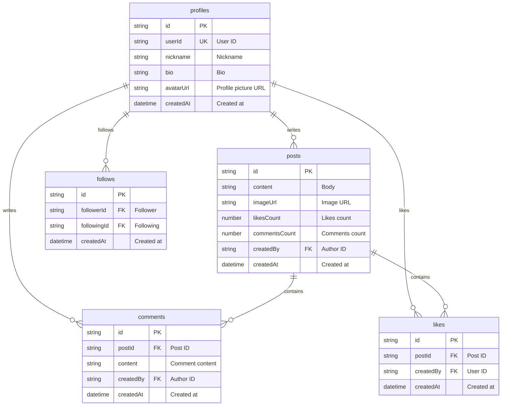

# Social Network Cookbook


💡 Build a social network with profiles, posts, follows, and feeds using bkend.


## Overview

In this cookbook, you will build a social network app using **dynamic tables** and the **REST API**. You will implement core features step by step, including profile management, post creation, comments and likes, follow relationships, and feed composition.

| Item | Details |
|------|---------|
| Difficulty | ⭐⭐ Beginner |
| Platform | Web + App |
| Key Features | Dynamic Table CRUD, Authentication, File Upload |
| Estimated Time | Quick Start 10 min, Full Guide 3 hours |

***

## What You Will Build

- **Profiles**: Manage nicknames, bios, and profile pictures
- **Posts**: Create, view, and delete text/image posts
- **Comments & Likes**: Add comments and likes to posts
- **Follows**: Follow/unfollow other users
- **Feeds**: Timeline of posts from followed users

***

## bkend Features Used

| Feature | Description | Related Docs |
|---------|-------------|--------------|
| Authentication | Google OAuth + Email login | [Authentication Overview](../../authentication/01-overview.md) |
| Dynamic Tables | profiles, posts, comments, likes, follows tables | [Database Overview](../../database/01-overview.md) |
| File Upload | Profile pictures, post images | [File Upload](../../storage/02-upload-single.md) |
| Data CRUD | Create/Read/Update/Delete data via REST API | [Insert Data](../../database/03-insert.md) |

***

## Table Design

***

## Learning Path

| Order | Document | Description | Est. Time |
|:-----:|----------|-------------|:---------:|
| - | [Quick Start](quick-start.md) | Create a profile + write a post in 10 minutes | 10 min |
| 0 | [Overview](full-guide/00-overview.md) | Project structure and API design | 15 min |
| 1 | [Authentication](full-guide/01-auth.md) | Google OAuth + Email login | 30 min |
| 2 | [Profiles](full-guide/02-profiles.md) | Profile CRUD | 20 min |
| 3 | [Posts](full-guide/03-posts.md) | Posts + Comments + Likes | 40 min |
| 4 | [Follows](full-guide/04-follows.md) | Follow relationship management | 20 min |
| 5 | [Feeds](full-guide/05-feeds.md) | Feed composition and pagination | 25 min |
| 6 | [AI Scenarios](full-guide/06-ai-prompts.md) | AI use cases | 15 min |
| 99 | [Troubleshooting](full-guide/99-troubleshooting.md) | FAQ and error handling | - |

***

## Prerequisites

Complete the following before you begin.

1. **Create a bkend project** — Refer to [Quick Start](../../getting-started/02-quickstart.md).
2. **Issue an API key** — Refer to [API Key Management](../../security/02-api-keys.md).
3. **Create tables** — Create the `profiles`, `posts`, `comments`, `likes`, and `follows` tables using the console or MCP.


✅ **Try saying this to the AI**

"Create the profiles, posts, comments, likes, and follows tables needed for a social network"


***

## Reference

- [social-network-app example project](../../../examples/social-network-app/) — Full code implementing this cookbook in Flutter

***

## Next Steps

- To get started quickly, begin with the [Quick Start](quick-start.md).
- For a detailed walkthrough, follow the [Full Guide](full-guide/00-overview.md).
