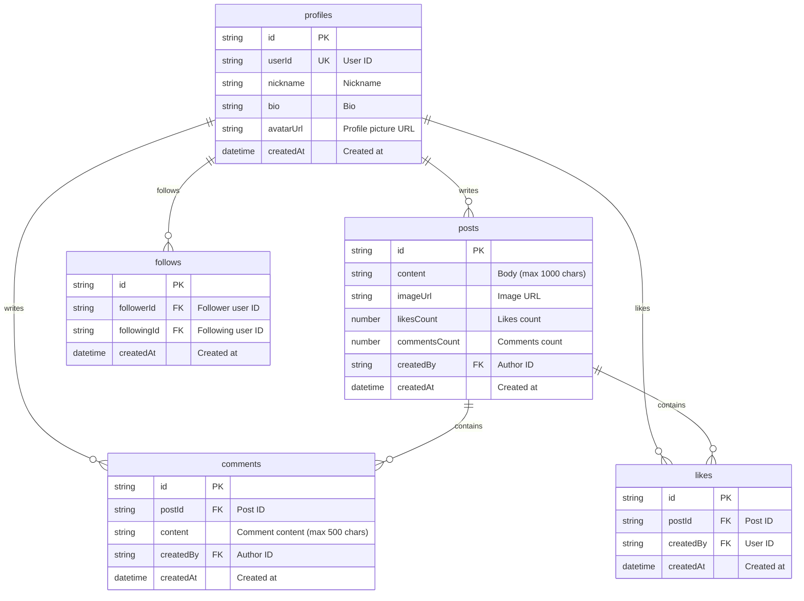
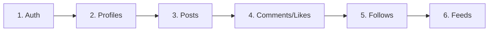

# 00. Social Network Overview


💡 Understand the overall structure and table design of the social network app.


## What You Will Learn

- The completed social network app
- Dynamic table design and relationships
- API endpoint structure
- Overall implementation flow

***

## What You Will Build

After completing this cookbook, you will be able to build a social network with the following features.

| Feature | Description |
|---------|-------------|
| **Sign Up / Login** | Google OAuth + Email authentication |
| **Profile Management** | Nickname, bio, profile picture |
| **Post Creation** | Text/image post CRUD |
| **Comments** | Add comments to posts |
| **Likes** | Like posts |
| **Follows** | Follow/unfollow between users |
| **Feeds** | Timeline of posts from followed users |

***

## Prerequisites

Complete the following items before starting this guide.




| Order | Item | Reference |
|:-----:|------|-----------|
| 1 | Sign up for bkend console | [Console Sign Up](../../../console/02-signup-login.md) |
| 2 | Create a project | [Project Management](../../../console/04-project-management.md) |
| 3 | Install AI tools | [MCP Overview](../../../mcp/01-overview.md) |
| 4 | Connect MCP OAuth | [OAuth 2.1 Authentication](../../../mcp/05-oauth.md) |


✅ **Try saying this to the AI**
"Show me the list of projects connected to bkend"

If the project list appears, you are ready.





| Order | Item | Reference |
|:-----:|------|-----------|
| 1 | Sign up for bkend console | [Console Sign Up](../../../console/02-signup-login.md) |
| 2 | Create a project | [Project Management](../../../console/04-project-management.md) |
| 3 | Issue an API Key | [API Key Management](../../../console/11-api-keys.md) |





⚠️ The "sign up" mentioned here refers to creating a **bkend console account**. App user sign up is implemented in [Authentication](01-auth.md).


***

## Feature Summary

| bkend Feature | Purpose | Tables/APIs Used |
|---------------|---------|------------------|
| Authentication | Sign up, login, token management | `/v1/auth/*` |
| Dynamic Tables | Business data storage | `/v1/data/{tableName}` |
| File Upload | Profile pictures, post images | `/v1/files` |

***

## Table Design

### System Fields

All dynamic tables automatically include the following fields.

| Field | Type | Description |
|-------|------|-------------|
| `id` | String | Unique identifier (auto-generated) |
| `createdBy` | String | Creator user ID (auto-set) |
| `createdAt` | DateTime | Creation time (auto-set) |
| `updatedAt` | DateTime | Update time (auto-set) |


⚠️ System fields are automatically set by the server. Do not include them in your requests.


***

## Overall Implementation Flow

| Step | Description | Key APIs |
|:----:|-------------|----------|
| 1 | Log in with Google OAuth or email | `/v1/auth/*` |
| 2 | Create/view profile after login | `/v1/data/profiles` |
| 3 | Create text/image posts | `/v1/data/posts` |
| 4 | Add comments and likes to posts | `/v1/data/comments`, `/v1/data/likes` |
| 5 | Follow/unfollow other users | `/v1/data/follows` |
| 6 | Feed of posts from followed users | `/v1/data/posts` (filter combination) |

***

## API Endpoint Summary

### Authentication

| Method | Endpoint | Description |
|--------|----------|-------------|
| GET | `/v1/auth/google/authorize` | Generate Google login URL |
| POST | `/v1/auth/email/signup` | Email sign up |
| POST | `/v1/auth/email/signin` | Email login |
| POST | `/v1/auth/refresh` | Refresh token |

### Data CRUD

All dynamic tables use the same endpoint structure.

| Method | Endpoint | Description |
|--------|----------|-------------|
| POST | `/v1/data/{tableName}` | Create data |
| GET | `/v1/data/{tableName}/{id}` | Get single record |
| GET | `/v1/data/{tableName}` | List records (filter/sort/paginate) |
| PATCH | `/v1/data/{tableName}/{id}` | Update data |
| DELETE | `/v1/data/{tableName}/{id}` | Delete data |


💡 Replace `{tableName}` with `profiles`, `posts`, `comments`, `likes`, or `follows`. All tables share the same CRUD API.


### Files

| Method | Endpoint | Description |
|--------|----------|-------------|
| POST | `/v1/files` | Upload file |
| GET | `/v1/files/{id}` | Get file metadata |
| GET | `/v1/files/{id}/download` | Download file |
| DELETE | `/v1/files/{id}` | Delete file |

***

## Access Permissions

| Table | Create | Read | Update | Delete |
|-------|--------|------|--------|--------|
| profiles | Logged-in users | All users | Owner only | Owner only |
| posts | Logged-in users | All users | Author only | Author only |
| comments | Logged-in users | All users | Author only | Author only |
| likes | Logged-in users | - | - | Owner only |
| follows | Logged-in users | All users | - | Owner only |

***

## Learning Path

| Chapter | Title | Description |
|:-------:|-------|-------------|
| 01 | [Authentication](01-auth.md) | Google OAuth + Email login |
| 02 | [Profiles](02-profiles.md) | Profile CRUD |
| 03 | [Posts](03-posts.md) | Posts + Comments + Likes |
| 04 | [Follows](04-follows.md) | Follow relationship management |
| 05 | [Feeds](05-feeds.md) | Feed composition and pagination |
| 06 | [AI Scenarios](06-ai-prompts.md) | AI use cases |
| 99 | [Troubleshooting](99-troubleshooting.md) | FAQ and error handling |

***

## Reference

- [Database Overview](../../../database/01-overview.md) — Dynamic table concepts
- [Core Concepts](../../../getting-started/03-core-concepts.md) — bkend architecture
- [social-network-app example project](../../../../examples/social-network-app/) — Full code implementing this cookbook in Flutter

***

## Next Steps

Implement Google OAuth and email login in [01. Authentication](01-auth.md).
