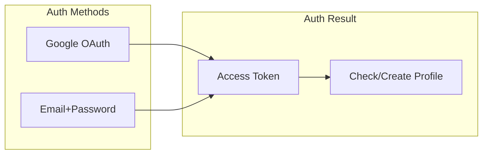
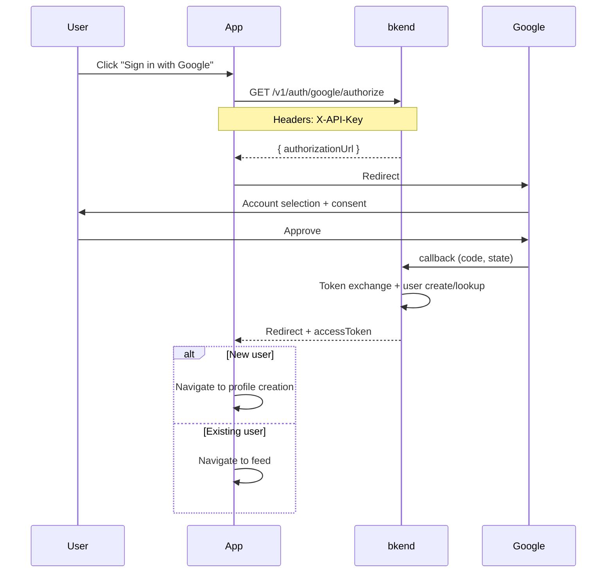
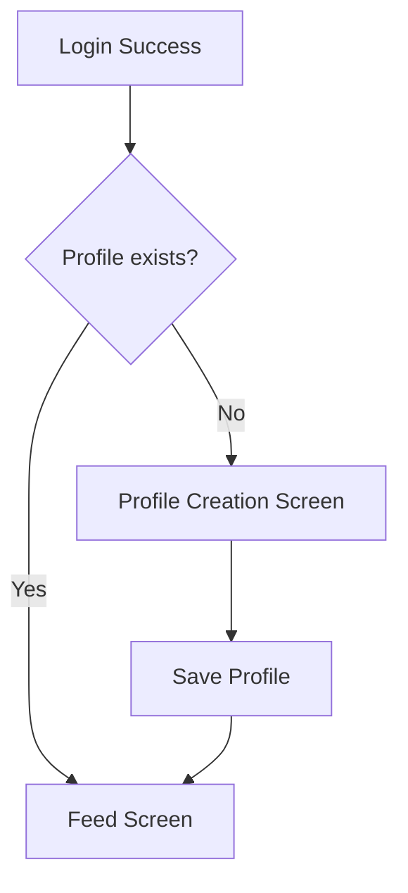

# 01. Authentication


💡 Implement social network login with Google OAuth and email sign up.


## What You Will Learn

- Google OAuth login flow
- Email sign up as an alternative
- Token storage and management
- Profile linking after login

***

## Authentication Flow Overview

The social network app provides **Google OAuth** as the primary login method and **email sign up** as an alternative.



***

## Step 1: Google OAuth Setup

### Configure Auth Provider in Console

1. In the bkend console, navigate to **Authentication** > **Provider Settings**.
2. Enable the **Google** provider.
3. Enter the `Client ID` and `Client Secret` issued from Google Cloud Console.
4. Check the **Callback URL** and register it in the **Authorized redirect URIs** in Google Cloud Console.


⚠️ Never expose the `Client Secret` in frontend code. Register it only in the bkend console.


### Google Cloud Console Setup

1. Go to [Google Cloud Console](https://console.cloud.google.com/).
2. **APIs & Services** > **Credentials** > Create **OAuth client ID**
3. Application type: **Web application**
4. Add the bkend callback URL to **Authorized redirect URIs**

***

## Step 2: Implement Google Login

### Google OAuth Flow







✅ **Try saying this to the AI**
"Create the Google OAuth login and callback handling code for the social network app. Use the bkendFetch helper."



💡 Authentication is an action performed by the user directly in the app. Ask the AI to generate the code, then add it to your app. You can also check the implementation code in the **Console + REST API** tab.





### Generate Authorization URL

```bash
curl -X GET "https://api-client.bkend.ai/v1/auth/google/authorize?redirect=https://myapp.com/auth/callback" \
  -H "X-API-Key: {pk_publishable_key}"
```

**Response:**

```json
{
  "authorizationUrl": "https://accounts.google.com/o/oauth2/v2/auth?client_id=...&redirect_uri=...&scope=openid%20email%20profile&response_type=code&state=..."
}
```

### Frontend Implementation

```javascript
const handleGoogleLogin = async () => {
  const callbackUrl = window.location.origin + '/auth/callback';

  const response = await fetch(
    `https://api-client.bkend.ai/v1/auth/google/authorize?redirect=${encodeURIComponent(callbackUrl)}`,
    {
      headers: {
        'X-API-Key': '{pk_publishable_key}',
      },
    }
  );

  const result = await response.json();

  if (result.authorizationUrl) {
    // Redirect to Google login page
    window.location.href = result.authorizationUrl;
  }
};
```

### Callback Handling

After Google authentication, the user is redirected to the callback URL. Extract the tokens from the URL parameters.

```javascript
// /auth/callback page
const urlParams = new URLSearchParams(window.location.search);
const accessToken = urlParams.get('accessToken');
const refreshToken = urlParams.get('refreshToken');
const isNewUser = urlParams.get('isNewUser');
const error = urlParams.get('error');

if (error) {
  alert(urlParams.get('errorMessage') || 'Login failed.');
  window.location.href = '/login';
} else if (accessToken) {
  // Store tokens
  localStorage.setItem('accessToken', accessToken);
  localStorage.setItem('refreshToken', refreshToken);

  // Navigate new users to profile creation
  if (isNewUser === 'true') {
    window.location.href = '/onboarding';
  } else {
    window.location.href = '/feed';
  }
}
```




### Callback Parameters

| On Success | On Failure |
|------------|------------|
| `accessToken` | `error` |
| `refreshToken` | `errorMessage` |
| `expiresIn` | |
| `isNewUser` | |

***

## Step 3: Email Sign Up Alternative

Provide email sign up for users without a Google account.





✅ **Try saying this to the AI**
"Create the email sign up and login code. Implement it using the bkendFetch helper."



💡 Sign up and login are features that users perform directly in the app. Ask the AI to generate the code, then add it to your app. You can also check the implementation code in the **Console + REST API** tab.





### Sign Up

```bash
curl -X POST https://api-client.bkend.ai/v1/auth/email/signup \
  -H "Content-Type: application/json" \
  -H "X-API-Key: {pk_publishable_key}" \
  -d '{
    "method": "password",
    "email": "user@example.com",
    "password": "abc123",
    "name": "John"
  }'
```

**Response:**

```json
{
  "accessToken": "eyJhbGciOiJIUzI1NiIs...",
  "refreshToken": "eyJhbGciOiJIUzI1NiIs...",
  "tokenType": "Bearer",
  "expiresIn": 3600
}
```

### Login

```bash
curl -X POST https://api-client.bkend.ai/v1/auth/email/signin \
  -H "Content-Type: application/json" \
  -H "X-API-Key: {pk_publishable_key}" \
  -d '{
    "method": "password",
    "email": "user@example.com",
    "password": "abc123"
  }'
```

**Response:**

```json
{
  "accessToken": "eyJhbGciOiJIUzI1NiIs...",
  "refreshToken": "eyJhbGciOiJIUzI1NiIs...",
  "tokenType": "Bearer",
  "expiresIn": 3600
}
```




***

## Step 4: Token Storage and Management

### Token Expiration

| Token | Expiration | Purpose |
|-------|:----------:|---------|
| Access Token | 1 hour | API request authentication |
| Refresh Token | 30 days | Access Token renewal |

### Token Refresh

When the Access Token expires, issue a new token using the Refresh Token.





✅ **Try saying this to the AI**
"Create code that stores tokens in localStorage after login and automatically refreshes them on 401 errors."



💡 The AI will generate complete code including token management logic. Refer to the **Console + REST API** tab for implementation details.





```bash
curl -X POST https://api-client.bkend.ai/v1/auth/refresh \
  -H "Content-Type: application/json" \
  -H "X-API-Key: {pk_publishable_key}" \
  -d '{
    "refreshToken": "{refreshToken}"
  }'
```

**Response:**

```json
{
  "accessToken": "eyJhbGciOiJIUzI1NiIs...",
  "refreshToken": "eyJhbGciOiJIUzI1NiIs...",
  "expiresIn": 3600
}
```

### Auto-Refresh Implementation Example

```javascript
const fetchWithAuth = async (url, options = {}) => {
  let accessToken = localStorage.getItem('accessToken');

  let response = await fetch(url, {
    ...options,
    headers: {
      ...options.headers,
      'Authorization': `Bearer ${accessToken}`,
      'X-API-Key': '{pk_publishable_key}',
    },
  });

  // Refresh token and retry on 401 response
  if (response.status === 401) {
    const refreshToken = localStorage.getItem('refreshToken');

    const refreshResponse = await fetch(
      'https://api-client.bkend.ai/v1/auth/refresh',
      {
        method: 'POST',
        headers: {
          'Content-Type': 'application/json',
          'X-API-Key': '{pk_publishable_key}',
        },
        body: JSON.stringify({ refreshToken }),
      }
    );

    if (refreshResponse.ok) {
      const data = await refreshResponse.json();
      localStorage.setItem('accessToken', data.accessToken);
      localStorage.setItem('refreshToken', data.refreshToken);

      // Retry with new token
      response = await fetch(url, {
        ...options,
        headers: {
          ...options.headers,
          'Authorization': `Bearer ${data.accessToken}`,
          'X-API-Key': '{pk_publishable_key}',
        },
      });
    } else {
      // Refresh Token also expired → re-login
      localStorage.clear();
      window.location.href = '/login';
    }
  }

  return response;
};
```




***

## Profile Check After Login

After successful login, check if a profile exists and navigate to the creation screen if it does not.







✅ **Try saying this to the AI**
"Find my profile in the profiles table using my userId"





```javascript
// Check profile after login
const checkProfile = async (userId) => {
  const filters = encodeURIComponent(JSON.stringify({ userId }));
  const response = await fetch(
    `https://api-client.bkend.ai/v1/data/profiles?andFilters=${filters}`,
    {
      headers: {
        'Authorization': `Bearer ${accessToken}`,
        'X-API-Key': '{pk_publishable_key}',
      },
    }
  );

  const result = await response.json();

  if (result.items && result.items.length > 0) {
    // Profile exists → navigate to feed
    return result.items[0];
  } else {
    // No profile → navigate to creation screen
    return null;
  }
};
```




***

## Error Handling

### Authentication Error Codes

| Error Code | HTTP | Description | Solution |
|------------|:----:|-------------|----------|
| `auth/invalid-credentials` | 401 | Invalid email or password | Verify input values |
| `auth/account-exists-different-provider` | 409 | Email already registered with a different method | Log in with the existing method |
| `auth/oauth-not-configured` | 400 | Google OAuth not configured | Check settings in the console |
| `auth/invalid-oauth-code` | 401 | Invalid authorization code | Try logging in again |
| `auth/token-expired` | 401 | Token expired | Refresh token or re-login |
| `auth/rate-limit` | 429 | Request limit exceeded | Retry after a moment |

### Rate Limiting

| Item | Limit |
|------|-------|
| Login failures | 5 per 15 minutes |
| Sign ups | 3 per hour |

***

## Reference

- [Social Login Overview](../../../authentication/05-social-overview.md) — Social login concepts
- [Google OAuth](../../../authentication/06-social-google.md) — Detailed Google OAuth setup
- [Token Management](../../../authentication/20-token-management.md) — Detailed token refresh patterns

***

## Next Steps

Implement profile CRUD in [02. Profiles](02-profiles.md).
