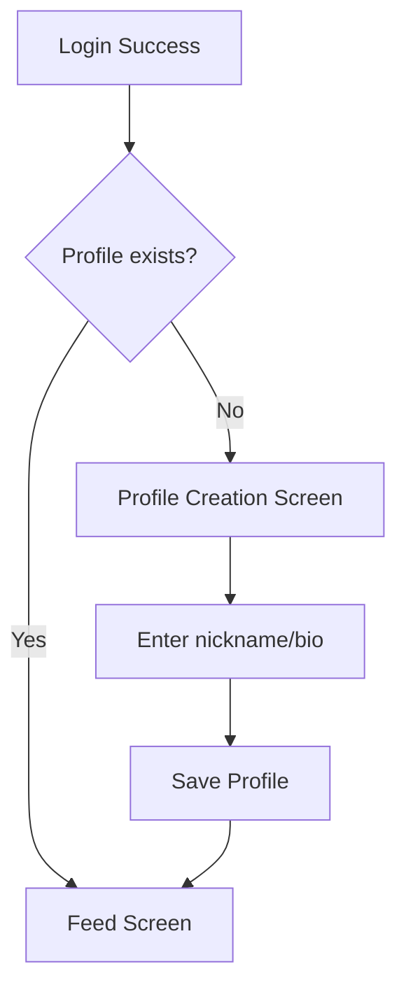
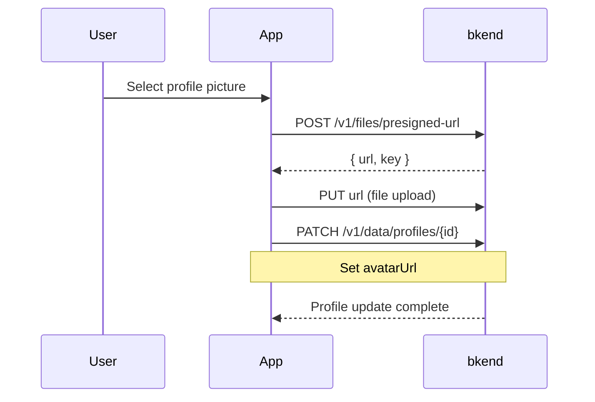

# 02. Implementing Profile Management


💡 Implement features to manage user profiles and avatar images.


## Overview

After sign up, set up and manage the user's nickname, bio, and profile picture. The profile is the basic unit of the social network, connected to all features including posts, comments, and follows.

| Item | Details |
|------|---------|
| Table | `profiles` |
| Key APIs | `/v1/data/profiles`, `/v1/files/presigned-url` |
| Prerequisite | [01. Authentication](01-auth.md) completed (Access Token required) |

***

## Step 1: Create the profiles Table





✅ **Try saying this to the AI**

"I want to manage user profiles in a social network. Set it up so I can store nicknames (2-20 chars), bios (max 200 chars), and profile pictures. The same user should not be able to create duplicate profiles. Show me the structure before creating it."



💡 Verify that the AI suggests a structure similar to the one below.

| Field | Description | Example Value |
|-------|-------------|---------------|
| nickname | Nickname | "SocialKim" |
| bio | Bio | "I love traveling and food" |
| avatarUrl | Profile picture URL | (linked after upload) |
| userId | User identifier | (user ID) |





1. In the bkend console, navigate to **Database** > **Table Management**.
2. Click the **Add Table** button.
3. Configure as follows.

| Field Name | Type | Required | Description |
|------------|------|:--------:|-------------|
| `nickname` | String | O | Nickname (2-20 chars) |
| `bio` | String | | Bio (max 200 chars) |
| `avatarUrl` | String | | Profile picture URL |
| `userId` | String | O | User ID (unique) |

4. Click **Save** to create the table.


💡 For more details on table management, refer to [Table Management](../../../console/07-table-management.md).





***

## Step 2: Create a Profile (Initial Setup After Sign Up)

After login, guide the user to the creation screen if no profile exists.







✅ **Try saying this to the AI**

"Create my profile. Set the nickname to 'SocialKim' and the bio to 'I love traveling and food'."





### Check if Profile Exists

```bash
curl -X GET "https://api-client.bkend.ai/v1/data/profiles?andFilters=%7B%22userId%22%3A%22{userId}%22%7D" \
  -H "X-API-Key: {pk_publishable_key}" \
  -H "Authorization: Bearer {accessToken}"
```

**Response (no profile):**

```json
{
  "items": [],
  "pagination": {
    "total": 0,
    "page": 1,
    "limit": 25,
    "totalPages": 0,
    "hasNext": false,
    "hasPrev": false
  }
}
```

### Create Profile

```bash
curl -X POST https://api-client.bkend.ai/v1/data/profiles \
  -H "Content-Type: application/json" \
  -H "X-API-Key: {pk_publishable_key}" \
  -H "Authorization: Bearer {accessToken}" \
  -d '{
    "nickname": "SocialKim",
    "bio": "I love traveling and food",
    "userId": "{userId}"
  }'
```

**Response (201 Created):**

```json
{
  "id": "profile_abc123",
  "nickname": "SocialKim",
  "bio": "I love traveling and food",
  "avatarUrl": null,
  "userId": "user_001",
  "createdBy": "user_001",
  "createdAt": "2025-01-15T10:00:00Z"
}
```

### bkendFetch Implementation

```javascript
const API_BASE = 'https://api-client.bkend.ai';

async function bkendFetch(path, options = {}) {
  const response = await fetch(`${API_BASE}${path}`, {
    ...options,
    headers: {
      'Content-Type': 'application/json',
      'X-API-Key': '{pk_publishable_key}',
      'Authorization': `Bearer ${accessToken}`,
      ...options.headers,
    },
  });

  if (!response.ok) {
    const error = await response.json();
    throw new Error(error.message || 'Request failed');
  }

  return response.json();
}

// Check if profile exists
const checkProfile = async (userId) => {
  const andFilters = encodeURIComponent(JSON.stringify({ userId }));
  const result = await bkendFetch(`/v1/data/profiles?andFilters=${andFilters}`);
  return result.items.length > 0 ? result.items[0] : null;
};

// Create profile
const createProfile = async ({ nickname, bio, userId }) => {
  return bkendFetch('/v1/data/profiles', {
    method: 'POST',
    body: { nickname, bio, userId },
  });
};
```


💡 For more details on the `bkendFetch` helper, refer to [App Integration Guide](../../../getting-started/06-app-integration.md).





***

## Step 3: View Profile





✅ **Try saying this to the AI**

"Show me my profile information."





### View My Profile

```bash
curl -X GET "https://api-client.bkend.ai/v1/data/profiles?andFilters=%7B%22userId%22%3A%22{userId}%22%7D" \
  -H "X-API-Key: {pk_publishable_key}" \
  -H "Authorization: Bearer {accessToken}"
```

### View Profile by ID

```bash
curl -X GET https://api-client.bkend.ai/v1/data/profiles/{profileId} \
  -H "X-API-Key: {pk_publishable_key}" \
  -H "Authorization: Bearer {accessToken}"
```

**Response:**

```json
{
  "id": "profile_abc123",
  "nickname": "SocialKim",
  "bio": "I love traveling and food",
  "avatarUrl": "https://cdn.example.com/avatars/avatar_001.jpg",
  "userId": "user_001",
  "createdAt": "2025-01-15T10:00:00Z"
}
```

### bkendFetch Implementation

```javascript
// View my profile
const getMyProfile = async (userId) => {
  const andFilters = encodeURIComponent(JSON.stringify({ userId }));
  const result = await bkendFetch(`/v1/data/profiles?andFilters=${andFilters}`);
  return result.items[0] || null;
};

// View profile by ID
const getProfile = async (profileId) => {
  return bkendFetch(`/v1/data/profiles/${profileId}`);
};
```




***

## Step 4: Update Profile





✅ **Try saying this to the AI**

"Change my nickname to 'SocialKing' and my bio to 'Sharing travel, food, and daily life'."





### Update Nickname/Bio

```bash
curl -X PATCH https://api-client.bkend.ai/v1/data/profiles/{profileId} \
  -H "Content-Type: application/json" \
  -H "X-API-Key: {pk_publishable_key}" \
  -H "Authorization: Bearer {accessToken}" \
  -d '{
    "nickname": "SocialKing",
    "bio": "Sharing travel, food, and daily life"
  }'
```

**Response (200 OK):**

```json
{
  "id": "profile_abc123",
  "nickname": "SocialKing",
  "bio": "Sharing travel, food, and daily life",
  "avatarUrl": "https://cdn.example.com/avatars/avatar_001.jpg",
  "userId": "user_001",
  "updatedAt": "2025-01-16T14:30:00Z"
}
```

### bkendFetch Implementation

```javascript
const updateProfile = async (profileId, updates) => {
  return bkendFetch(`/v1/data/profiles/${profileId}`, {
    method: 'PATCH',
    body: updates,
  });
};

// Usage example
await updateProfile('profile_abc123', {
  nickname: 'SocialKing',
  bio: 'Sharing travel, food, and daily life',
});
```




***

## Step 5: Upload Avatar Image

Upload a profile picture and link it to the profile.







✅ **Try saying this to the AI**

"I want to change my profile picture. Prepare an image upload for me."



💡 File upload is performed by the user directly in the app. With MCP, you can link an uploaded file URL as the profile picture.





### Issue Presigned URL

```bash
curl -X POST https://api-client.bkend.ai/v1/files/presigned-url \
  -H "Content-Type: application/json" \
  -H "X-API-Key: {pk_publishable_key}" \
  -H "Authorization: Bearer {accessToken}" \
  -d '{
    "filename": "avatar.jpg",
    "contentType": "image/jpeg"
  }'
```

**Response:**

```json
{
  "url": "https://storage.example.com/upload?signature=...",
  "key": "{file_key}",
  "filename": "avatar.jpg",
  "contentType": "image/jpeg"
}
```

### Upload File (Using Presigned URL)

```bash
curl -X PUT "{url}" \
  -H "Content-Type: image/jpeg" \
  --data-binary @avatar.jpg
```

### Link Avatar URL to Profile

```bash
curl -X PATCH https://api-client.bkend.ai/v1/data/profiles/{profileId} \
  -H "Content-Type: application/json" \
  -H "X-API-Key: {pk_publishable_key}" \
  -H "Authorization: Bearer {accessToken}" \
  -d '{
    "avatarUrl": "{uploaded_file_URL}"
  }'
```

### bkendFetch Implementation

```javascript
// Full avatar upload flow
const uploadAvatar = async (file, profileId) => {
  // 1. Issue presigned URL
  const { url, key } = await bkendFetch(
    '/v1/files/presigned-url',
    {
      method: 'POST',
      body: {
        filename: file.name,
        contentType: file.type,
      },
    }
  );

  // 2. Upload file
  await fetch(url, {
    method: 'PUT',
    headers: { 'Content-Type': file.type },
    body: file,
  });

  // 3. Link avatar URL to profile
  return bkendFetch(`/v1/data/profiles/${profileId}`, {
    method: 'PATCH',
    body: { avatarUrl: '{uploaded_file_URL}' },
  });
};
```


💡 For more details on file upload using presigned URLs, refer to [File Upload](../../../storage/02-upload-single.md).





***

## Step 6: View Other User Profiles





✅ **Try saying this to the AI**

"Find users whose nickname contains 'Social'."





### Search Users by Nickname

```bash
curl -X GET "https://api-client.bkend.ai/v1/data/profiles?andFilters=%7B%22nickname%22%3A%7B%22%24contains%22%3A%22Social%22%7D%7D" \
  -H "X-API-Key: {pk_publishable_key}" \
  -H "Authorization: Bearer {accessToken}"
```

**Response:**

```json
{
  "items": [
    {
      "id": "profile_abc123",
      "nickname": "SocialKim",
      "bio": "I love traveling and food",
      "avatarUrl": "https://cdn.example.com/files/file_avatar_001.jpg",
      "userId": "user_001"
    },
    {
      "id": "profile_def456",
      "nickname": "SocialMaster",
      "bio": "I love taking photos",
      "avatarUrl": "https://cdn.example.com/files/file_avatar_002.jpg",
      "userId": "user_002"
    }
  ],
  "pagination": {
    "total": 2,
    "page": 1,
    "limit": 25,
    "totalPages": 1,
    "hasNext": false,
    "hasPrev": false
  }
}
```

### bkendFetch Implementation

```javascript
// Search users by nickname
const searchProfiles = async (keyword) => {
  const andFilters = encodeURIComponent(
    JSON.stringify({ nickname: { $contains: keyword } })
  );
  return bkendFetch(`/v1/data/profiles?andFilters=${andFilters}`);
};

// View specific user profile
const getUserProfile = async (profileId) => {
  return bkendFetch(`/v1/data/profiles/${profileId}`);
};
```




***

## Reference

- [Table Management](../../../console/07-table-management.md) — Create/manage tables in the console
- [Insert Data](../../../database/03-insert.md) — Data insertion details
- [Update Data](../../../database/06-update.md) — Data update details
- [File Upload](../../../storage/02-upload-single.md) — Presigned URL upload flow
- [bkendFetch Helper](../../../getting-started/06-app-integration.md) — API helper function patterns

***

## Next Steps

Implement posts, comments, and likes in [03. Posts](03-posts.md).
