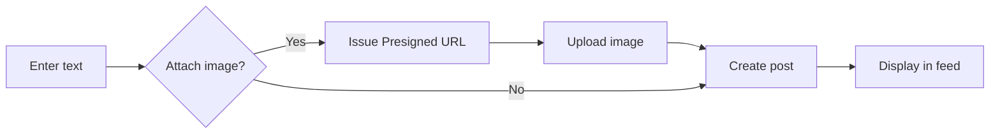
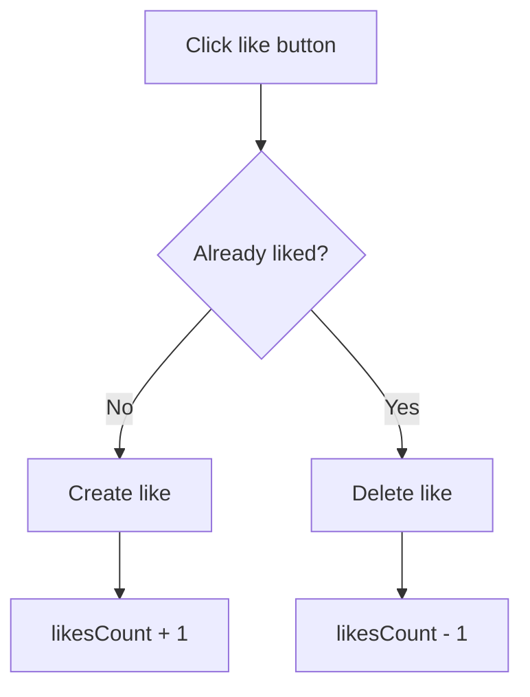

# 03. Implementing Posts & Comments & Likes


💡 Implement posts, comments, and likes to complete the core interactions of your social network.


## Overview

Implement the core social network features: post CRUD, image attachments, comments, and likes. Three tables are connected together to form a social feed.

| Item | Details |
|------|---------|
| Tables | `posts`, `comments`, `likes` |
| Key APIs | `/v1/data/posts`, `/v1/data/comments`, `/v1/data/likes`, `/v1/files/presigned-url` |
| Prerequisite | [02. Profiles](02-profiles.md) completed (profile creation required) |

***

## Step 1: Create Tables

Create three tables.

### posts Table





✅ **Try saying this to the AI**

"I need a place to store posts in the social network. Set it up to manage text content (max 1000 chars), images, like counts, and comment counts. Show me the structure before creating it."



💡 Verify that the AI suggests a structure similar to the one below.

| Field | Description | Example Value |
|-------|-------------|---------------|
| content | Post content | "Nice weather today" |
| imageUrl | Attached image URL | (linked after upload) |
| likesCount | Likes count | 0 |
| commentsCount | Comments count | 0 |





1. In the bkend console, navigate to **Database** > **Table Management**.
2. Click **Add Table** and configure as follows.

| Field Name | Type | Required | Description |
|------------|------|:--------:|-------------|
| `content` | String | O | Body (max 1000 chars) |
| `imageUrl` | String | | Image URL |
| `likesCount` | Number | | Likes count (default: 0) |
| `commentsCount` | Number | | Comments count (default: 0) |


💡 The `createdBy` field is automatically set by the system. You do not need to add an author ID field separately.





### comments Table





✅ **Try saying this to the AI**

"Let me add comments to posts. I need to know which post the comment belongs to, and the comment content should be max 500 chars. Show me the structure before creating it."



💡 Verify that the AI suggests a structure similar to the one below.

| Field | Description | Example Value |
|-------|-------------|---------------|
| postId | Post to comment on | (post ID) |
| content | Comment content | "I agree with you" |





| Field Name | Type | Required | Description |
|------------|------|:--------:|-------------|
| `postId` | String | O | Post ID |
| `content` | String | O | Comment content (max 500 chars) |




### likes Table





✅ **Try saying this to the AI**

"Let me add likes to posts. I just need to record which post was liked. Show me the structure before creating it."



💡 Verify that the AI suggests a structure similar to the one below.

| Field | Description | Example Value |
|-------|-------------|---------------|
| postId | Liked post | (post ID) |





| Field Name | Type | Required | Description |
|------------|------|:--------:|-------------|
| `postId` | String | O | Post ID |


⚠️ Since `createdBy` is auto-set, you need to implement duplicate checking in your app logic to allow only one like per user.





***

## Step 2: Create a Post







✅ **Try saying this to the AI**

"Create a post. The content should be 'I started a new project today!'"





### Create a Text Post

```bash
curl -X POST https://api-client.bkend.ai/v1/data/posts \
  -H "Content-Type: application/json" \
  -H "X-API-Key: {pk_publishable_key}" \
  -H "Authorization: Bearer {accessToken}" \
  -d '{
    "content": "I started a new project today!"
  }'
```

**Response (201 Created):**

```json
{
  "id": "post_xyz789",
  "content": "I started a new project today!",
  "imageUrl": null,
  "likesCount": 0,
  "commentsCount": 0,
  "createdBy": "user_001",
  "createdAt": "2025-01-15T10:00:00Z"
}
```

### Create a Post with Image

```javascript
// 1. Issue presigned URL
const { url } = await bkendFetch(
  '/v1/files/presigned-url',
  {
    method: 'POST',
    body: {
      filename: 'post-image.jpg',
      contentType: 'image/jpeg',
    },
  }
);

// 2. Upload image
await fetch(url, {
  method: 'PUT',
  headers: { 'Content-Type': 'image/jpeg' },
  body: imageFile,
});

// 3. Create post (with image URL)
const post = await bkendFetch('/v1/data/posts', {
  method: 'POST',
  body: {
    content: 'Here is a screenshot of my work',
    imageUrl: '{uploaded_file_URL}',
  },
});
```

### bkendFetch Implementation

```javascript
const API_BASE = 'https://api-client.bkend.ai';

async function bkendFetch(path, options = {}) {
  const response = await fetch(`${API_BASE}${path}`, {
    ...options,
    headers: {
      'Content-Type': 'application/json',
      'X-API-Key': '{pk_publishable_key}',
      'Authorization': `Bearer ${accessToken}`,
      ...options.headers,
    },
  });

  if (!response.ok) {
    const error = await response.json();
    throw new Error(error.message || 'Request failed');
  }

  return response.json();
}

// Create a post
const createPost = async ({ content, imageUrl }) => {
  const body = { content };
  if (imageUrl) body.imageUrl = imageUrl;

  return bkendFetch('/v1/data/posts', {
    method: 'POST',
    body,
  });
};
```




***

## Step 3: View Posts





✅ **Try saying this to the AI**

"Show me my 10 most recent posts."





### Get Single Post

```bash
curl -X GET https://api-client.bkend.ai/v1/data/posts/{postId} \
  -H "X-API-Key: {pk_publishable_key}" \
  -H "Authorization: Bearer {accessToken}"
```

### List Posts by User

```bash
curl -X GET "https://api-client.bkend.ai/v1/data/posts?andFilters=%7B%22createdBy%22%3A%22{userId}%22%7D&sortBy=createdAt&sortDirection=desc&limit=20" \
  -H "X-API-Key: {pk_publishable_key}" \
  -H "Authorization: Bearer {accessToken}"
```

**Response:**

```json
{
  "items": [
    {
      "id": "post_xyz789",
      "content": "I started a new project today!",
      "imageUrl": null,
      "likesCount": 5,
      "commentsCount": 2,
      "createdBy": "user_001",
      "createdAt": "2025-01-15T10:00:00Z"
    }
  ],
  "pagination": {
    "total": 1,
    "page": 1,
    "limit": 20,
    "totalPages": 1,
    "hasNext": false,
    "hasPrev": false
  }
}
```

### bkendFetch Implementation

```javascript
// Get posts by specific user
const getUserPosts = async (userId, page = 1, limit = 20) => {
  const andFilters = encodeURIComponent(JSON.stringify({ createdBy: userId }));
  const offset = (page - 1) * limit;
  return bkendFetch(
    `/v1/data/posts?andFilters=${andFilters}&sortBy=createdAt&sortDirection=desc&limit=${limit}&offset=${offset}`
  );
};

// Get single post
const getPost = async (postId) => {
  return bkendFetch(`/v1/data/posts/${postId}`);
};
```




***

## Step 4: Update/Delete Posts





✅ **Try saying this to the AI**

"Change the content of the post I just created to 'Updated content'."


To delete:


✅ **Try saying this to the AI**

"Delete the post I just created."





### Update a Post

```bash
curl -X PATCH https://api-client.bkend.ai/v1/data/posts/{postId} \
  -H "Content-Type: application/json" \
  -H "X-API-Key: {pk_publishable_key}" \
  -H "Authorization: Bearer {accessToken}" \
  -d '{
    "content": "Updated post content"
  }'
```

### Delete a Post

```bash
curl -X DELETE https://api-client.bkend.ai/v1/data/posts/{postId} \
  -H "X-API-Key: {pk_publishable_key}" \
  -H "Authorization: Bearer {accessToken}"
```


⚠️ Deleting a post does not automatically delete associated comments and likes. Clean up related data in your app.


### bkendFetch Implementation

```javascript
// Update a post
const updatePost = async (postId, updates) => {
  return bkendFetch(`/v1/data/posts/${postId}`, {
    method: 'PATCH',
    body: updates,
  });
};

// Delete a post
const deletePost = async (postId) => {
  return bkendFetch(`/v1/data/posts/${postId}`, {
    method: 'DELETE',
  });
};
```




***

## Step 5: Create/List Comments





✅ **Try saying this to the AI**

"Add a comment 'Congrats! Keep it up!' to that post."


To view comments:


✅ **Try saying this to the AI**

"Show me all comments on that post."





### Create a Comment

```bash
curl -X POST https://api-client.bkend.ai/v1/data/comments \
  -H "Content-Type: application/json" \
  -H "X-API-Key: {pk_publishable_key}" \
  -H "Authorization: Bearer {accessToken}" \
  -d '{
    "postId": "{postId}",
    "content": "Congrats! Keep it up!"
  }'
```

**Response (201 Created):**

```json
{
  "id": "comment_abc123",
  "postId": "post_xyz789",
  "content": "Congrats! Keep it up!",
  "createdBy": "user_002",
  "createdAt": "2025-01-15T11:00:00Z"
}
```

### List Comments for a Post

```bash
curl -X GET "https://api-client.bkend.ai/v1/data/comments?andFilters=%7B%22postId%22%3A%22{postId}%22%7D&sortBy=createdAt&sortDirection=asc" \
  -H "X-API-Key: {pk_publishable_key}" \
  -H "Authorization: Bearer {accessToken}"
```

**Response:**

```json
{
  "items": [
    {
      "id": "comment_abc123",
      "postId": "post_xyz789",
      "content": "Congrats! Keep it up!",
      "createdBy": "user_002",
      "createdAt": "2025-01-15T11:00:00Z"
    },
    {
      "id": "comment_def456",
      "postId": "post_xyz789",
      "content": "Amazing!",
      "createdBy": "user_003",
      "createdAt": "2025-01-15T11:30:00Z"
    }
  ],
  "pagination": {
    "total": 2,
    "page": 1,
    "limit": 25,
    "totalPages": 1,
    "hasNext": false,
    "hasPrev": false
  }
}
```

### bkendFetch Implementation

```javascript
// Create a comment
const createComment = async (postId, content) => {
  return bkendFetch('/v1/data/comments', {
    method: 'POST',
    body: { postId, content },
  });
};

// List comments
const getComments = async (postId) => {
  const andFilters = encodeURIComponent(JSON.stringify({ postId }));
  return bkendFetch(
    `/v1/data/comments?andFilters=${andFilters}&sortBy=createdAt&sortDirection=asc`
  );
};

// Delete a comment
const deleteComment = async (commentId) => {
  return bkendFetch(`/v1/data/comments/${commentId}`, {
    method: 'DELETE',
  });
};
```




***

## Step 6: Like Toggle

Likes are toggled by adding/removing. If a like already exists, remove it; if not, create it.







✅ **Try saying this to the AI**

"Like that post."


To unlike:


✅ **Try saying this to the AI**

"Remove my like from that post."





### Check Like Status

```bash
curl -X GET "https://api-client.bkend.ai/v1/data/likes?andFilters=%7B%22postId%22%3A%22{postId}%22%2C%22createdBy%22%3A%22{userId}%22%7D" \
  -H "X-API-Key: {pk_publishable_key}" \
  -H "Authorization: Bearer {accessToken}"
```

### Add Like

```bash
curl -X POST https://api-client.bkend.ai/v1/data/likes \
  -H "Content-Type: application/json" \
  -H "X-API-Key: {pk_publishable_key}" \
  -H "Authorization: Bearer {accessToken}" \
  -d '{
    "postId": "{postId}"
  }'
```

### Remove Like

```bash
curl -X DELETE https://api-client.bkend.ai/v1/data/likes/{likeId} \
  -H "X-API-Key: {pk_publishable_key}" \
  -H "Authorization: Bearer {accessToken}"
```

### bkendFetch Implementation (Toggle)

```javascript
// Toggle like
const toggleLike = async (postId, userId) => {
  // 1. Check existing like
  const andFilters = encodeURIComponent(
    JSON.stringify({ postId, createdBy: userId })
  );
  const existing = await bkendFetch(`/v1/data/likes?andFilters=${andFilters}`);

  if (existing.items.length > 0) {
    // 2a. Already liked → remove
    await bkendFetch(`/v1/data/likes/${existing.items[0].id}`, {
      method: 'DELETE',
    });
    return { liked: false };
  } else {
    // 2b. Not liked → create
    await bkendFetch('/v1/data/likes', {
      method: 'POST',
      body: { postId },
    });
    return { liked: true };
  }
};
```


💡 The like count (`likesCount`) must be separately updated in the `posts` table from your app. After toggling a like, increment/decrement the `likesCount` of the post.





***

## Reference

- [Insert Data](../../../database/03-insert.md) — Data insertion details
- [Select Data](../../../database/04-select.md) — Single record query details
- [List Data](../../../database/05-list.md) — Filters, sorting, pagination
- [Delete Data](../../../database/07-delete.md) — Data deletion details
- [File Upload](../../../storage/02-upload-single.md) — Presigned URL upload flow
- [Error Handling](../../../guides/11-error-handling.md) — API error handling patterns

***

## Next Steps

Implement the follow/unfollow system in [04. Follows](04-follows.md).
