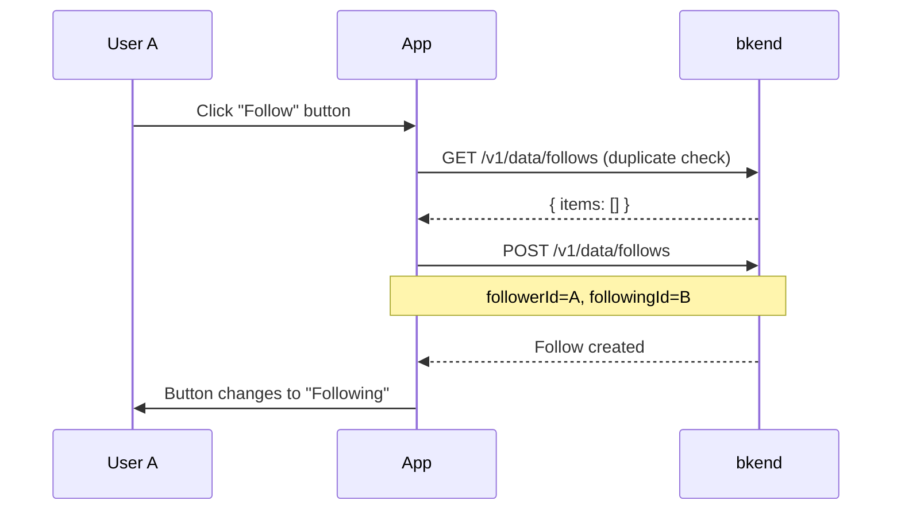

# 04. Implementing the Follow System


💡 Implement follow/unfollow relationship management between users.


## Overview

Build a follow system to form relationships between users. Users can view posts from followed users in their feed and browse follower/following lists.

| Item | Details |
|------|---------|
| Table | `follows` |
| Key API | `/v1/data/follows` |
| Prerequisite | [02. Profiles](02-profiles.md) completed (profile required) |

***

## Step 1: Create the follows Table





✅ **Try saying this to the AI**

"Let users follow each other. I just need to record who follows whom. Show me the structure before creating it."



💡 Verify that the AI suggests a structure similar to the one below.

| Field | Description | Example Value |
|-------|-------------|---------------|
| followerId | The person who follows | (user ID) |
| followingId | The person being followed | (user ID) |





1. In the bkend console, navigate to **Database** > **Table Management**.
2. Click **Add Table** and configure as follows.

| Field Name | Type | Required | Description |
|------------|------|:--------:|-------------|
| `followerId` | String | O | Follower user ID |
| `followingId` | String | O | Following user ID |


💡 For more details on table management, refer to [Table Management](../../../console/07-table-management.md).





***

## Step 2: Follow a User







✅ **Try saying this to the AI**

"Follow 'SocialKim'."





### Check for Duplicates Then Follow

```bash
# 1. Check if already following
curl -X GET "https://api-client.bkend.ai/v1/data/follows?andFilters=%7B%22followerId%22%3A%22{myUserId}%22%2C%22followingId%22%3A%22{targetUserId}%22%7D" \
  -H "X-API-Key: {pk_publishable_key}" \
  -H "Authorization: Bearer {accessToken}"
```

```bash
# 2. Create follow
curl -X POST https://api-client.bkend.ai/v1/data/follows \
  -H "Content-Type: application/json" \
  -H "X-API-Key: {pk_publishable_key}" \
  -H "Authorization: Bearer {accessToken}" \
  -d '{
    "followerId": "{myUserId}",
    "followingId": "{targetUserId}"
  }'
```

**Response (201 Created):**

```json
{
  "id": "follow_xyz789",
  "followerId": "user_001",
  "followingId": "user_002",
  "createdBy": "user_001",
  "createdAt": "2025-01-15T10:00:00Z"
}
```

### bkendFetch Implementation

```javascript
const API_BASE = 'https://api-client.bkend.ai';

async function bkendFetch(path, options = {}) {
  const response = await fetch(`${API_BASE}${path}`, {
    ...options,
    headers: {
      'Content-Type': 'application/json',
      'X-API-Key': '{pk_publishable_key}',
      'Authorization': `Bearer ${accessToken}`,
      ...options.headers,
    },
  });

  if (!response.ok) {
    const error = await response.json();
    throw new Error(error.message || 'Request failed');
  }

  return response.json();
}

// Follow (with duplicate check)
const followUser = async (myUserId, targetUserId) => {
  // Duplicate check
  const andFilters = encodeURIComponent(
    JSON.stringify({
      followerId: myUserId,
      followingId: targetUserId,
    })
  );
  const existing = await bkendFetch(`/v1/data/follows?andFilters=${andFilters}`);

  if (existing.items.length > 0) {
    throw new Error('Already following this user');
  }

  return bkendFetch('/v1/data/follows', {
    method: 'POST',
    body: {
      followerId: myUserId,
      followingId: targetUserId,
    },
  });
};
```




***

## Step 3: Unfollow





✅ **Try saying this to the AI**

"Unfollow 'SocialKim'."





### Find and Delete Follow Relationship

```bash
# 1. Find follow relationship
curl -X GET "https://api-client.bkend.ai/v1/data/follows?andFilters=%7B%22followerId%22%3A%22{myUserId}%22%2C%22followingId%22%3A%22{targetUserId}%22%7D" \
  -H "X-API-Key: {pk_publishable_key}" \
  -H "Authorization: Bearer {accessToken}"
```

```bash
# 2. Delete follow
curl -X DELETE https://api-client.bkend.ai/v1/data/follows/{followId} \
  -H "X-API-Key: {pk_publishable_key}" \
  -H "Authorization: Bearer {accessToken}"
```

### bkendFetch Implementation

```javascript
// Unfollow
const unfollowUser = async (myUserId, targetUserId) => {
  // Find follow relationship
  const andFilters = encodeURIComponent(
    JSON.stringify({
      followerId: myUserId,
      followingId: targetUserId,
    })
  );
  const result = await bkendFetch(`/v1/data/follows?andFilters=${andFilters}`);

  if (result.items.length === 0) {
    throw new Error('Follow relationship does not exist');
  }

  // Delete
  return bkendFetch(`/v1/data/follows/${result.items[0].id}`, {
    method: 'DELETE',
  });
};
```




***

## Step 4: View Followers List

View the list of "people who follow me."





✅ **Try saying this to the AI**

"Show me the list of people who follow me."





### Followers List

```bash
curl -X GET "https://api-client.bkend.ai/v1/data/follows?andFilters=%7B%22followingId%22%3A%22{myUserId}%22%7D&sortBy=createdAt&sortDirection=desc" \
  -H "X-API-Key: {pk_publishable_key}" \
  -H "Authorization: Bearer {accessToken}"
```

**Response:**

```json
{
  "items": [
    {
      "id": "follow_001",
      "followerId": "user_003",
      "followingId": "user_001",
      "createdAt": "2025-01-15T10:00:00Z"
    },
    {
      "id": "follow_002",
      "followerId": "user_004",
      "followingId": "user_001",
      "createdAt": "2025-01-14T09:00:00Z"
    }
  ],
  "pagination": {
    "total": 2,
    "page": 1,
    "limit": 25,
    "totalPages": 1,
    "hasNext": false,
    "hasPrev": false
  }
}
```

### Get Follower Profile Information

Retrieve profile information using the follower ID list.

```javascript
// Followers list + profile information
const getFollowersWithProfiles = async (myUserId) => {
  // 1. Get followers list
  const andFilters = encodeURIComponent(
    JSON.stringify({ followingId: myUserId })
  );
  const follows = await bkendFetch(
    `/v1/data/follows?andFilters=${andFilters}&sortBy=createdAt&sortDirection=desc`
  );

  if (follows.items.length === 0) return [];

  // 2. Get follower profiles
  const followerIds = follows.items.map((f) => f.followerId);
  const profileAndFilters = encodeURIComponent(
    JSON.stringify({ userId: { $in: followerIds } })
  );
  const profiles = await bkendFetch(
    `/v1/data/profiles?andFilters=${profileAndFilters}`
  );

  return profiles.items;
};
```




***

## Step 5: View Following List

View the list of "people I follow."





✅ **Try saying this to the AI**

"Show me the list of people I follow."





### Following List

```bash
curl -X GET "https://api-client.bkend.ai/v1/data/follows?andFilters=%7B%22followerId%22%3A%22{myUserId}%22%7D&sortBy=createdAt&sortDirection=desc" \
  -H "X-API-Key: {pk_publishable_key}" \
  -H "Authorization: Bearer {accessToken}"
```

**Response:**

```json
{
  "items": [
    {
      "id": "follow_003",
      "followerId": "user_001",
      "followingId": "user_002",
      "createdAt": "2025-01-15T10:00:00Z"
    },
    {
      "id": "follow_004",
      "followerId": "user_001",
      "followingId": "user_005",
      "createdAt": "2025-01-13T08:00:00Z"
    }
  ],
  "pagination": {
    "total": 2,
    "page": 1,
    "limit": 25,
    "totalPages": 1,
    "hasNext": false,
    "hasPrev": false
  }
}
```

### bkendFetch Implementation

```javascript
// Following list + profile information
const getFollowingWithProfiles = async (myUserId) => {
  const andFilters = encodeURIComponent(
    JSON.stringify({ followerId: myUserId })
  );
  const follows = await bkendFetch(
    `/v1/data/follows?andFilters=${andFilters}&sortBy=createdAt&sortDirection=desc`
  );

  if (follows.items.length === 0) return [];

  const followingIds = follows.items.map((f) => f.followingId);
  const profileAndFilters = encodeURIComponent(
    JSON.stringify({ userId: { $in: followingIds } })
  );
  const profiles = await bkendFetch(
    `/v1/data/profiles?andFilters=${profileAndFilters}`
  );

  return profiles.items;
};
```




***

## Step 6: Check Follow Status

Logic to determine the follow button state on the profile screen.

```mermaid
flowchart TD
    A[Enter profile screen] --> B[Check follow relationship]
    B --> C{Following?}
    C -->|Yes| D[Show "Following" button]
    C -->|No| E[Show "Follow" button]
```





✅ **Try saying this to the AI**

"Check if I am following 'SocialKim'."





```javascript
// Check follow status
const checkFollowStatus = async (myUserId, targetUserId) => {
  const andFilters = encodeURIComponent(
    JSON.stringify({
      followerId: myUserId,
      followingId: targetUserId,
    })
  );
  const result = await bkendFetch(`/v1/data/follows?andFilters=${andFilters}`);
  return result.items.length > 0;
};

// Toggle follow (follow/unfollow)
const toggleFollow = async (myUserId, targetUserId) => {
  const isFollowing = await checkFollowStatus(myUserId, targetUserId);

  if (isFollowing) {
    await unfollowUser(myUserId, targetUserId);
    return { following: false };
  } else {
    await followUser(myUserId, targetUserId);
    return { following: true };
  }
};
```




***

## Reference

- [Insert Data](../../../database/03-insert.md) — Data insertion details
- [List Data](../../../database/05-list.md) — Filters, sorting, pagination
- [Delete Data](../../../database/07-delete.md) — Data deletion details
- [Table Management](../../../console/07-table-management.md) — Create/manage tables in the console

***

## Next Steps

Build the following-based feed in [05. Feeds](05-feeds.md).
