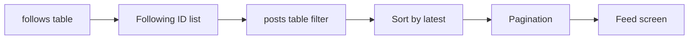
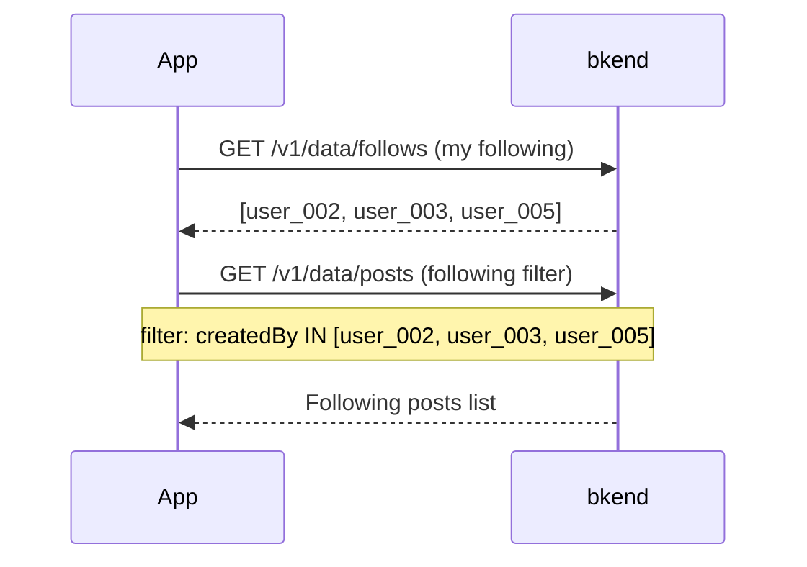

# 05. Implementing Feed Composition


💡 Implement following-based feeds, pagination, and filtering to complete the social network timeline.


## Overview

Compose a feed by aggregating posts from followed users. Create various feeds by combining the `posts` and `follows` tables without needing a separate table.

| Item | Details |
|------|---------|
| Tables | `posts` + `follows` (existing table combination) |
| Key APIs | `/v1/data/posts`, `/v1/data/follows` |
| Prerequisite | [04. Follows](04-follows.md) completed |

***

## Feed Composition Strategy



The feed is composed in two steps.

1. Query the list of user IDs you follow from the `follows` table.
2. Query those users' posts from the `posts` table.

***

## Step 1: Latest Posts Feed

Query all public posts sorted by newest first.





✅ **Try saying this to the AI**

"Show me the 20 most recent posts."





### Latest Feed

```bash
curl -X GET "https://api-client.bkend.ai/v1/data/posts?sortBy=createdAt&sortDirection=desc&limit=20" \
  -H "X-API-Key: {pk_publishable_key}" \
  -H "Authorization: Bearer {accessToken}"
```

**Response:**

```json
{
  "items": [
    {
      "id": "post_001",
      "content": "I started a new project today!",
      "imageUrl": "https://cdn.example.com/files/post_img_001.jpg",
      "likesCount": 12,
      "commentsCount": 3,
      "createdBy": "user_002",
      "createdAt": "2025-01-15T10:00:00Z"
    },
    {
      "id": "post_002",
      "content": "Delicious lunch!",
      "imageUrl": null,
      "likesCount": 5,
      "commentsCount": 1,
      "createdBy": "user_003",
      "createdAt": "2025-01-15T09:30:00Z"
    }
  ],
  "pagination": {
    "total": 50,
    "page": 1,
    "limit": 20,
    "totalPages": 3,
    "hasNext": true,
    "hasPrev": false
  }
}
```

### Pagination (offset-based)

```bash
# Page 1 (first 20)
curl -X GET "https://api-client.bkend.ai/v1/data/posts?sortBy=createdAt&sortDirection=desc&limit=20&offset=0" \
  -H "X-API-Key: {pk_publishable_key}" \
  -H "Authorization: Bearer {accessToken}"

# Page 2 (21st-40th)
curl -X GET "https://api-client.bkend.ai/v1/data/posts?sortBy=createdAt&sortDirection=desc&limit=20&offset=20" \
  -H "X-API-Key: {pk_publishable_key}" \
  -H "Authorization: Bearer {accessToken}"
```

### bkendFetch Implementation

```javascript
const API_BASE = 'https://api-client.bkend.ai';

async function bkendFetch(path, options = {}) {
  const response = await fetch(`${API_BASE}${path}`, {
    ...options,
    headers: {
      'Content-Type': 'application/json',
      'X-API-Key': '{pk_publishable_key}',
      'Authorization': `Bearer ${accessToken}`,
      ...options.headers,
    },
  });

  if (!response.ok) {
    const error = await response.json();
    throw new Error(error.message || 'Request failed');
  }

  return response.json();
}

// Latest feed
const getLatestFeed = async (page = 1, limit = 20) => {
  const offset = (page - 1) * limit;
  return bkendFetch(
    `/v1/data/posts?sortBy=createdAt&sortDirection=desc&limit=${limit}&offset=${offset}`
  );
};
```




***

## Step 2: Following-Based Feed

Show only posts from users you follow.







✅ **Try saying this to the AI**

"Show me the latest posts from people I follow."



💡 The AI automatically checks your following list first, then queries posts from those users.





### Query Following Feed

```javascript
// Following feed (2-step combination)
const getFollowingFeed = async (myUserId, page = 1, limit = 20) => {
  // 1. Get following list
  const followAndFilters = encodeURIComponent(
    JSON.stringify({ followerId: myUserId })
  );
  const follows = await bkendFetch(
    `/v1/data/follows?andFilters=${followAndFilters}`
  );

  if (follows.items.length === 0) {
    return { items: [], pagination: { total: 0, page: 1, limit, totalPages: 0, hasNext: false, hasPrev: false } };
  }

  // 2. Get posts from followed users
  const followingIds = follows.items.map((f) => f.followingId);
  const postAndFilters = encodeURIComponent(
    JSON.stringify({ createdBy: { $in: followingIds } })
  );
  const offset = (page - 1) * limit;

  return bkendFetch(
    `/v1/data/posts?andFilters=${postAndFilters}&sortBy=createdAt&sortDirection=desc&limit=${limit}&offset=${offset}`
  );
};
```

### Feed Including My Posts

```javascript
// Combined feed: my posts + following posts
const getHomeFeed = async (myUserId, page = 1, limit = 20) => {
  const followAndFilters = encodeURIComponent(
    JSON.stringify({ followerId: myUserId })
  );
  const follows = await bkendFetch(
    `/v1/data/follows?andFilters=${followAndFilters}`
  );

  // Combine my ID + following IDs
  const userIds = [myUserId, ...follows.items.map((f) => f.followingId)];
  const postAndFilters = encodeURIComponent(
    JSON.stringify({ createdBy: { $in: userIds } })
  );
  const offset = (page - 1) * limit;

  return bkendFetch(
    `/v1/data/posts?andFilters=${postAndFilters}&sortBy=createdAt&sortDirection=desc&limit=${limit}&offset=${offset}`
  );
};
```


💡 The following list does not change frequently, so cache it on the client side to avoid querying it on every request.





***

## Step 3: Feed Filtering

Filter the feed with various conditions.





✅ **Try saying this to the AI**

"Show me only posts from today that have images."





### Posts with Images Only

```bash
curl -X GET "https://api-client.bkend.ai/v1/data/posts?andFilters=%7B%22imageUrl%22%3A%7B%22%24ne%22%3Anull%7D%7D&sortBy=createdAt&sortDirection=desc&limit=20" \
  -H "X-API-Key: {pk_publishable_key}" \
  -H "Authorization: Bearer {accessToken}"
```

### Posts from a Specific Date Range

```bash
# Today's posts only
curl -X GET "https://api-client.bkend.ai/v1/data/posts?andFilters=%7B%22createdAt%22%3A%7B%22%24gte%22%3A%222025-01-15T00%3A00%3A00Z%22%7D%7D&sortBy=createdAt&sortDirection=desc" \
  -H "X-API-Key: {pk_publishable_key}" \
  -H "Authorization: Bearer {accessToken}"
```

### bkendFetch Implementation

```javascript
// Image posts only
const getImageFeed = async (page = 1, limit = 20) => {
  const andFilters = encodeURIComponent(
    JSON.stringify({ imageUrl: { $ne: null } })
  );
  const offset = (page - 1) * limit;
  return bkendFetch(
    `/v1/data/posts?andFilters=${andFilters}&sortBy=createdAt&sortDirection=desc&limit=${limit}&offset=${offset}`
  );
};

// Feed by date range
const getFeedByDateRange = async (startDate, endDate, page = 1, limit = 20) => {
  const andFilters = encodeURIComponent(
    JSON.stringify({
      createdAt: {
        $gte: startDate,
        $lte: endDate,
      },
    })
  );
  const offset = (page - 1) * limit;
  return bkendFetch(
    `/v1/data/posts?andFilters=${andFilters}&sortBy=createdAt&sortDirection=desc&limit=${limit}&offset=${offset}`
  );
};
```




***

## Step 4: Popular Posts Sorting





✅ **Try saying this to the AI**

"Show me the 10 most liked posts."


For most commented posts:


✅ **Try saying this to the AI**

"Show me the 10 most commented posts."





### Sort by Likes

```bash
curl -X GET "https://api-client.bkend.ai/v1/data/posts?sortBy=likesCount&sortDirection=desc&limit=20" \
  -H "X-API-Key: {pk_publishable_key}" \
  -H "Authorization: Bearer {accessToken}"
```

### Sort by Comments

```bash
curl -X GET "https://api-client.bkend.ai/v1/data/posts?sortBy=commentsCount&sortDirection=desc&limit=20" \
  -H "X-API-Key: {pk_publishable_key}" \
  -H "Authorization: Bearer {accessToken}"
```

### bkendFetch Implementation

```javascript
// Popular posts (by likes)
const getPopularFeed = async (page = 1, limit = 20) => {
  const offset = (page - 1) * limit;
  return bkendFetch(
    `/v1/data/posts?sortBy=likesCount&sortDirection=desc&limit=${limit}&offset=${offset}`
  );
};

// Most commented posts
const getMostCommentedFeed = async (page = 1, limit = 20) => {
  const offset = (page - 1) * limit;
  return bkendFetch(
    `/v1/data/posts?sortBy=commentsCount&sortDirection=desc&limit=${limit}&offset=${offset}`
  );
};
```

### Feed Tab Implementation Example

```javascript
// Query by feed type
const getFeed = async (type, myUserId, page = 1) => {
  switch (type) {
    case 'latest':
      return getLatestFeed(page);
    case 'following':
      return getFollowingFeed(myUserId, page);
    case 'popular':
      return getPopularFeed(page);
    case 'images':
      return getImageFeed(page);
    default:
      return getLatestFeed(page);
  }
};
```




***

## Step 5: Infinite Scroll Implementation

A pattern to automatically load the next page as the user scrolls in the app.





✅ **Try saying this to the AI**

"Show me the next page of the feed you showed me earlier."



💡 Infinite scroll is a UI pattern implemented in the app. With MCP, data is queried page by page.





```javascript
// Infinite scroll feed manager
class FeedManager {
  constructor(myUserId) {
    this.myUserId = myUserId;
    this.page = 1;
    this.limit = 20;
    this.hasMore = true;
    this.posts = [];
  }

  // Load next page
  async loadMore() {
    if (!this.hasMore) return;

    const result = await getFollowingFeed(
      this.myUserId,
      this.page,
      this.limit
    );

    this.posts = [...this.posts, ...result.items];
    this.hasMore = this.posts.length < result.pagination.total;
    this.page++;

    return result.items;
  }

  // Refresh (from the beginning)
  async refresh() {
    this.page = 1;
    this.hasMore = true;
    this.posts = [];
    return this.loadMore();
  }
}

// Usage example
const feed = new FeedManager('user_001');

// Initial load
await feed.loadMore();

// Load more on scroll events
window.addEventListener('scroll', async () => {
  if (isNearBottom() && feed.hasMore) {
    await feed.loadMore();
    renderPosts(feed.posts);
  }
});
```


💡 The `offset` approach is simple but performance may degrade with large datasets. For large-scale feeds, consider a cursor-based approach using `createdAt`.





***

## Step 6: Integrated Feed Screen Example

Integrate all the features implemented so far into a single feed screen.





✅ **Try saying this to the AI**

"Show me my feed. Include the profile information of who wrote each post."



💡 The AI automatically processes multiple steps sequentially.
1. Check who you are following
2. Query their posts
3. Query each post author's profile
4. Compile and display the results together





```javascript
// Initialize feed screen
const initFeedScreen = async (myUserId) => {
  // 1. Get my profile
  const profileAndFilters = encodeURIComponent(
    JSON.stringify({ userId: myUserId })
  );
  const profileResult = await bkendFetch(
    `/v1/data/profiles?andFilters=${profileAndFilters}`
  );
  const myProfile = profileResult.items[0];

  // 2. Load following feed
  const feed = await getFollowingFeed(myUserId, 1, 20);

  // 3. Get author profiles for each post
  const authorIds = [...new Set(feed.items.map((p) => p.createdBy))];
  const authorAndFilters = encodeURIComponent(
    JSON.stringify({ userId: { $in: authorIds } })
  );
  const authors = await bkendFetch(
    `/v1/data/profiles?andFilters=${authorAndFilters}`
  );

  // 4. Map author info to posts
  const authorMap = {};
  authors.items.forEach((a) => {
    authorMap[a.userId] = a;
  });

  const feedWithAuthors = feed.items.map((post) => ({
    ...post,
    author: authorMap[post.createdBy] || null,
  }));

  return {
    myProfile,
    feed: feedWithAuthors,
    total: feed.pagination.total,
  };
};
```




***

## Reference

- [List Data](../../../database/05-list.md) — Filters, sorting, pagination details
- [Select Data](../../../database/04-select.md) — Single record query details
- [CRUD App Patterns](../../../database/12-crud-app-patterns.md) — App integration CRUD patterns
- [Error Handling](../../../guides/11-error-handling.md) — API error handling patterns

***

## Next Steps

Explore AI-powered feed recommendations, content analysis, and more advanced use cases in [06. AI Scenarios](06-ai-prompts.md).
