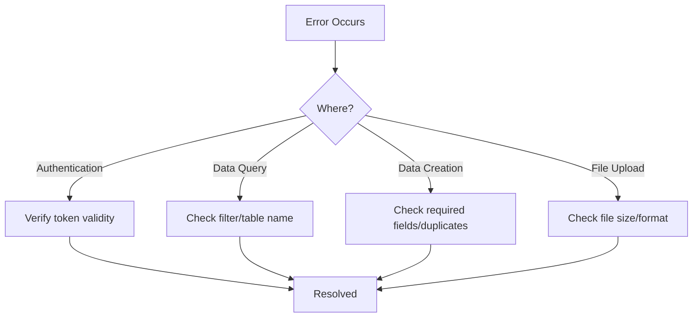

# 99. Troubleshooting


💡 A collection of common errors and solutions encountered during social network app development. This guide covers causes and fixes organized by error code.


***

## Authentication

### 401 Unauthorized

```json
{
  "error": {
    "code": 401,
    "message": "Unauthorized: Invalid or expired token"
  }
}
```

**Cause**: The Access Token has expired or is invalid.

**Solution**:

1. Issue a new Access Token using the Refresh Token.

```bash
curl -X POST https://api-client.bkend.ai/v1/auth/refresh \
  -H "Content-Type: application/json" \
  -H "X-API-Key: {pk_publishable_key}" \
  -d '{
    "refreshToken": "{refreshToken}"
  }'
```

2. If the Refresh Token has also expired, log in again.


⚠️ Check the Access Token expiration time and implement token refresh logic in your app before it expires.


### Google OAuth Login Failure

```json
{
  "error": {
    "code": 400,
    "message": "Bad Request: Invalid OAuth code"
  }
}
```

**Cause**: The authorization code from Google is invalid or has already been used.

**Solution**:

1. Authorization codes can only be used **once**. Start a new login flow.
2. Verify that the Google OAuth settings (Client ID, Redirect URI) in the console are correct.
3. Ensure the Redirect URI exactly matches the one registered in Google Cloud Console.

### Token Refresh Failure

```json
{
  "error": {
    "code": 401,
    "message": "Unauthorized: Invalid refresh token"
  }
}
```

**Cause**: The Refresh Token has expired or has already been used (rotated).

**Solution**:

1. Prompt the user to log in again.
2. Ensure your app updates the Refresh Token with the latest value when storing it.

***

## Profile

### Profile Creation Failure — Missing Required Fields

```json
{
  "error": {
    "code": 400,
    "message": "Bad Request: 'nickname' is required"
  }
}
```

**Cause**: A required field such as `nickname` or `userId` is missing.

**Solution**:

Include the required fields in the request body.

```json
{
  "nickname": "DevKim",
  "userId": "user_001"
}
```

### Duplicate Profile Creation

```json
{
  "error": {
    "code": 409,
    "message": "Conflict: Profile already exists for this user"
  }
}
```

**Cause**: Attempted to create a profile twice with the same `userId`.

**Solution**:

1. Query the existing profile first.

```json
{
  "name": "list_profiles",
  "arguments": {
    "filter": { "userId": "user_001" }
  }
}
```

2. If a profile exists, use `update_profiles` to modify it instead.

### Avatar Upload Failure

```json
{
  "error": {
    "code": 413,
    "message": "Payload Too Large: File size exceeds limit"
  }
}
```

**Cause**: The uploaded file exceeds the size limit.

**Solution**:

1. Compress the image or reduce its resolution and try again.
2. Verify the supported formats (JPEG, PNG, GIF, WebP).

```json
{
  "error": {
    "code": 415,
    "message": "Unsupported Media Type"
  }
}
```

**Cause**: The file format is not supported.

**Solution**: Convert the file to one of JPEG, PNG, GIF, or WebP and upload again.

***

## Posts

### Post Creation Failure

```json
{
  "error": {
    "code": 400,
    "message": "Bad Request: 'content' is required"
  }
}
```

**Cause**: The `content` field is empty or missing.

**Solution**: Always include the post body (`content`).

```bash
curl -X POST https://api-client.bkend.ai/v1/data/posts \
  -H "Content-Type: application/json" \
  -H "X-API-Key: {pk_publishable_key}" \
  -H "Authorization: Bearer {accessToken}" \
  -d '{
    "content": "Enter your post content here"
  }'
```

### Empty Results

```json
{
  "data": [],
  "total": 0
}
```

**Cause**: No posts match the given conditions.

**Checklist**:

1. **Filter conditions** — Verify that filter values (createdBy, postId, etc.) are correct.
2. **API Key** — Verify that the correct Publishable Key is set in the `X-API-Key` header.
3. **Table name** — Verify that the table name in the request URL is correct.


💡 Publishable Keys are issued separately for each environment (dev/staging/prod). Make sure you are using the key for the correct environment.


### Post Update/Delete Permission Denied

```json
{
  "error": {
    "code": 403,
    "message": "Forbidden: You are not the author"
  }
}
```

**Cause**: You attempted to update or delete a post that you did not create.

**Solution**: Verify that you are the author. The `createdBy` field must match the currently logged-in user ID.

### Image Not Displaying

**Possible causes**:

1. **Presigned URL not used** — An arbitrary URL was placed in `imageUrl` without actually uploading a file
2. **URL expired** — Presigned URLs expire after a certain period
3. **Upload failed** — The file upload to the presigned URL failed

**Solution**:

1. Issue a presigned URL and upload the actual file.
2. Query the file metadata to get a download URL and store it in `imageUrl`.
3. If expired, query the file metadata again to refresh the URL.

***

## Follows

### Duplicate Follow

```json
{
  "error": {
    "code": 409,
    "message": "Conflict: Already following this user"
  }
}
```

**Cause**: Attempted to follow a user you are already following.

**Solution**: Check the existing relationship before following.

```json
{
  "name": "list_follows",
  "arguments": {
    "filter": {
      "followerId": "user_001",
      "followingId": "user_002"
    }
  }
}
```

If results exist, you are already following. Unfollow if needed.

### Following Yourself

```json
{
  "error": {
    "code": 400,
    "message": "Bad Request: Cannot follow yourself"
  }
}
```

**Cause**: `followerId` and `followingId` are the same.

**Solution**: Validate in your app that the user is not following themselves before making the request.

```javascript
const followUser = async (myUserId, targetUserId) => {
  if (myUserId === targetUserId) {
    throw new Error('You cannot follow yourself');
  }
  // Proceed with follow logic
};
```

### Follow Relationship Not Found

```json
{
  "error": {
    "code": 404,
    "message": "Follow relationship not found"
  }
}
```

**Cause**: Attempted to delete a relationship that was already unfollowed or never existed.

**Solution**: Use `list_follows` to verify the relationship exists before unfollowing.

***

## Feeds

### Empty Feed

```json
{
  "data": [],
  "total": 0
}
```

**Possible causes**:

1. **Not following anyone** — You have not followed any users
2. **Following users have no posts** — The users you follow have not created any posts
3. **Filter condition error** — The `$in` array is empty

**Solution**:

1. Check your following list first.

```json
{
  "name": "list_follows",
  "arguments": {
    "filter": { "followerId": "user_001" }
  }
}
```

2. If you are not following anyone, follow some users.
3. If you have followings but the feed is empty, query the latest feed for all posts.

```json
{
  "name": "list_posts",
  "arguments": {
    "sort": "createdAt:desc",
    "limit": 20
  }
}
```

### Sorting Not Applied

```json
// Incorrect examples
{ "sort": "-createdAt" }
{ "sort": { "createdAt": -1 } }
```

**Cause**: The sort format is incorrect.

**Solution**: Use the `field:direction` format.

```json
// Correct examples
{ "sort": "createdAt:desc" }
{ "sort": "likesCount:desc" }
{ "sort": "createdAt:asc" }
```

### Slow Feed Loading

**Solution**:

1. Reduce the `limit` value (20 or fewer recommended).
2. Cache the following list on the client to avoid querying it on every request.
3. Use pagination.

```javascript
// Caching example
let cachedFollowingIds = null;

const getFollowingIds = async (myUserId) => {
  if (cachedFollowingIds) return cachedFollowingIds;

  const andFilters = encodeURIComponent(
    JSON.stringify({ followerId: myUserId })
  );
  const follows = await bkendFetch(
    `/v1/data/follows?andFilters=${andFilters}`
  );
  cachedFollowingIds = follows.items.map((f) => f.followingId);
  return cachedFollowingIds;
};
```

***

## MCP Tools

### AI Cannot Find Table

```text
AI response: "Cannot find the posts table."
```

**Possible causes**:

1. **Table not created** — The table has not been created yet
2. **Project/environment mismatch** — The MCP connection settings point to a different project or environment
3. **Table name typo** — Name differs in case, pluralization, etc.

**Solution**:

1. Ask the AI to check the table list.


✅ **Try saying this to the AI**

"Show me what tables exist in the current project"


2. If the table does not exist, create it.


✅ **Try saying this to the AI**

"Create the profiles, posts, comments, likes, and follows tables needed for the social network"


### MCP Connection Failure

```text
Error: Connection refused
```

**Checklist**:

| Item | How to Verify |
|------|---------------|
| MCP Server URL | Verify the URL is correct in the settings file |
| API Key | Verify a valid API key is configured |
| Project ID | Verify the correct project ID is entered |
| Network | Check internet connection |

**Solution**:

1. Check your MCP client settings.
2. Restart the MCP client (Claude Desktop, Cursor, etc.).
3. Verify in the console that the API key has not expired.

### AI Response Is Unexpected

**Possible causes**:

1. **Ambiguous prompt** — Specific values or IDs were not provided
2. **No data** — The requested data does not exist

**Solution**:

- Include specific IDs and values in your requests.
- Instead of "Show me posts," write "Show me the 5 latest posts by user_001" for clarity.

***

## Queries

### Filter Syntax Error

```json
{
  "error": {
    "code": 400,
    "message": "Bad Request: Invalid filter syntax"
  }
}
```

**Correct filter usage**:

```bash
# String filter
?andFilters={"createdBy":"user_001"}

# Comparison operator
?andFilters={"likesCount":{"$gte":10}}

# Array inclusion
?andFilters={"createdBy":{"$in":["user_001","user_002"]}}

# Compound conditions
?andFilters={"createdBy":"user_001","imageUrl":{"$ne":null}}
```


💡 When using in URLs, encode the `andFilters` value with `encodeURIComponent()`.


**Supported operators**:

| Operator | Description | Example |
|----------|-------------|---------|
| `$eq` | Equal to | `{ "status": { "$eq": "active" } }` |
| `$ne` | Not equal to | `{ "imageUrl": { "$ne": null } }` |
| `$gt`, `$gte` | Greater than, greater than or equal | `{ "likesCount": { "$gte": 10 } }` |
| `$lt`, `$lte` | Less than, less than or equal | `{ "likesCount": { "$lt": 100 } }` |
| `$in` | In list | `{ "createdBy": { "$in": ["user_001"] } }` |
| `$nin` | Not in list | `{ "status": { "$nin": ["deleted"] } }` |

### API Rate Limit Exceeded

```json
{
  "error": {
    "code": 429,
    "message": "Too Many Requests"
  }
}
```

**Solution**:

1. Space requests at least 1 second apart.
2. Reduce unnecessary repeated requests.
3. Cache responses on the client where possible.

***

## Debugging Tips

### Pre-Request Checklist

| Item | Verify |
|------|--------|
| Is there a valid token in the `Authorization` header? | `Bearer {accessToken}` |
| Is the `X-API-Key` header included? | Check Publishable Key in the console |
| Is `Content-Type` set to `application/json`? | Required for POST/PATCH requests |
| Is the table name in the URL path correct? | Check plural form (e.g., `posts`, `profiles`) |

### Step-by-Step Problem Isolation

When errors occur in complex features, isolate them step by step.




💡 Ask the AI "An error occurred with my last request. Analyze the cause" and it will analyze the error message and suggest solutions.


***

## FAQ

### Q: When I delete a post, are comments and likes also deleted?

A: No. Deleting a post does not automatically delete associated comments (`comments`) and likes (`likes`). Implement logic in your app to clean up related data when deleting a post.

### Q: The follower count seems incorrect

A: Check the `total` value in the `follows` table query results. Follow relationships from deleted accounts may still remain.

### Q: The image URL has expired

A: Presigned URLs expire after a certain period. Query the file metadata again to get a new download URL.

### Q: Is data different across environments (dev/staging/prod)?

A: Yes. Each environment uses an independent data store. Data created in `dev` will not be visible in `prod`. Verify that the correct environment's Publishable Key is being used in `X-API-Key`.

***

## Reference

- [Error Handling Patterns](../../../guides/11-error-handling.md) — API error codes and handling patterns in detail
- [Token Management](../../../authentication/20-token-management.md) — Token refresh and expiration handling
- [File Upload](../../../storage/02-upload-single.md) — Presigned URL upload flow

***

## Next Steps

- Return to the [Social Network Cookbook README](../README.md) to review the overall structure.
- Explore other cookbooks:
  - [Blog Cookbook](../../blog/README.md) — Build a blog platform
  - [Recipe App Cookbook](../../recipe-app/README.md) — Build a recipe management app
  - [Shopping Mall Cookbook](../../shopping-mall/README.md) — Build a shopping mall
