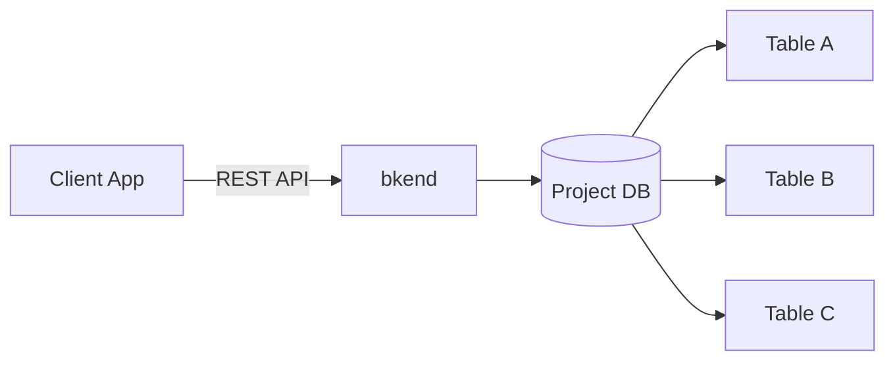
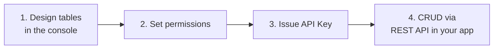

# Database Overview


Understand the bkend database system and learn how to manage data with the REST API.


## What is the Database?

If you want to store and query data with just API calls — without defining table structures in advance — use bkend's dynamic tables. bkend provides an isolated database for each project. You can create tables and perform data CRUD (Create, Read, Update, Delete) operations via the REST API without any server setup.

***

## Key Features

### Per-Project Isolation

Each project uses its own independent database. Data is also separated by environment (dev/staging/prod), ensuring development and production data never overlap.

### Schema-Based Validation

Data is automatically validated according to the schema defined on each table. Constraints such as required fields, types, patterns, and ranges are enforced.

### Role-Based Permissions

You can configure role-based access permissions for each table.

| Role | Description |
|------|-------------|
| `admin` | Full access to all data |
| `user` | Access based on table permission settings |
| `guest` | Access based on table permission settings (no authentication required) |
| `self` | Access only to data created by the user |

### System Fields

The following system fields are automatically added to every record.

| Field | Type | Description |
|-------|------|-------------|
| `id` | `string` | Unique data ID |
| `createdBy` | `string` | Creator ID |
| `createdAt` | `string` | Creation timestamp (ISO 8601) |
| `updatedAt` | `string` | Last modified timestamp (ISO 8601) |

***

## API Structure

The database API supports two path formats.

| Path | Description |
|------|-------------|
| `/v1/data/:tableName` | Standard path |
| `/v1/:tableName` | Shorthand path |

Both paths work identically. This documentation uses the standard path (`/v1/data/:tableName`).

### Required Headers

| Header | Required | Description |
|--------|:--------:|-------------|
| `X-API-Key` | ✅ | `{pk_publishable_key}` — Publishable Key |
| `Authorization` | Conditional | `Bearer {accessToken}` — Required depending on permissions |


The Publishable Key contains project and environment information, so no additional headers are needed.


***

## Development Workflow

Here is the end-to-end workflow for using the database. Design your structure in the console, then manage data from your app via the REST API.

| Step | Tool | Task | Where to Check |
|:----:|------|------|----------------|
| 1 | Console | Create tables, define columns | Console > **Database** |
| 2 | Console | Set CRUD permissions per role | Console > **Database** > Table > **Permissions** |
| 3 | Console | Issue an API Key (Bearer Token) | Console > **API Keys** > **Create New Token** |
| 4 | REST API | Perform data CRUD from your app | `POST/GET/PATCH/DELETE /v1/data/:tableName` |


You can find your **Publishable Key** in Console > **API Keys**.


If you are integrating the REST API in your app for the first time, see [Integrate bkend in Your App](../getting-started/03-app-integration.md) first.

***

## Table Management


💡 **Table naming rules**: Must start with a letter. Only letters, numbers, dashes, and underscores are allowed (`/^[a-zA-Z][a-zA-Z0-9_-]*$/`). Examples: `posts`, `user-profiles`, `order_items`


Table creation, schema editing, and index management are performed in the **console**.

- [Table Management](../console/07-table-management.md) — Create and manage tables in the console
- [Schema Editor](../console/08-schema-editor.md) — Configure columns and constraints
- [Index Management](../console/09-index-management.md) — Indexes for performance optimization

If you use AI tools, you can also manage tables through MCP tools.

- [Table Management Tools](../mcp/04-table-tools.md) — Manage tables via AI

***

## In This Section

| Document | Description |
|----------|-------------|
| [Understanding the Data Model](02-data-model.md) | Schema, permissions, system fields |
| [Create Data](03-insert.md) | POST — Add new data |
| [Get a Single Record](04-select.md) | GET — Retrieve data by ID |
| [List Data](05-list.md) | GET — Retrieve a list of data |
| [Update Data](06-update.md) | PATCH — Update data |
| [Delete Data](07-delete.md) | DELETE — Remove data |
| [Filtering](08-filtering.md) | AND/OR filters, search |
| [Sorting & Pagination](09-sorting-pagination.md) | Sorting, paging |
| [Table Schema Query](10-table-spec.md) | Inspect table structure |
| [API Reference](11-api-reference.md) | Full endpoint listing |
| [Data CRUD App Patterns](12-crud-app-patterns.md) | Implement CRUD in your app |


**Learn by doing**: To see how data CRUD is used in real projects, check out the [Cookbooks](../../cookbooks/README.md).

