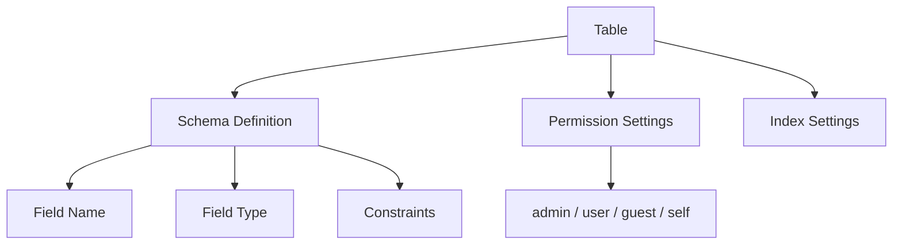
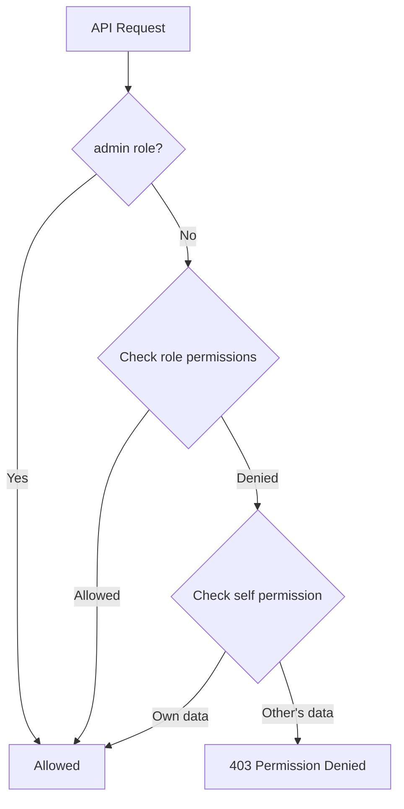

# Understanding the Data Model


💡 Learn about the schema, permissions, and system fields in the bkend database.


## Overview

The bkend database is based on **dynamic tables**. Create tables using the console or MCP tools, then perform data CRUD via the REST API. Each table is subject to schema validation and role-based permissions.

***

## Table Structure



### Schema

A table schema defines the type and constraints for each field.


💡 The `bsonType` in the code below is the internal storage format included in API responses. When creating tables, use one of the 7 abstract types: `string`, `number`, `boolean`, `date`, `object`, `array`, `reference`.


```json
{
  "bsonType": "object",
  "required": ["email", "name"],
  "properties": {
    "email": {
      "bsonType": "string",
      "pattern": "^[a-zA-Z0-9._%+-]+@[a-zA-Z0-9.-]+\\.[a-zA-Z]{2,}$"
    },
    "name": {
      "bsonType": "string"
    },
    "age": {
      "bsonType": "int",
      "minimum": 0,
      "maximum": 150
    },
    "tags": {
      "bsonType": "array",
      "items": { "bsonType": "string" }
    }
  }
}
```

### Supported Types

| Type | Description | Example |
|------|-------------|---------|
| `string` | String | `"hello"` |
| `int` | Integer | `42` |
| `double` | Float | `3.14` |
| `bool` | Boolean | `true` |
| `date` | Date | `"2025-01-01T00:00:00Z"` |
| `object` | Nested object | `{ "key": "value" }` |
| `array` | Array | `[1, 2, 3]` |

### Constraints

| Constraint | Applies To | Description |
|------------|-----------|-------------|
| `required` | All | List of required fields |
| `pattern` | `string` | Regex pattern |
| `minimum` / `maximum` | `int`, `double` | Range limits |
| `minLength` / `maxLength` | `string` | Length limits |
| `enum` | `string` | Allowed values |
| `items` | `array` | Array element type |


⚠️ **Field naming rules** — Start with a letter and use only letters, numbers, and underscores. Field names starting with `$` or `.`, or empty strings, can cause issues when querying data.


| Recommended | Not Recommended | Reason |
|-------------|-----------------|--------|
| `userName` | `$userName` | `$` prefix conflicts with internal operators |
| `home_address` | `home.address` | `.` is interpreted as a nested field separator |
| `title` | `""` (empty string) | Cannot be queried or filtered |
| `field1` | `123field` | Starting with a number causes issues in some SDKs |

***

## System Fields

System fields are automatically included in every record. These fields cannot be modified directly.

| Field | Type | Description | Auto-set |
|-------|------|-------------|:--------:|
| `id` | `string` | Unique identifier | ✅ |
| `createdBy` | `string` | Creator User ID | ✅ |
| `createdAt` | `string` | Creation timestamp (ISO 8601) | ✅ |
| `updatedAt` | `string` | Last modified timestamp (ISO 8601) | ✅ |


💡 `createdBy` is automatically set to the requester's User ID. For guest requests, it may be an empty string.


***

## Permission Model

Each table has CRUD permissions configured per role.

### Roles

| Role | Determined By | Description |
|------|--------------|-------------|
| `admin` | Has admin privileges | Full access to all data |
| `user` | Authenticated regular user | Access based on configured permissions |
| `guest` | Unauthenticated request | Access based on configured permissions |
| `self` | Own data | Access only data where `createdBy` matches the user |

### CRUD Permissions

| Permission | Description |
|------------|-------------|
| `create` | Create data |
| `read` | Read a single record |
| `list` | List data |
| `update` | Update data |
| `delete` | Delete data |

### Permission Configuration Example

```json
{
  "admin": {
    "create": true,
    "read": true,
    "list": true,
    "update": true,
    "delete": true
  },
  "user": {
    "create": true,
    "read": true,
    "list": true,
    "update": false,
    "delete": false
  },
  "guest": {
    "read": true,
    "list": true
  },
  "self": {
    "read": true,
    "update": true,
    "delete": true
  }
}
```

### Permission Check Flow




⚠️ When `self` permissions are configured, a `list` request automatically adds a `createdBy` filter so that only the user's own data is returned.


***

## System Tables

Tables whose names start with `_` (underscore) are system tables. Only the `admin` role can access them; regular users are restricted.

***

## Next Steps

- [Create Data](03-insert.md) — Add your first record
- [Table Management](../console/07-table-management.md) — Create tables in the console
- [RLS Policies](../security/05-rls-policies.md) — Fine-grained access control
