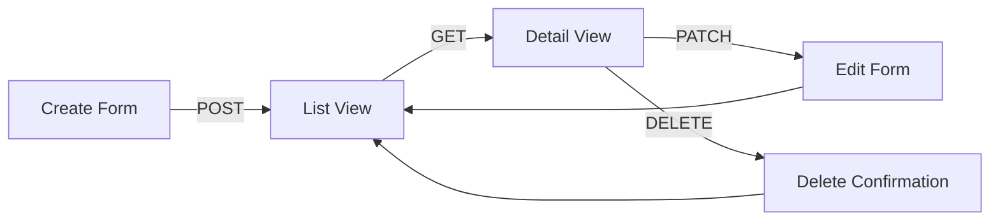

# Data CRUD App Patterns


💡 Learn patterns for implementing data CRUD features like bulletin boards and to-do lists in your app.


## Overview

This document explains how to implement the **Create > List > Update > Delete** flow in your app using the bkend data API. It assumes the `bkendFetch` helper function is already configured.


⚠️ If you have not set up `bkendFetch` yet, see [Integrate bkend in Your App](../getting-started/03-app-integration.md) first.




***

## Full Flow

A CRUD app combines the following four APIs.

| Feature | Method | Endpoint | Description |
|---------|:------:|----------|-------------|
| Create | `POST` | `/v1/data/{tableName}` | Add new data |
| List | `GET` | `/v1/data/{tableName}` | Paginated list |
| Update | `PATCH` | `/v1/data/{tableName}/{id}` | Partial field update |
| Delete | `DELETE` | `/v1/data/{tableName}/{id}` | Delete data |


💡 All endpoints also support the shorthand path. `/v1/data/posts` and `/v1/posts` work identically.


***

## 1. Create Form

Collect user input and send it to `POST /v1/data/{tableName}`. Include the fields directly in the request body.

### HTML Form

```html
<form id="createForm">
  <input type="text" name="title" placeholder="Title" required />
  <textarea name="content" placeholder="Content" required></textarea>
  <select name="category">
    <option value="notice">Notice</option>
    <option value="general">General</option>
  </select>
  <button type="submit">Submit</button>
</form>
```

### JavaScript Handler

```javascript
document.getElementById('createForm').addEventListener('submit', async (e) => {
  e.preventDefault();
  const form = new FormData(e.target);

  try {
    const data = await bkendFetch('/v1/data/posts', {
      method: 'POST',
      body: JSON.stringify({
        title: form.get('title'),
        content: form.get('content'),
        category: form.get('category'),
      }),
    });

    console.log('Created:', data.id);
    // Navigate to list page
    loadList();
  } catch (error) {
    handleError(error);
  }
});
```

### Response (201 Created)

```json
{
  "id": "507f1f77bcf86cd799439011",
  "title": "My First Post",
  "content": "Hello, this is bkend.",
  "category": "notice",
  "createdBy": "user-uuid-1234",
  "createdAt": "2025-01-15T10:30:00.000Z"
}
```

***

## 2. List View + Pagination

Retrieve the list with `GET /v1/data/{tableName}` and control pages with the `page` and `limit` parameters.

### JavaScript Implementation

```javascript
let currentPage = 1;
const PAGE_SIZE = 10;

async function loadList(page = 1) {
  const params = new URLSearchParams({
    page: String(page),
    limit: String(PAGE_SIZE),
    sortBy: 'createdAt',
    sortDirection: 'desc',
  });

  const result = await bkendFetch(`/v1/data/posts?${params}`);

  renderList(result.items);
  renderPagination(result.pagination);
  currentPage = page;
}

function renderList(items) {
  const container = document.getElementById('list');
  container.innerHTML = items
    .map(
      (item) => `
      <div class="item" data-id="${item.id}">
        <h3>${item.title}</h3>
        <p>${item.content}</p>
        <span>${new Date(item.createdAt).toLocaleDateString()}</span>
        <button onclick="openEdit('${item.id}')">Edit</button>
        <button onclick="confirmDelete('${item.id}')">Delete</button>
      </div>
    `
    )
    .join('');
}

function renderPagination(pagination) {
  const { page, totalPages, hasNext, hasPrev } = pagination;
  const container = document.getElementById('pagination');

  container.innerHTML = `
    <button onclick="loadList(${page - 1})" ${!hasPrev ? 'disabled' : ''}>Previous</button>
    <span>${page} / ${totalPages} (${pagination.total} total)</span>
    <button onclick="loadList(${page + 1})" ${!hasNext ? 'disabled' : ''}>Next</button>
  `;
}
```

### Response Structure

```json
{
  "items": [
    {
      "id": "507f1f77bcf86cd799439011",
      "title": "My First Post",
      "content": "Hello, this is bkend.",
      "category": "notice",
      "createdAt": "2025-01-15T10:30:00.000Z"
    }
  ],
  "pagination": {
    "total": 42,
    "page": 1,
    "limit": 10,
    "totalPages": 5,
    "hasNext": true,
    "hasPrev": false
  }
}
```

### Adding Search

Add the `search` parameter to the list query to implement keyword search.

```javascript
async function searchPosts(keyword) {
  const params = new URLSearchParams({
    page: '1',
    limit: String(PAGE_SIZE),
    search: keyword,
  });

  const result = await bkendFetch(`/v1/data/posts?${params}`);
  renderList(result.items);
  renderPagination(result.pagination);
}
```

***

## 3. Edit Form

Retrieve existing data with `GET /v1/data/{tableName}/{id}`, then send only the changed fields with `PATCH`.

### JavaScript Implementation

```javascript
async function openEdit(postId) {
  // 1. Retrieve existing data
  const post = await bkendFetch(`/v1/data/posts/${postId}`);

  // 2. Populate the form with existing values
  document.getElementById('editTitle').value = post.title;
  document.getElementById('editContent').value = post.content;
  document.getElementById('editCategory').value = post.category;

  // 3. Show the edit form
  document.getElementById('editModal').style.display = 'block';
  document.getElementById('editForm').dataset.postId = postId;
}

document.getElementById('editForm').addEventListener('submit', async (e) => {
  e.preventDefault();
  const postId = e.target.dataset.postId;

  try {
    const updated = await bkendFetch(`/v1/data/posts/${postId}`, {
      method: 'PATCH',
      body: JSON.stringify({
        title: document.getElementById('editTitle').value,
        content: document.getElementById('editContent').value,
        category: document.getElementById('editCategory').value,
      }),
    });

    console.log('Updated:', updated.updatedAt);
    document.getElementById('editModal').style.display = 'none';
    loadList(currentPage);
  } catch (error) {
    handleError(error);
  }
});
```

### Response (200 OK)

```json
{
  "id": "507f1f77bcf86cd799439011",
  "title": "Updated Title",
  "content": "Updated content.",
  "category": "general",
  "createdAt": "2025-01-15T10:30:00.000Z",
  "updatedAt": "2025-01-15T14:20:00.000Z"
}
```


⚠️ System fields (`id`, `createdBy`, `createdAt`) cannot be modified. `updatedAt` is automatically refreshed.


***

## 4. Delete Confirmation

Prompt the user for confirmation, then call `DELETE /v1/data/{tableName}/{id}`.

### JavaScript Implementation

```javascript
async function confirmDelete(postId) {
  if (!confirm('Are you sure you want to delete? Deleted data cannot be recovered.')) {
    return;
  }

  try {
    await bkendFetch(`/v1/data/posts/${postId}`, {
      method: 'DELETE',
    });

    console.log('Deleted');
    loadList(currentPage);
  } catch (error) {
    handleError(error);
  }
}
```


🚨 **Warning** — Deleted data cannot be recovered. Always prompt the user for confirmation before deleting.


***

## Role-Based Error Handling

CRUD operations may be restricted based on user roles. Handle `403` errors appropriately.

```javascript
function handleError(error) {
  if (error.status === 403) {
    alert('You do not have permission to perform this action.');
    return;
  }

  if (error.status === 404) {
    alert('Data not found.');
    loadList(currentPage);
    return;
  }

  if (error.status === 400) {
    alert('Please check your input values.');
    return;
  }

  if (error.status === 409) {
    alert('A duplicate value exists.');
    return;
  }

  alert('An error occurred. Please try again.');
  console.error(error);
}
```

### Error Code Summary

| Error Code | HTTP | When It Occurs |
|------------|:----:|----------------|
| `data/table-not-found` | 404 | Table does not exist |
| `data/not-found` | 404 | Data not found |
| `data/validation-error` | 400 | Schema validation failed (missing required fields, type mismatch, etc.) |
| `data/duplicate-value` | 409 | Unique constraint violation |
| `data/permission-denied` | 403 | No permission for the operation |
| `data/invalid-header` | 400 | Missing required header |

### CRUD Permissions by Role

| Role | Create | List | Update | Delete |
|------|:------:|:----:|:------:|:------:|
| `admin` | ✅ | ✅ | ✅ | ✅ |
| `user` | Table settings | Table settings | Table settings | Table settings |
| `guest` | Table settings | Table settings | Table settings | Table settings |
| `self` | - | Own data only | Own data only | Own data only |


💡 Permissions per role depend on the table's `permissions` settings. For details, see [Data Model](02-data-model.md).


***

## Full Example

Below is the complete code for a simple bulletin board app combining all the patterns above.

```html
<!DOCTYPE html>
<html lang="en">
<head>
  <meta charset="UTF-8" />
  <title>bkend Bulletin Board</title>
</head>
<body>
  <!-- List -->
  <div id="list"></div>
  <div id="pagination"></div>

  <!-- Create Form -->
  <form id="createForm">
    <input type="text" name="title" placeholder="Title" required />
    <textarea name="content" placeholder="Content" required></textarea>
    <button type="submit">Submit</button>
  </form>

  <!-- Edit Modal -->
  <div id="editModal" style="display:none">
    <form id="editForm">
      <input type="text" id="editTitle" required />
      <textarea id="editContent" required></textarea>
      <select id="editCategory">
        <option value="notice">Notice</option>
        <option value="general">General</option>
      </select>
      <button type="submit">Save</button>
      <button type="button" onclick="document.getElementById('editModal').style.display='none'">
        Cancel
      </button>
    </form>
  </div>

  <script type="module">
    import { bkendFetch } from './bkend.js';

    // Make bkendFetch globally available
    window.bkendFetch = bkendFetch;

    const PAGE_SIZE = 10;
    let currentPage = 1;

    // List
    window.loadList = async function (page = 1) {
      const params = new URLSearchParams({
        page: String(page),
        limit: String(PAGE_SIZE),
        sortBy: 'createdAt',
        sortDirection: 'desc',
      });
      const result = await bkendFetch(`/v1/data/posts?${params}`);
      renderList(result.items);
      renderPagination(result.pagination);
      currentPage = page;
    };

    function renderList(items) {
      document.getElementById('list').innerHTML = items
        .map(
          (item) => `
          <div>
            <h3>${item.title}</h3>
            <p>${item.content}</p>
            <button onclick="openEdit('${item.id}')">Edit</button>
            <button onclick="confirmDelete('${item.id}')">Delete</button>
          </div>`
        )
        .join('');
    }

    function renderPagination(p) {
      document.getElementById('pagination').innerHTML = `
        <button onclick="loadList(${p.page - 1})" ${!p.hasPrev ? 'disabled' : ''}>Previous</button>
        <span>${p.page} / ${p.totalPages}</span>
        <button onclick="loadList(${p.page + 1})" ${!p.hasNext ? 'disabled' : ''}>Next</button>
      `;
    }

    // Create
    document.getElementById('createForm').addEventListener('submit', async (e) => {
      e.preventDefault();
      const form = new FormData(e.target);
      await bkendFetch('/v1/data/posts', {
        method: 'POST',
        body: JSON.stringify({
          title: form.get('title'),
          content: form.get('content'),
        }),
      });
      e.target.reset();
      loadList();
    });

    // Edit
    window.openEdit = async function (postId) {
      const post = await bkendFetch(`/v1/data/posts/${postId}`);
      document.getElementById('editTitle').value = post.title;
      document.getElementById('editContent').value = post.content;
      document.getElementById('editForm').dataset.postId = postId;
      document.getElementById('editModal').style.display = 'block';
    };

    document.getElementById('editForm').addEventListener('submit', async (e) => {
      e.preventDefault();
      const postId = e.target.dataset.postId;
      await bkendFetch(`/v1/data/posts/${postId}`, {
        method: 'PATCH',
        body: JSON.stringify({
          title: document.getElementById('editTitle').value,
          content: document.getElementById('editContent').value,
        }),
      });
      document.getElementById('editModal').style.display = 'none';
      loadList(currentPage);
    });

    // Delete
    window.confirmDelete = async function (postId) {
      if (!confirm('Delete this item?')) return;
      await bkendFetch(`/v1/data/posts/${postId}`, { method: 'DELETE' });
      loadList(currentPage);
    };

    // Initial load
    loadList();
  </script>
</body>
</html>
```

***


💡 **Real-world examples**: To see how CRUD patterns are used in real projects, check out the [Cookbooks](../../cookbooks/README.md).


## Next Steps

- [Filtering](08-filtering.md) — Advanced search with AND/OR filters
- [Sorting & Pagination](09-sorting-pagination.md) — Add sort options
- [Table Spec](10-table-spec.md) — Understand table constraints
- [API Reference](11-api-reference.md) — Full data API listing
- Example Projects — See CRUD implementation code in [blog-web](../../examples/blog-web/) | [recipe-web](../../examples/recipe-web/) | [shopping-mall-web](../../examples/shopping-mall-web/)
