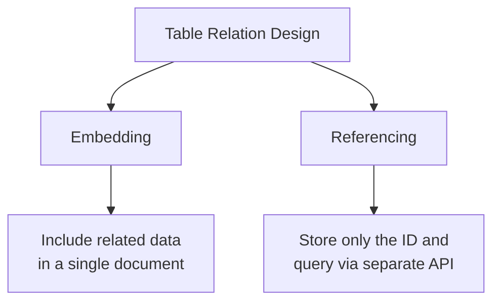
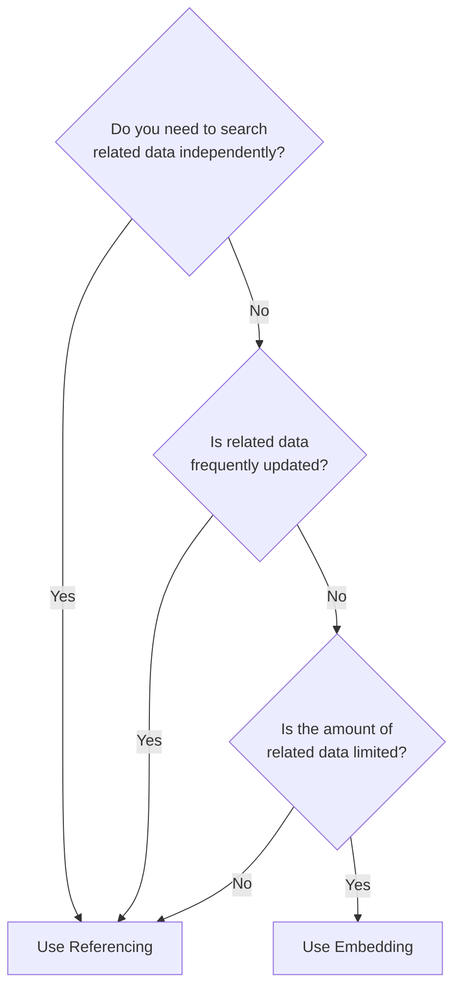
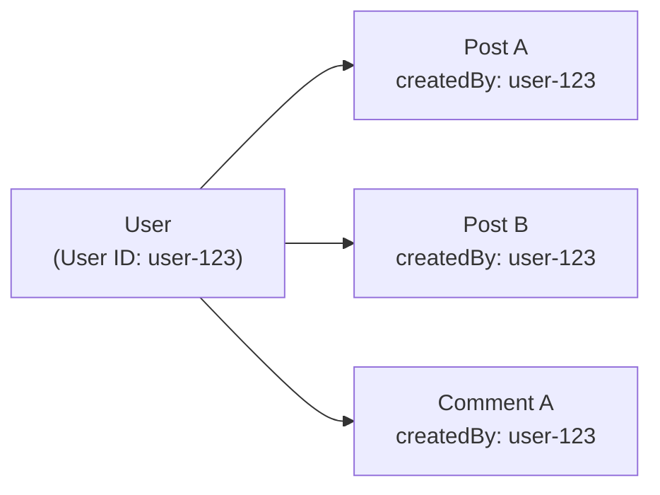

# Table Relations


Learn how to design relations between tables and efficiently query related data in bkend.


## Overview

The bkend database is a **document-based NoSQL** system. Since it does not natively support `JOIN` like relational databases (RDBMS), you need separate design patterns to express relations between tables.

This document covers two core patterns -- **Embedding** and **Referencing** -- and provides guidance on choosing the right approach for each scenario.



***

## Embedding vs Referencing

Compare the two patterns for expressing relations in bkend.

### Embedding

Include related data within a single document as **nested objects** or **arrays**.

```json
{
  "id": "post-001",
  "title": "Getting Started with bkend",
  "content": "Hello...",
  "author": {
    "name": "Jane Dev",
    "avatar": "https://example.com/avatar.jpg"
  },
  "comments": [
    {
      "text": "Great article!",
      "userName": "Bob Design",
      "createdAt": "2025-01-15T10:00:00Z"
    },
    {
      "text": "Thanks!",
      "userName": "Alice PM",
      "createdAt": "2025-01-15T11:00:00Z"
    }
  ]
}
```

**Advantages:**
- Retrieve all related data in a single API call
- Fast responses with minimal network requests

**Disadvantages:**
- Document size grows as nested data increases
- Difficult to search nested data independently
- Same data may be duplicated across multiple documents

### Referencing

Store only the **ID** of related data and retrieve it via a separate API call when needed.

```json
{
  "id": "post-001",
  "title": "Getting Started with bkend",
  "content": "Hello...",
  "authorId": "user-uuid-1234",
  "categoryId": "cat-uuid-5678"
}
```

**Advantages:**
- No data duplication (normalized)
- Each record can be managed and searched independently
- Document size remains consistent

**Disadvantages:**
- Additional API calls required to retrieve related data
- Data assembly logic needed on the client side

***

## Pattern Selection Guide



| Criteria | Embedding | Referencing |
|----------|:---------:|:-----------:|
| Related data size | Small (fixed) | Large (growing) |
| Independent search needed | No | Yes |
| Data change frequency | Low | High |
| Read performance | Fast (1 call) | Moderate (N+1 calls) |
| Data consistency | Duplication risk | Consistent |

### Practical Examples

| Scenario | Recommended Pattern | Reason |
|----------|:------------------:|--------|
| Post tags | Embedding | Tags are small and always fetched with the post |
| Post comments | Referencing | Comments grow continuously and need independent management |
| Order shipping address | Embedding | Preserves the address snapshot at the time of order |
| Product category | Referencing | Category changes should be reflected across all products |
| User profile picture URL | Embedding | Single value, always fetched together |
| User order list | Referencing | Orders keep growing and need independent search |

***

## Implementing the Reference Pattern

The most important aspect of the reference pattern is **client-side join**. You combine related data through multiple API calls.

### Table Design

Here is an example implementing a post-comment relationship with two tables.

**posts table:**

| Field | Type | Description |
|-------|------|-------------|
| `title` | `string` | Post title |
| `content` | `string` | Post content |
| `authorName` | `string` | Author name |
| `createdBy` | `string` | (System) Author User ID |

**comments table:**

| Field | Type | Description |
|-------|------|-------------|
| `postId` | `string` | Referenced post ID |
| `text` | `string` | Comment content |
| `authorName` | `string` | Author name |
| `createdBy` | `string` | (System) Author User ID |

### Client-Side Join

Code to retrieve a post together with its comments.



```javascript
// 1. Retrieve the post
const postRes = await fetch(
  'https://api-client.bkend.ai/v1/data/posts/post-001',
  {
    headers: {
      'Authorization': `Bearer ${accessToken}`,
      'X-Project-Id': '{project_id}',
      'X-Environment': 'dev',
    },
  }
);
const post = await postRes.json();

// 2. Retrieve comments for the post (filter by reference ID)
const andFilters = JSON.stringify({ postId: post.id });
const commentRes = await fetch(
  `https://api-client.bkend.ai/v1/data/comments?andFilters=${encodeURIComponent(andFilters)}&sortBy=createdAt&sortDirection=asc`,
  {
    headers: {
      'Authorization': `Bearer ${accessToken}`,
      'X-Project-Id': '{project_id}',
      'X-Environment': 'dev',
    },
  }
);
const { items: comments } = await commentRes.json();

// 3. Combine on the client
const postWithComments = {
  ...post,
  comments,
};
```


```javascript
import { bkendFetch } from './bkend.js';

// Function to fetch a post with its comments
async function getPostWithComments(postId) {
  // 1. Retrieve the post
  const post = await bkendFetch(`/v1/data/posts/${postId}`);

  // 2. Retrieve comments
  const andFilters = JSON.stringify({ postId });
  const { items: comments } = await bkendFetch(
    `/v1/data/comments?andFilters=${encodeURIComponent(andFilters)}&sortBy=createdAt&sortDirection=asc`
  );

  return { ...post, comments };
}
```




The reference pattern requires multiple API calls. Where performance matters, use parallel calls (`Promise.all`) whenever possible.


### Parallel Query Optimization

Retrieve related data in parallel to reduce response time.

```javascript
// Fetch post list + comment count for each post in parallel
async function getPostListWithCommentCounts() {
  // 1. Retrieve post list
  const { items: posts } = await bkendFetch(
    '/v1/data/posts?page=1&limit=20&sortBy=createdAt&sortDirection=desc'
  );

  // 2. Retrieve comments for each post in parallel
  const commentPromises = posts.map(post => {
    const andFilters = JSON.stringify({ postId: post.id });
    return bkendFetch(
      `/v1/data/comments?andFilters=${encodeURIComponent(andFilters)}&limit=1`
    );
  });

  const commentResults = await Promise.all(commentPromises);

  // 3. Add comment count to each post
  return posts.map((post, i) => ({
    ...post,
    commentCount: commentResults[i].pagination.total,
  }));
}
```


When you only need the comment count, query with `limit=1` to get the total from `pagination.total`. This minimizes the actual comment data transferred and reduces network cost.


***

## Implementing the Embedding Pattern

The embedding pattern uses `object` or `array` types in the schema.

### Schema Design

```json
{
  "bsonType": "object",
  "required": ["title", "content"],
  "properties": {
    "title": { "bsonType": "string" },
    "content": { "bsonType": "string" },
    "author": {
      "bsonType": "object",
      "properties": {
        "name": { "bsonType": "string" },
        "avatar": { "bsonType": "string" }
      }
    },
    "tags": {
      "bsonType": "array",
      "items": { "bsonType": "string" }
    }
  }
}
```

### Creating Data



```bash
curl -X POST "https://api-client.bkend.ai/v1/data/posts" \
  -H "Authorization: Bearer {accessToken}" \
  -H "X-Project-Id: {project_id}" \
  -H "X-Environment: dev" \
  -H "Content-Type: application/json" \
  -d '{
    "title": "Getting Started with bkend",
    "content": "Hello...",
    "author": {
      "name": "Jane Dev",
      "avatar": "https://example.com/avatar.jpg"
    },
    "tags": ["tutorial", "beginner"]
  }'
```


```javascript
const response = await fetch('https://api-client.bkend.ai/v1/data/posts', {
  method: 'POST',
  headers: {
    'Authorization': `Bearer ${accessToken}`,
    'X-Project-Id': '{project_id}',
    'X-Environment': 'dev',
    'Content-Type': 'application/json',
  },
  body: JSON.stringify({
    title: 'Getting Started with bkend',
    content: 'Hello...',
    author: {
      name: 'Jane Dev',
      avatar: 'https://example.com/avatar.jpg',
    },
    tags: ['tutorial', 'beginner'],
  }),
});

const post = await response.json();
```



***

## User-Data Relations with createdBy

bkend automatically sets the `createdBy` system field on every record. This lets you implement **ownership relations between users and data** without a separate reference field.



### Querying Your Own Data

Filter by `createdBy` to retrieve only a specific user's data.

```javascript
// Retrieve only the current user's posts
const andFilters = JSON.stringify({ createdBy: currentUserId });

const response = await fetch(
  `https://api-client.bkend.ai/v1/data/posts?andFilters=${encodeURIComponent(andFilters)}`,
  {
    headers: {
      'Authorization': `Bearer ${accessToken}`,
      'X-Project-Id': '{project_id}',
      'X-Environment': 'dev',
    },
  }
);

const { items: myPosts } = await response.json();
```

### Using self Permissions

When you configure `self` in the table permissions, the user's own data is **automatically returned without any explicit filter**.

| Permission Setting | Behavior |
|-------------------|----------|
| `self.list = true` | List queries automatically return only data where `createdBy` matches the user |
| `self.read = true` | Single record queries only allow access to own data |
| `self.update = true` | Only own data can be updated |
| `self.delete = true` | Only own data can be deleted |


`self` permissions are enforced server-side. Even if a client bypasses the filter, they cannot access another user's data, ensuring security.


***

## Relation Design Best Practices

### 1. Embed data that is read frequently

Embed data that is always fetched together to reduce the number of API calls.

```json
{
  "id": "order-001",
  "items": [
    { "productName": "Laptop", "price": 1200000, "quantity": 1 },
    { "productName": "Mouse", "price": 35000, "quantity": 2 }
  ],
  "shippingAddress": {
    "city": "Seoul",
    "detail": "123 Gangnam-gu, Yeoksam-dong"
  }
}
```

### 2. Reference data that changes frequently

Separate data that needs to be updated independently into its own table.

```
products table: { id, name, price, stock }
reviews table:  { id, productId, rating, text, createdBy }
```

### 3. Watch out for the N+1 problem

Be aware of the **N+1 problem** in the reference pattern, where an additional API call is made for each item in a list.


Fetching a list of 20 items + querying related data for each = 21 total API calls. Use `Promise.all` for parallel processing or embed frequently needed fields to reduce call count.


### 4. Hybrid approach

You can combine embedding and referencing. Embed frequently used information and separate detailed data via references.

```json
{
  "id": "post-001",
  "title": "Getting Started with bkend",
  "authorId": "user-uuid-1234",
  "authorName": "Jane Dev",
  "authorAvatar": "https://example.com/avatar.jpg",
  "commentCount": 15
}
```

In this example, `authorId` is a reference, but `authorName` and `authorAvatar` are embedded for quick display in lists. Fetch the full profile details via `authorId` only when needed.

***

## Next Steps

- [Understanding the Data Model](02-data-model.md) — Schema, permissions, system fields
- [Filtering](08-filtering.md) — Query referenced data with AND/OR filters
- [Data CRUD App Patterns](12-crud-app-patterns.md) — Implement CRUD in your app
- [Performance Optimization](../guides/04-performance.md) — Optimize API calls
