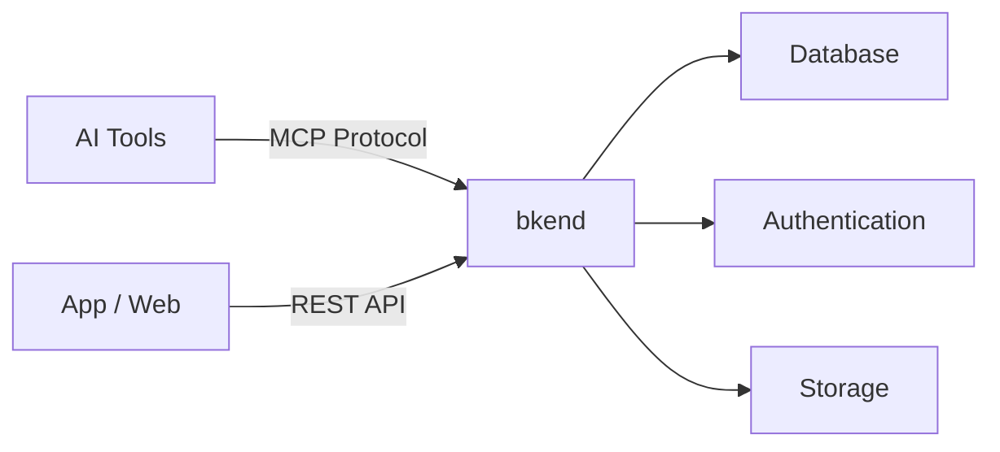
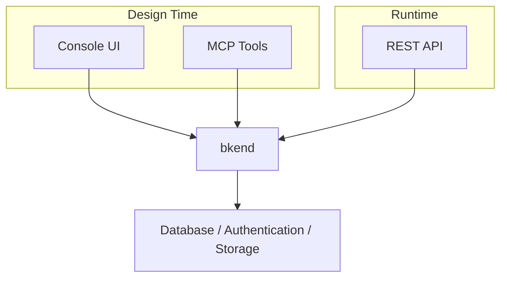

# What is bkend?


bkend is a Backend-as-a-Service (BaaS) platform that lets you build your backend with AI tools and connect it to your app via REST API.


## Overview

bkend is a backend platform that lets you manage databases, authentication, and storage without writing server code. You can build your backend using natural language through AI tools like Claude Code and Cursor, then connect it to your app via REST API.

***

## Why bkend?

Traditional backend development requires writing server code, configuring databases, implementing authentication, and setting up deployment pipelines. bkend replaces all of these with natural language commands in AI tools or REST API calls.

| Traditional Approach | bkend |
|---------------------|-------|
| Write server code | Natural language commands via AI tools |
| Configure databases manually | Manage via console or MCP tools |
| Integrate auth libraries | Built-in authentication system |
| Build file servers | Built-in storage |
| Set up deployment pipelines | Automatic provisioning |

***

## Core Features

### Database

Create dynamic tables via the console or MCP tools, and access data through the REST API (`/v1/data/{tableName}`) to perform CRUD (Create, Read, Update, Delete) operations. Supports 7 column types, constraints, indexes, and relationship configuration.


A **dynamic table** is a table where defining a schema via the console or MCP tools automatically generates a REST API endpoint (`/v1/data/{tableName}`). You can create tables and access data via API without writing any server code.


### Authentication

Provides email signup, social login (Google, GitHub), magic link, and MFA (Multi-Factor Authentication). Handles JWT (JSON Web Token)-based session management and automatic token refresh.

### Storage

Provides presigned URL-based file upload and download. Supports multipart upload for large files.

### AI Tool Integration

Supports the [MCP (Model Context Protocol)](https://spec.modelcontextprotocol.io/2025-03-26) standard. You can use all bkend features with natural language in Claude Code, Cursor, and other AI tools.

### Console

Visually manage projects, environments, team members, and data from the web-based management console.

***

## How to Use

You can interact with bkend in three ways.

| Method | Audience | Description |
|--------|----------|-------------|
| **MCP Tools** | AI tool users | Build your backend with natural language in Claude Code and Cursor |
| **REST API** | App developers | Query/modify data, authenticate users, and manage files via HTTP requests |
| **Console** | Everyone | Manage visually through the web UI |


In bkend, a **Tenant** is the developer who builds the backend (uses the console/MCP), while a **User** is the end user of the app (interacts via REST API). See [Understanding Tenants and Users](05-tenant-vs-user.md) for details.


***


If you are new to bkend, head to [Quick Start](02-quickstart.md) to create your first project in 10 minutes. For framework-specific integration, see [Framework Quick Start](07-quickstart-framework.md).


## Next Steps

- [Quick Start](02-quickstart.md) — Create your first project in 10 minutes
- [Integrating bkend in Your App](03-app-integration.md) — Connect bkend to your app via REST API
- [Core Concepts](04-core-concepts.md) — Understand the Organization, Project, and Environment structure
- [MCP Tools Overview](../mcp/01-overview.md) — Explore MCP tools available in AI tools
- [Hands-on Project Cookbook](../../cookbooks/README.md) — Build real apps like blogs and social networks step by step
