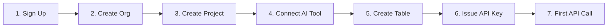

# Quick Start


Create a project on bkend and fetch your first data from your app in just 10 minutes.


## Overview

This guide walks you through the entire process from signing up to making your first REST API call.

***

## Full Process



***

## Prerequisites

- A web browser
- An AI tool installed (Claude Code, Cursor, etc.) — optional if you only plan to use the REST API without MCP

***

## Step 1: Sign Up

1. Go to the [bkend console](https://console.bkend.ai).
2. Log in with your **Google** or **GitHub** account. Magic link login is also supported.


After logging in, you will be automatically redirected to the console home screen.


***

## Step 2: Create an Organization

1. Click the **Create Organization** button in the console.
2. Enter an organization name (e.g., `My Startup`).
3. Click **Create**.

***

## Step 3: Create a Project

1. Click the **Projects** menu on the organization page.
2. Click the **Create Project** button.
3. Fill in the following information.

| Field | Example | Description |
|-------|---------|-------------|
| **Project Name** | My Blog | Display name for the project |
| **Project Slug** | my-blog | URL identifier (can be auto-generated) |
| **Region** | Seoul (ap-northeast-2) | Data storage region |
| **Cloud** | AWS | Cloud provider |

4. Click **Create**.


When you create a project, a `dev` environment is automatically provisioned. Wait about 30 seconds until it reaches **Active** status.


***

## Step 4: Connect an AI Tool



Add the following to your `~/.claude.json` file.

```json
{
  "mcpServers": {
    "bkend": {
      "type": "http",
      "url": "https://api.bkend.ai/mcp"
    }
  }
}
```

Restart Claude Code and the OAuth 2.1 authentication flow will start automatically.


Add an MCP server in your Cursor settings.

```json
{
  "mcpServers": {
    "bkend": {
      "type": "http",
      "url": "https://api.bkend.ai/mcp"
    }
  }
}
```



***

## Step 5: Create Your First Table

Ask the AI tool something like this:

```text
"Create a posts table.
- title: string (required)
- content: string (required)
- author_name: string
- published: boolean (default: false)"
```

Verify the created table in the **Database** menu of the console.


The table has been created, but you need an **API Key** to insert data from your app. Continue to steps 6 and 7.


***

## Step 6: Issue an API Key

You need an API Key to call the REST API from your app.

1. Click **Access Tokens** in the sidebar.
2. Click the **Create New Token** button.
3. Fill in the following information.

| Field | Value |
|-------|-------|
| **Token Name** | my-app-key |
| **Token Type** | BEARER_TOKEN |
| **Permission Scope** | Table Data (read, create, update, delete) |

4. Click **Create** and the token will be displayed. Copy it and store it securely.


This token is a **Public Key**. It is used in clients (browsers, apps) and has limited permissions. For the difference between Public Key and Secret Key, see [Public Key vs Secret Key](../security/03-public-vs-secret.md).



**Warning** — The token is only shown once when created. If lost, you must regenerate it.


***

## Step 7: Create Your First Data

Use the issued API Key to create data from your app. Check the Project ID in the console under **Project Settings**.



```bash
curl -X POST https://api-client.bkend.ai/v1/data/posts \
  -H "Content-Type: application/json" \
  -H "Authorization: Bearer {accessToken}" \
  -H "X-Project-Id: {project_id}" \
  -H "X-Environment: dev" \
  -d '{
    "title": "Hello bkend!",
    "content": "This is my first post.",
    "published": true
  }'
```


```javascript
const response = await fetch('https://api-client.bkend.ai/v1/data/posts', {
  method: 'POST',
  headers: {
    'Content-Type': 'application/json',
    'Authorization': 'Bearer {accessToken}',
    'X-Project-Id': '{project_id}',
    'X-Environment': 'dev',
  },
  body: JSON.stringify({
    title: 'Hello bkend!',
    content: 'This is my first post.',
    published: true,
  }),
});

const data = await response.json();
console.log(data.id); // ID of the created data
```



### Response Example

```json
{
  "id": "abc123",
  "title": "Hello bkend!",
  "content": "This is my first post.",
  "published": true,
  "createdAt": "2026-02-12T00:00:00.000Z",
  "updatedAt": "2026-02-12T00:00:00.000Z"
}
```

Verify the created data in the console under **Database** > **posts** table.


Your first project is ready, and you have created data via the REST API!


***

## Bonus: Add Authentication

Now that you can create data, add user authentication to track who created each record.

### Step 8: Call the Signup API

```javascript
const response = await fetch('https://api-client.bkend.ai/v1/auth/email/signup', {
  method: 'POST',
  headers: {
    'Content-Type': 'application/json',
    'X-Project-Id': '{project_id}',
    'X-Environment': 'dev',
  },
  body: JSON.stringify({
    method: 'password',
    email: 'user@example.com',
    password: 'MyP@ssw0rd!',
    name: 'John Doe',
  }),
});

const { accessToken, refreshToken } = await response.json();
// Store the tokens securely
```

### Step 9: Create Authenticated Data

When you create data with the issued `accessToken`, the `createdBy` field is automatically populated with the user ID.

```javascript
const post = await fetch('https://api-client.bkend.ai/v1/data/posts', {
  method: 'POST',
  headers: {
    'Content-Type': 'application/json',
    'Authorization': `Bearer ${accessToken}`,
    'X-Project-Id': '{project_id}',
    'X-Environment': 'dev',
  },
  body: JSON.stringify({
    title: 'Authenticated Post',
    content: 'This post was created by a logged-in user.',
    published: true,
  }),
});

const data = await post.json();
console.log(data.createdBy); // User ID
```


With authentication in place, you can apply RLS (Row Level Security) policies such as "only the creator can edit or delete their own data." See [Writing RLS Policies](../security/05-rls-policies.md).


***

## Troubleshooting

| Error Code | Cause | Solution |
|-----------|-------|----------|
| `401 Unauthorized` | API Key is missing or incorrect | Check the `Authorization` header |
| `404 Not Found` | Table does not exist | Verify table creation in the console |
| `400 Bad Request` | Required field missing or type mismatch | Check the request body |
| `403 Forbidden` | Environment is not Active | Check environment status in the console |

***

## Next Steps

- [Integrating bkend in Your App](03-app-integration.md) — How to connect bkend to your app
- [Core Concepts](04-core-concepts.md) — Organization, Project, and Environment structure
- [Console Overview](../console/01-overview.md) — Explore the console UI
- [AI Tools Integration Overview](../ai-tools/01-overview.md) — Detailed AI tool setup guide
- [MCP Tools Overview](../mcp/01-overview.md) — MCP tool reference
- [Table Management](../console/07-table-management.md) — Design tables in the console
- [Hands-on Project Cookbook](../../cookbooks/README.md) — Build real apps from blog to shopping mall
