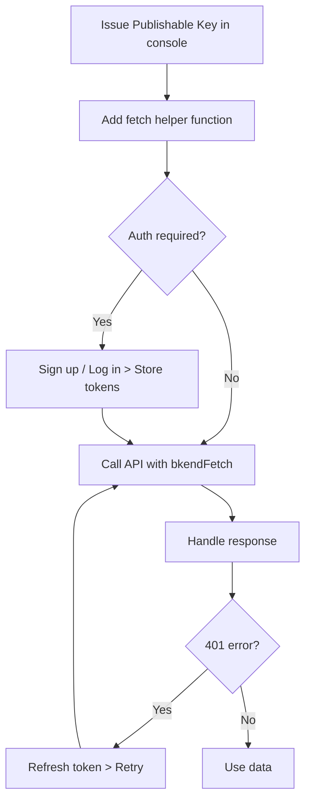

# Integrating bkend in Your App


💡 Connect your bkend backend to your app using the REST API. The fetch helper pattern defined in this document is referenced by other app integration guides.


## Overview

This document covers:

- Essential setup for calling the bkend API from your app
- A fetch helper function with common headers for all requests
- Distinguishing between authenticated and unauthenticated requests

***

## Prerequisites

| Item | Where to Find | Description |
|------|---------------|-------------|
| Publishable Key | Console > **API Keys** | Client key with `pk_` prefix |
| Access Token | Login API response | JWT (for authenticated APIs) |


⚠️ If you do not have a Publishable Key, refer to [API Key Management](../console/11-api-keys.md) to issue one first.


***

## Required Headers

All REST API requests require the following headers.

| Header | Value | Required | Description |
|--------|-------|:--------:|-------------|
| `Content-Type` | `application/json` | Yes | Request body format |
| `X-API-Key` | `{pk_publishable_key}` | Yes | Publishable Key (issued in the console). Includes project ID and environment |
| `Authorization` | `Bearer {accessToken}` | Conditional | Only for APIs that require authentication |


💡 The `pk_` key includes project ID and environment information, so no additional context headers are needed.


***

## API Base URL

```text
https://api-client.bkend.ai
```

All endpoints are relative to this URL.

***

## Fetch Helper Function

Use this helper function to call the bkend API throughout your app. It automatically includes the required headers with every request.

```javascript
// bkend.js — Add this file to your project

const API_BASE = 'https://api-client.bkend.ai';
const PUBLISHABLE_KEY = '{pk_publishable_key}'; // Issued in the console

/**
 * bkend API call helper
 * @param {string} path - API path (e.g., '/v1/data/posts')
 * @param {object} options - fetch options (method, body, headers, etc.)
 * @returns {Promise<any>} Response data
 */
export async function bkendFetch(path, options = {}) {
  const accessToken = localStorage.getItem('accessToken');

  const response = await fetch(`${API_BASE}${path}`, {
    ...options,
    headers: {
      'Content-Type': 'application/json',
      'X-API-Key': PUBLISHABLE_KEY,
      ...(accessToken && { 'Authorization': `Bearer ${accessToken}` }),
      ...options.headers,
    },
    ...(options.body && typeof options.body === 'object' && !options.rawBody
      ? { body: JSON.stringify(options.body) }
      : {}),
  });

  if (response.status === 401) {
    // Attempt token refresh on expiry
    const refreshed = await refreshAccessToken();
    if (refreshed) {
      return bkendFetch(path, options); // Retry
    }
    throw new Error('Session expired. Please log in again.');
  }

  if (!response.ok) {
    const error = await response.json().catch(() => ({}));
    throw new Error(error.message || `Request failed (${response.status})`);
  }

  // 204 No Content
  if (response.status === 204) return null;

  return response.json();
}

/**
 * Refresh the Access Token
 */
async function refreshAccessToken() {
  const refreshToken = localStorage.getItem('refreshToken');
  if (!refreshToken) return false;

  try {
    const response = await fetch(`${API_BASE}/v1/auth/refresh`, {
      method: 'POST',
      headers: {
        'Content-Type': 'application/json',
        'X-API-Key': PUBLISHABLE_KEY,
      },
      body: JSON.stringify({ refreshToken }),
    });

    if (!response.ok) return false;

    const data = await response.json();
    localStorage.setItem('accessToken', data.accessToken);
    localStorage.setItem('refreshToken', data.refreshToken);
    return true;
  } catch {
    return false;
  }
}
```

***

## Usage Examples

### Unauthenticated Request (Signup)

```javascript
import { bkendFetch } from './bkend.js';

// Signup — No Authorization header needed
const result = await bkendFetch('/v1/auth/email/signup', {
  method: 'POST',
  body: {
    method: 'password',
    email: 'user@example.com',
    password: 'MyP@ssw0rd!',
    name: 'John Doe',
  },
});

// Store tokens
localStorage.setItem('accessToken', result.accessToken);
localStorage.setItem('refreshToken', result.refreshToken);
```

### Authenticated Request (Create Data)

```javascript
import { bkendFetch } from './bkend.js';

// Create data — accessToken from localStorage is included automatically
const post = await bkendFetch('/v1/data/posts', {
  method: 'POST',
  body: {
    title: 'My First Post',
    content: 'Hello, world!',
    published: true,
  },
});

console.log(post.id); // ID of the created data
```

### List Data

```javascript
import { bkendFetch } from './bkend.js';

// List query — GET request
const result = await bkendFetch('/v1/data/posts?page=1&limit=10');
console.log(result.items);       // Array of posts
console.log(result.pagination);  // { page, limit, total, totalPages }
```

***

## Testing with curl

Before integrating with your app, verify that the API works correctly using curl.

```bash
# Test data creation
curl -X POST https://api-client.bkend.ai/v1/data/posts \
  -H "Content-Type: application/json" \
  -H "X-API-Key: {pk_publishable_key}" \
  -H "Authorization: Bearer {accessToken}" \
  -d '{
    "title": "Test Post",
    "content": "Data created via curl."
  }'
```

***

## CORS

The bkend API supports direct calls from browsers. You can call the API using `fetch` from your client app without any additional CORS configuration.

***

## Error Handling

| Status Code | Cause | Action |
|------------|-------|--------|
| `400` | Missing required field or type mismatch | Check the request body |
| `401` | Token expired or missing | `refreshAccessToken()` handles automatic refresh |
| `403` | Permission denied (RLS rejection) | Check permission settings |
| `404` | Resource not found (table/data) | Check path and table name |
| `429` | Rate limit exceeded | Add retry interval |
| `500` | Server error | Retry after a short delay |


💡 The `bkendFetch` helper automatically refreshes the token and retries on 401 errors. If the refresh fails, it throws an error.


***

## Integration Flow Summary



***

## Next Steps

- [Token Storage and Refresh](../authentication/20-token-management.md) — Detailed token management strategies
- [Auth Form Patterns](../authentication/21-auth-form-patterns.md) — Signup and login form implementation
- [Data CRUD App Patterns](../database/12-crud-app-patterns.md) — Managing data in your app
- [File Upload App Patterns](../storage/10-upload-app-patterns.md) — File upload implementation
- [Error Handling Guide](../guides/11-error-handling.md) — Error response handling strategies
- [Hands-on Project Cookbook](../../cookbooks/README.md) — Apply integration patterns in real apps
