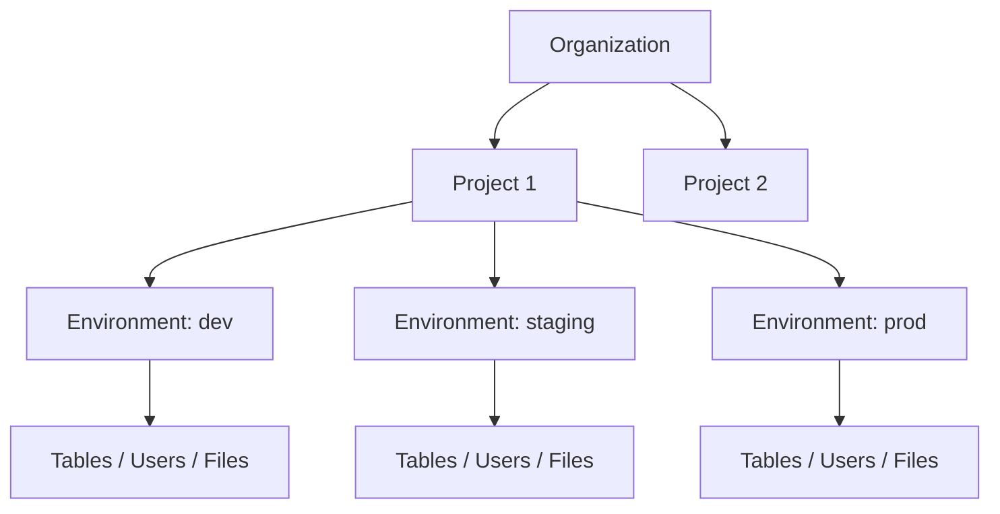
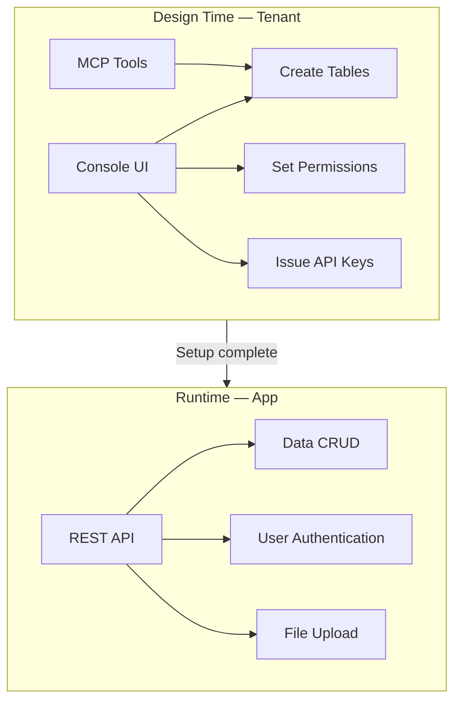

# Core Concepts


This page explains the resource hierarchy and key terminology of bkend.


## Overview

bkend manages resources in a three-level hierarchy: Organization > Project > Environment. Understanding this structure helps you use the console and API effectively.

***

## Resource Hierarchy

***

## Organization

An Organization is the top-level resource in bkend. It groups teams and projects under a single entity.

| Item | Description |
|------|-------------|
| Projects | Create multiple projects within an Organization |
| Team Members | Assign roles: Owner, Admin, Member, Billing |
| Billing | Manage plans at the Organization level |

***

## Project

A Project corresponds to a single service or app. When creating a project, you choose a region and cloud provider.

| Item | Description |
|------|-------------|
| Region | Data storage location (e.g., Seoul, US East) |
| Cloud | Cloud provider (e.g., AWS) |
| Environments | Create multiple environments within a project |

***

## Environment

An Environment is the unit of data isolation. Create environments like `dev`, `staging`, and `prod` to separate development from production.

| Data | Shared Across Environments | Description |
|------|:--------------------------:|-------------|
| Table schemas | No | Independent schema per environment |
| Table data | No | Independent data per environment |
| Users | No | Independent user pool per environment |
| API Keys | No | Independent keys per environment |
| Files | No | Independent storage per environment |
| Project settings | Yes | Shared across all environments |
| Team members | Yes | Shared at the Organization level |


Data in the `dev` and `prod` environments is completely isolated. Switching environments displays different data.


***

## API Key

An API Key is used for authentication when calling the REST API. Keys are issued independently per environment.

| Type | Usage | Permissions |
|------|-------|-------------|
| **Publishable Key** | Used in clients (browsers, apps) | Limited read/write |
| **Secret Key** | Used on the server | Full read/write |


**Warning** — Never include a Secret Key in client-side code.


***

## Design Tools vs Runtime Tools

Work in bkend falls into **design time** and **runtime**. Different tools are used at each stage.

| Stage | Tools | Actions | Who |
|-------|-------|---------|-----|
| **Design** | Console UI, MCP Tools | Create tables, edit schemas, set permissions, issue API Keys | Tenant (developer) |
| **Runtime** | REST API | Data CRUD, user authentication, file management | App (User) |


Use the console and MCP tools to **design the structure**, and the REST API to **run the app**. Once you have created a table, the next step is to insert data via the REST API.


***

## MCP (Model Context Protocol)

MCP is a standard protocol for communication between AI tools and services. bkend provides an MCP server so you can manage your backend with natural language in AI tools like Claude Code and Cursor.

| Item | Description |
|------|-------------|
| Authentication | OAuth 2.1 + PKCE (Proof Key for Code Exchange) (automatic) |
| Transport | Streamable HTTP |
| Endpoint | `https://api.bkend.ai/mcp` |

***

## Next Steps

- [Understanding Tenant and User](05-tenant-vs-user.md) — Differences between the two user types
- [Integrating bkend in Your App](03-app-integration.md) — Connect bkend to your app via REST API
- [Console Overview](../console/01-overview.md) — Manage resources in the console
- [Understanding API Keys](../security/02-api-keys.md) — Creating and using API Keys
- [MCP Tools Overview](../mcp/01-overview.md) — MCP tools available in AI tools

> **MCP Specification 2025-03-26**
> "The Model Context Protocol (MCP) is an open protocol that standardizes how applications provide context to LLMs."
> — [Model Context Protocol](https://spec.modelcontextprotocol.io/2025-03-26)
