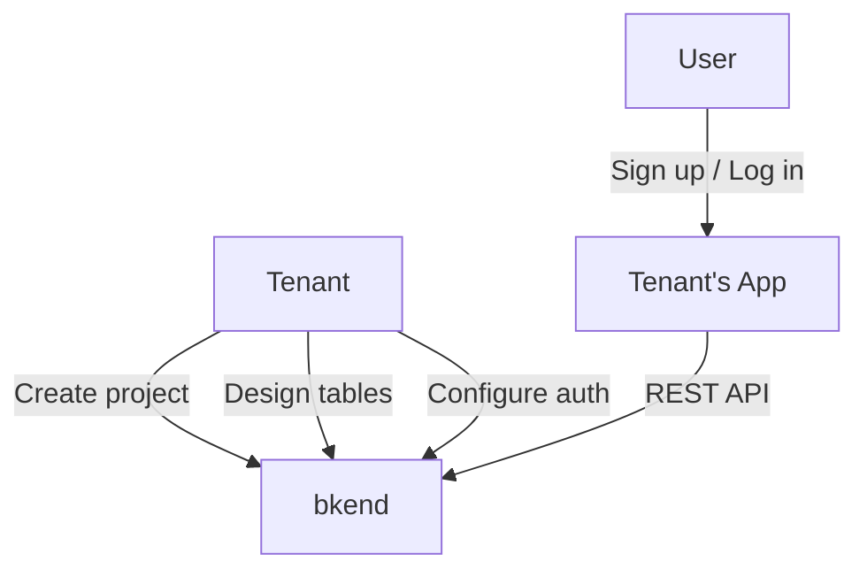
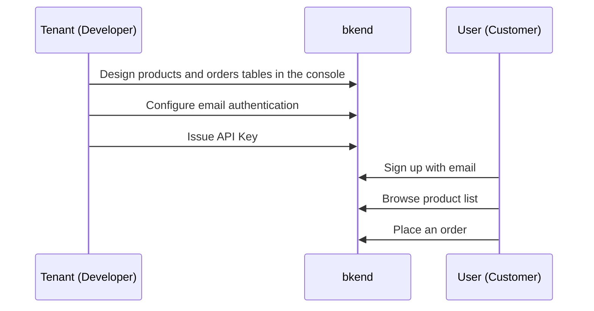

# Understanding Tenant and User


bkend has two user types: Tenant and User.


## Overview

People who use bkend fall into two distinct types. Understanding the difference helps you configure authentication and permissions correctly.

***

## Tenant

A Tenant is the **service provider** who creates and manages projects on bkend. Tenants log in to the bkend console to design databases, configure authentication, and manage API Keys.

| Item | Description |
|------|-------------|
| Login | bkend console (`https://console.bkend.ai`) |
| Authentication | Magic link, Google, GitHub |
| Roles | Owner, Admin, Member, Billing |
| Activities | Project settings, table design, environment management, team management |

***

## User

A User is the **end user** of the service built by a Tenant. Users log in through the authentication methods configured by the Tenant and access the data the Tenant has designed.

| Item | Description |
|------|-------------|
| Login | The app/service built by the Tenant |
| Authentication | Methods configured by the Tenant (email, social, etc.) |
| Activities | Query/create/update data, upload files, manage profile |

***

## Comparison

| Aspect | Tenant | User |
|--------|--------|------|
| **Who** | Service provider (developer) | Service consumer (end customer) |
| **Access tool** | Console, MCP Tools | App built by the Tenant |
| **Auth method** | OAuth 2.1 (console/MCP) | JWT (email/social login) |
| **API usage** | Configure projects via MCP Tools | Manipulate data via REST API |
| **Data scope** | Full project management | Permitted data within an environment |


Tenant credentials (console login, MCP tokens) and User credentials (JWT) are completely separate.


***

## Real-world Example

Suppose you are building an online shopping mall.

- **Tenant**: The shopping mall developer. Designs `products` and `orders` tables on bkend and configures email authentication.
- **User**: The shopping mall customer. Signs up with email, searches for products, and places orders.

***

## Frequently Asked Questions

| Question | Answer |
|----------|--------|
| Are Tenant and User accounts in the same system? | No. They use completely separate authentication systems. |
| Can a User access the console? | No. Users can only use the app built by the Tenant. |
| Can a Tenant have multiple projects? | Yes. You can create multiple projects within an Organization. |
| Is User data isolated per environment? | Yes. The `dev` and `prod` user pools are completely independent. |

***

## Next Steps

- [Next Steps](06-next-steps.md) — Guides for each major feature
- [Authentication Overview](../authentication/01-overview.md) — Set up User authentication
- [Console Overview](../console/01-overview.md) — Use the Tenant console
