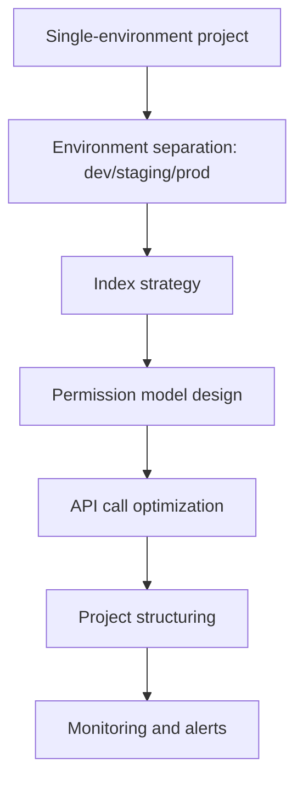
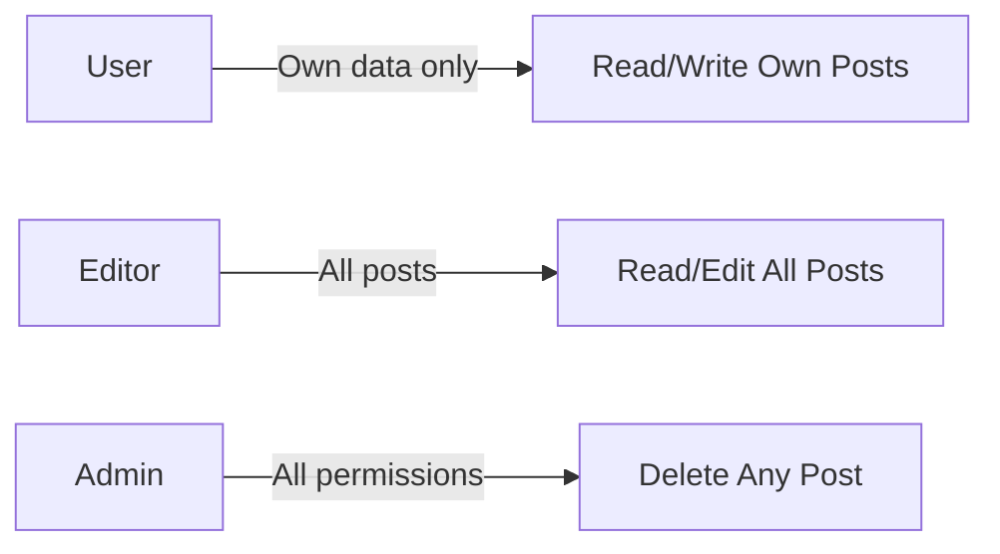

# Scaling Guide


💡 Learn strategies and best practices for scaling your bkend project, including environment separation, index optimization, and permission design.


## Overview

As your project grows, you will encounter the following scaling challenges:

- **Environment separation** — Safely isolate development, staging, and production environments
- **Data growth** — Maintain fast query performance with millions of records
- **User growth** — Ensure stable response times with many concurrent users
- **Complex permissions** — Fine-grained access control by team, role, and organization
- **API call optimization** — Reduce unnecessary requests and leverage caching

This guide walks you through designing your bkend project for scalability, step by step.

***

## Scaling Roadmap



***

## Step 1: Environment Configuration Strategy

### 1.1 Environment Separation Pattern

Use bkend's environment separation feature to isolate development, test, and production data.

| Environment | Purpose | API Key | Database |
|-------------|---------|---------|----------|
| **dev** | Development and experimentation | Issued per developer | Test data |
| **staging** | QA and integration testing | Shared by team | Production replica |
| **prod** | Live service | Strict access control | Real user data |

#### Managing .env Files Per Environment

```bash
# .env.development
BKEND_PUBLISHABLE_KEY={pk_dev_publishable_key}

# .env.staging
BKEND_PUBLISHABLE_KEY={pk_staging_publishable_key}

# .env.production
BKEND_PUBLISHABLE_KEY={pk_prod_publishable_key}
```

#### Environment-Specific Configuration in Client Code

```javascript
const config = {
  publishableKey: process.env.BKEND_PUBLISHABLE_KEY,
  baseURL: 'https://api-client.bkend.ai'
};

// API call helper
async function apiRequest(endpoint, options = {}) {
  const response = await fetch(`${config.baseURL}${endpoint}`, {
    ...options,
    headers: {
      ...options.headers,
      'X-API-Key': config.publishableKey,
    }
  });

  return response.json();
}

// Usage
const posts = await apiRequest('/v1/data/posts');
```

### 1.2 Syncing Data Across Environments

Periodically sync a production data replica to your staging environment.

```javascript
// Production → Staging data copy script
async function syncProdToStaging(tableName) {
  // 1. Fetch production data
  const prodData = await fetch(`https://api-client.bkend.ai/v1/data/${tableName}`, {
    headers: {
      'X-API-Key': process.env.BKEND_SOURCE_PUBLISHABLE_KEY,
    }
  }).then(r => r.json());

  // 2. Delete existing staging data
  await fetch(`https://api-client.bkend.ai/v1/data/${tableName}`, {
    method: 'DELETE',
    headers: {
      'X-API-Key': process.env.BKEND_TARGET_PUBLISHABLE_KEY,
    }
  });

  // 3. Copy production data
  for (const row of prodData) {
    await fetch(`https://api-client.bkend.ai/v1/data/${tableName}`, {
      method: 'POST',
      headers: {
        'Content-Type': 'application/json',
        'X-API-Key': process.env.BKEND_TARGET_PUBLISHABLE_KEY,
      },
      body: JSON.stringify(row)
    });
  }

  console.log(`Synced ${tableName} to staging`);
}

// Run weekly on Sunday at 2 AM (cron)
syncProdToStaging('users');
syncProdToStaging('posts');
```


⚠️ Anonymize tables containing personal information before syncing. Mask emails, phone numbers, and similar data.


***

## Step 2: Project Structuring

### 2.1 Separating Projects by Microservice

Separating projects by service within a single organization provides the following benefits:

- **Independent schemas** — Tables for each service are not mixed
- **Permission isolation** — Separate project access per team
- **Per-environment settings** — Each service can use a different environment strategy

#### Example: E-commerce App Structure

```text
Organization: MyCompany
├── Project: Auth Service
│   ├── dev
│   ├── staging
│   └── prod
│       └── Tables: users, sessions, oauth_tokens
├── Project: Product Service
│   ├── dev
│   ├── staging
│   └── prod
│       └── Tables: products, categories, inventory
├── Project: Order Service
│   ├── dev
│   ├── staging
│   └── prod
│       └── Tables: orders, order_items, payments
└── Project: Notification Service
    ├── dev
    ├── staging
    └── prod
        └── Tables: notifications, templates, schedules
```

### 2.2 Shared Data Strategy

When multiple services need to reference the same data, choose one of the following strategies:

| Strategy | Method | Pros | Cons |
|----------|--------|------|------|
| **Central DB** | All tables in one project | Simple | Increased coupling between services |
| **API Calls** | Service A → Service B API | Maintains independence | Network latency |
| **Data Replication** | Periodic sync | Fast reads | Consistency issues |

#### Example: API Call Approach

```javascript
// Call User Service API from Order Service
async function getUserInfo(userId) {
  const response = await fetch(`https://api-client.bkend.ai/v1/data/users/${userId}`, {
    headers: {
      'X-API-Key': process.env.USER_SERVICE_PUBLISHABLE_KEY,
    }
  });

  return response.json();
}
```

***

## Step 3: Index Strategy

### 3.1 When You Need Indexes

Add indexes in the following situations:

| Scenario | Index Target | Example |
|----------|-------------|---------|
| **Filter condition** | Frequently filtered fields | `andFilters: { userId: '...' }` → `userId` index |
| **Sort key** | Sort target fields | `sortBy: createdAt` → `createdAt` index |
| **Unique constraints** | Fields requiring no duplicates | `email` field → Unique index |

### 3.2 Index Creation Examples

Create indexes from the **console** or **MCP tools**.



1. Go to **Database** → **Tables** → **posts** → **Indexes**
2. Click **New Index**
3. Index name: `idx_posts_userId`
4. Field: `userId`
5. Click **Create**



```json
// Single field index
{
  "name": "idx_posts_userId",
  "fields": { "userId": 1 }
}

// Compound index (userId + createdAt descending)
{
  "name": "idx_posts_userId_createdAt",
  "fields": { "userId": 1, "createdAt": -1 }
}

// Unique index
{
  "name": "idx_users_email",
  "fields": { "email": 1 },
  "unique": true
}

// Sparse index (excludes documents without the field)
{
  "name": "idx_posts_slug",
  "fields": { "slug": 1 },
  "unique": true,
  "sparse": true
}
```



### 3.3 Measuring Index Performance

Compare query performance before and after adding an index.

```javascript
const headers = {
  'X-API-Key': '{pk_publishable_key}',
  'Authorization': 'Bearer {accessToken}',
};

const url = 'https://api-client.bkend.ai/v1/data/posts?' + new URLSearchParams({
  andFilters: JSON.stringify({ userId: '{userId}' })
});

// Query 10,000 records without index
console.time('without index');
await fetch(url, { headers });
console.timeEnd('without index'); // e.g., 850ms

// After adding index
console.time('with index');
await fetch(url, { headers });
console.timeEnd('with index'); // e.g., 45ms
```


💡 Indexes improve read performance but slightly degrade write performance. Add indexes to columns that are queried frequently but written to less often.


***

## Step 4: Permission Model Design

### 4.1 Role-Based Access Control (RBAC)

Design complex permission requirements using role-based access control.

#### Example: Blog App Role Model



**Table Design**

Create a `user_roles` table with the following schema:

```json
{
  "userId": { "bsonType": "string" },
  "role": { "bsonType": "string" }
}
```

Add an index on `userId` for fast lookups:

```json
{
  "name": "idx_user_roles_userId",
  "fields": { "userId": 1 }
}
```

**Permission Settings (posts table)**

| Group | create | read | update | delete |
|-------|:------:|:----:|:------:|:------:|
| **guest** | - | ✅ | - | - |
| **user** | ✅ | ✅ | - | - |
| **self** | - | ✅ | ✅ | ✅ |
| **admin** | ✅ | ✅ | ✅ | ✅ |


💡 bkend provides 4 permission groups: `admin`, `user`, `self`, and `guest`. The `self` group restricts operations to records created by the authenticated user (`createdBy` field match).


### 4.2 Organization-Level Data Isolation

In multi-tenant apps, isolate data by organization using separate tables with permission control.

**Table Design**

Create an `organizations` table and an `organization_members` table:

```json
// organizations table schema
{
  "name": { "bsonType": "string" }
}

// organization_members table schema
{
  "organizationId": { "bsonType": "string" },
  "userId": { "bsonType": "string" },
  "role": { "bsonType": "string" }
}

// posts table schema (with organizationId)
{
  "organizationId": { "bsonType": "string" },
  "title": { "bsonType": "string" },
  "content": { "bsonType": "string" }
}
```

**Permission Settings (posts table)**

| Group | create | read | update | delete |
|-------|:------:|:----:|:------:|:------:|
| **user** | ✅ | ✅ | - | - |
| **self** | - | ✅ | ✅ | ✅ |
| **admin** | ✅ | ✅ | ✅ | ✅ |

***

## Step 5: API Call Optimization

### 5.1 Use Query Parameters

Reduce network traffic by fetching only the data you need.

```javascript
// Bad example: fetch all data then filter on client
const allPosts = await fetch('https://api-client.bkend.ai/v1/data/posts', {
  headers: {
    'X-API-Key': '{pk_publishable_key}',
    'Authorization': 'Bearer {accessToken}',
  }
}).then(r => r.json());

const myPosts = allPosts.items.filter(p => p.authorId === userId);

// Good example: filter on the server
const myPosts = await fetch(
  'https://api-client.bkend.ai/v1/data/posts?' + new URLSearchParams({
    andFilters: JSON.stringify({ authorId: userId }),
    select: 'id,title,createdAt'
  }),
  {
    headers: {
      'X-API-Key': '{pk_publishable_key}',
      'Authorization': 'Bearer {accessToken}',
    }
  }
).then(r => r.json());
```

### 5.2 Pagination

Break large datasets into pages.

```javascript
async function fetchPosts(page = 1, limit = 20) {
  const posts = await fetch(
    'https://api-client.bkend.ai/v1/data/posts?' + new URLSearchParams({
      page: String(page),
      limit: String(limit),
      sortBy: 'createdAt',
      sortDirection: 'desc'
    }),
    {
      headers: {
        'X-API-Key': '{pk_publishable_key}',
        'Authorization': 'Bearer {accessToken}',
      }
    }
  ).then(r => r.json());

  // Response: { items: [...], pagination: { page, limit, total } }
  return posts;
}

// Usage
const page1 = await fetchPosts(1); // 1-20
const page2 = await fetchPosts(2); // 21-40
```

### 5.3 Client-Side Caching

Cache data that does not change frequently on the client side.

```javascript
// Simple in-memory cache
const cache = new Map();

async function fetchWithCache(url, options, cacheKey, ttl = 60000) {
  const cached = cache.get(cacheKey);

  if (cached && Date.now() - cached.timestamp < ttl) {
    console.log('Using cached data');
    return cached.data;
  }

  const response = await fetch(url, options);
  const data = await response.json();

  cache.set(cacheKey, { data, timestamp: Date.now() });
  return data;
}

// Usage (cache categories for 1 minute)
const categories = await fetchWithCache(
  'https://api-client.bkend.ai/v1/data/categories',
  {
    headers: {
      'X-API-Key': '{pk_publishable_key}',
      'Authorization': 'Bearer {accessToken}',
    }
  },
  'categories',
  60000
);
```

### 5.4 Batch Requests

Fetch multiple resources in a single request.

```javascript
// Bad example: 10 sequential requests
for (const postId of postIds) {
  const post = await fetch(`https://api-client.bkend.ai/v1/data/posts/${postId}`, {
    headers: {
      'X-API-Key': '{pk_publishable_key}',
      'Authorization': 'Bearer {accessToken}',
    }
  }).then(r => r.json());
}

// Good example: parallel requests with Promise.all
const headers = {
  'X-API-Key': '{pk_publishable_key}',
  'Authorization': 'Bearer {accessToken}',
};

const posts = await Promise.all(
  postIds.map(id =>
    fetch(`https://api-client.bkend.ai/v1/data/posts/${id}`, { headers })
      .then(r => r.json())
  )
);
```

***

## Step 6: API Key Management Strategy

### 6.1 Separate Keys Per Environment

Separate API Keys by environment to prevent accidental modification of production data.

```bash
# .env.development
BKEND_PUBLISHABLE_KEY={pk_dev_publishable_key}

# .env.production
BKEND_PUBLISHABLE_KEY={pk_prod_publishable_key}
```

### 6.2 Key Rotation Policy

Rotate your API Keys periodically for security.

1. Generate a new API Key in the console
2. Deploy the new key to your application
3. Deactivate the old key (allow a 1-week grace period)
4. Delete the old key

### 6.3 Restrict Key Permissions

Apply the principle of least privilege in production environments.

| Environment | Permissions | Reason |
|-------------|------------|--------|
| **dev** | Full access | Development convenience |
| **staging** | Read/Write | QA testing |
| **prod** | Read-only (frontend) | Security hardening |
| **prod** | Read/Write (backend) | Server-side operations |

***

## Step 7: Monitoring and Alerts

### 7.1 Error Logging

Log API call failures to track issues.

```javascript
async function apiRequestWithLogging(url, options) {
  try {
    const response = await fetch(url, options);

    if (!response.ok) {
      const error = await response.json();
      console.error('API Error:', {
        url,
        status: response.status,
        error
      });

      // Send to external logging service (Sentry, LogRocket, etc.)
      sendToLoggingService({
        level: 'error',
        message: `API request failed: ${url}`,
        context: { status: response.status, error }
      });
    }

    return response.json();
  } catch (err) {
    console.error('Network Error:', err);
    sendToLoggingService({
      level: 'error',
      message: `Network error: ${url}`,
      context: { error: err.message }
    });
    throw err;
  }
}
```

### 7.2 Performance Monitoring

Track API response times to detect performance degradation.

```javascript
async function apiRequestWithMetrics(url, options) {
  const start = performance.now();

  const response = await fetch(url, options);
  const data = await response.json();

  const duration = performance.now() - start;

  // Collect metrics
  sendToMetricsService({
    metric: 'api.request.duration',
    value: duration,
    tags: {
      endpoint: url,
      status: response.status,
      environment: process.env.NODE_ENV
    }
  });

  return data;
}
```

***

## Scaling Checklist

- [ ] Environment separation (dev/staging/prod) complete
- [ ] Environment-specific .env files configured
- [ ] Production → staging sync script written
- [ ] Microservice-based project separation reviewed
- [ ] Indexes added for frequently queried columns
- [ ] Compound index strategy established
- [ ] Index performance measured
- [ ] Role-based permission model designed
- [ ] Organization-level data isolation (multi-tenant)
- [ ] Query parameters used (select, filter, limit)
- [ ] Pagination implemented
- [ ] Client-side caching implemented
- [ ] API calls optimized with batch requests
- [ ] API Keys separated per environment
- [ ] API Key rotation policy established
- [ ] Error logging system built
- [ ] Performance monitoring dashboard configured


✅ Once you complete all steps, your bkend project will be ready for scalable operation.


***

## Related Documents

- [Performance Optimization](04-performance.md) — Query and index optimization
- [CI/CD Integration](07-ci-cd.md) — Deployment pipeline configuration
- [Testing Strategy](06-testing.md) — Environment-specific testing strategy
- [Permission Settings](../security/05-rls-policies.md) — RLS policy design
- [Console Environment Management](../console/05-environment.md) — Environment settings guide
