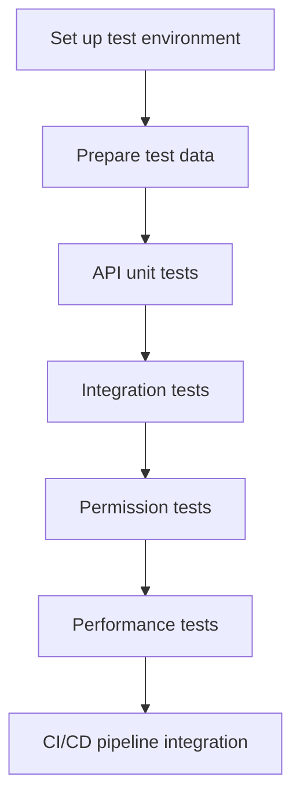

# Testing Strategy


Learn how to set up test environments and automation strategies for your bkend project. Test authentication, CRUD operations, and permissions safely.


## Overview

With bkend's environment separation, you can test safely without affecting production data.

### Testing Principles

- **Environment isolation** — Test in the dev environment; never touch prod
- **Automation** — Integrate into CI/CD pipelines to test on every commit
- **Data independence** — Delete test data after tests complete
- **Permission verification** — Verify that RLS policies work correctly

***

## Testing Roadmap



***

## Step 1: Test Environment Setup

### 1.1 Environment Strategy

| Environment | Purpose | Data | API Key |
|-------------|---------|------|---------|
| **dev** | Local development testing | Developer's personal test data | Personal key |
| **staging** | CI/CD automated testing | Anonymized production replica | Team shared key |
| **prod** | Live service | Real user data | Production-only key |

### 1.2 Environment Variables

Separate test environment variables into a `.env.test` file.

```bash
# .env.test
BKEND_API_KEY={test-api-key}
BKEND_PROJECT_ID={project-id}
BKEND_ENVIRONMENT=dev
BKEND_BASE_URL=https://api-client.bkend.ai
```

### 1.3 Test Helper Functions

Write helper functions to simplify API calls.

```javascript
// test/helpers.js
require('dotenv').config({ path: '.env.test' });

const config = {
  apiKey: process.env.BKEND_API_KEY,
  projectId: process.env.BKEND_PROJECT_ID,
  environment: process.env.BKEND_ENVIRONMENT,
  baseURL: process.env.BKEND_BASE_URL
};

async function apiRequest(endpoint, options = {}) {
  const response = await fetch(`${config.baseURL}${endpoint}`, {
    ...options,
    headers: {
      ...options.headers,
      'Authorization': `Bearer ${config.apiKey}`,
      'X-Project-Id': config.projectId,
      'X-Environment': config.environment
    }
  });

  const data = await response.json();

  if (!response.ok) {
    throw new Error(`API Error: ${response.status} ${JSON.stringify(data)}`);
  }

  return data;
}

async function login(email, password) {
  const data = await apiRequest('/v1/auth/login', {
    method: 'POST',
    headers: { 'Content-Type': 'application/json' },
    body: JSON.stringify({ email, password })
  });

  return data.access_token;
}

module.exports = { apiRequest, login, config };
```

***

## Step 2: Test Data Preparation

### 2.1 Fixture Data

Prepare fixed data for testing.

```javascript
// test/fixtures.js
const testUsers = [
  {
    email: 'user1@test.com',
    password: 'password123',
    displayName: 'Test User 1'
  },
  {
    email: 'user2@test.com',
    password: 'password123',
    displayName: 'Test User 2'
  }
];

const testPosts = [
  {
    title: 'Test Post 1',
    content: 'This is a test post.'
  },
  {
    title: 'Test Post 2',
    content: 'Another test post.'
  }
];

module.exports = { testUsers, testPosts };
```

### 2.2 Setup/Teardown

Create and delete data before and after tests.

```javascript
// test/setup.js
const { apiRequest } = require('./helpers');
const { testUsers, testPosts } = require('./fixtures');

let createdUserIds = [];
let createdPostIds = [];

async function setup() {
  console.log('Setting up test data...');

  // Create test users
  for (const user of testUsers) {
    const data = await apiRequest('/v1/auth/register', {
      method: 'POST',
      headers: { 'Content-Type': 'application/json' },
      body: JSON.stringify(user)
    });
    createdUserIds.push(data.user.id);
  }

  console.log(`Created ${createdUserIds.length} test users`);
}

async function teardown() {
  console.log('Cleaning up test data...');

  // Delete created posts
  for (const postId of createdPostIds) {
    await apiRequest(`/v1/data/posts/${postId}`, { method: 'DELETE' });
  }

  console.log(`Deleted ${createdPostIds.length} test posts`);

  // Keep created users (reusable)
}

module.exports = { setup, teardown, createdUserIds, createdPostIds };
```

***

## Step 3: API Tests

### 3.1 Authentication Tests

Test signup, login, and token refresh.

```javascript
// test/auth.test.js
const { apiRequest, login } = require('./helpers');

describe('Authentication', () => {
  test('Signup succeeds', async () => {
    const response = await apiRequest('/v1/auth/register', {
      method: 'POST',
      headers: { 'Content-Type': 'application/json' },
      body: JSON.stringify({
        email: 'newuser@test.com',
        password: 'password123',
        displayName: 'New User'
      })
    });

    expect(response.user).toBeDefined();
    expect(response.user.email).toBe('newuser@test.com');
    expect(response.access_token).toBeDefined();
  });

  test('Login succeeds', async () => {
    const token = await login('user1@test.com', 'password123');
    expect(token).toBeDefined();
  });

  test('Login fails with wrong password', async () => {
    await expect(
      login('user1@test.com', 'wrongpassword')
    ).rejects.toThrow();
  });

  test('Token refresh succeeds', async () => {
    const loginData = await apiRequest('/v1/auth/login', {
      method: 'POST',
      headers: { 'Content-Type': 'application/json' },
      body: JSON.stringify({
        email: 'user1@test.com',
        password: 'password123'
      })
    });

    const refreshData = await apiRequest('/v1/auth/refresh', {
      method: 'POST',
      headers: { 'Content-Type': 'application/json' },
      body: JSON.stringify({
        refresh_token: loginData.refresh_token
      })
    });

    expect(refreshData.access_token).toBeDefined();
    expect(refreshData.access_token).not.toBe(loginData.access_token);
  });
});
```

### 3.2 CRUD Tests

Test data creation, retrieval, update, and deletion.

```javascript
// test/crud.test.js
const { apiRequest, login } = require('./helpers');
const { createdPostIds } = require('./setup');

describe('CRUD Operations', () => {
  let token;
  let postId;

  beforeAll(async () => {
    token = await login('user1@test.com', 'password123');
  });

  test('Create post (INSERT)', async () => {
    const response = await apiRequest('/v1/data/posts', {
      method: 'POST',
      headers: {
        'Content-Type': 'application/json',
        'Authorization': `Bearer ${token}`
      },
      body: JSON.stringify({
        title: 'Test Post',
        content: 'This is a test post.'
      })
    });

    expect(response.id).toBeDefined();
    postId = response.id;
    createdPostIds.push(postId);
  });

  test('Read post (SELECT)', async () => {
    const posts = await apiRequest(`/v1/data/posts?id=eq.${postId}`, {
      headers: { 'Authorization': `Bearer ${token}` }
    });

    expect(posts.length).toBe(1);
    expect(posts[0].title).toBe('Test Post');
  });

  test('Update post (UPDATE)', async () => {
    const response = await apiRequest(`/v1/data/posts/${postId}`, {
      method: 'PATCH',
      headers: {
        'Content-Type': 'application/json',
        'Authorization': `Bearer ${token}`
      },
      body: JSON.stringify({
        title: 'Updated Title'
      })
    });

    expect(response.title).toBe('Updated Title');
  });

  test('Delete post (DELETE)', async () => {
    await apiRequest(`/v1/data/posts/${postId}`, {
      method: 'DELETE',
      headers: { 'Authorization': `Bearer ${token}` }
    });

    const posts = await apiRequest(`/v1/data/posts?id=eq.${postId}`, {
      headers: { 'Authorization': `Bearer ${token}` }
    });

    expect(posts.length).toBe(0);

    // Mark as deleted
    const index = createdPostIds.indexOf(postId);
    if (index > -1) createdPostIds.splice(index, 1);
  });
});
```

### 3.3 Query Filter Tests

Test various query parameters.

```javascript
// test/query.test.js
const { apiRequest, login } = require('./helpers');

describe('Query Filters', () => {
  let token;

  beforeAll(async () => {
    token = await login('user1@test.com', 'password123');
  });

  test('eq (equals) filter', async () => {
    const posts = await apiRequest('/v1/data/posts?title=eq.Test Post', {
      headers: { 'Authorization': `Bearer ${token}` }
    });

    posts.forEach(post => {
      expect(post.title).toBe('Test Post');
    });
  });

  test('like (pattern) filter', async () => {
    const posts = await apiRequest('/v1/data/posts?title=like.*Test*', {
      headers: { 'Authorization': `Bearer ${token}` }
    });

    posts.forEach(post => {
      expect(post.title).toContain('Test');
    });
  });

  test('order (sorting)', async () => {
    const posts = await apiRequest('/v1/data/posts?order=created_at.desc', {
      headers: { 'Authorization': `Bearer ${token}` }
    });

    for (let i = 1; i < posts.length; i++) {
      const prev = new Date(posts[i - 1].created_at);
      const curr = new Date(posts[i].created_at);
      expect(prev >= curr).toBe(true);
    }
  });

  test('limit (count restriction)', async () => {
    const posts = await apiRequest('/v1/data/posts?limit=5', {
      headers: { 'Authorization': `Bearer ${token}` }
    });

    expect(posts.length).toBeLessThanOrEqual(5);
  });
});
```

***

## Step 4: Permission Tests

### 4.1 RLS Policy Verification

Verify that Row-Level Security policies work correctly.

```javascript
// test/permissions.test.js
const { apiRequest, login } = require('./helpers');

describe('Permissions (RLS)', () => {
  let user1Token, user2Token;
  let user1PostId;

  beforeAll(async () => {
    user1Token = await login('user1@test.com', 'password123');
    user2Token = await login('user2@test.com', 'password123');

    // User1 creates a post
    const post = await apiRequest('/v1/data/posts', {
      method: 'POST',
      headers: {
        'Content-Type': 'application/json',
        'Authorization': `Bearer ${user1Token}`
      },
      body: JSON.stringify({
        title: 'User1 Post',
        content: 'This is User1 post.'
      })
    });
    user1PostId = post.id;
  });

  test('Editing own post is allowed', async () => {
    const response = await apiRequest(`/v1/data/posts/${user1PostId}`, {
      method: 'PATCH',
      headers: {
        'Content-Type': 'application/json',
        'Authorization': `Bearer ${user1Token}`
      },
      body: JSON.stringify({ title: 'Updated by User1' })
    });

    expect(response.title).toBe('Updated by User1');
  });

  test('Editing another user\'s post is blocked', async () => {
    await expect(
      apiRequest(`/v1/data/posts/${user1PostId}`, {
        method: 'PATCH',
        headers: {
          'Content-Type': 'application/json',
          'Authorization': `Bearer ${user2Token}`
        },
        body: JSON.stringify({ title: 'Hacked by User2' })
      })
    ).rejects.toThrow();
  });

  test('Deleting another user\'s post is blocked', async () => {
    await expect(
      apiRequest(`/v1/data/posts/${user1PostId}`, {
        method: 'DELETE',
        headers: { 'Authorization': `Bearer ${user2Token}` }
      })
    ).rejects.toThrow();
  });

  test('Deleting own post is allowed', async () => {
    await apiRequest(`/v1/data/posts/${user1PostId}`, {
      method: 'DELETE',
      headers: { 'Authorization': `Bearer ${user1Token}` }
    });

    const posts = await apiRequest(`/v1/data/posts?id=eq.${user1PostId}`, {
      headers: { 'Authorization': `Bearer ${user1Token}` }
    });

    expect(posts.length).toBe(0);
  });
});
```

### 4.2 Role-Based Permission Tests

Test permissions based on roles.

```javascript
// test/roles.test.js
const { apiRequest, login } = require('./helpers');

describe('Role-Based Permissions', () => {
  let adminToken, userToken;
  let userPostId;

  beforeAll(async () => {
    adminToken = await login('admin@test.com', 'password123');
    userToken = await login('user1@test.com', 'password123');

    // User creates a post
    const post = await apiRequest('/v1/data/posts', {
      method: 'POST',
      headers: {
        'Content-Type': 'application/json',
        'Authorization': `Bearer ${userToken}`
      },
      body: JSON.stringify({ title: 'User Post', content: 'Content' })
    });
    userPostId = post.id;
  });

  test('Admin can delete any post', async () => {
    await apiRequest(`/v1/data/posts/${userPostId}`, {
      method: 'DELETE',
      headers: { 'Authorization': `Bearer ${adminToken}` }
    });

    const posts = await apiRequest(`/v1/data/posts?id=eq.${userPostId}`, {
      headers: { 'Authorization': `Bearer ${adminToken}` }
    });

    expect(posts.length).toBe(0);
  });
});
```

***

## Step 5: Integration Tests

### 5.1 User Flow Tests

Test real user scenarios.

```javascript
// test/integration.test.js
const { apiRequest } = require('./helpers');

describe('User Flow Integration', () => {
  test('Signup → Login → Create post → Read → Delete', async () => {
    // 1. Signup
    const registerData = await apiRequest('/v1/auth/register', {
      method: 'POST',
      headers: { 'Content-Type': 'application/json' },
      body: JSON.stringify({
        email: 'flow@test.com',
        password: 'password123',
        displayName: 'Flow User'
      })
    });

    expect(registerData.user).toBeDefined();
    const token = registerData.access_token;

    // 2. Create post
    const post = await apiRequest('/v1/data/posts', {
      method: 'POST',
      headers: {
        'Content-Type': 'application/json',
        'Authorization': `Bearer ${token}`
      },
      body: JSON.stringify({
        title: 'Integration Test Post',
        content: 'This is an integration test.'
      })
    });

    expect(post.id).toBeDefined();

    // 3. Read post
    const posts = await apiRequest(`/v1/data/posts?id=eq.${post.id}`, {
      headers: { 'Authorization': `Bearer ${token}` }
    });

    expect(posts.length).toBe(1);
    expect(posts[0].title).toBe('Integration Test Post');

    // 4. Delete post
    await apiRequest(`/v1/data/posts/${post.id}`, {
      method: 'DELETE',
      headers: { 'Authorization': `Bearer ${token}` }
    });

    // 5. Verify deletion
    const deletedPosts = await apiRequest(`/v1/data/posts?id=eq.${post.id}`, {
      headers: { 'Authorization': `Bearer ${token}` }
    });

    expect(deletedPosts.length).toBe(0);
  });
});
```

***

## Step 6: Performance Tests

### 6.1 Response Time Measurement

Measure API response times.

```javascript
// test/performance.test.js
const { apiRequest, login } = require('./helpers');

describe('Performance', () => {
  let token;

  beforeAll(async () => {
    token = await login('user1@test.com', 'password123');
  });

  test('Post list response time < 500ms', async () => {
    const start = performance.now();

    await apiRequest('/v1/data/posts?limit=100', {
      headers: { 'Authorization': `Bearer ${token}` }
    });

    const duration = performance.now() - start;
    expect(duration).toBeLessThan(500);
  });

  test('Response time with index < 100ms', async () => {
    const start = performance.now();

    // Assuming user_id has an index
    await apiRequest('/v1/data/posts?user_id=eq.{user-id}&limit=100', {
      headers: { 'Authorization': `Bearer ${token}` }
    });

    const duration = performance.now() - start;
    expect(duration).toBeLessThan(100);
  });
});
```

### 6.2 Load Tests

Simulate concurrent requests.

```javascript
// test/load.test.js
const { apiRequest, login } = require('./helpers');

describe('Load Test', () => {
  test('Handle 100 concurrent requests', async () => {
    const token = await login('user1@test.com', 'password123');

    const requests = Array.from({ length: 100 }, () =>
      apiRequest('/v1/data/posts?limit=10', {
        headers: { 'Authorization': `Bearer ${token}` }
      })
    );

    const start = performance.now();
    const results = await Promise.all(requests);
    const duration = performance.now() - start;

    expect(results.length).toBe(100);
    console.log(`100 requests completed in ${duration}ms`);
  });
});
```

***

## Step 7: CI/CD Pipeline Integration

### 7.1 GitHub Actions Setup

Create a `.github/workflows/test.yml` file.

```yaml
name: API Tests

on:
  push:
    branches: [ main, develop ]
  pull_request:
    branches: [ main ]

jobs:
  test:
    runs-on: ubuntu-latest

    steps:
    - uses: actions/checkout@v3

    - name: Setup Node.js
      uses: actions/setup-node@v3
      with:
        node-version: '18'

    - name: Install dependencies
      run: npm install

    - name: Run tests
      env:
        BKEND_API_KEY: ${{ secrets.BKEND_API_KEY_TEST }}
        BKEND_PROJECT_ID: ${{ secrets.BKEND_PROJECT_ID }}
        BKEND_ENVIRONMENT: dev
      run: npm test

    - name: Cleanup test data
      if: always()
      run: npm run test:cleanup
```

### 7.2 npm Script Setup

Add test scripts to `package.json`.

```json
{
  "scripts": {
    "test": "jest",
    "test:watch": "jest --watch",
    "test:coverage": "jest --coverage",
    "test:setup": "node test/setup.js",
    "test:cleanup": "node test/teardown.js"
  },
  "jest": {
    "testEnvironment": "node",
    "globalSetup": "./test/setup.js",
    "globalTeardown": "./test/teardown.js"
  }
}
```

***

## Testing Checklist

- [ ] Test environment (dev) configured
- [ ] .env.test file created
- [ ] Test helper functions written
- [ ] Fixture data prepared
- [ ] Setup/Teardown scripts written
- [ ] Authentication tests (signup, login, token refresh)
- [ ] CRUD tests (INSERT, SELECT, UPDATE, DELETE)
- [ ] Query filter tests (eq, like, order, limit)
- [ ] RLS permission tests (own vs. other user's data access)
- [ ] Role-based permission tests (admin, user)
- [ ] Integration tests (user flow)
- [ ] Performance tests (response time, index effectiveness)
- [ ] Load tests (concurrent request handling)
- [ ] CI/CD pipeline integration (GitHub Actions)
- [ ] Test coverage > 80%


Once all tests pass, you can safely proceed with production deployment.


***

## Related Documents

- [CI/CD Integration](07-ci-cd.md) — Deployment pipeline configuration
- [Scaling Guide](05-scaling.md) — Environment-specific configuration strategy
- [Performance Optimization](04-performance.md) — Query optimization strategy
- [Authentication API Reference](../authentication/19-api-reference.md) — Authentication endpoints
- [Database CRUD](../database/01-overview.md) — Data API usage
- [Permission Settings](../security/05-rls-policies.md) — RLS policy configuration
