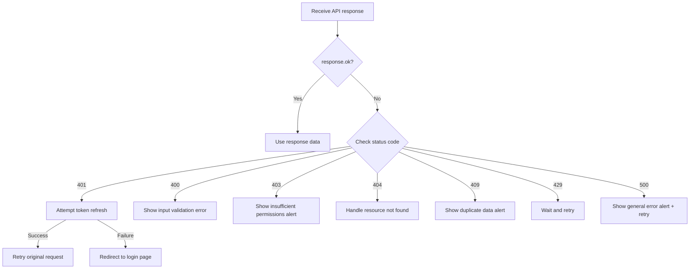

# Error Handling Guide


💡 Handle bkend API errors effectively in your app. This document covers response strategies per HTTP status code and user notification patterns.


## Overview

This document covers:

- Response strategies per HTTP status code
- Parsing error response structures
- User notification patterns (toast, inline error)
- Network error handling

***

## Error Response Structure

bkend API error responses follow this format:

```json
{
  "statusCode": 400,
  "error": "VALIDATION_ERROR",
  "message": "Required parameter is missing"
}
```

| Field | Type | Description |
|-------|------|-------------|
| `statusCode` | `number` | HTTP status code |
| `error` | `string` | Error code (for programmatic use) |
| `message` | `string` | Human-readable error description |

***

## Error Handling Flow



***

## Error Handling Utility

Use this error handling function across all API calls.

```javascript
/**
 * Parses an API error response
 * @param {Response} response - fetch Response object
 * @returns {object} Parsed error information
 */
async function parseApiError(response) {
  try {
    const body = await response.json();
    return {
      status: response.status,
      code: body.error || 'UNKNOWN_ERROR',
      message: body.message || 'An unknown error occurred',
    };
  } catch {
    return {
      status: response.status,
      code: 'PARSE_ERROR',
      message: 'Unable to process the server response',
    };
  }
}
```

***

## Strategies by Status Code

### 401 Unauthorized — Token Refresh

When the access token expires, automatically refresh it and retry the original request.

```javascript
async function handleApiRequest(path, options = {}) {
  let response = await bkendFetch(path, options);

  // bkendFetch already handles 401 internally,
  // but redirect to login on refresh failure
  return response;
}

// Redirect to login on refresh failure
function redirectToLogin() {
  localStorage.removeItem('accessToken');
  localStorage.removeItem('refreshToken');
  window.location.href = '/login';
}
```


💡 Using the `bkendFetch` helper, the 401 → token refresh → retry flow is handled automatically. See [Integrating bkend in Your App](../getting-started/03-app-integration.md) for detailed setup.


***

### 400 Bad Request — Input Validation

Validate user input and display error messages next to form fields.

```javascript
async function createPost(formData) {
  try {
    const post = await bkendFetch('/v1/data/posts', {
      method: 'POST',
      body: formData,
    });
    return { success: true, data: post };
  } catch (error) {
    return {
      success: false,
      message: error.message, // e.g., "title is required"
    };
  }
}

// Form submit handler
async function handleSubmit(event) {
  event.preventDefault();
  const formData = {
    title: document.getElementById('title').value,
    content: document.getElementById('content').value,
  };

  const result = await createPost(formData);
  if (!result.success) {
    // Display error message below the form
    showInlineError(result.message);
  }
}
```

***

### 403 Forbidden — Insufficient Permissions

```javascript
async function handleForbidden(error) {
  showToast({
    type: 'error',
    message: 'You do not have permission to perform this action',
  });
}
```


⚠️ If 403 errors occur repeatedly, check the table's **Permissions** settings in the console. Verify that the required CRUD permissions are granted for the User role.


***

### 409 Conflict — Duplicate Data

```javascript
// Email duplication during signup
async function handleSignup(email, password, name) {
  try {
    const result = await bkendFetch('/v1/auth/email/signup', {
      method: 'POST',
      body: { method: 'password', email, password, name },
    });
    return result;
  } catch (error) {
    if (error.message.includes('already exists')) {
      showInlineError('This email is already registered. Try logging in instead.');
    } else {
      showInlineError(error.message);
    }
  }
}
```

***

### 429 Too Many Requests — Rate Limiting

```javascript
/**
 * Retries with exponential backoff
 */
async function fetchWithRetry(path, options, maxRetries = 3) {
  for (let attempt = 0; attempt < maxRetries; attempt++) {
    try {
      return await bkendFetch(path, options);
    } catch (error) {
      if (error.message.includes('429') && attempt < maxRetries - 1) {
        const delay = Math.pow(2, attempt) * 1000; // 1s, 2s, 4s
        await new Promise(resolve => setTimeout(resolve, delay));
        continue;
      }
      throw error;
    }
  }
}
```

***

### Network Errors

These occur when the internet connection drops or the server is unreachable.

```javascript
async function safeApiCall(path, options) {
  try {
    return await bkendFetch(path, options);
  } catch (error) {
    if (error instanceof TypeError && error.message === 'Failed to fetch') {
      showToast({
        type: 'error',
        message: 'Please check your network connection',
      });
      return null;
    }
    throw error;
  }
}
```

***

## User Notification Patterns

### Toast Notifications

Brief notifications displayed on screen. Suitable for network errors, server errors, and other general errors.

```javascript
function showToast({ type, message, duration = 3000 }) {
  const toast = document.createElement('div');
  toast.className = `toast toast-${type}`;
  toast.textContent = message;
  document.body.appendChild(toast);

  setTimeout(() => toast.remove(), duration);
}
```

### Inline Errors

Errors displayed next to form fields. Suitable for input validation errors.

```javascript
function showInlineError(message, fieldId) {
  const errorEl = document.getElementById(`${fieldId}-error`);
  if (errorEl) {
    errorEl.textContent = message;
    errorEl.style.display = 'block';
  }
}

function clearInlineError(fieldId) {
  const errorEl = document.getElementById(`${fieldId}-error`);
  if (errorEl) {
    errorEl.textContent = '';
    errorEl.style.display = 'none';
  }
}
```

***

## Error Code Reference

Common error codes and recommended user messages.

| Error Code | HTTP | User Message |
|-----------|:----:|-------------|
| `VALIDATION_ERROR` | 400 | Please check your input |
| `UNAUTHORIZED` | 401 | Login is required |
| `TOKEN_EXPIRED` | 401 | (Auto-refresh then retry) |
| `PERMISSION_DENIED` | 403 | You do not have permission |
| `TABLE_NOT_FOUND` | 404 | The requested data was not found |
| `RECORD_NOT_FOUND` | 404 | The requested data was not found |
| `EMAIL_ALREADY_EXISTS` | 409 | This email is already registered |
| `RATE_LIMIT_EXCEEDED` | 429 | Please try again shortly |

For the full error code list, see [Common Error Codes](../troubleshooting/01-common-errors.md).

***

## Next Steps

- [Integrating bkend in Your App](../getting-started/03-app-integration.md) — Fetch helper setup
- [Token Storage and Refresh](../authentication/20-token-management.md) — Automatic token refresh details
- [Common Error Codes](../troubleshooting/01-common-errors.md) — Full error code reference
- [Authentication Troubleshooting](../troubleshooting/03-auth-issues.md) — Resolving auth errors
- [Hands-on Project Cookbooks](../../cookbooks/README.md) — Build real apps with error handling included
- Example Projects — See error handling implementation in [blog-web](../../examples/blog-web/) / [recipe-web](../../examples/recipe-web/) / [shopping-mall-web](../../examples/shopping-mall-web/)
