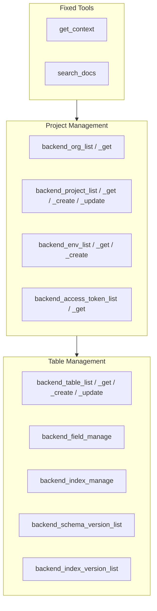

# MCP Tools Overview


💡 This page provides a complete list and classification of tools and resources offered by the bkend MCP server.


## Overview

The bkend MCP server provides **Tools** and **Resources** so you can manage your backend from AI tools. Tools convert natural language requests into actual backend operations, and Resources let you query the current state.

***

## Tool Classification

### Fixed Tools

These tools are always available when you connect to the MCP server.

| Tool | Description | Details |
|------|-------------|---------|
| `get_context` | Retrieve session context (Organization, project, environment) | [Context](02-context.md) |
| `search_docs` | Search bkend documentation | [Context](02-context.md) |

### API Tools

These tools directly manage your backend. They all use the `backend_` prefix.

| Category | Tool Count | Description | Details |
|----------|:----------:|-------------|---------|
| Project Management | 9 | Manage Organizations, projects, environments, and access tokens | [Project Tools](03-project-tools.md) |
| Table Management | 7 | Manage tables, fields, indexes, and schema versions | [Table Tools](04-table-tools.md) |

***

## Features Without Dedicated Tools

Auth, Storage, and Data CRUD do not have dedicated MCP tools. Instead, use `search_docs` to find implementation guides, then generate **REST API code**.

| Feature | MCP Tool | Alternative |
|---------|:--------:|-------------|
| Auth | N/A | Generate REST API code — [Auth Tools](06-auth-tools.md) |
| Storage | N/A | Generate REST API code — [Storage Tools](07-storage-tools.md) |
| Data CRUD | N/A | Generate REST API code — [Data Tools](05-data-tools.md) |


💡 When you ask your AI tool to "implement a login feature" or "add data to a table," `search_docs` automatically finds the relevant docs and generates the REST API calling code.


***

## Resources

MCP Resources let you query the current state in read-only mode through the `bkend://` URI schema. Resources are automatically generated from GET endpoints that have MCP enabled.

| Resource | URI Pattern | Description |
|----------|-------------|-------------|
| Organization | `bkend://organizations/{organizationId}` | Organization details |
| Organization List | `bkend://organizations` | List of Organizations |
| Project | `bkend://projects/{projectId}` | Project details |
| Project List | `bkend://projects` | List of projects |
| Environment | `bkend://environments/{environmentId}` | Environment details |
| Environment List | `bkend://environments` | List of environments |
| Table | `bkend://tables/{tableId}` | Table details |
| Table List | `bkend://tables` | List of tables |

> For details, see [MCP Resources](08-resources.md).

***

## Complete Tool List

***

## Next Steps

- [Context](02-context.md) — Details on `get_context` and `search_docs`
- [Project Tools](03-project-tools.md) — Manage Organizations, projects, environments, and access tokens
- [Table Tools](04-table-tools.md) — Manage tables, fields, and indexes
- [MCP Resources](08-resources.md) — Resource URIs and how to query them
