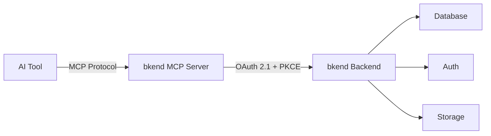
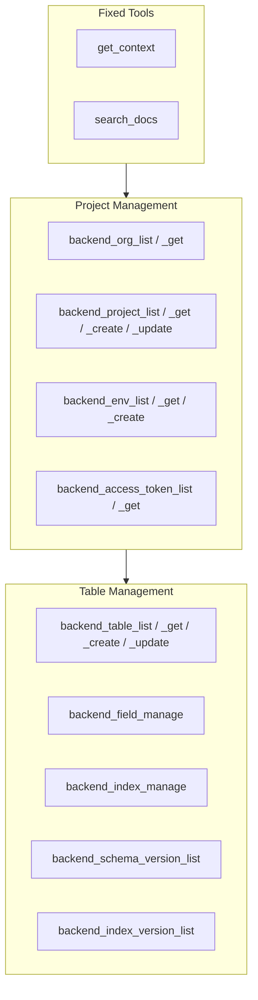

# MCP


💡 Use the bkend MCP server to manage your backend with natural language from AI tools like Claude Code, Cursor, and VS Code.


## Overview

bkend connects to AI tools through [MCP (Model Context Protocol)](https://spec.modelcontextprotocol.io/2025-03-26). When you issue natural language commands from an MCP-compatible AI tool, bkend automatically manages Database, Auth, and Storage for you.

```mermaid
flowchart LR
    A[AI Tool] -->|MCP Protocol| B[bkend MCP Server]
    B -->|OAuth 2.1 + PKCE| C[bkend Backend]
    C --> D[Database]
    C --> E[Auth]
    C --> F[Storage]
```

***

## MCP Server Information

| Item | Value |
|------|-------|
| Server URL | `https://api.bkend.ai/mcp` |
| Protocol Version | `2025-03-26` |
| Transport | Streamable HTTP |
| Authentication | [OAuth 2.1](https://datatracker.ietf.org/doc/html/draft-ietf-oauth-v2-1-12) + PKCE |
| Message Format | JSON-RPC 2.0 |

***

## Available Tools

### Fixed Tools

These tools handle session context and documentation search.

| Tool | Description | Details |
|------|-------------|---------|
| `get_context` | Must be called at session start — provides Organization ID, resource hierarchy, and usage guidelines | [Context](06-context.md) |
| `search_docs` | Search bkend documentation — API guides, auth implementation, CRUD patterns, code examples | [Context](06-context.md) |

### API Tools

These tools directly manage your backend. They all use the `backend_` prefix.

| Category | Tool Count | Description | Details |
|----------|:----------:|-------------|---------|
| Project Management | 9 | Manage Organizations, projects, environments, and access tokens | [Project Tools](07-project-tools.md) |
| Table Management | 7 | Manage tables, fields, indexes, and schema versions | [Table Tools](08-table-tools.md) |

### REST API Code Generation

Auth, Storage, and Data CRUD do not have dedicated MCP tools. Instead, use `search_docs` to find implementation guides, then generate **REST API code**.

| Feature | MCP Tool | Alternative |
|---------|:--------:|-------------|
| Auth | N/A | Generate REST API code — [Code Generation](09-code-generation.md#auth) |
| Storage | N/A | Generate REST API code — [Code Generation](09-code-generation.md#storage) |
| Data CRUD | N/A | Generate REST API code — [Code Generation](09-code-generation.md#data-crud) |


💡 When you ask your AI tool to "implement a login feature" or "add data to a table," `search_docs` automatically finds the relevant docs and generates the REST API calling code.



⚠️ MCP tools control **management functions** (table schemas, projects, environments, etc.). They are different from the REST API used for app user data. For REST API integration, see [Integrating bkend in Your App](../getting-started/03-app-integration.md).


***

## Complete Tool List

```mermaid
graph TD
    subgraph Fixed["Fixed Tools"]
        A[get_context]
        B[search_docs]
    end

    subgraph Project["Project Management"]
        C[backend_org_list / _get]
        D[backend_project_list / _get / _create / _update]
        E[backend_env_list / _get / _create]
        F[backend_access_token_list / _get]
    end

    subgraph Table["Table Management"]
        G[backend_table_list / _get / _create / _update]
        H[backend_field_manage]
        I[backend_index_manage]
        J[backend_schema_version_list]
        K[backend_index_version_list]
    end

    Fixed --> Project
    Project --> Table
```

***

## Resources

MCP Resources let you query the current state in read-only mode through the `bkend://` URI schema.

| Resource | URI Pattern | Description |
|----------|-------------|-------------|
| Organization | `bkend://organizations/{organizationId}` | Organization details |
| Organization List | `bkend://organizations` | List of Organizations |
| Project | `bkend://projects/{projectId}` | Project details |
| Project List | `bkend://projects` | List of projects |
| Environment | `bkend://environments/{environmentId}` | Environment details |
| Environment List | `bkend://environments` | List of environments |
| Table | `bkend://tables/{tableId}` | Table details |
| Table List | `bkend://tables` | List of tables |

> For details, see [MCP Resources](10-resources.md).

***

## Permissions (Scopes)

These are the permissions granted during MCP integration.

| Resource | Read | Create | Update | Delete |
|----------|:----:|:------:|:------:|:------:|
| Organization | ✅ | - | - | - |
| Project | ✅ | ✅ | ✅ | ✅ |
| Environment | ✅ | ✅ | - | ✅ |
| Table Schema | ✅ | ✅ | ✅ | ✅ |
| Table Data | ✅ | ✅ | ✅ | ✅ |
| Access Token | ✅ | - | - | - |

***

## Quick Start

> For the full setup guide, see [Setup](02-setup.md).

***

## Next Steps

- [Setup](02-setup.md) — Install and authenticate your AI tool
- [Usage](03-usage.md) — Prompt examples and best practices
- [MCP Protocol](04-protocol.md) — Protocol specification details
- [OAuth 2.1 Authentication](05-oauth.md) — Authentication flow and token management
- [Context](06-context.md) — `get_context` and `search_docs` details
- [Project Tools](07-project-tools.md) — Organization, project, and environment management
- [Table Tools](08-table-tools.md) — Table, field, and index management
- [Code Generation](09-code-generation.md) — REST API code generation for Auth, Storage, Data
- [Resources](10-resources.md) — MCP resource URIs
- [API Reference](11-api-reference.md) — Complete tool schemas
- [Hands-on Project Cookbooks](../../cookbooks/README.md) — Build real app backends with MCP

## Reference Standards

- [MCP Specification 2025-03-26](https://spec.modelcontextprotocol.io/2025-03-26)
- [OAuth 2.1](https://datatracker.ietf.org/doc/html/draft-ietf-oauth-v2-1-12)
