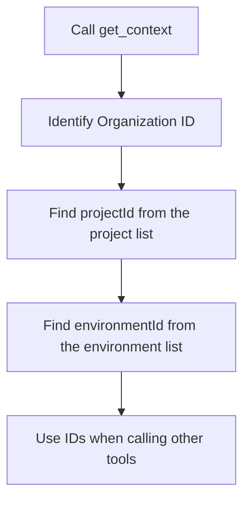

# Context


This page covers `get_context`, which is automatically called when an AI tool first connects to bkend, and `search_docs`, the documentation search tool.


## get_context

When an AI tool connects to the MCP server, it **automatically** calls `get_context`. This tool returns the information available for the current session.

### Parameters

Called without parameters.

### Response Structure

```json
{
  "organization": {
    "id": "org_abc123",
    "name": "My Organization"
  },
  "projects": [
    {
      "id": "proj_xyz789",
      "name": "my-app",
      "environments": [
        {
          "id": "env_dev001",
          "name": "dev",
          "status": "active"
        }
      ]
    }
  ],
  "apiEndpoint": "https://api-client.bkend.ai",
  "warnings": []
}
```

### Return Values

| Field | Description |
|-------|-------------|
| Organization | ID and name of the currently authenticated Organization |
| Project list | Accessible projects with their environment details |
| API endpoint | REST API endpoint |
| Warnings | Limitation or warning messages |

### ID Lookup Flow

Most MCP tools require `projectId` and `environmentId`. You can find these values in the `get_context` response.




If the AI tool does not call `get_context`, it cannot use any other tools. If you get no response after connecting, restart your AI tool.


***

## search_docs

A tool for searching bkend documentation. It is primarily used to find implementation guides for features that lack dedicated MCP tools, such as Auth and Storage.

### Parameters

| Parameter | Type | Required | Description |
|-----------|------|:--------:|-------------|
| `query` | string | Yes | Search keyword |

### Usage Example

```json
{
  "query": "how to implement email signup"
}
```

### Response Structure

```json
{
  "results": [
    {
      "title": "Email Signup",
      "content": "How to sign up with email and password...",
      "relevance": 0.95
    }
  ]
}
```

### Built-in Documents

Key built-in documents that `search_docs` can search:

| Document ID | Content |
|-------------|---------|
| `3_howto_implement_auth` | Auth implementation guide (signup, login, token management) |
| `6_code_examples_auth` | Auth code examples (email, social, magic link) |


When you ask your AI tool to "build a login feature," `search_docs` is automatically called to find the relevant documentation.


***

## Notes

### Data Response Format

When you query data through MCP tools, the response follows this format:

- List queries: `items` array and `pagination` object
- Single-item queries: Object returned directly
- ID field: `id` (not `_id`)

### Required Reference Rules

When generating REST API code from data retrieved via MCP tools:

| Item | Correct Usage |
|------|---------------|
| API endpoint | `https://api-client.bkend.ai` |
| Required headers | `X-API-Key`, `Authorization` (for authenticated requests) |
| ID field | `id` |
| List response | `{ items, pagination }` |

***

## Next Steps

- [MCP Tools Overview](01-overview.md) — Complete tool classification
- [Project Tools](03-project-tools.md) — Manage Organizations, projects, and environments
- [Data Tools](05-data-tools.md) — Data CRUD operations
