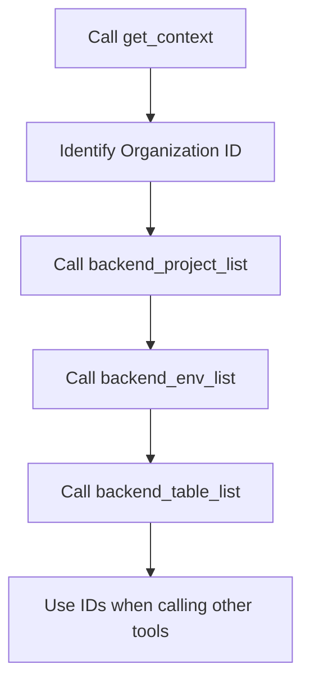

# Context


💡 This page covers `get_context`, which is automatically called when an AI tool first connects to bkend, and `search_docs`, the documentation search tool.


## get_context

When an AI tool connects to the MCP server, it should call `get_context` first. This tool returns session information and a guide for navigating bkend resources.

### Parameters

Called without parameters.

### Response Content

The response is a Markdown-formatted text containing:

**Your Session** — Organization ID and REST API Base URL for the current session.

| Field | Description |
|-------|-------------|
| Organization ID | ID of the currently authenticated Organization |
| REST API Base URL | `https://api-client.bkend.ai` — Use this for REST API calls |

**API Domains** — Clarifies the difference between domains to prevent confusion.

| Domain | Purpose | Use In |
|--------|---------|--------|
| `api-client.bkend.ai` | Consumer REST API base URL | App code (fetch, axios, SDK) |
| `api.bkend.ai/mcp` | MCP Server connection | AI tool configuration only |


🚨 **Never use `api.bkend.ai` directly in generated app code.** Always use `api-client.bkend.ai` for REST API calls.


**Resource Hierarchy** — Shows how to navigate from Organization to Table.

```
Organization → Project → Environment (dev/staging/prod) → Table
```

| To find | Call | With |
|---------|------|------|
| Organization ID | See "Your Session" above | - |
| Project ID | `backend_project_list` | organizationId |
| Environment | `backend_env_list` | projectId |
| Table | `backend_table_list` | projectId, environment |

### ID Lookup Flow

Most MCP tools require `projectId` or `tableId`. Use the resource hierarchy to find these values.




⚠️ If the AI tool does not call `get_context`, it may use incorrect API URLs. Always call this tool first in every session.


***

## search_docs

A tool for searching bkend documentation via GitBook. Use it to find implementation guides for Auth, Storage, Data CRUD, and other features.

### Parameters

| Parameter | Type | Required | Description |
|-----------|------|:--------:|-------------|
| `query` | string | Yes | Search query (e.g., "signup authentication", "CRUD filtering") |

### Usage Example

```json
{
  "query": "how to implement email signup"
}
```

### Response Content

The response is a Markdown-formatted search result containing up to 5 matching pages with their titles and relevant sections.

```text
## Search Results for "email signup"

### Email Signup
**Overview**
How to sign up with email and password...

---
```


💡 When you ask your AI tool to "build a login feature," `search_docs` is automatically called to find the relevant documentation and generate REST API code.


***

## Notes

### Data Response Format

When you query data through MCP tools, the response follows this format:

- List queries: `items` array and `pagination` object
- Single-item queries: Object returned directly
- ID field: `id` (not `_id`)

### Required Reference Rules

When generating REST API code from data retrieved via MCP tools:

| Item | Correct Usage |
|------|---------------|
| API endpoint | `https://api-client.bkend.ai` |
| Required headers | `X-API-Key`, `Authorization` (for authenticated requests) |
| ID field | `id` |
| List response | `{ items, pagination }` |

***

## Next Steps

- [MCP Tools Overview](01-overview.md) — Complete tool classification
- [Project Tools](03-project-tools.md) — Manage Organizations, projects, environments, and access tokens
- [Table Tools](04-table-tools.md) — Manage tables, fields, and indexes
