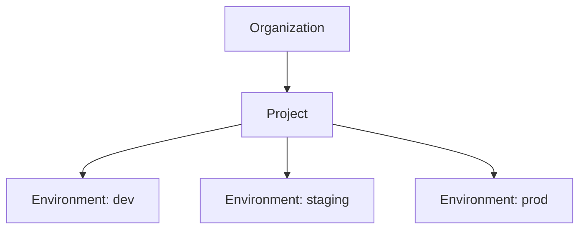
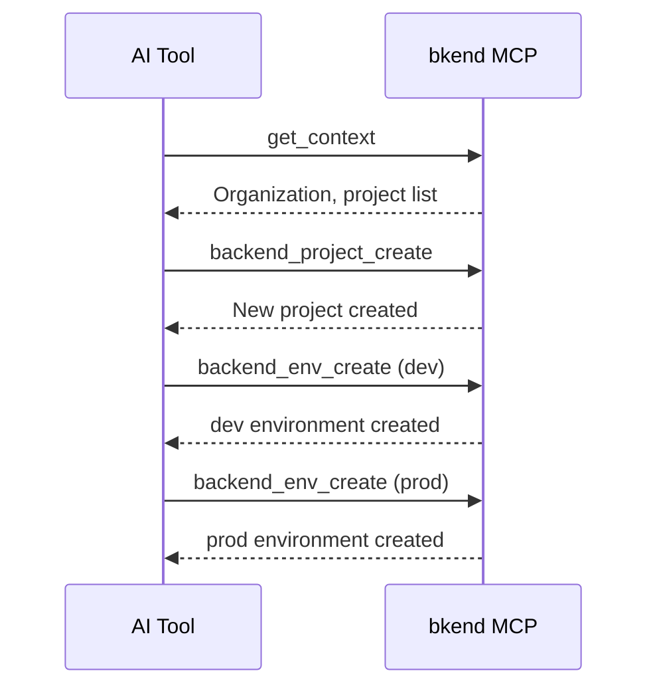

# Project Tools


This page covers the MCP tools for managing Organizations, projects, and environments.


## Overview

Project tools manage bkend's resource hierarchy: Organization > Project > Environment. All tools use the `backend_` prefix.



***

## Organization Tools

### backend_org_list

Retrieves the list of accessible Organizations.

| Item | Value |
|------|-------|
| Parameters | None |

#### Response Example

```json
{
  "organizations": [
    {
      "id": "org_abc123",
      "name": "My Organization",
      "plan": "pro"
    }
  ]
}
```

***

## Project Tools

### backend_project_list

Retrieves the list of projects in an Organization.

| Parameter | Type | Required | Description |
|-----------|------|:--------:|-------------|
| `organizationId` | string | Yes | Organization ID |

### backend_project_get

Retrieves the details of a project.

| Parameter | Type | Required | Description |
|-----------|------|:--------:|-------------|
| `organizationId` | string | Yes | Organization ID |
| `projectId` | string | Yes | Project ID |

### backend_project_create

Creates a new project.

| Parameter | Type | Required | Description |
|-----------|------|:--------:|-------------|
| `organizationId` | string | Yes | Organization ID |
| `name` | string | Yes | Project name |
| `description` | string | | Project description |

### backend_project_update

Updates project information.

| Parameter | Type | Required | Description |
|-----------|------|:--------:|-------------|
| `organizationId` | string | Yes | Organization ID |
| `projectId` | string | Yes | Project ID |
| `name` | string | | New name |
| `description` | string | | New description |

### backend_project_delete

Deletes a project.

| Parameter | Type | Required | Description |
|-----------|------|:--------:|-------------|
| `organizationId` | string | Yes | Organization ID |
| `projectId` | string | Yes | Project ID |


Deleting a project permanently removes all environments, tables, and data within it. This action cannot be undone.


***

## Environment Tools

### backend_env_list

Retrieves the list of environments in a project.

| Parameter | Type | Required | Description |
|-----------|------|:--------:|-------------|
| `organizationId` | string | Yes | Organization ID |
| `projectId` | string | Yes | Project ID |

### backend_env_get

Retrieves environment details.

| Parameter | Type | Required | Description |
|-----------|------|:--------:|-------------|
| `organizationId` | string | Yes | Organization ID |
| `projectId` | string | Yes | Project ID |
| `environmentId` | string | Yes | Environment ID |

### backend_env_create

Creates a new environment.

| Parameter | Type | Required | Description |
|-----------|------|:--------:|-------------|
| `organizationId` | string | Yes | Organization ID |
| `projectId` | string | Yes | Project ID |
| `name` | string | Yes | Environment name (`dev`, `staging`, `prod`, etc.) |

***

## Usage Flow

A typical project management flow:



***

## Next Steps

- [Table Tools](04-table-tools.md) — Manage tables, fields, and indexes
- [Data Tools](05-data-tools.md) — Data CRUD operations
- [Context](02-context.md) — How to look up IDs
