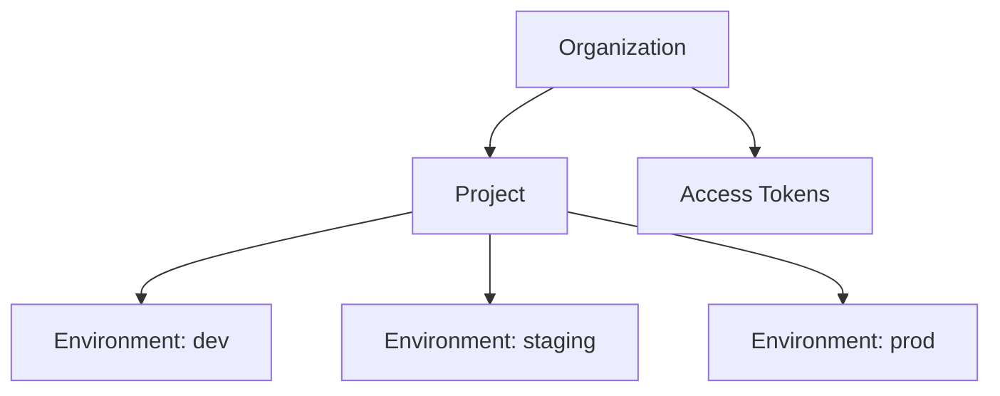
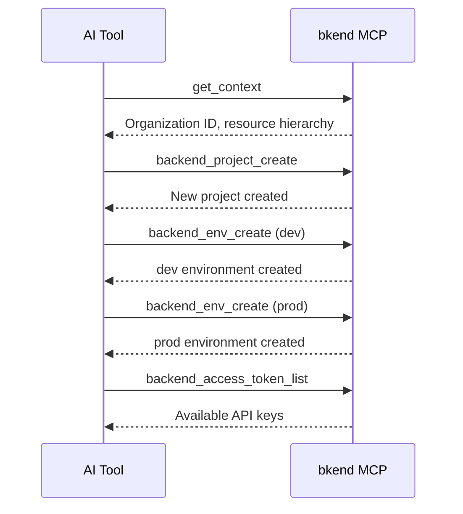

# Project Tools


💡 This page covers the MCP tools for managing Organizations, projects, environments, and access tokens.


## Overview

Project tools manage bkend's resource hierarchy: Organization > Project > Environment. All tools use the `backend_` prefix.



***

## Organization Tools

### backend_org_list

Retrieves the list of accessible Organizations.

| Item | Value |
|------|-------|
| Parameters | None |

### backend_org_get

Retrieves details of a specific Organization.

| Parameter | Type | Required | Description |
|-----------|------|:--------:|-------------|
| `organizationId` | string | Yes | Organization ID |

***

## Project Tools

### backend_project_list

Retrieves the list of projects accessible to the current user.

| Item | Value |
|------|-------|
| Parameters | None (filtered by your Organization automatically) |

### backend_project_get

Retrieves the details of a project.

| Parameter | Type | Required | Description |
|-----------|------|:--------:|-------------|
| `projectId` | string | Yes | Project ID |

### backend_project_create

Creates a new project.

| Parameter | Type | Required | Description |
|-----------|------|:--------:|-------------|
| `body` | object | Yes | Project creation data |

#### body Structure

```json
{
  "body": {
    "organizationId": "org_abc123",
    "slug": "my-app",
    "name": "My App",
    "primaryCloud": "aws",
    "primaryRegion": "ap-northeast-2"
  }
}
```

| Field | Type | Required | Description |
|-------|------|:--------:|-------------|
| `organizationId` | string | Yes | Organization ID |
| `slug` | string | Yes | URL-friendly unique slug |
| `name` | string | Yes | Project name |
| `primaryCloud` | string | Yes | Cloud provider (`aws`, `gcp`, `azu`) |
| `primaryRegion` | string | Yes | Deployment region |
| `description` | string | | Project description |

### backend_project_update

Updates project information.

| Parameter | Type | Required | Description |
|-----------|------|:--------:|-------------|
| `projectId` | string | Yes | Project ID |
| `body` | object | | Fields to update |

```json
{
  "projectId": "proj_xyz789",
  "body": {
    "name": "New Project Name",
    "description": "Updated description"
  }
}
```

***

## Environment Tools

### backend_env_list

Retrieves the list of environments accessible to the current user.

| Item | Value |
|------|-------|
| Parameters | None (filtered by your Organization automatically) |

### backend_env_get

Retrieves environment details.

| Parameter | Type | Required | Description |
|-----------|------|:--------:|-------------|
| `environmentId` | string | Yes | Environment ID |

### backend_env_create

Creates a new environment.

| Parameter | Type | Required | Description |
|-----------|------|:--------:|-------------|
| `body` | object | Yes | Environment creation data |

```json
{
  "body": {
    "projectId": "proj_xyz789",
    "environment": "dev",
    "environmentType": "dev"
  }
}
```

| Field | Type | Required | Description |
|-------|------|:--------:|-------------|
| `projectId` | string | Yes | Project ID |
| `environment` | string | Yes | Environment name (e.g., `dev`, `staging`, `prod`) |
| `environmentType` | string | Yes | Type (`dev`, `staging`, `prod`, `custom`) |

***

## Access Token Tools

### backend_access_token_list

Retrieves the list of access tokens for the Organization.

| Item | Value |
|------|-------|
| Parameters | None (filtered by your Organization automatically) |

### backend_access_token_get

Retrieves access token details by ID. The token value is not included for security.

| Parameter | Type | Required | Description |
|-----------|------|:--------:|-------------|
| `accessTokenId` | string | Yes | Access Token ID |


💡 Access tokens are created and managed through the console. MCP provides read-only access to token information.


***

## Usage Flow

A typical project setup flow:



***

## Next Steps

- [Table Tools](04-table-tools.md) — Manage tables, fields, and indexes
- [Data Tools](05-data-tools.md) — Data CRUD via REST API
- [Context](02-context.md) — How to look up IDs
