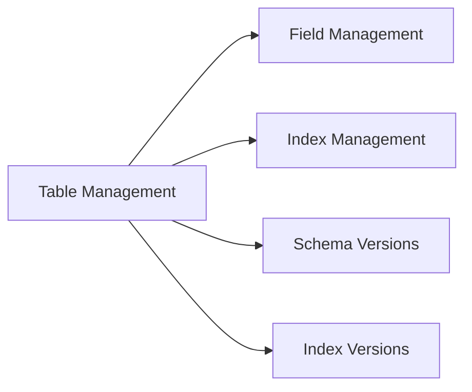
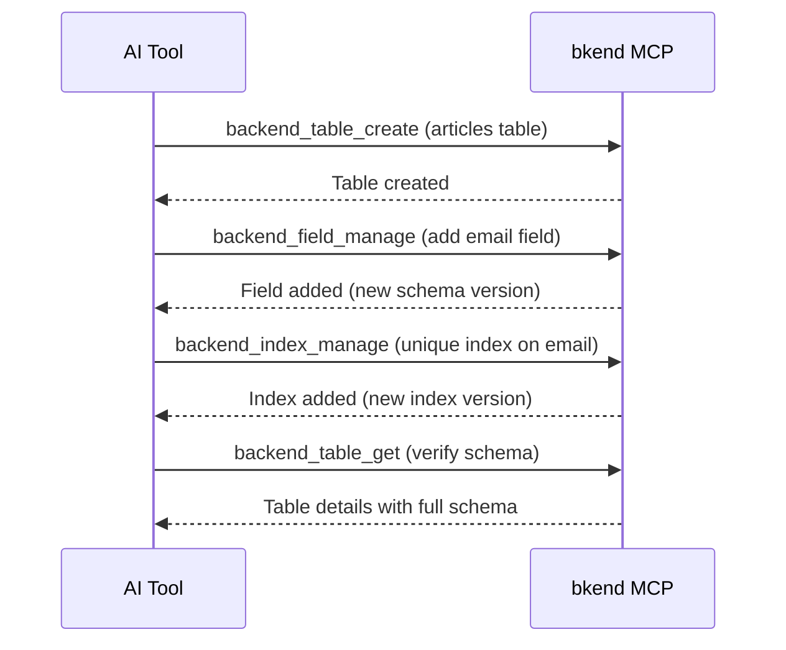

# Table Tools


💡 This page covers the MCP tools for managing tables, fields, indexes, and schema versions.


## Overview

Table tools manage your database structure. They handle everything from creating tables to adding fields, configuring indexes, and viewing version history.



***

## Table Tools

### backend_table_list

Retrieves the list of tables accessible to the current user.

| Item | Value |
|------|-------|
| Parameters | None (filtered by your Organization automatically) |

### backend_table_get

Retrieves table details including full schema definition and document count.

| Parameter | Type | Required | Description |
|-----------|------|:--------:|-------------|
| `tableId` | string | Yes | Table ID |

### backend_table_create

Creates a new table.

| Parameter | Type | Required | Description |
|-----------|------|:--------:|-------------|
| `body` | object | Yes | Table creation data |

#### body Structure

```json
{
  "body": {
    "projectId": "proj_xyz789",
    "environment": "dev",
    "tableName": "articles",
    "schema": {
      "title": { "bsonType": "string" },
      "content": { "bsonType": "string" },
      "published": { "bsonType": "bool" }
    }
  }
}
```

| Field | Type | Required | Description |
|-------|------|:--------:|-------------|
| `projectId` | string | Yes | Project ID |
| `environment` | string | Yes | Environment name |
| `tableName` | string | Yes | Table name (max 64 chars) |
| `schema` | object | Yes | Table schema (BSON schema format) |
| `displayName` | string | | Display name |
| `description` | string | | Table description |

### backend_table_update

Updates table metadata.

| Parameter | Type | Required | Description |
|-----------|------|:--------:|-------------|
| `tableId` | string | Yes | Table ID |
| `body` | object | | Fields to update |

```json
{
  "tableId": "tbl_abc123",
  "body": {
    "displayName": "Blog Articles",
    "description": "Blog article table"
  }
}
```


💡 To modify table fields, use `backend_field_manage` instead of `backend_table_update`.


***

## Field Tools

### backend_field_manage

Adds, updates, or removes fields in a table. Creates a new schema version.

| Parameter | Type | Required | Description |
|-----------|------|:--------:|-------------|
| `tableId` | string | Yes | Table ID |
| `body` | object | | Field management operations |

#### Add Fields Example

```json
{
  "tableId": "tbl_abc123",
  "body": {
    "fieldsToAddOrUpdate": {
      "email": { "bsonType": "string" },
      "age": { "bsonType": "int" }
    },
    "requiredFieldsToAdd": ["email"]
  }
}
```

#### Remove Fields Example

```json
{
  "tableId": "tbl_abc123",
  "body": {
    "fieldsToRemove": ["temporaryField"],
    "requiredFieldsToRemove": ["temporaryField"]
  }
}
```

| Field | Type | Description |
|-------|------|-------------|
| `fieldsToAddOrUpdate` | object | Fields to add or update (BSON schema format) |
| `fieldsToRemove` | string[] | Field names to remove |
| `requiredFieldsToAdd` | string[] | Field names to add to required list |
| `requiredFieldsToRemove` | string[] | Field names to remove from required list |

***

## Index Tools

### backend_index_manage

Adds or removes indexes on a table. Creates a new index version.

| Parameter | Type | Required | Description |
|-----------|------|:--------:|-------------|
| `tableId` | string | Yes | Table ID |
| `body` | object | | Index management operations |

#### Add Index Example

```json
{
  "tableId": "tbl_abc123",
  "body": {
    "indexesToAddOrUpdate": [
      {
        "name": "email_unique",
        "fields": { "email": 1 },
        "unique": true
      }
    ]
  }
}
```

#### Remove Index Example

```json
{
  "tableId": "tbl_abc123",
  "body": {
    "indexesToRemove": ["email_unique"]
  }
}
```

| Field | Type | Description |
|-------|------|-------------|
| `indexesToAddOrUpdate` | array | Indexes to add or update |
| `indexesToRemove` | string[] | Index names to remove |

Each index object:

| Field | Type | Required | Description |
|-------|------|:--------:|-------------|
| `name` | string | Yes | Index name |
| `fields` | object | Yes | Index fields (`1` for ascending, `-1` for descending) |
| `unique` | boolean | | Whether unique (default: false) |
| `sparse` | boolean | | Whether sparse (default: false) |

***

## Version Tools

View the history of schema and index changes.

### backend_schema_version_list

Retrieves the list of schema versions for a table.

| Parameter | Type | Required | Description |
|-----------|------|:--------:|-------------|
| `tableId` | string | Yes | Table ID |
| `page` | number | | Page number |
| `limit` | number | | Items per page |

### backend_index_version_list

Retrieves the list of index versions for a table.

| Parameter | Type | Required | Description |
|-----------|------|:--------:|-------------|
| `tableId` | string | Yes | Table ID |
| `page` | number | | Page number |
| `limit` | number | | Items per page |

***

## Usage Flow



***

## Next Steps

- [Data Tools](05-data-tools.md) — Data CRUD via REST API
- [Project Tools](03-project-tools.md) — Environment management
- [MCP Tools Overview](01-overview.md) — Complete tool classification
