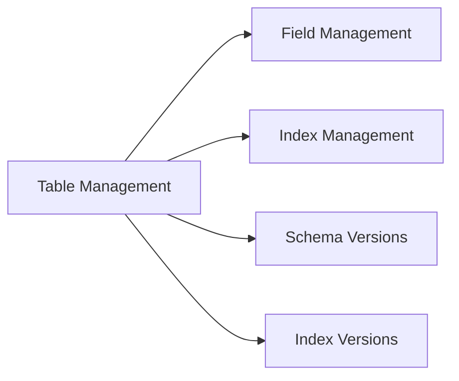
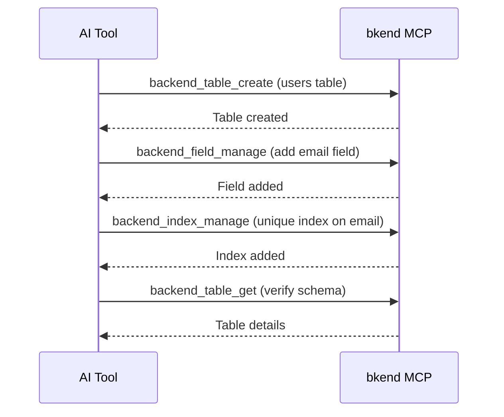

# Table Tools


This page covers the MCP tools for managing tables, fields, indexes, and schema versions.


## Overview

Table tools manage your database structure. They handle everything from creating tables to adding fields, configuring indexes, and managing schema versions.



***

## Table Tools

### backend_table_list

Retrieves the list of tables in an environment.

| Parameter | Type | Required | Description |
|-----------|------|:--------:|-------------|
| `organizationId` | string | Yes | Organization ID |
| `projectId` | string | Yes | Project ID |
| `environmentId` | string | Yes | Environment ID |

### backend_table_get

Retrieves table details including fields and indexes.

| Parameter | Type | Required | Description |
|-----------|------|:--------:|-------------|
| `organizationId` | string | Yes | Organization ID |
| `projectId` | string | Yes | Project ID |
| `environmentId` | string | Yes | Environment ID |
| `tableId` | string | Yes | Table ID |

### backend_table_create

Creates a new table.

| Parameter | Type | Required | Description |
|-----------|------|:--------:|-------------|
| `organizationId` | string | Yes | Organization ID |
| `projectId` | string | Yes | Project ID |
| `environmentId` | string | Yes | Environment ID |
| `name` | string | Yes | Table name |
| `fields` | array | Yes | Field array |

#### fields Array Structure

```json
{
  "fields": [
    {
      "name": "title",
      "type": "string",
      "required": true
    },
    {
      "name": "content",
      "type": "string",
      "required": false
    },
    {
      "name": "published",
      "type": "boolean",
      "defaultValue": false
    }
  ]
}
```

#### Supported Field Types

| Type | Description | Examples |
|------|-------------|----------|
| `string` | String | Name, email, title |
| `number` | Number | Price, quantity, age |
| `boolean` | True/false | Active status, visibility |
| `date` | Date/time | Created date, updated date |
| `object` | JSON object | Metadata, settings |
| `array` | JSON array | Tags, categories |
| `reference` | Reference to another table | Author, category |

### backend_table_delete

Deletes a table.

| Parameter | Type | Required | Description |
|-----------|------|:--------:|-------------|
| `organizationId` | string | Yes | Organization ID |
| `projectId` | string | Yes | Project ID |
| `environmentId` | string | Yes | Environment ID |
| `tableId` | string | Yes | Table ID |


Deleting a table permanently removes all data within it. This action cannot be undone.


***

## Field Tools

### backend_field_manage

Adds, updates, or deletes fields in a table.

| Parameter | Type | Required | Description |
|-----------|------|:--------:|-------------|
| `organizationId` | string | Yes | Organization ID |
| `projectId` | string | Yes | Project ID |
| `environmentId` | string | Yes | Environment ID |
| `tableId` | string | Yes | Table ID |
| `action` | string | Yes | `add`, `update`, `delete` |
| `field` | object | Yes | Field information |

#### Add Field Example

```json
{
  "action": "add",
  "field": {
    "name": "email",
    "type": "string",
    "required": true,
    "unique": true
  }
}
```

#### Update Field Example

```json
{
  "action": "update",
  "field": {
    "name": "email",
    "required": false
  }
}
```

***

## Index Tools

### backend_index_manage

Adds or deletes indexes on a table.

| Parameter | Type | Required | Description |
|-----------|------|:--------:|-------------|
| `organizationId` | string | Yes | Organization ID |
| `projectId` | string | Yes | Project ID |
| `environmentId` | string | Yes | Environment ID |
| `tableId` | string | Yes | Table ID |
| `action` | string | Yes | `add`, `delete` |
| `index` | object | Yes | Index information |

#### Add Index Example

```json
{
  "action": "add",
  "index": {
    "fields": ["email"],
    "unique": true
  }
}
```

***

## Schema Version Tools

Manage schema change history.

### backend_schema_version_list

Retrieves the list of schema versions.

| Parameter | Type | Required | Description |
|-----------|------|:--------:|-------------|
| `organizationId` | string | Yes | Organization ID |
| `projectId` | string | Yes | Project ID |
| `environmentId` | string | Yes | Environment ID |
| `tableId` | string | Yes | Table ID |

### backend_schema_version_get

Retrieves the details of a specific schema version.

| Parameter | Type | Required | Description |
|-----------|------|:--------:|-------------|
| `organizationId` | string | Yes | Organization ID |
| `projectId` | string | Yes | Project ID |
| `environmentId` | string | Yes | Environment ID |
| `tableId` | string | Yes | Table ID |
| `versionId` | string | Yes | Version ID |

### backend_schema_version_apply

Applies (rolls back to) a specific schema version.

| Parameter | Type | Required | Description |
|-----------|------|:--------:|-------------|
| `organizationId` | string | Yes | Organization ID |
| `projectId` | string | Yes | Project ID |
| `environmentId` | string | Yes | Environment ID |
| `tableId` | string | Yes | Table ID |
| `versionId` | string | Yes | Version ID to apply |

***

## Index Version Tools

Manage index change history.

### backend_index_version_list

Retrieves the list of index versions.

| Parameter | Type | Required | Description |
|-----------|------|:--------:|-------------|
| `organizationId` | string | Yes | Organization ID |
| `projectId` | string | Yes | Project ID |
| `environmentId` | string | Yes | Environment ID |
| `tableId` | string | Yes | Table ID |

### backend_index_version_get

Retrieves the details of a specific index version.

| Parameter | Type | Required | Description |
|-----------|------|:--------:|-------------|
| `organizationId` | string | Yes | Organization ID |
| `projectId` | string | Yes | Project ID |
| `environmentId` | string | Yes | Environment ID |
| `tableId` | string | Yes | Table ID |
| `versionId` | string | Yes | Version ID |

***

## Usage Flow



***

## Next Steps

- [Data Tools](05-data-tools.md) — Data CRUD operations
- [Project Tools](03-project-tools.md) — Environment management
- [MCP Tools Overview](01-overview.md) — Complete tool classification
