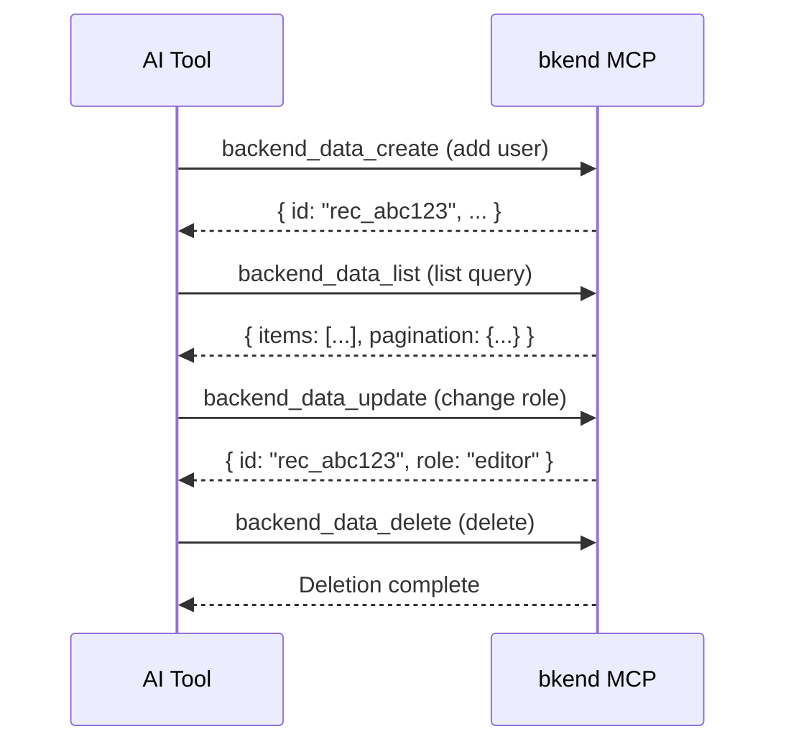

# Data Tools


This page covers the MCP tools for querying, creating, updating, and deleting data.


## Overview

Data tools perform CRUD (Create, Read, Update, Delete) operations on table data. There are 5 tools in total.

| Tool | Description |
|------|-------------|
| `backend_data_list` | List data (filter, sort, paginate) |
| `backend_data_get` | Retrieve a single record |
| `backend_data_create` | Create data |
| `backend_data_update` | Update data |
| `backend_data_delete` | Delete data |

***

## backend_data_list

Retrieves a list of data. Supports filtering, sorting, and pagination.

### Parameters

| Parameter | Type | Required | Description |
|-----------|------|:--------:|-------------|
| `organizationId` | string | Yes | Organization ID |
| `projectId` | string | Yes | Project ID |
| `environmentId` | string | Yes | Environment ID |
| `tableId` | string | Yes | Table ID |
| `page` | number | | Page number (default: 1) |
| `limit` | number | | Items per page (default: 20, max: 100) |
| `sortBy` | string | | Sort field |
| `sortDirection` | string | | `asc` or `desc` (default: `desc`) |
| `andFilters` | object | | AND condition filters |
| `orFilters` | array | | OR condition filters |

### Filtering

#### AND Filters

Retrieve data that satisfies all conditions simultaneously.

```json
{
  "andFilters": {
    "role": "admin",
    "status": "active"
  }
}
```

#### OR Filters

Retrieve data that satisfies at least one condition.

```json
{
  "orFilters": [
    { "role": "admin" },
    { "role": "editor" }
  ]
}
```

#### Operator Filters

```json
{
  "andFilters": {
    "age": { "$gte": 20 },
    "status": { "$ne": "deleted" }
  }
}
```

| Operator | Description | Example |
|----------|-------------|---------|
| `$eq` | Equal to | `{ "$eq": "admin" }` |
| `$ne` | Not equal to | `{ "$ne": "deleted" }` |
| `$gt` | Greater than | `{ "$gt": 100 }` |
| `$gte` | Greater than or equal to | `{ "$gte": 20 }` |
| `$lt` | Less than | `{ "$lt": 50 }` |
| `$lte` | Less than or equal to | `{ "$lte": 100 }` |
| `$in` | Included in | `{ "$in": ["admin", "editor"] }` |
| `$nin` | Not included in | `{ "$nin": ["deleted"] }` |

### Response Structure

```json
{
  "items": [
    {
      "id": "rec_abc123",
      "name": "John Doe",
      "email": "john@example.com",
      "role": "admin",
      "createdAt": "2025-01-01T00:00:00Z",
      "updatedAt": "2025-01-01T00:00:00Z"
    }
  ],
  "pagination": {
    "page": 1,
    "limit": 20,
    "total": 45,
    "totalPages": 3
  }
}
```


List data is contained in the `items` array and pagination info is in the `pagination` object. The ID field is `id`.


***

## backend_data_get

Retrieves a single record.

### Parameters

| Parameter | Type | Required | Description |
|-----------|------|:--------:|-------------|
| `organizationId` | string | Yes | Organization ID |
| `projectId` | string | Yes | Project ID |
| `environmentId` | string | Yes | Environment ID |
| `tableId` | string | Yes | Table ID |
| `recordId` | string | Yes | Record ID |

### Response Structure

```json
{
  "id": "rec_abc123",
  "name": "John Doe",
  "email": "john@example.com",
  "role": "admin",
  "createdAt": "2025-01-01T00:00:00Z",
  "updatedAt": "2025-01-01T00:00:00Z"
}
```

***

## backend_data_create

Creates a new record.

### Parameters

| Parameter | Type | Required | Description |
|-----------|------|:--------:|-------------|
| `organizationId` | string | Yes | Organization ID |
| `projectId` | string | Yes | Project ID |
| `environmentId` | string | Yes | Environment ID |
| `tableId` | string | Yes | Table ID |
| `data` | object | Yes | Data to create |

### Usage Example

```json
{
  "organizationId": "org_abc123",
  "projectId": "proj_xyz789",
  "environmentId": "env_dev001",
  "tableId": "tbl_users",
  "data": {
    "name": "John Doe",
    "email": "john@example.com",
    "role": "admin"
  }
}
```

***

## backend_data_update

Updates a record. Only the fields you pass are modified (Partial Update).

### Parameters

| Parameter | Type | Required | Description |
|-----------|------|:--------:|-------------|
| `organizationId` | string | Yes | Organization ID |
| `projectId` | string | Yes | Project ID |
| `environmentId` | string | Yes | Environment ID |
| `tableId` | string | Yes | Table ID |
| `recordId` | string | Yes | Record ID |
| `data` | object | Yes | Data to update (only fields to change) |

### Usage Example

```json
{
  "recordId": "rec_abc123",
  "data": {
    "role": "editor"
  }
}
```

***

## backend_data_delete

Deletes a record.

### Parameters

| Parameter | Type | Required | Description |
|-----------|------|:--------:|-------------|
| `organizationId` | string | Yes | Organization ID |
| `projectId` | string | Yes | Project ID |
| `environmentId` | string | Yes | Environment ID |
| `tableId` | string | Yes | Table ID |
| `recordId` | string | Yes | Record ID |


Deleted data cannot be recovered.


***

## CRUD Flow Example



***

## Next Steps

- [Table Tools](04-table-tools.md) — Manage table structure
- [Auth Tools](06-auth-tools.md) — Auth implementation guide
- [MCP Tools Overview](01-overview.md) — Complete tool classification
